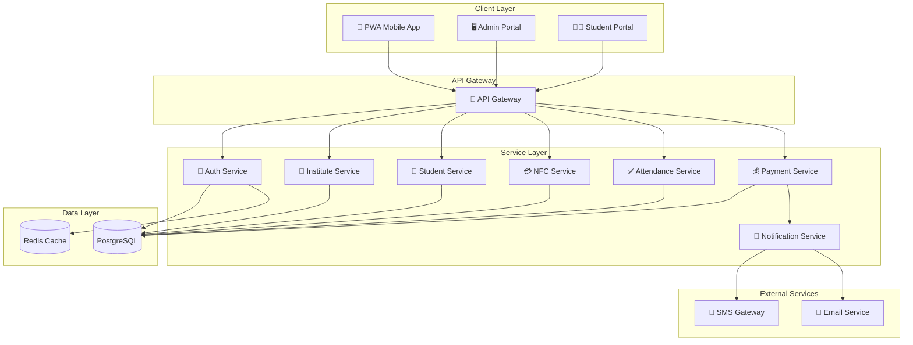

# 📚 Attendance Management System (AMS)

> A modern NFC-based attendance and fee management solution for educational institutes

[](./CHANGELOG.md)
[](./LICENSE)

## 🎯 Overview

The Attendance Management System (AMS) is a comprehensive solution designed to modernize the traditional paper-based attendance and fee management systems in educational institutes. By leveraging NFC technology, AMS provides a seamless, efficient, and secure way to manage student attendance and class fees.

## 🌟 Key Features

| Feature | Description |
|---------|-------------|
| **Multi-Institute Support** | Single platform supporting multiple educational institutes |
| **NFC Card Integration** | Unique NFC cards for student identification |
| **Mobile PWA** | Progressive Web App for card checking and validation |
| **Attendance Tracking** | Real-time class-wise attendance management |
| **Fee Management** | Class-wise fee collection and tracking |
| **Notifications** | SMS and Email notifications for payments |
| **Admin Portal** | Institute-specific administration |
| **Super Admin** | Developer-level system management |

## 📖 Documentation Index

### Architecture & Design
- [System Architecture](./architecture/system-architecture.md)
- [Class & ER Diagrams](./architecture/class-er-diagrams.md)
- [Database Design](./architecture/database-design.md)
- [API Design](./architecture/api-design.md)
- [Security Architecture](./architecture/security-architecture.md)

### Modules
- [User Management](./modules/user-management.md)
- [Institute Management](./modules/institute-management.md)
- [NFC Card Management](./modules/nfc-card-management.md)
- [Attendance Module](./modules/attendance-module.md)
- [Fee Management](./modules/fee-management.md)
- [Notification Service](./modules/notification-service.md)

### User Guides
- [Student Guide](./guides/student-guide.md)
- [Card Checker Guide](./guides/card-checker-guide.md)
- [Admin Guide](./guides/admin-guide.md)
- [Super Admin Guide](./guides/super-admin-guide.md)

### Technical Documentation
- [Technology Stack](./technical/technology-stack.md)
- [Deployment Guide](./technical/deployment-guide.md)
- [PWA Implementation](./technical/pwa-implementation.md)
- [NFC Integration](./technical/nfc-integration.md)

## 🚀 Quick Start

```bash
# Clone the repository
git clone https://github.com/your-org/ams.git

# Navigate to the project
cd ams

# Install dependencies
npm install

# Start development server
npm run dev
```

## 📊 System Overview Diagram



## 👥 User Roles

| Role | Description | Access Level |
|------|-------------|--------------|
| **Super Admin** | System-wide administration for developers | Full system access |
| **Institute Admin** | Institute-specific management | Institute-level access |
| **Card Checker** | Attendance and payment processing | Class-level access |
| **Student** | View personal records | Personal data only |

## 📞 Support

For support and queries, please contact:
- 📧 Email: support@ams.com
- 📚 Documentation: [Wiki Home](./README.md)

---

© 2026 Attendance Management System. All rights reserved.

