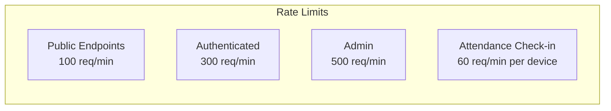

# 🔌 API Design

> RESTful API specification for the Attendance Management System

## 1. API Overview

The AMS API follows REST principles with JSON as the data exchange format. All endpoints are versioned and require authentication unless specified otherwise.

### Base URL
```
Production: https://api.ams.com/v1
Staging: https://api-staging.ams.com/v1
Development: http://localhost:3000/api/v1
```

### Common Headers
```http
Content-Type: application/json
Accept: application/json
Authorization: Bearer <jwt_token>
X-Institute-ID: <institute_uuid>  # Required for institute-scoped operations
X-Request-ID: <unique_request_id>  # For request tracing
```

## 2. API Architecture

```mermaid
graph TB
    subgraph "Client Applications"
        PWA[PWA App]
        Admin[Admin Portal]
        Student[Student Portal]
    end
    
    subgraph "API Gateway"
        Gateway[API Gateway]
        RateLimit[Rate Limiter]
        Auth[Auth Middleware]
        Validator[Request Validator]
    end
    
    subgraph "API Routes"
        AuthAPI[/auth/*]
        InstitutesAPI[/institutes/*]
        StudentsAPI[/students/*]
        ClassesAPI[/classes/*]
        CardsAPI[/cards/*]
        AttendanceAPI[/attendance/*]
        PaymentsAPI[/payments/*]
        NotificationsAPI[/notifications/*]
        ReportsAPI[/reports/*]
    end
    
    PWA --> Gateway
    Admin --> Gateway
    Student --> Gateway
    
    Gateway --> RateLimit
    RateLimit --> Auth
    Auth --> Validator
    
    Validator --> AuthAPI
    Validator --> InstitutesAPI
    Validator --> StudentsAPI
    Validator --> ClassesAPI
    Validator --> CardsAPI
    Validator --> AttendanceAPI
    Validator --> PaymentsAPI
    Validator --> NotificationsAPI
    Validator --> ReportsAPI
```

## 3. Authentication API

### 3.1 Login

```http
POST /auth/login
```

**Request Body:**
```json
{
  "email": "user@example.com",
  "password": "securePassword123"
}
```

**Success Response (200):**
```json
{
  "success": true,
  "data": {
    "user": {
      "id": "uuid",
      "email": "user@example.com",
      "firstName": "John",
      "lastName": "Doe",
      "role": "institute_admin",
      "institutes": [
        {
          "id": "uuid",
          "name": "ABC Institute",
          "role": "admin"
        }
      ]
    },
    "tokens": {
      "accessToken": "eyJhbGciOiJIUzI1NiIs...",
      "refreshToken": "eyJhbGciOiJIUzI1NiIs...",
      "expiresIn": 3600
    }
  }
}
```

### 3.2 Refresh Token

```http
POST /auth/refresh
```

**Request Body:**
```json
{
  "refreshToken": "eyJhbGciOiJIUzI1NiIs..."
}
```

### 3.3 Logout

```http
POST /auth/logout
```

### 3.4 Password Reset Request

```http
POST /auth/password/reset-request
```

**Request Body:**
```json
{
  "email": "user@example.com"
}
```

### 3.5 Password Reset Confirm

```http
POST /auth/password/reset-confirm
```

**Request Body:**
```json
{
  "token": "reset_token_from_email",
  "newPassword": "newSecurePassword123"
}
```

## 4. Institute API

### 4.1 List Institutes (Super Admin Only)

```http
GET /institutes
```

**Query Parameters:**
| Parameter | Type | Description |
|-----------|------|-------------|
| page | integer | Page number (default: 1) |
| limit | integer | Items per page (default: 20) |
| search | string | Search by name or code |
| isActive | boolean | Filter by active status |

**Response:**
```json
{
  "success": true,
  "data": {
    "institutes": [
      {
        "id": "uuid",
        "name": "ABC Institute",
        "code": "ABC001",
        "email": "info@abc.edu",
        "phone": "+1234567890",
        "isActive": true,
        "studentCount": 150,
        "classCount": 12,
        "createdAt": "2026-01-15T10:30:00Z"
      }
    ],
    "pagination": {
      "page": 1,
      "limit": 20,
      "totalPages": 5,
      "totalItems": 95
    }
  }
}
```

### 4.2 Create Institute

```http
POST /institutes
```

**Request Body:**
```json
{
  "name": "ABC Institute",
  "code": "ABC001",
  "address": "123 Education St",
  "phone": "+1234567890",
  "email": "info@abc.edu",
  "settings": {
    "timezone": "Asia/Colombo",
    "notificationPreferences": {
      "smsEnabled": true,
      "emailEnabled": true
    }
  }
}
```

### 4.3 Get Institute Details

```http
GET /institutes/:instituteId
```

### 4.4 Update Institute

```http
PUT /institutes/:instituteId
```

### 4.5 Get Institute Statistics

```http
GET /institutes/:instituteId/stats
```

**Response:**
```json
{
  "success": true,
  "data": {
    "totalStudents": 150,
    "activeStudents": 142,
    "totalClasses": 12,
    "activeClasses": 10,
    "totalCards": 148,
    "attendanceToday": 89,
    "paymentsThisMonth": {
      "total": 125000.00,
      "count": 85
    }
  }
}
```

## 5. Student API

### 5.1 Register Student

```http
POST /students/register
```

**Request Body:**
```json
{
  "instituteId": "uuid",
  "firstName": "Jane",
  "lastName": "Smith",
  "email": "jane@example.com",
  "phone": "+1234567890",
  "dateOfBirth": "2005-03-15",
  "guardianName": "John Smith",
  "guardianPhone": "+0987654321",
  "guardianEmail": "john.smith@example.com",
  "address": "456 Student Lane",
  "classIds": ["uuid1", "uuid2"]
}
```

**Response (201):**
```json
{
  "success": true,
  "data": {
    "student": {
      "id": "uuid",
      "studentCode": "STU-2026-001",
      "enrollmentNumber": "ABC-2026-0001",
      "firstName": "Jane",
      "lastName": "Smith",
      "email": "jane@example.com"
    },
    "nfcCard": {
      "id": "uuid",
      "cardUid": "04:A2:B3:C4:D5:E6:F7",
      "status": "pending_activation"
    },
    "message": "Student registered successfully. NFC card pending activation."
  }
}
```

### 5.2 List Students

```http
GET /students
```

**Query Parameters:**
| Parameter | Type | Description |
|-----------|------|-------------|
| instituteId | uuid | Filter by institute |
| classId | uuid | Filter by class |
| status | string | Filter by enrollment status |
| search | string | Search by name, code, email |
| page | integer | Page number |
| limit | integer | Items per page |

### 5.3 Get Student Details

```http
GET /students/:studentId
```

**Response:**
```json
{
  "success": true,
  "data": {
    "id": "uuid",
    "studentCode": "STU-2026-001",
    "firstName": "Jane",
    "lastName": "Smith",
    "email": "jane@example.com",
    "phone": "+1234567890",
    "dateOfBirth": "2005-03-15",
    "guardian": {
      "name": "John Smith",
      "phone": "+0987654321",
      "email": "john.smith@example.com"
    },
    "institutes": [
      {
        "id": "uuid",
        "name": "ABC Institute",
        "enrollmentNumber": "ABC-2026-0001",
        "enrollmentDate": "2026-01-15",
        "status": "active",
        "nfcCard": {
          "id": "uuid",
          "cardUid": "04:A2:B3:C4:D5:E6:F7",
          "status": "active"
        }
      }
    ],
    "classes": [
      {
        "id": "uuid",
        "name": "Mathematics Grade 10",
        "status": "enrolled"
      }
    ]
  }
}
```

### 5.4 Update Student

```http
PUT /students/:studentId
```

### 5.5 Get Student Attendance History

```http
GET /students/:studentId/attendance
```

**Query Parameters:**
| Parameter | Type | Description |
|-----------|------|-------------|
| classId | uuid | Filter by class |
| startDate | date | Start date (YYYY-MM-DD) |
| endDate | date | End date (YYYY-MM-DD) |

### 5.6 Get Student Payment History

```http
GET /students/:studentId/payments
```

## 6. Class API

### 6.1 List Classes

```http
GET /classes
```

### 6.2 Create Class

```http
POST /classes
```

**Request Body:**
```json
{
  "instituteId": "uuid",
  "name": "Mathematics Grade 10",
  "code": "MATH-10",
  "description": "Advanced mathematics for grade 10 students",
  "instructorId": "uuid",
  "schedule": [
    {
      "day": "monday",
      "startTime": "09:00",
      "endTime": "10:30"
    },
    {
      "day": "wednesday",
      "startTime": "09:00",
      "endTime": "10:30"
    }
  ],
  "room": "Room 101",
  "capacity": 30,
  "fee": {
    "name": "Monthly Tuition",
    "amount": 5000.00,
    "frequency": "monthly",
    "dueDay": 5
  }
}
```

### 6.3 Get Class Details

```http
GET /classes/:classId
```

### 6.4 Update Class

```http
PUT /classes/:classId
```

### 6.5 Get Class Students

```http
GET /classes/:classId/students
```

### 6.6 Enroll Student in Class

```http
POST /classes/:classId/students
```

**Request Body:**
```json
{
  "studentId": "uuid"
}
```

### 6.7 Remove Student from Class

```http
DELETE /classes/:classId/students/:studentId
```

### 6.8 Get Class Attendance

```http
GET /classes/:classId/attendance
```

**Query Parameters:**
| Parameter | Type | Description |
|-----------|------|-------------|
| date | date | Specific date (YYYY-MM-DD) |
| startDate | date | Start date range |
| endDate | date | End date range |

## 7. NFC Card API

### 7.1 Validate Card (PWA Check-in)

```http
POST /cards/validate
```

**Request Body:**
```json
{
  "cardUid": "04:A2:B3:C4:D5:E6:F7",
  "classId": "uuid"
}
```

**Response:**
```json
{
  "success": true,
  "data": {
    "valid": true,
    "student": {
      "id": "uuid",
      "studentCode": "STU-2026-001",
      "firstName": "Jane",
      "lastName": "Smith",
      "photoUrl": "https://..."
    },
    "card": {
      "id": "uuid",
      "status": "active"
    },
    "enrollment": {
      "status": "enrolled",
      "classId": "uuid",
      "className": "Mathematics Grade 10"
    },
    "paymentStatus": {
      "currentMonthPaid": true,
      "dueAmount": 0
    }
  }
}
```

### 7.2 Issue Card

```http
POST /cards
```

**Request Body:**
```json
{
  "studentId": "uuid",
  "instituteId": "uuid",
  "cardUid": "04:A2:B3:C4:D5:E6:F7"
}
```

### 7.3 Get Card Details

```http
GET /cards/:cardId
```

### 7.4 Update Card Status

```http
PATCH /cards/:cardId/status
```

**Request Body:**
```json
{
  "status": "blocked",
  "reason": "Lost card reported"
}
```

### 7.5 Replace Card

```http
POST /cards/:cardId/replace
```

**Request Body:**
```json
{
  "newCardUid": "04:B2:C3:D4:E5:F6:G7",
  "reason": "Card damaged"
}
```

### 7.6 Get Card Transaction History

```http
GET /cards/:cardId/transactions
```

## 8. Attendance API

### 8.1 Record Attendance (Check-in)

```http
POST /attendance/checkin
```

**Request Body:**
```json
{
  "cardUid": "04:A2:B3:C4:D5:E6:F7",
  "classId": "uuid",
  "deviceInfo": {
    "type": "mobile",
    "browser": "Chrome",
    "platform": "Android"
  }
}
```

**Response:**
```json
{
  "success": true,
  "data": {
    "attendance": {
      "id": "uuid",
      "studentId": "uuid",
      "studentName": "Jane Smith",
      "studentPhoto": "https://...",
      "classId": "uuid",
      "className": "Mathematics Grade 10",
      "checkInTime": "2026-02-14T09:05:23Z",
      "status": "present"
    },
    "message": "Attendance recorded successfully"
  }
}
```

### 8.2 Get Today's Attendance for Class

```http
GET /attendance/class/:classId/today
```

**Response:**
```json
{
  "success": true,
  "data": {
    "class": {
      "id": "uuid",
      "name": "Mathematics Grade 10"
    },
    "date": "2026-02-14",
    "summary": {
      "total": 25,
      "present": 20,
      "late": 3,
      "absent": 2
    },
    "records": [
      {
        "studentId": "uuid",
        "studentCode": "STU-2026-001",
        "studentName": "Jane Smith",
        "checkInTime": "2026-02-14T09:05:23Z",
        "status": "present"
      }
    ]
  }
}
```

### 8.3 Update Attendance Status

```http
PATCH /attendance/:attendanceId
```

**Request Body:**
```json
{
  "status": "excused",
  "notes": "Medical leave"
}
```

### 8.4 Get Attendance Report

```http
GET /attendance/report
```

**Query Parameters:**
| Parameter | Type | Description |
|-----------|------|-------------|
| instituteId | uuid | Institute ID |
| classId | uuid | Class ID (optional) |
| studentId | uuid | Student ID (optional) |
| startDate | date | Start date |
| endDate | date | End date |
| format | string | Response format (json/csv) |

## 9. Payment API

### 9.1 Get Payment Dues

```http
GET /payments/dues/:studentId
```

**Query Parameters:**
| Parameter | Type | Description |
|-----------|------|-------------|
| classId | uuid | Filter by class |
| month | integer | Month (1-12) |
| year | integer | Year |

**Response:**
```json
{
  "success": true,
  "data": {
    "student": {
      "id": "uuid",
      "name": "Jane Smith"
    },
    "dues": [
      {
        "classId": "uuid",
        "className": "Mathematics Grade 10",
        "feeId": "uuid",
        "feeName": "Monthly Tuition",
        "amount": 5000.00,
        "paidAmount": 0,
        "dueAmount": 5000.00,
        "dueDate": "2026-02-05",
        "status": "overdue"
      }
    ],
    "totalDue": 5000.00
  }
}
```

### 9.2 Record Payment

```http
POST /payments
```

**Request Body:**
```json
{
  "studentId": "uuid",
  "classId": "uuid",
  "classFeeId": "uuid",
  "amount": 5000.00,
  "paymentMethod": "cash",
  "forMonth": 2,
  "forYear": 2026,
  "notes": "Paid in full"
}
```

**Response:**
```json
{
  "success": true,
  "data": {
    "payment": {
      "id": "uuid",
      "referenceNumber": "PAY-2026-0001234",
      "amount": 5000.00,
      "paymentMethod": "cash",
      "paymentDate": "2026-02-14",
      "status": "completed"
    },
    "notifications": {
      "smsSent": true,
      "emailSent": true
    },
    "message": "Payment recorded successfully"
  }
}
```

### 9.3 Get Payment History

```http
GET /payments
```

**Query Parameters:**
| Parameter | Type | Description |
|-----------|------|-------------|
| studentId | uuid | Filter by student |
| classId | uuid | Filter by class |
| startDate | date | Start date |
| endDate | date | End date |
| status | string | Filter by status |

### 9.4 Get Payment Receipt

```http
GET /payments/:paymentId/receipt
```

### 9.5 Refund Payment

```http
POST /payments/:paymentId/refund
```

**Request Body:**
```json
{
  "amount": 5000.00,
  "reason": "Class cancelled"
}
```

## 10. Notification API

### 10.1 Get User Notifications

```http
GET /notifications
```

### 10.2 Send Notification (Admin)

```http
POST /notifications/send
```

**Request Body:**
```json
{
  "recipients": ["uuid1", "uuid2"],
  "channels": ["sms", "email"],
  "subject": "Payment Reminder",
  "content": "Your class fee for February is due.",
  "type": "payment_reminder"
}
```

### 10.3 Get Notification Status

```http
GET /notifications/:notificationId
```

## 11. Reports API

### 11.1 Attendance Summary Report

```http
GET /reports/attendance/summary
```

### 11.2 Payment Summary Report

```http
GET /reports/payments/summary
```

### 11.3 Student Report

```http
GET /reports/students/:studentId
```

### 11.4 Class Report

```http
GET /reports/classes/:classId
```

### 11.5 Export Report

```http
POST /reports/export
```

**Request Body:**
```json
{
  "reportType": "attendance",
  "format": "csv",
  "filters": {
    "instituteId": "uuid",
    "startDate": "2026-01-01",
    "endDate": "2026-02-14"
  }
}
```

## 12. Error Responses

### Standard Error Format

```json
{
  "success": false,
  "error": {
    "code": "VALIDATION_ERROR",
    "message": "Validation failed",
    "details": [
      {
        "field": "email",
        "message": "Invalid email format"
      }
    ]
  },
  "requestId": "req_abc123"
}
```

### Error Codes

| Code | HTTP Status | Description |
|------|-------------|-------------|
| VALIDATION_ERROR | 400 | Request validation failed |
| UNAUTHORIZED | 401 | Authentication required |
| FORBIDDEN | 403 | Insufficient permissions |
| NOT_FOUND | 404 | Resource not found |
| CONFLICT | 409 | Resource conflict (e.g., duplicate) |
| RATE_LIMITED | 429 | Too many requests |
| INTERNAL_ERROR | 500 | Server error |

## 13. Rate Limiting



**Rate Limit Headers:**
```http
X-RateLimit-Limit: 300
X-RateLimit-Remaining: 295
X-RateLimit-Reset: 1644847260
```

## 14. WebSocket Events (Real-time)

### Connection

```javascript
const socket = io('wss://api.ams.com', {
  auth: { token: 'jwt_token' },
  query: { instituteId: 'uuid', classId: 'uuid' }
});
```

### Events

| Event | Direction | Description |
|-------|-----------|-------------|
| `attendance:checkin` | Server → Client | New check-in recorded |
| `payment:received` | Server → Client | Payment recorded |
| `card:status` | Server → Client | Card status changed |
| `class:join` | Client → Server | Join class room |
| `class:leave` | Client → Server | Leave class room |

### Event Payload Example

```json
{
  "event": "attendance:checkin",
  "data": {
    "attendanceId": "uuid",
    "studentId": "uuid",
    "studentName": "Jane Smith",
    "classId": "uuid",
    "timestamp": "2026-02-14T09:05:23Z"
  }
}
```

---

**Previous:** [Database Design](./database-design.md) | **Next:** [Security Architecture](./security-architecture.md)

