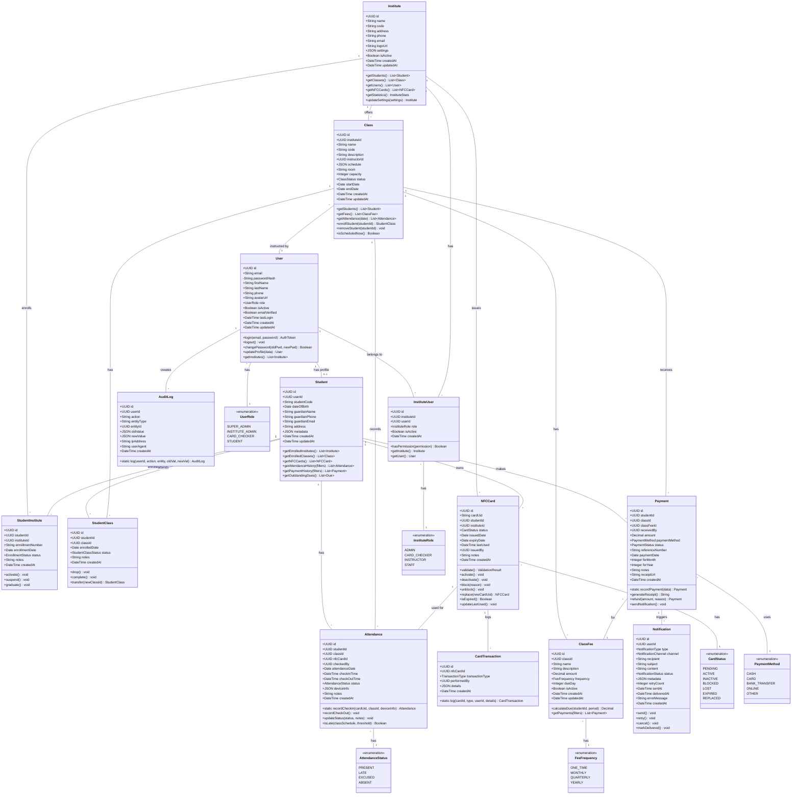
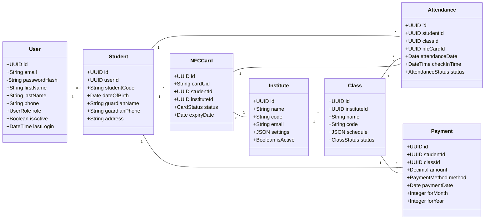
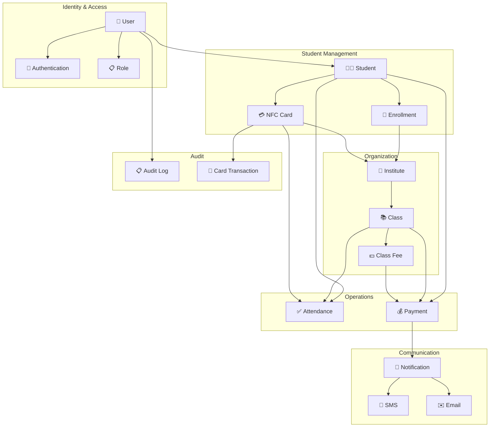

# 📊 System Diagrams

> Class Diagram and Entity Relationship Diagram for the Attendance Management System

## 1. Class Diagram

The class diagram shows the object-oriented design of the AMS system, including all entities, their attributes, methods, and relationships.



## 2. Detailed Class Diagram (Core Entities)



## 3. Entity Relationship Diagram (Chen Notation)

```mermaid
erDiagram
    %% ==================== CORE ENTITIES ====================
    
    USERS {
        uuid id PK "Primary Key"
        varchar email UK "Unique email address"
        varchar password_hash "Bcrypt hashed password"
        varchar first_name "User's first name"
        varchar last_name "User's last name"
        varchar phone "Contact phone"
        varchar avatar_url "Profile picture URL"
        enum role "super_admin|institute_admin|card_checker|student"
        boolean is_active "Account active status"
        boolean email_verified "Email verification status"
        timestamp last_login "Last login timestamp"
        timestamp created_at "Record creation time"
        timestamp updated_at "Last update time"
    }
    
    INSTITUTES {
        uuid id PK "Primary Key"
        varchar name "Institute name"
        varchar code UK "Unique institute code"
        text address "Physical address"
        varchar phone "Contact phone"
        varchar email "Contact email"
        varchar logo_url "Logo image URL"
        jsonb settings "Configuration settings"
        boolean is_active "Active status"
        timestamp created_at "Record creation time"
        timestamp updated_at "Last update time"
    }
    
    STUDENTS {
        uuid id PK "Primary Key"
        uuid user_id FK,UK "References users.id"
        varchar student_code UK "Unique student identifier"
        date date_of_birth "Student DOB"
        varchar guardian_name "Parent/Guardian name"
        varchar guardian_phone "Guardian contact"
        varchar guardian_email "Guardian email"
        text address "Student address"
        jsonb metadata "Additional info JSON"
        timestamp created_at "Record creation time"
        timestamp updated_at "Last update time"
    }
    
    CLASSES {
        uuid id PK "Primary Key"
        uuid institute_id FK "References institutes.id"
        varchar name "Class name"
        varchar code "Class code within institute"
        text description "Class description"
        uuid instructor_id FK "References users.id"
        jsonb schedule "Schedule JSON array"
        varchar room "Room/Location"
        integer capacity "Max students"
        enum status "active|inactive|completed|cancelled"
        date start_date "Class start date"
        date end_date "Class end date"
        timestamp created_at "Record creation time"
        timestamp updated_at "Last update time"
    }
    
    NFC_CARDS {
        uuid id PK "Primary Key"
        varchar card_uid UK "Physical card UID"
        uuid student_id FK "References students.id"
        uuid institute_id FK "References institutes.id"
        enum status "active|inactive|lost|expired|blocked"
        date issued_date "Card issue date"
        date expiry_date "Card expiration"
        timestamp last_used "Last card tap time"
        uuid issued_by FK "References users.id"
        text notes "Admin notes"
        timestamp created_at "Record creation time"
    }
    
    %% ==================== JUNCTION/BRIDGE TABLES ====================
    
    INSTITUTE_USERS {
        uuid id PK "Primary Key"
        uuid institute_id FK "References institutes.id"
        uuid user_id FK "References users.id"
        enum role "admin|card_checker|instructor|staff"
        boolean is_active "Membership active"
        timestamp created_at "Record creation time"
    }
    
    STUDENT_INSTITUTES {
        uuid id PK "Primary Key"
        uuid student_id FK "References students.id"
        uuid institute_id FK "References institutes.id"
        varchar enrollment_number UK "Institute enrollment number"
        date enrollment_date "Enrollment date"
        enum status "active|inactive|suspended|graduated"
        text notes "Enrollment notes"
        timestamp created_at "Record creation time"
    }
    
    STUDENT_CLASSES {
        uuid id PK "Primary Key"
        uuid student_id FK "References students.id"
        uuid class_id FK "References classes.id"
        date enrolled_date "Class enrollment date"
        enum status "enrolled|dropped|completed|transferred"
        text notes "Enrollment notes"
        timestamp created_at "Record creation time"
    }
    
    %% ==================== TRANSACTION TABLES ====================
    
    ATTENDANCE {
        uuid id PK "Primary Key"
        uuid student_id FK "References students.id"
        uuid class_id FK "References classes.id"
        uuid nfc_card_id FK "References nfc_cards.id"
        uuid checked_by FK "References users.id"
        date attendance_date "Attendance date"
        timestamp check_in_time "Check-in timestamp"
        timestamp check_out_time "Check-out timestamp"
        enum status "present|late|excused|absent"
        jsonb device_info "Device metadata"
        text notes "Attendance notes"
        timestamp created_at "Record creation time"
    }
    
    CLASS_FEES {
        uuid id PK "Primary Key"
        uuid class_id FK "References classes.id"
        varchar name "Fee name"
        text description "Fee description"
        decimal amount "Fee amount"
        enum frequency "one_time|monthly|quarterly|yearly"
        integer due_day "Day of month due (1-31)"
        boolean is_active "Fee active status"
        timestamp created_at "Record creation time"
        timestamp updated_at "Last update time"
    }
    
    PAYMENTS {
        uuid id PK "Primary Key"
        uuid student_id FK "References students.id"
        uuid class_id FK "References classes.id"
        uuid class_fee_id FK "References class_fees.id"
        uuid received_by FK "References users.id"
        decimal amount "Payment amount"
        enum payment_method "cash|card|bank_transfer|online|other"
        enum status "pending|completed|failed|refunded"
        varchar reference_number "Receipt number"
        date payment_date "Payment date"
        integer for_month "Payment period month"
        integer for_year "Payment period year"
        text notes "Payment notes"
        varchar receipt_url "Receipt file URL"
        timestamp created_at "Record creation time"
    }
    
    %% ==================== AUDIT/LOG TABLES ====================
    
    CARD_TRANSACTIONS {
        uuid id PK "Primary Key"
        uuid nfc_card_id FK "References nfc_cards.id"
        enum transaction_type "issued|activated|deactivated|blocked|unblocked|replaced|expired"
        uuid performed_by FK "References users.id"
        jsonb details "Transaction details JSON"
        timestamp created_at "Record creation time"
    }
    
    NOTIFICATIONS {
        uuid id PK "Primary Key"
        uuid user_id FK "References users.id"
        enum type "payment_confirmation|payment_reminder|attendance|general|alert"
        enum channel "sms|email|push|in_app"
        varchar recipient "Phone or email"
        varchar subject "Notification subject"
        text content "Notification body"
        enum status "pending|sent|delivered|failed|cancelled"
        jsonb metadata "Additional metadata"
        integer retry_count "Delivery attempts"
        timestamp sent_at "Send timestamp"
        timestamp delivered_at "Delivery timestamp"
        text error_message "Error if failed"
        timestamp created_at "Record creation time"
    }
    
    AUDIT_LOGS {
        uuid id PK "Primary Key"
        uuid user_id FK "References users.id"
        varchar action "Action performed"
        varchar entity_type "Entity type modified"
        uuid entity_id "Entity ID modified"
        jsonb old_value "Previous state"
        jsonb new_value "New state"
        inet ip_address "Client IP"
        text user_agent "Browser/client info"
        timestamp created_at "Record creation time"
    }
    
    %% ==================== RELATIONSHIPS ====================
    
    %% User to Student (1:1)
    USERS ||--o| STUDENTS : "has profile"
    
    %% User to Institute (M:N via INSTITUTE_USERS)
    USERS ||--o{ INSTITUTE_USERS : "belongs to"
    INSTITUTES ||--o{ INSTITUTE_USERS : "has"
    
    %% Student to Institute (M:N via STUDENT_INSTITUTES)
    STUDENTS ||--o{ STUDENT_INSTITUTES : "enrolled in"
    INSTITUTES ||--o{ STUDENT_INSTITUTES : "enrolls"
    
    %% Institute to Class (1:N)
    INSTITUTES ||--o{ CLASSES : "offers"
    
    %% Class Instructor
    USERS ||--o{ CLASSES : "instructs"
    
    %% Student to Class (M:N via STUDENT_CLASSES)
    STUDENTS ||--o{ STUDENT_CLASSES : "attends"
    CLASSES ||--o{ STUDENT_CLASSES : "has"
    
    %% NFC Cards
    STUDENTS ||--o{ NFC_CARDS : "owns"
    INSTITUTES ||--o{ NFC_CARDS : "issues"
    USERS ||--o{ NFC_CARDS : "issued by"
    
    %% Card Transactions
    NFC_CARDS ||--o{ CARD_TRANSACTIONS : "logs"
    USERS ||--o{ CARD_TRANSACTIONS : "performed by"
    
    %% Class Fees
    CLASSES ||--o{ CLASS_FEES : "has"
    
    %% Attendance
    STUDENTS ||--o{ ATTENDANCE : "has"
    CLASSES ||--o{ ATTENDANCE : "records"
    NFC_CARDS ||--o{ ATTENDANCE : "used for"
    USERS ||--o{ ATTENDANCE : "checked by"
    
    %% Payments
    STUDENTS ||--o{ PAYMENTS : "makes"
    CLASSES ||--o{ PAYMENTS : "receives"
    CLASS_FEES ||--o{ PAYMENTS : "for"
    USERS ||--o{ PAYMENTS : "received by"
    
    %% Notifications
    USERS ||--o{ NOTIFICATIONS : "receives"
    
    %% Audit Logs
    USERS ||--o{ AUDIT_LOGS : "creates"
```



## 4. Simplified ER Diagram (Core Business Entities)

```mermaid
erDiagram
    INSTITUTE ||--o{ CLASS : offers
    INSTITUTE ||--o{ STUDENT_ENROLLMENT : has
    INSTITUTE ||--o{ NFC_CARD : issues
    
    STUDENT ||--o{ STUDENT_ENROLLMENT : "enrolled in"
    STUDENT ||--o{ CLASS_ENROLLMENT : attends
    STUDENT ||--o{ NFC_CARD : owns
    STUDENT ||--o{ ATTENDANCE : has
    STUDENT ||--o{ PAYMENT : makes
    
    CLASS ||--o{ CLASS_ENROLLMENT : has
    CLASS ||--o{ CLASS_FEE : charges
    CLASS ||--o{ ATTENDANCE : records
    CLASS ||--o{ PAYMENT : receives
    
    NFC_CARD ||--o{ ATTENDANCE : "used for"
    
    CLASS_FEE ||--o{ PAYMENT : for
    
    INSTITUTE {
        uuid id PK
        string name
        string code UK
        boolean is_active
    }
    
    STUDENT {
        uuid id PK
        string student_code UK
        string guardian_phone
    }
    
    CLASS {
        uuid id PK
        uuid institute_id FK
        string name
        string code
    }
    
    NFC_CARD {
        uuid id PK
        string card_uid UK
        uuid student_id FK
        uuid institute_id FK
        enum status
    }
    
    STUDENT_ENROLLMENT {
        uuid id PK
        uuid student_id FK
        uuid institute_id FK
        string enrollment_number UK
        enum status
    }
    
    CLASS_ENROLLMENT {
        uuid id PK
        uuid student_id FK
        uuid class_id FK
        enum status
    }
    
    ATTENDANCE {
        uuid id PK
        uuid student_id FK
        uuid class_id FK
        uuid nfc_card_id FK
        date attendance_date
        enum status
    }
    
    CLASS_FEE {
        uuid id PK
        uuid class_id FK
        decimal amount
        enum frequency
    }
    
    PAYMENT {
        uuid id PK
        uuid student_id FK
        uuid class_id FK
        uuid class_fee_id FK
        decimal amount
        date payment_date
    }
```

## 5. Domain Model Diagram



## 6. Cardinality Summary

| Relationship | Type | Description |
|--------------|------|-------------|
| User → Student | 1:0..1 | A user may optionally be a student |
| Institute → Class | 1:N | One institute has many classes |
| Institute → NFC Card | 1:N | One institute issues many cards |
| Student → NFC Card | 1:N | One student can have multiple cards (one per institute) |
| Student → Institute | M:N | Students can enroll in multiple institutes |
| Student → Class | M:N | Students can enroll in multiple classes |
| Class → Class Fee | 1:N | One class can have multiple fee types |
| Student + Class → Attendance | Many records per combination |
| Student + Class + Fee → Payment | Many records per combination |

---

**Related Documentation:**
- [Database Design](./database-design.md) - SQL Schema definitions
- [System Architecture](./system-architecture.md) - Overall system design
- [API Design](./api-design.md) - RESTful API endpoints

