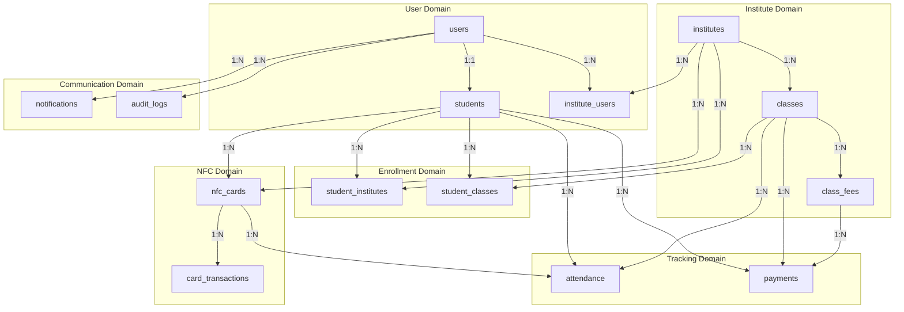

# 🗄️ Database Design

> Comprehensive database schema design for the Attendance Management System

## 1. Database Overview

The AMS uses **PostgreSQL** as its primary database, chosen for its:
- Strong ACID compliance
- Excellent JSON support for flexible data
- Advanced indexing capabilities
- Built-in full-text search
- Robust security features

## 2. Entity Relationship Diagram

```mermaid
erDiagram
    INSTITUTE ||--o{ INSTITUTE_USER : has
    INSTITUTE ||--o{ CLASS : offers
    INSTITUTE ||--o{ NFC_CARD : issues
    INSTITUTE ||--o{ STUDENT_INSTITUTE : enrolls
    
    USER ||--o{ INSTITUTE_USER : belongs_to
    USER ||--o{ STUDENT : is
    USER ||--o{ AUDIT_LOG : creates
    
    STUDENT ||--o{ STUDENT_INSTITUTE : enrolled_in
    STUDENT ||--o{ NFC_CARD : owns
    STUDENT ||--o{ STUDENT_CLASS : attends
    STUDENT ||--o{ ATTENDANCE : has
    STUDENT ||--o{ PAYMENT : makes
    
    CLASS ||--o{ STUDENT_CLASS : has
    CLASS ||--o{ ATTENDANCE : records
    CLASS ||--o{ CLASS_FEE : has
    CLASS ||--o{ PAYMENT : receives
    
    NFC_CARD ||--o{ ATTENDANCE : used_for
    NFC_CARD ||--o{ CARD_TRANSACTION : logs
    
    CLASS_FEE ||--o{ PAYMENT : for
    
    PAYMENT ||--o{ NOTIFICATION : triggers
    ATTENDANCE ||--o{ NOTIFICATION : triggers

    INSTITUTE {
        uuid id PK
        string name
        string code UK
        string address
        string phone
        string email
        jsonb settings
        boolean is_active
        timestamp created_at
        timestamp updated_at
    }
    
    USER {
        uuid id PK
        string email UK
        string password_hash
        string first_name
        string last_name
        string phone
        enum role
        boolean is_active
        timestamp last_login
        timestamp created_at
        timestamp updated_at
    }
    
    INSTITUTE_USER {
        uuid id PK
        uuid institute_id FK
        uuid user_id FK
        enum role
        boolean is_active
        timestamp created_at
    }
    
    STUDENT {
        uuid id PK
        uuid user_id FK
        string student_code UK
        date date_of_birth
        string guardian_name
        string guardian_phone
        string address
        jsonb metadata
        timestamp created_at
        timestamp updated_at
    }
    
    STUDENT_INSTITUTE {
        uuid id PK
        uuid student_id FK
        uuid institute_id FK
        string enrollment_number UK
        date enrollment_date
        enum status
        timestamp created_at
    }
    
    NFC_CARD {
        uuid id PK
        string card_uid UK
        uuid student_id FK
        uuid institute_id FK
        enum status
        date issued_date
        date expiry_date
        timestamp last_used
        timestamp created_at
    }
    
    CLASS {
        uuid id PK
        uuid institute_id FK
        string name
        string code
        string description
        uuid instructor_id FK
        jsonb schedule
        enum status
        timestamp created_at
        timestamp updated_at
    }
    
    STUDENT_CLASS {
        uuid id PK
        uuid student_id FK
        uuid class_id FK
        date enrolled_date
        enum status
        timestamp created_at
    }
    
    ATTENDANCE {
        uuid id PK
        uuid student_id FK
        uuid class_id FK
        uuid nfc_card_id FK
        uuid checked_by FK
        timestamp check_in_time
        enum status
        string device_info
        timestamp created_at
    }
    
    CLASS_FEE {
        uuid id PK
        uuid class_id FK
        string name
        decimal amount
        enum frequency
        integer due_day
        boolean is_active
        timestamp created_at
    }
    
    PAYMENT {
        uuid id PK
        uuid student_id FK
        uuid class_id FK
        uuid class_fee_id FK
        uuid received_by FK
        decimal amount
        enum payment_method
        string reference_number
        date payment_date
        integer for_month
        integer for_year
        string notes
        timestamp created_at
    }
    
    NOTIFICATION {
        uuid id PK
        uuid user_id FK
        enum type
        string channel
        string recipient
        string subject
        text content
        enum status
        jsonb metadata
        timestamp sent_at
        timestamp created_at
    }
    
    AUDIT_LOG {
        uuid id PK
        uuid user_id FK
        string action
        string entity_type
        uuid entity_id
        jsonb old_value
        jsonb new_value
        string ip_address
        timestamp created_at
    }
    
    CARD_TRANSACTION {
        uuid id PK
        uuid nfc_card_id FK
        enum transaction_type
        jsonb details
        timestamp created_at
    }
```

## 3. Detailed Schema Definitions

### 3.1 Core Tables

#### institutes
```sql
CREATE TABLE institutes (
    id UUID PRIMARY KEY DEFAULT gen_random_uuid(),
    name VARCHAR(255) NOT NULL,
    code VARCHAR(50) UNIQUE NOT NULL,
    address TEXT,
    phone VARCHAR(20),
    email VARCHAR(255),
    logo_url VARCHAR(500),
    settings JSONB DEFAULT '{}',
    is_active BOOLEAN DEFAULT true,
    created_at TIMESTAMP WITH TIME ZONE DEFAULT CURRENT_TIMESTAMP,
    updated_at TIMESTAMP WITH TIME ZONE DEFAULT CURRENT_TIMESTAMP
);

CREATE INDEX idx_institutes_code ON institutes(code);
CREATE INDEX idx_institutes_is_active ON institutes(is_active);

COMMENT ON TABLE institutes IS 'Educational institutes registered in the system';
COMMENT ON COLUMN institutes.settings IS 'JSON config: notification prefs, branding, etc.';
```

#### users
```sql
CREATE TYPE user_role AS ENUM ('super_admin', 'institute_admin', 'card_checker', 'student');

CREATE TABLE users (
    id UUID PRIMARY KEY DEFAULT gen_random_uuid(),
    email VARCHAR(255) UNIQUE NOT NULL,
    password_hash VARCHAR(255) NOT NULL,
    first_name VARCHAR(100) NOT NULL,
    last_name VARCHAR(100) NOT NULL,
    phone VARCHAR(20),
    avatar_url VARCHAR(500),
    role user_role NOT NULL DEFAULT 'student',
    is_active BOOLEAN DEFAULT true,
    email_verified BOOLEAN DEFAULT false,
    last_login TIMESTAMP WITH TIME ZONE,
    created_at TIMESTAMP WITH TIME ZONE DEFAULT CURRENT_TIMESTAMP,
    updated_at TIMESTAMP WITH TIME ZONE DEFAULT CURRENT_TIMESTAMP
);

CREATE INDEX idx_users_email ON users(email);
CREATE INDEX idx_users_role ON users(role);
CREATE INDEX idx_users_is_active ON users(is_active);

COMMENT ON TABLE users IS 'All system users including students, admins, and staff';
```

#### institute_users
```sql
CREATE TYPE institute_role AS ENUM ('admin', 'card_checker', 'instructor', 'staff');

CREATE TABLE institute_users (
    id UUID PRIMARY KEY DEFAULT gen_random_uuid(),
    institute_id UUID NOT NULL REFERENCES institutes(id) ON DELETE CASCADE,
    user_id UUID NOT NULL REFERENCES users(id) ON DELETE CASCADE,
    role institute_role NOT NULL,
    is_active BOOLEAN DEFAULT true,
    created_at TIMESTAMP WITH TIME ZONE DEFAULT CURRENT_TIMESTAMP,
    
    UNIQUE(institute_id, user_id)
);

CREATE INDEX idx_institute_users_institute ON institute_users(institute_id);
CREATE INDEX idx_institute_users_user ON institute_users(user_id);

COMMENT ON TABLE institute_users IS 'Maps users to institutes with specific roles';
```

### 3.2 Student Tables

#### students
```sql
CREATE TABLE students (
    id UUID PRIMARY KEY DEFAULT gen_random_uuid(),
    user_id UUID NOT NULL REFERENCES users(id) ON DELETE CASCADE,
    student_code VARCHAR(50) UNIQUE NOT NULL,
    date_of_birth DATE,
    guardian_name VARCHAR(255),
    guardian_phone VARCHAR(20),
    guardian_email VARCHAR(255),
    address TEXT,
    metadata JSONB DEFAULT '{}',
    created_at TIMESTAMP WITH TIME ZONE DEFAULT CURRENT_TIMESTAMP,
    updated_at TIMESTAMP WITH TIME ZONE DEFAULT CURRENT_TIMESTAMP,
    
    UNIQUE(user_id)
);

CREATE INDEX idx_students_user ON students(user_id);
CREATE INDEX idx_students_code ON students(student_code);

COMMENT ON TABLE students IS 'Student-specific profile information';
COMMENT ON COLUMN students.metadata IS 'Additional student data: emergency contacts, medical info, etc.';
```

#### student_institutes
```sql
CREATE TYPE enrollment_status AS ENUM ('active', 'inactive', 'suspended', 'graduated');

CREATE TABLE student_institutes (
    id UUID PRIMARY KEY DEFAULT gen_random_uuid(),
    student_id UUID NOT NULL REFERENCES students(id) ON DELETE CASCADE,
    institute_id UUID NOT NULL REFERENCES institutes(id) ON DELETE CASCADE,
    enrollment_number VARCHAR(100) NOT NULL,
    enrollment_date DATE NOT NULL DEFAULT CURRENT_DATE,
    status enrollment_status DEFAULT 'active',
    notes TEXT,
    created_at TIMESTAMP WITH TIME ZONE DEFAULT CURRENT_TIMESTAMP,
    
    UNIQUE(student_id, institute_id),
    UNIQUE(institute_id, enrollment_number)
);

CREATE INDEX idx_student_institutes_student ON student_institutes(student_id);
CREATE INDEX idx_student_institutes_institute ON student_institutes(institute_id);
CREATE INDEX idx_student_institutes_status ON student_institutes(status);

COMMENT ON TABLE student_institutes IS 'Student enrollment in institutes (many-to-many)';
```

### 3.3 NFC Card Tables

#### nfc_cards
```sql
CREATE TYPE card_status AS ENUM ('active', 'inactive', 'lost', 'expired', 'blocked');

CREATE TABLE nfc_cards (
    id UUID PRIMARY KEY DEFAULT gen_random_uuid(),
    card_uid VARCHAR(100) UNIQUE NOT NULL,
    student_id UUID NOT NULL REFERENCES students(id) ON DELETE CASCADE,
    institute_id UUID NOT NULL REFERENCES institutes(id) ON DELETE CASCADE,
    status card_status DEFAULT 'active',
    issued_date DATE NOT NULL DEFAULT CURRENT_DATE,
    expiry_date DATE,
    last_used TIMESTAMP WITH TIME ZONE,
    issued_by UUID REFERENCES users(id),
    notes TEXT,
    created_at TIMESTAMP WITH TIME ZONE DEFAULT CURRENT_TIMESTAMP,
    
    UNIQUE(student_id, institute_id)
);

CREATE INDEX idx_nfc_cards_uid ON nfc_cards(card_uid);
CREATE INDEX idx_nfc_cards_student ON nfc_cards(student_id);
CREATE INDEX idx_nfc_cards_institute ON nfc_cards(institute_id);
CREATE INDEX idx_nfc_cards_status ON nfc_cards(status);

COMMENT ON TABLE nfc_cards IS 'NFC cards issued to students per institute';
COMMENT ON COLUMN nfc_cards.card_uid IS 'Unique identifier read from the physical NFC card';
```

#### card_transactions
```sql
CREATE TYPE transaction_type AS ENUM ('issued', 'activated', 'deactivated', 'blocked', 'unblocked', 'replaced', 'expired');

CREATE TABLE card_transactions (
    id UUID PRIMARY KEY DEFAULT gen_random_uuid(),
    nfc_card_id UUID NOT NULL REFERENCES nfc_cards(id) ON DELETE CASCADE,
    transaction_type transaction_type NOT NULL,
    performed_by UUID REFERENCES users(id),
    details JSONB DEFAULT '{}',
    created_at TIMESTAMP WITH TIME ZONE DEFAULT CURRENT_TIMESTAMP
);

CREATE INDEX idx_card_transactions_card ON card_transactions(nfc_card_id);
CREATE INDEX idx_card_transactions_type ON card_transactions(transaction_type);
CREATE INDEX idx_card_transactions_created ON card_transactions(created_at);

COMMENT ON TABLE card_transactions IS 'Audit log for NFC card lifecycle events';
```

### 3.4 Class Tables

#### classes
```sql
CREATE TYPE class_status AS ENUM ('active', 'inactive', 'completed', 'cancelled');

CREATE TABLE classes (
    id UUID PRIMARY KEY DEFAULT gen_random_uuid(),
    institute_id UUID NOT NULL REFERENCES institutes(id) ON DELETE CASCADE,
    name VARCHAR(255) NOT NULL,
    code VARCHAR(50) NOT NULL,
    description TEXT,
    instructor_id UUID REFERENCES users(id),
    schedule JSONB DEFAULT '[]',
    room VARCHAR(100),
    capacity INTEGER,
    status class_status DEFAULT 'active',
    start_date DATE,
    end_date DATE,
    created_at TIMESTAMP WITH TIME ZONE DEFAULT CURRENT_TIMESTAMP,
    updated_at TIMESTAMP WITH TIME ZONE DEFAULT CURRENT_TIMESTAMP,
    
    UNIQUE(institute_id, code)
);

CREATE INDEX idx_classes_institute ON classes(institute_id);
CREATE INDEX idx_classes_status ON classes(status);
CREATE INDEX idx_classes_instructor ON classes(instructor_id);

COMMENT ON TABLE classes IS 'Classes offered by institutes';
COMMENT ON COLUMN classes.schedule IS 'JSON array of schedule objects: [{day, start_time, end_time}]';
```

#### student_classes
```sql
CREATE TYPE student_class_status AS ENUM ('enrolled', 'dropped', 'completed', 'transferred');

CREATE TABLE student_classes (
    id UUID PRIMARY KEY DEFAULT gen_random_uuid(),
    student_id UUID NOT NULL REFERENCES students(id) ON DELETE CASCADE,
    class_id UUID NOT NULL REFERENCES classes(id) ON DELETE CASCADE,
    enrolled_date DATE NOT NULL DEFAULT CURRENT_DATE,
    status student_class_status DEFAULT 'enrolled',
    notes TEXT,
    created_at TIMESTAMP WITH TIME ZONE DEFAULT CURRENT_TIMESTAMP,
    
    UNIQUE(student_id, class_id)
);

CREATE INDEX idx_student_classes_student ON student_classes(student_id);
CREATE INDEX idx_student_classes_class ON student_classes(class_id);
CREATE INDEX idx_student_classes_status ON student_classes(status);

COMMENT ON TABLE student_classes IS 'Student enrollment in classes (many-to-many)';
```

### 3.5 Attendance Tables

#### attendance
```sql
CREATE TYPE attendance_status AS ENUM ('present', 'late', 'excused', 'absent');

CREATE TABLE attendance (
    id UUID PRIMARY KEY DEFAULT gen_random_uuid(),
    student_id UUID NOT NULL REFERENCES students(id) ON DELETE CASCADE,
    class_id UUID NOT NULL REFERENCES classes(id) ON DELETE CASCADE,
    nfc_card_id UUID REFERENCES nfc_cards(id),
    checked_by UUID REFERENCES users(id),
    attendance_date DATE NOT NULL DEFAULT CURRENT_DATE,
    check_in_time TIMESTAMP WITH TIME ZONE NOT NULL DEFAULT CURRENT_TIMESTAMP,
    check_out_time TIMESTAMP WITH TIME ZONE,
    status attendance_status DEFAULT 'present',
    device_info JSONB DEFAULT '{}',
    notes TEXT,
    created_at TIMESTAMP WITH TIME ZONE DEFAULT CURRENT_TIMESTAMP,
    
    UNIQUE(student_id, class_id, attendance_date)
);

CREATE INDEX idx_attendance_student ON attendance(student_id);
CREATE INDEX idx_attendance_class ON attendance(class_id);
CREATE INDEX idx_attendance_date ON attendance(attendance_date);
CREATE INDEX idx_attendance_card ON attendance(nfc_card_id);
CREATE INDEX idx_attendance_status ON attendance(status);

-- Composite index for common queries
CREATE INDEX idx_attendance_class_date ON attendance(class_id, attendance_date);

COMMENT ON TABLE attendance IS 'Student attendance records';
COMMENT ON COLUMN attendance.device_info IS 'JSON: device type, browser, location, etc.';
```

### 3.6 Payment Tables

#### class_fees
```sql
CREATE TYPE fee_frequency AS ENUM ('one_time', 'monthly', 'quarterly', 'yearly');

CREATE TABLE class_fees (
    id UUID PRIMARY KEY DEFAULT gen_random_uuid(),
    class_id UUID NOT NULL REFERENCES classes(id) ON DELETE CASCADE,
    name VARCHAR(255) NOT NULL,
    description TEXT,
    amount DECIMAL(10, 2) NOT NULL,
    frequency fee_frequency DEFAULT 'monthly',
    due_day INTEGER DEFAULT 1 CHECK (due_day >= 1 AND due_day <= 31),
    is_active BOOLEAN DEFAULT true,
    created_at TIMESTAMP WITH TIME ZONE DEFAULT CURRENT_TIMESTAMP,
    updated_at TIMESTAMP WITH TIME ZONE DEFAULT CURRENT_TIMESTAMP
);

CREATE INDEX idx_class_fees_class ON class_fees(class_id);
CREATE INDEX idx_class_fees_active ON class_fees(is_active);

COMMENT ON TABLE class_fees IS 'Fee structure for classes';
COMMENT ON COLUMN class_fees.due_day IS 'Day of month when fee is due';
```

#### payments
```sql
CREATE TYPE payment_method AS ENUM ('cash', 'card', 'bank_transfer', 'online', 'other');
CREATE TYPE payment_status AS ENUM ('pending', 'completed', 'failed', 'refunded');

CREATE TABLE payments (
    id UUID PRIMARY KEY DEFAULT gen_random_uuid(),
    student_id UUID NOT NULL REFERENCES students(id) ON DELETE CASCADE,
    class_id UUID NOT NULL REFERENCES classes(id) ON DELETE CASCADE,
    class_fee_id UUID REFERENCES class_fees(id),
    received_by UUID NOT NULL REFERENCES users(id),
    amount DECIMAL(10, 2) NOT NULL,
    payment_method payment_method NOT NULL,
    status payment_status DEFAULT 'completed',
    reference_number VARCHAR(100),
    payment_date DATE NOT NULL DEFAULT CURRENT_DATE,
    for_month INTEGER CHECK (for_month >= 1 AND for_month <= 12),
    for_year INTEGER CHECK (for_year >= 2000 AND for_year <= 2100),
    notes TEXT,
    receipt_url VARCHAR(500),
    created_at TIMESTAMP WITH TIME ZONE DEFAULT CURRENT_TIMESTAMP
);

CREATE INDEX idx_payments_student ON payments(student_id);
CREATE INDEX idx_payments_class ON payments(class_id);
CREATE INDEX idx_payments_date ON payments(payment_date);
CREATE INDEX idx_payments_status ON payments(status);

-- Composite index for payment history queries
CREATE INDEX idx_payments_student_class ON payments(student_id, class_id);
CREATE INDEX idx_payments_period ON payments(for_year, for_month);

COMMENT ON TABLE payments IS 'Payment records for class fees';
```

### 3.7 Notification Tables

#### notifications
```sql
CREATE TYPE notification_type AS ENUM ('payment_confirmation', 'payment_reminder', 'attendance', 'general', 'alert');
CREATE TYPE notification_channel AS ENUM ('sms', 'email', 'push', 'in_app');
CREATE TYPE notification_status AS ENUM ('pending', 'sent', 'delivered', 'failed', 'cancelled');

CREATE TABLE notifications (
    id UUID PRIMARY KEY DEFAULT gen_random_uuid(),
    user_id UUID REFERENCES users(id) ON DELETE SET NULL,
    type notification_type NOT NULL,
    channel notification_channel NOT NULL,
    recipient VARCHAR(255) NOT NULL,
    subject VARCHAR(500),
    content TEXT NOT NULL,
    status notification_status DEFAULT 'pending',
    metadata JSONB DEFAULT '{}',
    retry_count INTEGER DEFAULT 0,
    sent_at TIMESTAMP WITH TIME ZONE,
    delivered_at TIMESTAMP WITH TIME ZONE,
    error_message TEXT,
    created_at TIMESTAMP WITH TIME ZONE DEFAULT CURRENT_TIMESTAMP
);

CREATE INDEX idx_notifications_user ON notifications(user_id);
CREATE INDEX idx_notifications_status ON notifications(status);
CREATE INDEX idx_notifications_type ON notifications(type);
CREATE INDEX idx_notifications_created ON notifications(created_at);

COMMENT ON TABLE notifications IS 'SMS and email notification records';
```

### 3.8 Audit Tables

#### audit_logs
```sql
CREATE TABLE audit_logs (
    id UUID PRIMARY KEY DEFAULT gen_random_uuid(),
    user_id UUID REFERENCES users(id) ON DELETE SET NULL,
    action VARCHAR(100) NOT NULL,
    entity_type VARCHAR(100) NOT NULL,
    entity_id UUID,
    old_value JSONB,
    new_value JSONB,
    ip_address INET,
    user_agent TEXT,
    created_at TIMESTAMP WITH TIME ZONE DEFAULT CURRENT_TIMESTAMP
);

CREATE INDEX idx_audit_logs_user ON audit_logs(user_id);
CREATE INDEX idx_audit_logs_action ON audit_logs(action);
CREATE INDEX idx_audit_logs_entity ON audit_logs(entity_type, entity_id);
CREATE INDEX idx_audit_logs_created ON audit_logs(created_at);

-- Partition by month for better performance
-- CREATE TABLE audit_logs_y2026m01 PARTITION OF audit_logs
--     FOR VALUES FROM ('2026-01-01') TO ('2026-02-01');

COMMENT ON TABLE audit_logs IS 'System-wide audit trail for all changes';
```

## 4. Database Relationships Diagram



## 5. Indexes Strategy

### 5.1 Performance-Critical Indexes

```sql
-- Fast card lookup during check-in (most frequent operation)
CREATE INDEX CONCURRENTLY idx_nfc_cards_uid_active 
ON nfc_cards(card_uid) 
WHERE status = 'active';

-- Fast attendance check for duplicate prevention
CREATE INDEX CONCURRENTLY idx_attendance_lookup 
ON attendance(class_id, student_id, attendance_date);

-- Payment status lookup for a student
CREATE INDEX CONCURRENTLY idx_payments_student_period 
ON payments(student_id, for_year, for_month);

-- Active students in a class
CREATE INDEX CONCURRENTLY idx_student_classes_active 
ON student_classes(class_id) 
WHERE status = 'enrolled';
```

### 5.2 Full-Text Search Indexes

```sql
-- Student search
CREATE INDEX idx_students_search ON students 
USING gin(to_tsvector('english', 
    coalesce(student_code, '') || ' ' || 
    coalesce(guardian_name, '')));

-- Class search
CREATE INDEX idx_classes_search ON classes 
USING gin(to_tsvector('english', 
    name || ' ' || coalesce(description, '')));
```

## 6. Views for Common Queries

### 6.1 Student Dashboard View

```sql
CREATE VIEW vw_student_dashboard AS
SELECT 
    s.id AS student_id,
    s.student_code,
    u.first_name,
    u.last_name,
    u.email,
    i.id AS institute_id,
    i.name AS institute_name,
    nc.card_uid,
    nc.status AS card_status,
    COUNT(DISTINCT sc.class_id) AS enrolled_classes,
    (
        SELECT COUNT(*) 
        FROM attendance a 
        WHERE a.student_id = s.id 
        AND a.attendance_date >= DATE_TRUNC('month', CURRENT_DATE)
    ) AS attendance_this_month
FROM students s
JOIN users u ON s.user_id = u.id
JOIN student_institutes si ON s.id = si.student_id
JOIN institutes i ON si.institute_id = i.id
LEFT JOIN nfc_cards nc ON s.id = nc.student_id AND i.id = nc.institute_id
LEFT JOIN student_classes sc ON s.id = sc.student_id AND sc.status = 'enrolled'
WHERE si.status = 'active'
GROUP BY s.id, s.student_code, u.first_name, u.last_name, u.email,
         i.id, i.name, nc.card_uid, nc.status;
```

### 6.2 Class Attendance Summary View

```sql
CREATE VIEW vw_class_attendance_summary AS
SELECT 
    c.id AS class_id,
    c.name AS class_name,
    c.institute_id,
    a.attendance_date,
    COUNT(*) FILTER (WHERE a.status = 'present') AS present_count,
    COUNT(*) FILTER (WHERE a.status = 'late') AS late_count,
    COUNT(*) FILTER (WHERE a.status = 'absent') AS absent_count,
    COUNT(*) FILTER (WHERE a.status = 'excused') AS excused_count,
    COUNT(*) AS total_records
FROM classes c
LEFT JOIN attendance a ON c.id = a.class_id
GROUP BY c.id, c.name, c.institute_id, a.attendance_date;
```

### 6.3 Payment Status View

```sql
CREATE VIEW vw_payment_status AS
SELECT 
    s.id AS student_id,
    s.student_code,
    u.first_name || ' ' || u.last_name AS student_name,
    c.id AS class_id,
    c.name AS class_name,
    cf.id AS fee_id,
    cf.name AS fee_name,
    cf.amount AS fee_amount,
    cf.frequency,
    EXTRACT(MONTH FROM CURRENT_DATE)::INTEGER AS current_month,
    EXTRACT(YEAR FROM CURRENT_DATE)::INTEGER AS current_year,
    COALESCE(
        (SELECT SUM(p.amount) 
         FROM payments p 
         WHERE p.student_id = s.id 
         AND p.class_id = c.id 
         AND p.for_month = EXTRACT(MONTH FROM CURRENT_DATE)
         AND p.for_year = EXTRACT(YEAR FROM CURRENT_DATE)
         AND p.status = 'completed'),
        0
    ) AS paid_amount,
    cf.amount - COALESCE(
        (SELECT SUM(p.amount) 
         FROM payments p 
         WHERE p.student_id = s.id 
         AND p.class_id = c.id 
         AND p.for_month = EXTRACT(MONTH FROM CURRENT_DATE)
         AND p.for_year = EXTRACT(YEAR FROM CURRENT_DATE)
         AND p.status = 'completed'),
        0
    ) AS due_amount
FROM students s
JOIN users u ON s.user_id = u.id
JOIN student_classes sc ON s.id = sc.student_id
JOIN classes c ON sc.class_id = c.id
JOIN class_fees cf ON c.id = cf.class_id
WHERE sc.status = 'enrolled' AND cf.is_active = true;
```

## 7. Database Functions

### 7.1 Trigger for Updated Timestamp

```sql
CREATE OR REPLACE FUNCTION update_updated_at_column()
RETURNS TRIGGER AS $$
BEGIN
    NEW.updated_at = CURRENT_TIMESTAMP;
    RETURN NEW;
END;
$$ language 'plpgsql';

-- Apply to tables
CREATE TRIGGER update_institutes_updated_at 
    BEFORE UPDATE ON institutes 
    FOR EACH ROW EXECUTE FUNCTION update_updated_at_column();

CREATE TRIGGER update_users_updated_at 
    BEFORE UPDATE ON users 
    FOR EACH ROW EXECUTE FUNCTION update_updated_at_column();

CREATE TRIGGER update_students_updated_at 
    BEFORE UPDATE ON students 
    FOR EACH ROW EXECUTE FUNCTION update_updated_at_column();

CREATE TRIGGER update_classes_updated_at 
    BEFORE UPDATE ON classes 
    FOR EACH ROW EXECUTE FUNCTION update_updated_at_column();
```

### 7.2 Function to Check Duplicate Attendance

```sql
CREATE OR REPLACE FUNCTION check_duplicate_attendance()
RETURNS TRIGGER AS $$
BEGIN
    IF EXISTS (
        SELECT 1 FROM attendance 
        WHERE student_id = NEW.student_id 
        AND class_id = NEW.class_id 
        AND attendance_date = NEW.attendance_date
    ) THEN
        RAISE EXCEPTION 'Attendance already recorded for this student in this class today';
    END IF;
    RETURN NEW;
END;
$$ language 'plpgsql';

CREATE TRIGGER prevent_duplicate_attendance
    BEFORE INSERT ON attendance
    FOR EACH ROW EXECUTE FUNCTION check_duplicate_attendance();
```

## 8. Migration Strategy

```mermaid
graph LR
    subgraph "Phase 1: Core"
        M1[institutes]
        M2[users]
        M3[institute_users]
    end
    
    subgraph "Phase 2: Students"
        M4[students]
        M5[student_institutes]
    end
    
    subgraph "Phase 3: Classes"
        M6[classes]
        M7[student_classes]
        M8[class_fees]
    end
    
    subgraph "Phase 4: NFC"
        M9[nfc_cards]
        M10[card_transactions]
    end
    
    subgraph "Phase 5: Operations"
        M11[attendance]
        M12[payments]
    end
    
    subgraph "Phase 6: Support"
        M13[notifications]
        M14[audit_logs]
    end
    
    M1 --> M2 --> M3 --> M4 --> M5 --> M6 --> M7 --> M8 --> M9 --> M10 --> M11 --> M12 --> M13 --> M14
```



---

**Previous:** [System Architecture](./system-architecture.md) | **Next:** [API Design](./api-design.md)

