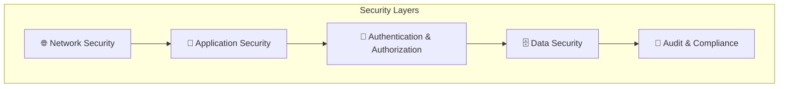
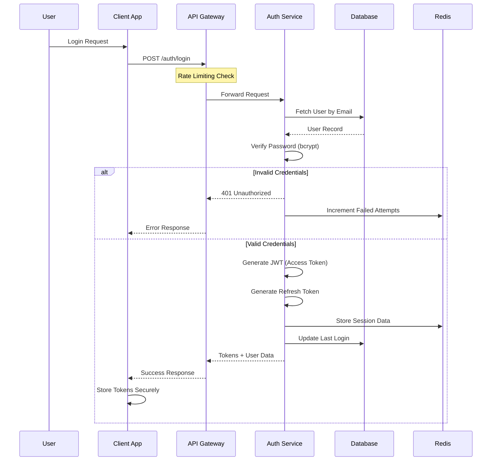
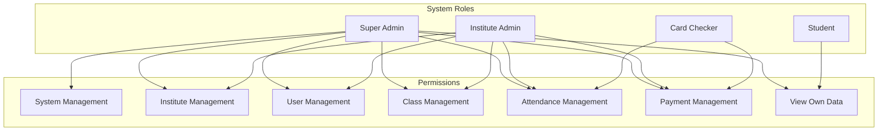
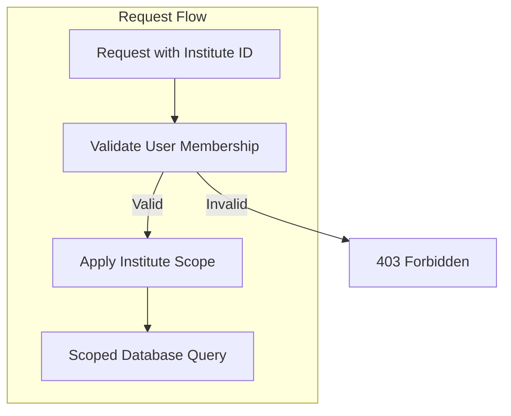
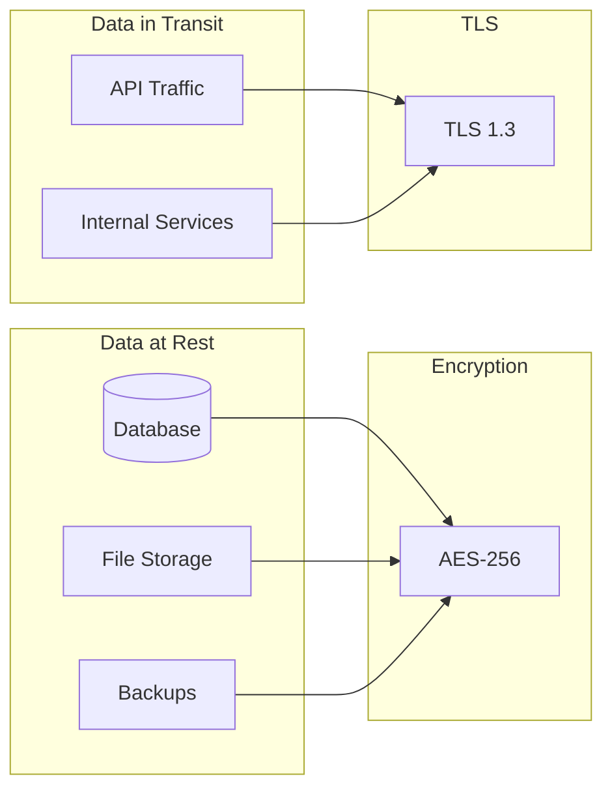
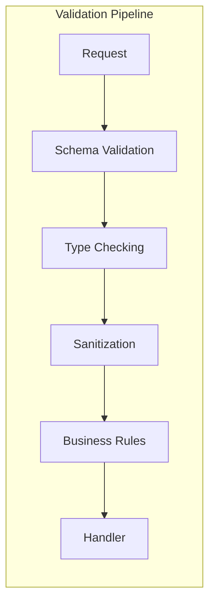
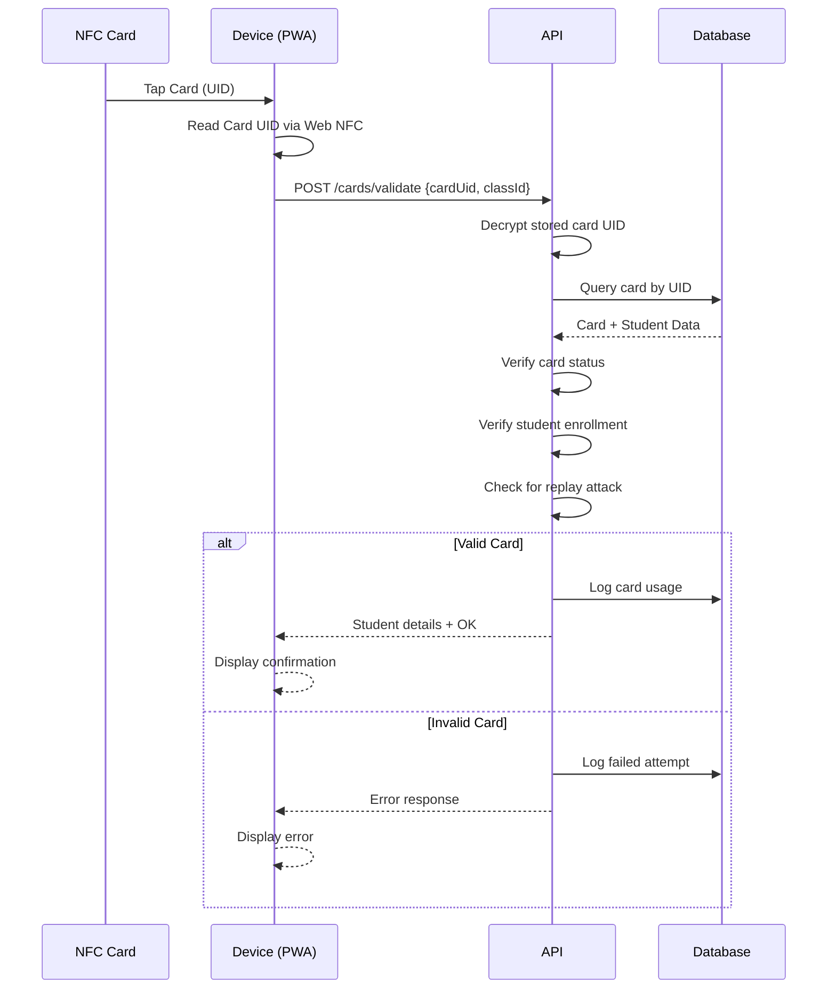
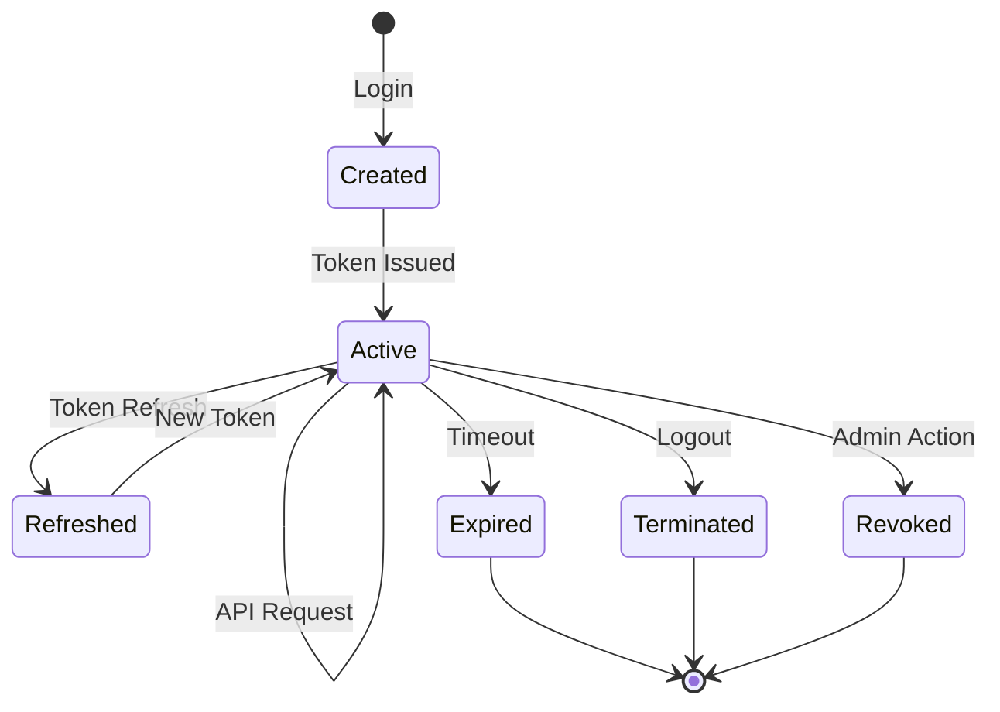
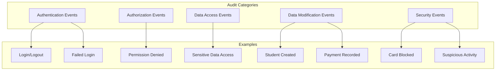
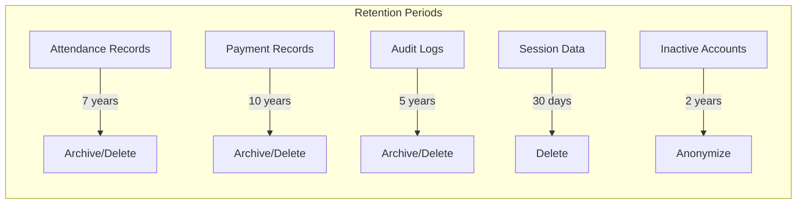

# 🔐 Security Architecture

> Security design and implementation guidelines for the Attendance Management System

## 1. Security Overview

The AMS implements a defense-in-depth security strategy with multiple layers of protection to safeguard sensitive student data, payment information, and system integrity.



## 2. Authentication Architecture

### 2.1 Authentication Flow



### 2.2 JWT Token Structure

```json
{
  "header": {
    "alg": "RS256",
    "typ": "JWT"
  },
  "payload": {
    "sub": "user_uuid",
    "email": "user@example.com",
    "role": "institute_admin",
    "institutes": ["institute_uuid_1", "institute_uuid_2"],
    "permissions": ["read:students", "write:attendance"],
    "iat": 1644847200,
    "exp": 1644850800,
    "iss": "ams-auth-service",
    "aud": "ams-api"
  }
}
```

### 2.3 Token Management

| Token Type | Lifetime | Storage | Refresh |
|------------|----------|---------|---------|
| Access Token | 1 hour | Memory only | Via refresh token |
| Refresh Token | 7 days | HttpOnly cookie | Re-authenticate |
| Session | 24 hours | Redis | Sliding expiration |

## 3. Authorization Model

### 3.1 Role-Based Access Control (RBAC)



### 3.2 Permission Matrix

| Permission | Super Admin | Institute Admin | Card Checker | Student |
|------------|:-----------:|:---------------:|:------------:|:-------:|
| Create Institute | ✅ | ❌ | ❌ | ❌ |
| Manage Institute | ✅ | ✅* | ❌ | ❌ |
| Manage Users | ✅ | ✅* | ❌ | ❌ |
| Manage Classes | ✅ | ✅* | ❌ | ❌ |
| Register Students | ✅ | ✅* | ❌ | ❌ |
| Issue NFC Cards | ✅ | ✅* | ❌ | ❌ |
| Record Attendance | ✅ | ✅* | ✅* | ❌ |
| Record Payments | ✅ | ✅* | ✅* | ❌ |
| View Reports | ✅ | ✅* | ✅* | ❌ |
| View Own Attendance | ✅ | ✅ | ✅ | ✅ |
| View Own Payments | ✅ | ✅ | ✅ | ✅ |

*Restricted to assigned institute(s)/class(es)

### 3.3 Multi-Tenancy Security



**Implementation:**
```typescript
// Middleware for institute scope validation
async function validateInstituteAccess(req, res, next) {
  const { instituteId } = req.headers['x-institute-id'] || req.params;
  const userId = req.user.id;
  
  // Super admins have access to all institutes
  if (req.user.role === 'super_admin') {
    return next();
  }
  
  // Verify user belongs to institute
  const membership = await InstituteUser.findOne({
    where: { userId, instituteId, isActive: true }
  });
  
  if (!membership) {
    return res.status(403).json({ error: 'Access denied to this institute' });
  }
  
  req.instituteRole = membership.role;
  next();
}
```

## 4. Data Security

### 4.1 Encryption Strategy



### 4.2 Sensitive Data Handling

| Data Type | Storage | Encryption | Access |
|-----------|---------|------------|--------|
| Passwords | Database | bcrypt (cost 12) | Never exposed |
| NFC Card UIDs | Database | AES-256 | Authenticated only |
| Student PII | Database | Column-level encryption | Role-based |
| Payment Data | Database | AES-256 | Role-based |
| Session Data | Redis | At-rest encryption | System only |

### 4.3 Data Masking

```typescript
// PII masking for logs and non-privileged responses
const maskEmail = (email: string): string => {
  const [local, domain] = email.split('@');
  return `${local.slice(0, 2)}***@${domain}`;
};

const maskPhone = (phone: string): string => {
  return phone.slice(0, 3) + '****' + phone.slice(-2);
};

const maskCardUid = (uid: string): string => {
  return uid.slice(0, 5) + '***' + uid.slice(-2);
};
```

## 5. API Security

### 5.1 Security Headers

```typescript
// Security headers middleware
app.use(helmet({
  contentSecurityPolicy: {
    directives: {
      defaultSrc: ["'self'"],
      scriptSrc: ["'self'"],
      styleSrc: ["'self'", "'unsafe-inline'"],
      imgSrc: ["'self'", "data:", "https:"],
      connectSrc: ["'self'", "https://api.ams.com"],
      frameSrc: ["'none'"],
      objectSrc: ["'none'"]
    }
  },
  hsts: {
    maxAge: 31536000,
    includeSubDomains: true,
    preload: true
  },
  referrerPolicy: { policy: 'strict-origin-when-cross-origin' },
  noSniff: true,
  xssFilter: true,
  frameguard: { action: 'deny' }
}));
```

### 5.2 Input Validation



**Validation Example:**
```typescript
// Using Joi for validation
const studentRegistrationSchema = Joi.object({
  firstName: Joi.string().min(2).max(100).required()
    .pattern(/^[a-zA-Z\s'-]+$/),
  lastName: Joi.string().min(2).max(100).required()
    .pattern(/^[a-zA-Z\s'-]+$/),
  email: Joi.string().email().required(),
  phone: Joi.string().pattern(/^\+?[\d\s-]{10,15}$/),
  dateOfBirth: Joi.date().max('now').min('1900-01-01'),
  instituteId: Joi.string().uuid().required(),
  classIds: Joi.array().items(Joi.string().uuid()).min(1)
});
```

### 5.3 Rate Limiting Configuration

```typescript
const rateLimitConfig = {
  // General API rate limit
  api: {
    windowMs: 60 * 1000, // 1 minute
    max: 100, // requests per window
    message: 'Too many requests, please try again later'
  },
  
  // Authentication endpoints
  auth: {
    windowMs: 15 * 60 * 1000, // 15 minutes
    max: 5, // login attempts
    message: 'Too many login attempts, please try again later'
  },
  
  // NFC card validation (high frequency)
  cardValidation: {
    windowMs: 60 * 1000,
    max: 60, // per device
    keyGenerator: (req) => req.headers['x-device-id']
  },
  
  // Password reset
  passwordReset: {
    windowMs: 60 * 60 * 1000, // 1 hour
    max: 3,
    message: 'Too many password reset attempts'
  }
};
```

### 5.4 SQL Injection Prevention

```typescript
// Always use parameterized queries
// ❌ Bad - vulnerable to SQL injection
const badQuery = `SELECT * FROM users WHERE email = '${email}'`;

// ✅ Good - parameterized query
const goodQuery = await db.query(
  'SELECT * FROM users WHERE email = $1',
  [email]
);

// ✅ Good - using ORM
const user = await User.findOne({
  where: { email: email }
});
```

## 6. NFC Security

### 6.1 Card Authentication Flow



### 6.2 Card Security Measures

| Measure | Implementation |
|---------|----------------|
| UID Encryption | AES-256 encryption of stored UIDs |
| Replay Prevention | Timestamp + rate limiting |
| Card Binding | One card per student per institute |
| Status Tracking | Active, blocked, lost, expired states |
| Audit Trail | All card transactions logged |

### 6.3 Card Cloning Prevention

```typescript
// Detect potential card cloning
async function detectSuspiciousActivity(cardUid: string, deviceInfo: DeviceInfo) {
  const recentUsage = await CardTransaction.findAll({
    where: {
      cardUid,
      createdAt: { [Op.gte]: new Date(Date.now() - 5 * 60 * 1000) } // Last 5 mins
    }
  });
  
  // Check for usage from multiple locations
  const uniqueDevices = new Set(recentUsage.map(u => u.deviceId));
  if (uniqueDevices.size > 1) {
    await alertSecurityTeam({
      type: 'POTENTIAL_CARD_CLONE',
      cardUid,
      devices: Array.from(uniqueDevices)
    });
    return true;
  }
  
  // Check for unusually high frequency
  if (recentUsage.length > 5) {
    await alertSecurityTeam({
      type: 'HIGH_FREQUENCY_USAGE',
      cardUid,
      count: recentUsage.length
    });
    return true;
  }
  
  return false;
}
```

## 7. Session Security

### 7.1 Session Management



### 7.2 Session Configuration

```typescript
const sessionConfig = {
  // Session timeout
  maxAge: 24 * 60 * 60 * 1000, // 24 hours
  
  // Idle timeout
  idleTimeout: 30 * 60 * 1000, // 30 minutes
  
  // Maximum concurrent sessions
  maxConcurrentSessions: 3,
  
  // Session storage
  store: new RedisStore({
    client: redisClient,
    prefix: 'sess:',
    ttl: 86400
  }),
  
  // Cookie settings
  cookie: {
    secure: true,
    httpOnly: true,
    sameSite: 'strict',
    domain: '.ams.com'
  }
};
```

## 8. Audit & Logging

### 8.1 Audit Events



### 8.2 Audit Log Structure

```typescript
interface AuditLog {
  id: string;
  timestamp: Date;
  userId: string;
  userEmail: string;
  action: string;
  entityType: string;
  entityId: string;
  oldValue?: object;
  newValue?: object;
  ipAddress: string;
  userAgent: string;
  requestId: string;
  result: 'success' | 'failure';
  metadata?: object;
}

// Example audit log entry
{
  id: "audit_123",
  timestamp: "2026-02-14T10:30:00Z",
  userId: "user_456",
  userEmail: "admin@abc.edu",
  action: "PAYMENT_RECORDED",
  entityType: "payment",
  entityId: "payment_789",
  oldValue: null,
  newValue: {
    studentId: "student_101",
    amount: 5000,
    classId: "class_202"
  },
  ipAddress: "192.168.1.100",
  userAgent: "Mozilla/5.0...",
  requestId: "req_abc123",
  result: "success",
  metadata: {
    instituteId: "inst_303"
  }
}
```

### 8.3 Security Monitoring

```typescript
// Real-time security alerts
const securityAlerts = [
  {
    name: 'Multiple Failed Logins',
    condition: 'failedLogins > 5 in 15 minutes',
    action: 'lockAccount + notifyAdmin'
  },
  {
    name: 'Suspicious Card Activity',
    condition: 'cardUsage from multiple devices in 5 minutes',
    action: 'blockCard + notifyAdmin'
  },
  {
    name: 'Unusual Data Access',
    condition: 'bulk data export by non-admin',
    action: 'alert + requireVerification'
  },
  {
    name: 'After Hours Access',
    condition: 'admin access between 11PM-6AM',
    action: 'logAndAlert'
  }
];
```

## 9. Compliance & Privacy

### 9.1 Data Protection Principles

| Principle | Implementation |
|-----------|----------------|
| Data Minimization | Collect only necessary data |
| Purpose Limitation | Use data only for stated purposes |
| Storage Limitation | Retention policies enforced |
| Accuracy | Regular data validation |
| Integrity | Audit trails, checksums |
| Confidentiality | Encryption, access controls |

### 9.2 Data Retention Policy



### 9.3 Data Subject Rights

```typescript
// GDPR-style data export
async function exportStudentData(studentId: string): Promise<DataExport> {
  return {
    personalInfo: await Student.findById(studentId),
    enrollments: await StudentInstitute.findAll({ studentId }),
    classes: await StudentClass.findAll({ studentId }),
    attendance: await Attendance.findAll({ studentId }),
    payments: await Payment.findAll({ studentId }),
    cards: await NFCCard.findAll({ studentId }),
    auditLogs: await AuditLog.findAll({ 
      entityType: 'student',
      entityId: studentId
    })
  };
}

// Data deletion (right to be forgotten)
async function deleteStudentData(studentId: string): Promise<void> {
  await db.transaction(async (t) => {
    // Anonymize rather than delete for audit purposes
    await Student.update(
      { 
        firstName: 'DELETED',
        lastName: 'USER',
        email: `deleted_${studentId}@deleted.com`,
        phone: null,
        address: null
      },
      { where: { id: studentId }, transaction: t }
    );
    
    // Deactivate cards
    await NFCCard.update(
      { status: 'blocked' },
      { where: { studentId }, transaction: t }
    );
    
    // Log deletion
    await AuditLog.create({
      action: 'DATA_DELETION_REQUEST',
      entityType: 'student',
      entityId: studentId
    }, { transaction: t });
  });
}
```

## 10. Security Checklist

### 10.1 Development Security

- [ ] Input validation on all endpoints
- [ ] Parameterized database queries
- [ ] Secure password hashing (bcrypt)
- [ ] JWT with appropriate expiration
- [ ] HTTPS everywhere
- [ ] Security headers configured
- [ ] Dependencies regularly updated
- [ ] Code review for security issues

### 10.2 Deployment Security

- [ ] Environment variables for secrets
- [ ] Firewall rules configured
- [ ] Database access restricted
- [ ] Logging enabled
- [ ] Monitoring alerts configured
- [ ] Backup encryption enabled
- [ ] SSL certificates valid
- [ ] DDoS protection enabled

### 10.3 Operational Security

- [ ] Regular security audits
- [ ] Penetration testing (quarterly)
- [ ] Incident response plan
- [ ] Security training for staff
- [ ] Access review (monthly)
- [ ] Vulnerability scanning
- [ ] Log review (weekly)
- [ ] Backup restoration testing

---

**Previous:** [API Design](./api-design.md) | **Next:** [User Management Module](../modules/user-management.md)

