# 🏗️ System Architecture

> Comprehensive architectural design for the Attendance Management System

## 1. Architecture Overview

The AMS follows a **microservices-inspired modular monolith** architecture, designed to be scalable, maintainable, and secure. This approach provides the benefits of service separation while maintaining operational simplicity for the MVP phase.

### 1.1 High-Level Architecture Diagram

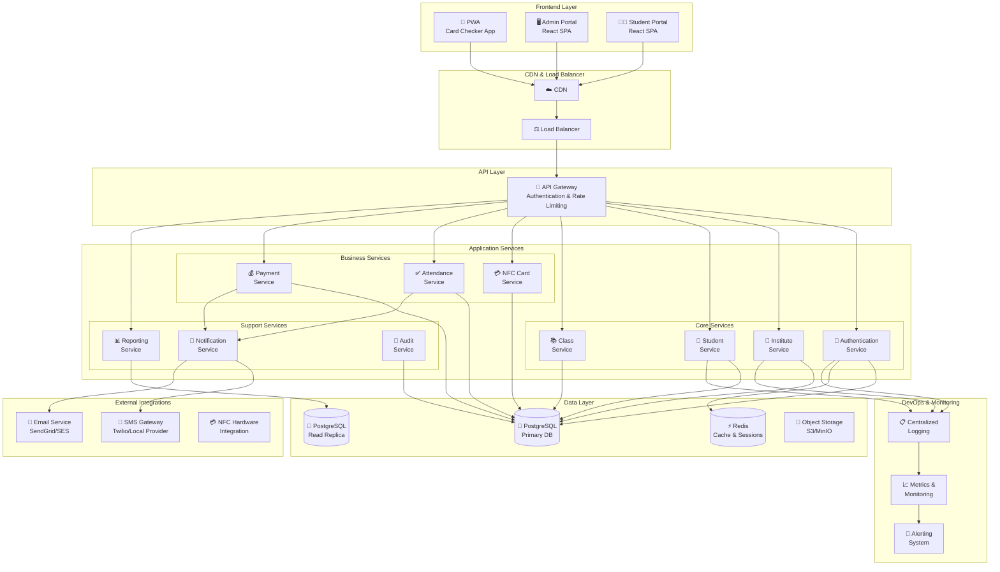

## 2. Component Architecture

### 2.1 Frontend Applications

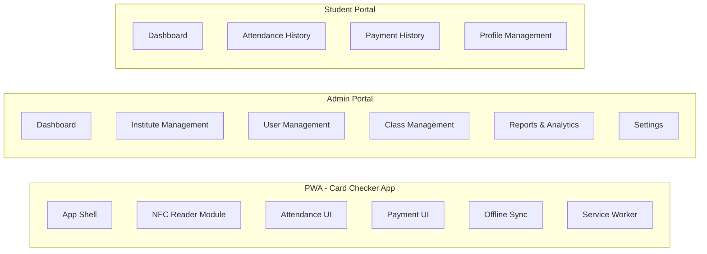

#### 2.1.1 PWA (Progressive Web App) Features

| Feature | Description | Technology |
|---------|-------------|------------|
| **Offline Support** | Works without internet connection | Service Workers, IndexedDB |
| **NFC Reading** | Read NFC cards via Web NFC API | Web NFC API |
| **Push Notifications** | Real-time updates | Web Push API |
| **Installable** | Add to home screen | Web App Manifest |
| **Background Sync** | Sync data when online | Background Sync API |

### 2.2 Backend Service Architecture

```mermaid
graph TB
    subgraph "API Gateway Layer"
        Gateway[API Gateway]
        RateLimiter[Rate Limiter]
        AuthMiddleware[Auth Middleware]
        RequestValidator[Request Validator]
    end

    subgraph "Authentication Service"
        JWTHandler[JWT Handler]
        SessionMgr[Session Manager]
        RoleMgr[Role Manager]
        PasswordHandler[Password Handler]
    end

    subgraph "Institute Service"
        InstCRUD[Institute CRUD]
        InstConfig[Configuration]
        InstUsers[User Assignment]
    end

    subgraph "Student Service"
        StudentCRUD[Student CRUD]
        Enrollment[Enrollment Manager]
        StudentSearch[Search & Filter]
    end

    subgraph "Class Service"
        ClassCRUD[Class CRUD]
        Schedule[Schedule Manager]
        ClassEnrollment[Class Enrollment]
    end

    subgraph "NFC Card Service"
        CardProvisioning[Card Provisioning]
        CardValidation[Card Validation]
        CardLinking[Student Linking]
        CardStatus[Status Management]
    end

    subgraph "Attendance Service"
        AttendanceRecord[Attendance Recording]
        AttendanceQuery[Query & Reports]
        RealTimeTracking[Real-time Tracking]
    end

    subgraph "Payment Service"
        FeeManagement[Fee Management]
        PaymentRecording[Payment Recording]
        PaymentHistory[Payment History]
        DueCalculation[Due Calculation]
    end

    subgraph "Notification Service"
        SMSHandler[SMS Handler]
        EmailHandler[Email Handler]
        TemplateEngine[Template Engine]
        NotificationQueue[Message Queue]
    end

    Gateway --> RateLimiter
    RateLimiter --> AuthMiddleware
    AuthMiddleware --> RequestValidator
    
    RequestValidator --> JWTHandler
    RequestValidator --> InstCRUD
    RequestValidator --> StudentCRUD
    RequestValidator --> ClassCRUD
    RequestValidator --> CardProvisioning
    RequestValidator --> AttendanceRecord
    RequestValidator --> FeeManagement
```

## 3. Data Flow Architecture

### 3.1 Student Registration Flow

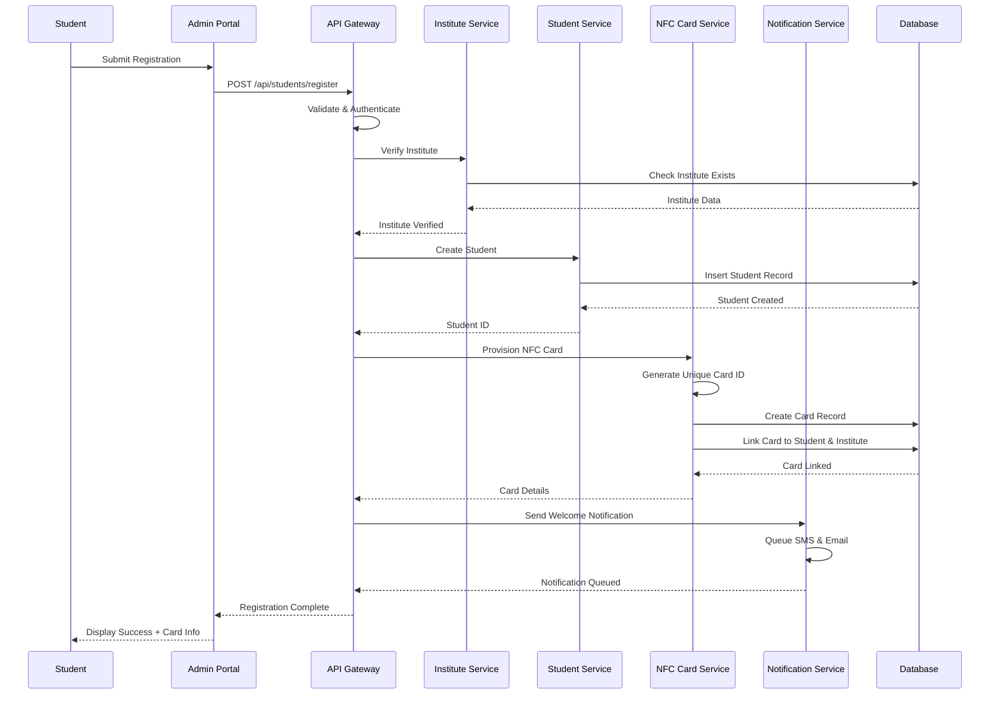

### 3.2 Attendance Check-in Flow

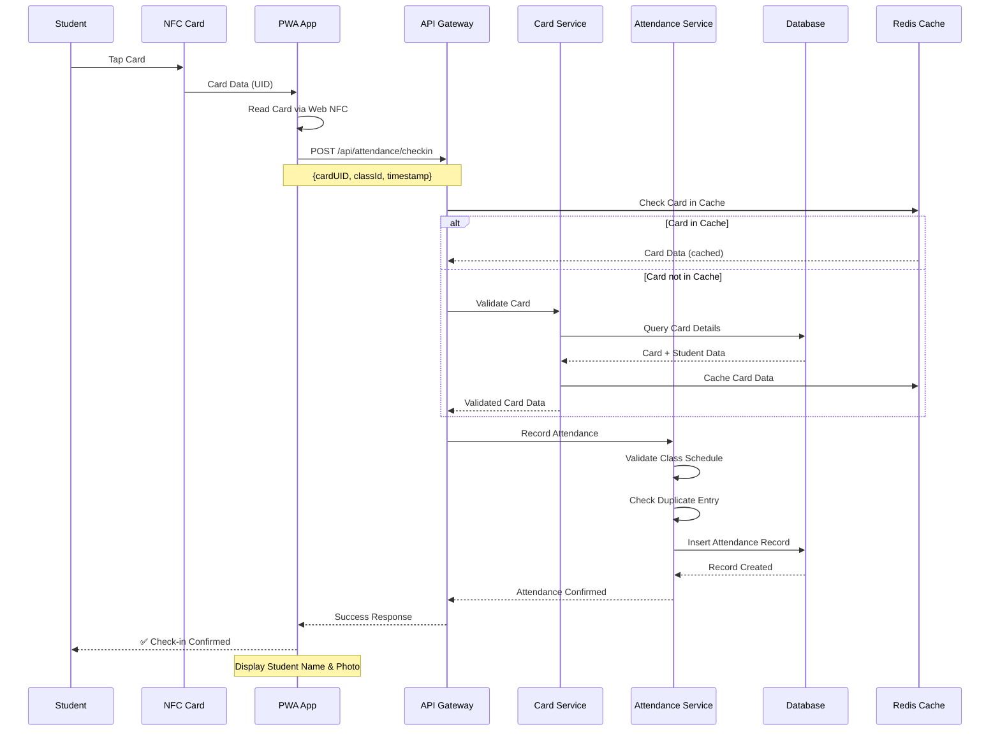

### 3.3 Payment Processing Flow

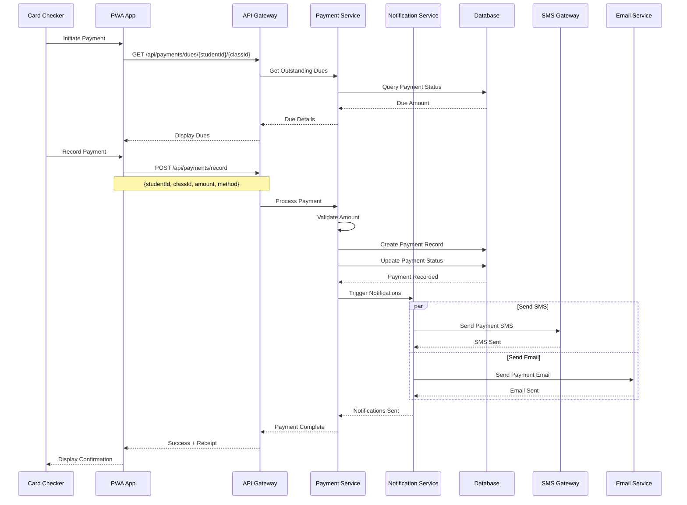

## 4. Deployment Architecture

### 4.1 Cloud Deployment Diagram

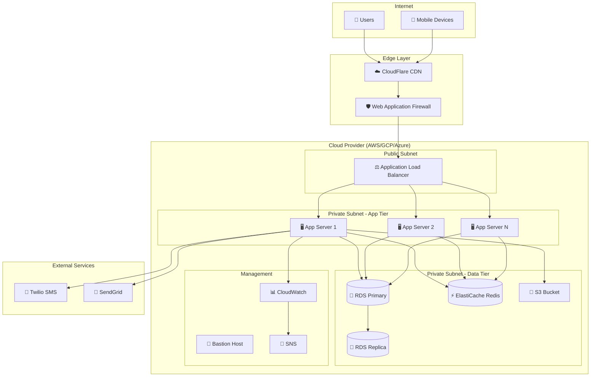

### 4.2 Container Architecture (Docker/Kubernetes)

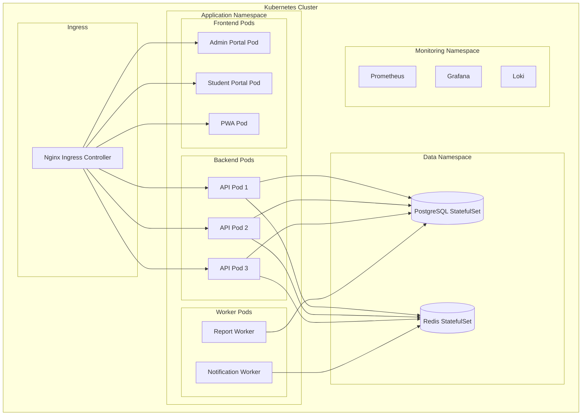

## 5. Security Architecture

### 5.1 Security Layers

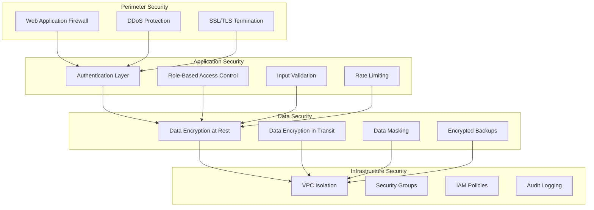

### 5.2 Authentication Flow

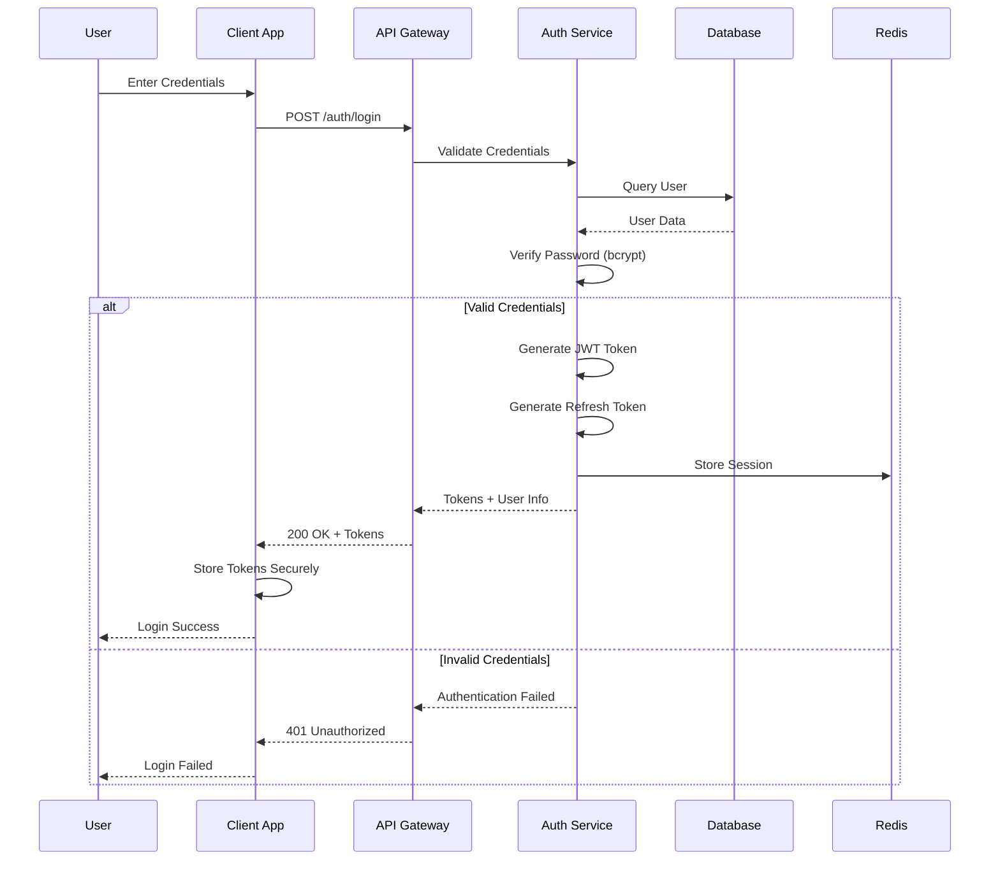

## 6. Integration Architecture

### 6.1 External Service Integration

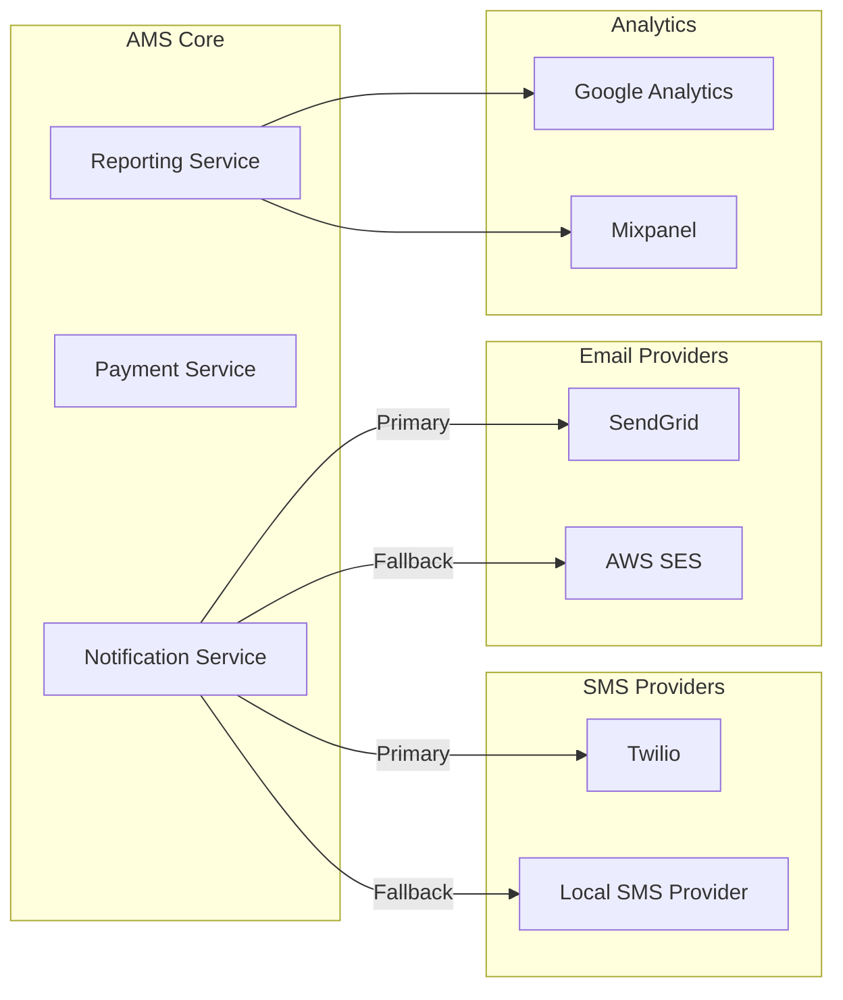

## 7. Scalability Considerations

### 7.1 Horizontal Scaling Strategy

| Component | Scaling Strategy | Trigger |
|-----------|------------------|---------|
| API Servers | Auto-scaling group | CPU > 70% |
| Database | Read replicas | Read load > threshold |
| Cache | Redis Cluster | Memory > 80% |
| Workers | Queue-based scaling | Queue depth |

### 7.2 Performance Targets

| Metric | Target | Maximum |
|--------|--------|---------|
| API Response Time | < 200ms | 500ms |
| NFC Tap to Confirm | < 1s | 2s |
| Concurrent Users | 1000 | 5000 |
| Transactions/second | 100 | 500 |

## 8. Technology Stack Summary

| Layer | Technology | Justification |
|-------|------------|---------------|
| Frontend | React + TypeScript | Type safety, ecosystem |
| PWA | Workbox + Web NFC | Offline support, NFC |
| Backend | Node.js + Express | Performance, ecosystem |
| Database | PostgreSQL | ACID, JSON support |
| Cache | Redis | Speed, pub/sub |
| Queue | Bull (Redis) | Reliable job processing |
| Auth | JWT + bcrypt | Stateless, secure |
| Deployment | Docker + K8s | Scalability, portability |

---

**Next:** [Database Design](./database-design.md) | [API Design](./api-design.md)

