# 📚 Attendance Management System (AMS)

> A modern NFC-based attendance and fee management solution for educational institutes

[](./CHANGELOG.md)
[](./LICENSE)

## 🎯 Overview

The Attendance Management System (AMS) is a comprehensive solution designed to modernize the traditional paper-based attendance and fee management systems in educational institutes. By leveraging NFC technology, AMS provides a seamless, efficient, and secure way to manage student attendance and class fees.

## 🌟 Key Features

| Feature | Description |
|---------|-------------|
| **Multi-Institute Support** | Single platform supporting multiple educational institutes |
| **NFC Card Integration** | Unique NFC cards for student identification |
| **Mobile PWA** | Progressive Web App for card checking and validation |
| **Attendance Tracking** | Real-time class-wise attendance management |
| **Fee Management** | Class-wise fee collection and tracking |
| **Notifications** | SMS and Email notifications for payments |
| **Admin Portal** | Institute-specific administration |
| **Super Admin** | Developer-level system management |

## 📖 Documentation Index

### Architecture & Design
- [System Architecture](./architecture/system-architecture.md)
- [Class & ER Diagrams](./architecture/class-er-diagrams.md)
- [Database Design](./architecture/database-design.md)
- [API Design](./architecture/api-design.md)
- [Security Architecture](./architecture/security-architecture.md)

### Modules
- [User Management](./modules/user-management.md)
- [Institute Management](./modules/institute-management.md)
- [NFC Card Management](./modules/nfc-card-management.md)
- [Attendance Module](./modules/attendance-module.md)
- [Fee Management](./modules/fee-management.md)
- [Notification Service](./modules/notification-service.md)
- [Instructor Portal](./modules/instructor-portal.md)

### User Guides
- [Student Guide](./guides/student-guide.md)
- [Card Checker Guide](./guides/card-checker-guide.md)
- [Admin Guide](./guides/admin-guide.md)
- [Super Admin Guide](./guides/super-admin-guide.md)

### Technical Documentation
- [Technology Stack](./technical/technology-stack.md)
- [Deployment Guide](./technical/deployment-guide.md)
- [PWA Implementation](./technical/pwa-implementation.md)
- [NFC Integration](./technical/nfc-integration.md)

## 🚀 Quick Start

```bash
# Clone the repository
git clone https://github.com/your-org/ams.git

# Navigate to the project
cd ams

# Install dependencies
npm install

# Start development server
npm run dev
```

## 📊 System Overview Diagram

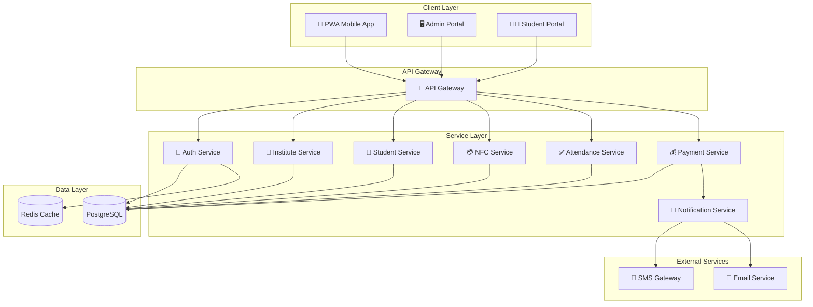

## 👥 User Roles

| Role | Description | Access Level |
|------|-------------|--------------|
| **Super Admin** | System-wide administration for developers | Full system access |
| **Institute Admin** | Institute-specific management | Institute-level access |
| **Card Checker** | Attendance and payment processing | Class-level access |
| **Student** | View personal records | Personal data only |

## 📞 Support

For support and queries, please contact:
- 📧 Email: support@ams.com
- 📚 Documentation: [Wiki Home](./README.md)

---

© 2026 Attendance Management System. All rights reserved.


<div style="page-break-after: always;"></div>

# 🔌 API Design

> RESTful API specification for the Attendance Management System

## 1. API Overview

The AMS API follows REST principles with JSON as the data exchange format. All endpoints are versioned and require authentication unless specified otherwise.

### Base URL
```
Production: https://api.ams.com/v1
Staging: https://api-staging.ams.com/v1
Development: http://localhost:3000/api/v1
```

### Common Headers
```http
Content-Type: application/json
Accept: application/json
Authorization: Bearer <jwt_token>
X-Institute-ID: <institute_uuid>  # Required for institute-scoped operations
X-Request-ID: <unique_request_id>  # For request tracing
```

## 2. API Architecture

```mermaid
graph TB
    subgraph "Client Applications"
        PWA[PWA App]
        Admin[Admin Portal]
        Student[Student Portal]
    end
    
    subgraph "API Gateway"
        Gateway[API Gateway]
        RateLimit[Rate Limiter]
        Auth[Auth Middleware]
        Validator[Request Validator]
    end
    
    subgraph "API Routes"
        AuthAPI[/auth/*]
        InstitutesAPI[/institutes/*]
        StudentsAPI[/students/*]
        ClassesAPI[/classes/*]
        CardsAPI[/cards/*]
        AttendanceAPI[/attendance/*]
        PaymentsAPI[/payments/*]
        NotificationsAPI[/notifications/*]
        ReportsAPI[/reports/*]
    end
    
    PWA --> Gateway
    Admin --> Gateway
    Student --> Gateway
    
    Gateway --> RateLimit
    RateLimit --> Auth
    Auth --> Validator
    
    Validator --> AuthAPI
    Validator --> InstitutesAPI
    Validator --> StudentsAPI
    Validator --> ClassesAPI
    Validator --> CardsAPI
    Validator --> AttendanceAPI
    Validator --> PaymentsAPI
    Validator --> NotificationsAPI
    Validator --> ReportsAPI
```

## 3. Authentication API

### 3.1 Login

```http
POST /auth/login
```

**Request Body:**
```json
{
  "email": "user@example.com",
  "password": "securePassword123"
}
```

**Success Response (200):**
```json
{
  "success": true,
  "data": {
    "user": {
      "id": "uuid",
      "email": "user@example.com",
      "firstName": "John",
      "lastName": "Doe",
      "role": "institute_admin",
      "institutes": [
        {
          "id": "uuid",
          "name": "ABC Institute",
          "role": "admin"
        }
      ]
    },
    "tokens": {
      "accessToken": "eyJhbGciOiJIUzI1NiIs...",
      "refreshToken": "eyJhbGciOiJIUzI1NiIs...",
      "expiresIn": 3600
    }
  }
}
```

### 3.2 Refresh Token

```http
POST /auth/refresh
```

**Request Body:**
```json
{
  "refreshToken": "eyJhbGciOiJIUzI1NiIs..."
}
```

### 3.3 Logout

```http
POST /auth/logout
```

### 3.4 Password Reset Request

```http
POST /auth/password/reset-request
```

**Request Body:**
```json
{
  "email": "user@example.com"
}
```

### 3.5 Password Reset Confirm

```http
POST /auth/password/reset-confirm
```

**Request Body:**
```json
{
  "token": "reset_token_from_email",
  "newPassword": "newSecurePassword123"
}
```

## 4. Institute API

### 4.1 List Institutes (Super Admin Only)

```http
GET /institutes
```

**Query Parameters:**
| Parameter | Type | Description |
|-----------|------|-------------|
| page | integer | Page number (default: 1) |
| limit | integer | Items per page (default: 20) |
| search | string | Search by name or code |
| isActive | boolean | Filter by active status |

**Response:**
```json
{
  "success": true,
  "data": {
    "institutes": [
      {
        "id": "uuid",
        "name": "ABC Institute",
        "code": "ABC001",
        "email": "info@abc.edu",
        "phone": "+1234567890",
        "isActive": true,
        "studentCount": 150,
        "classCount": 12,
        "createdAt": "2026-01-15T10:30:00Z"
      }
    ],
    "pagination": {
      "page": 1,
      "limit": 20,
      "totalPages": 5,
      "totalItems": 95
    }
  }
}
```

### 4.2 Create Institute

```http
POST /institutes
```

**Request Body:**
```json
{
  "name": "ABC Institute",
  "code": "ABC001",
  "address": "123 Education St",
  "phone": "+1234567890",
  "email": "info@abc.edu",
  "settings": {
    "timezone": "Asia/Colombo",
    "notificationPreferences": {
      "smsEnabled": true,
      "emailEnabled": true
    }
  }
}
```

### 4.3 Get Institute Details

```http
GET /institutes/:instituteId
```

### 4.4 Update Institute

```http
PUT /institutes/:instituteId
```

### 4.5 Get Institute Statistics

```http
GET /institutes/:instituteId/stats
```

**Response:**
```json
{
  "success": true,
  "data": {
    "totalStudents": 150,
    "activeStudents": 142,
    "totalClasses": 12,
    "activeClasses": 10,
    "totalCards": 148,
    "attendanceToday": 89,
    "paymentsThisMonth": {
      "total": 125000.00,
      "count": 85
    }
  }
}
```

## 5. Student API

### 5.1 Register Student

```http
POST /students/register
```

**Request Body:**
```json
{
  "instituteId": "uuid",
  "firstName": "Jane",
  "lastName": "Smith",
  "email": "jane@example.com",
  "phone": "+1234567890",
  "dateOfBirth": "2005-03-15",
  "guardianName": "John Smith",
  "guardianPhone": "+0987654321",
  "guardianEmail": "john.smith@example.com",
  "address": "456 Student Lane",
  "classIds": ["uuid1", "uuid2"]
}
```

**Response (201):**
```json
{
  "success": true,
  "data": {
    "student": {
      "id": "uuid",
      "studentCode": "STU-2026-001",
      "enrollmentNumber": "ABC-2026-0001",
      "firstName": "Jane",
      "lastName": "Smith",
      "email": "jane@example.com"
    },
    "nfcCard": {
      "id": "uuid",
      "cardUid": "04:A2:B3:C4:D5:E6:F7",
      "status": "pending_activation"
    },
    "message": "Student registered successfully. NFC card pending activation."
  }
}
```

### 5.2 List Students

```http
GET /students
```

**Query Parameters:**
| Parameter | Type | Description |
|-----------|------|-------------|
| instituteId | uuid | Filter by institute |
| classId | uuid | Filter by class |
| status | string | Filter by enrollment status |
| search | string | Search by name, code, email |
| page | integer | Page number |
| limit | integer | Items per page |

### 5.3 Get Student Details

```http
GET /students/:studentId
```

**Response:**
```json
{
  "success": true,
  "data": {
    "id": "uuid",
    "studentCode": "STU-2026-001",
    "firstName": "Jane",
    "lastName": "Smith",
    "email": "jane@example.com",
    "phone": "+1234567890",
    "dateOfBirth": "2005-03-15",
    "guardian": {
      "name": "John Smith",
      "phone": "+0987654321",
      "email": "john.smith@example.com"
    },
    "institutes": [
      {
        "id": "uuid",
        "name": "ABC Institute",
        "enrollmentNumber": "ABC-2026-0001",
        "enrollmentDate": "2026-01-15",
        "status": "active",
        "nfcCard": {
          "id": "uuid",
          "cardUid": "04:A2:B3:C4:D5:E6:F7",
          "status": "active"
        }
      }
    ],
    "classes": [
      {
        "id": "uuid",
        "name": "Mathematics Grade 10",
        "status": "enrolled"
      }
    ]
  }
}
```

### 5.4 Update Student

```http
PUT /students/:studentId
```

### 5.5 Get Student Attendance History

```http
GET /students/:studentId/attendance
```

**Query Parameters:**
| Parameter | Type | Description |
|-----------|------|-------------|
| classId | uuid | Filter by class |
| startDate | date | Start date (YYYY-MM-DD) |
| endDate | date | End date (YYYY-MM-DD) |

### 5.6 Get Student Payment History

```http
GET /students/:studentId/payments
```

## 6. Class API

### 6.1 List Classes

```http
GET /classes
```

### 6.2 Create Class

```http
POST /classes
```

**Request Body:**
```json
{
  "instituteId": "uuid",
  "name": "Mathematics Grade 10",
  "code": "MATH-10",
  "description": "Advanced mathematics for grade 10 students",
  "instructorId": "uuid",
  "schedule": [
    {
      "day": "monday",
      "startTime": "09:00",
      "endTime": "10:30"
    },
    {
      "day": "wednesday",
      "startTime": "09:00",
      "endTime": "10:30"
    }
  ],
  "room": "Room 101",
  "capacity": 30,
  "fee": {
    "name": "Monthly Tuition",
    "amount": 5000.00,
    "frequency": "monthly",
    "dueDay": 5
  }
}
```

### 6.3 Get Class Details

```http
GET /classes/:classId
```

### 6.4 Update Class

```http
PUT /classes/:classId
```

### 6.5 Get Class Students

```http
GET /classes/:classId/students
```

### 6.6 Enroll Student in Class

```http
POST /classes/:classId/students
```

**Request Body:**
```json
{
  "studentId": "uuid"
}
```

### 6.7 Remove Student from Class

```http
DELETE /classes/:classId/students/:studentId
```

### 6.8 Get Class Attendance

```http
GET /classes/:classId/attendance
```

**Query Parameters:**
| Parameter | Type | Description |
|-----------|------|-------------|
| date | date | Specific date (YYYY-MM-DD) |
| startDate | date | Start date range |
| endDate | date | End date range |

## 7. NFC Card API

### 7.1 Validate Card (PWA Check-in)

```http
POST /cards/validate
```

**Request Body:**
```json
{
  "cardUid": "04:A2:B3:C4:D5:E6:F7",
  "classId": "uuid"
}
```

**Response:**
```json
{
  "success": true,
  "data": {
    "valid": true,
    "student": {
      "id": "uuid",
      "studentCode": "STU-2026-001",
      "firstName": "Jane",
      "lastName": "Smith",
      "photoUrl": "https://..."
    },
    "card": {
      "id": "uuid",
      "status": "active"
    },
    "enrollment": {
      "status": "enrolled",
      "classId": "uuid",
      "className": "Mathematics Grade 10"
    },
    "paymentStatus": {
      "currentMonthPaid": true,
      "dueAmount": 0
    }
  }
}
```

### 7.2 Issue Card

```http
POST /cards
```

**Request Body:**
```json
{
  "studentId": "uuid",
  "instituteId": "uuid",
  "cardUid": "04:A2:B3:C4:D5:E6:F7"
}
```

### 7.3 Get Card Details

```http
GET /cards/:cardId
```

### 7.4 Update Card Status

```http
PATCH /cards/:cardId/status
```

**Request Body:**
```json
{
  "status": "blocked",
  "reason": "Lost card reported"
}
```

### 7.5 Replace Card

```http
POST /cards/:cardId/replace
```

**Request Body:**
```json
{
  "newCardUid": "04:B2:C3:D4:E5:F6:G7",
  "reason": "Card damaged"
}
```

### 7.6 Get Card Transaction History

```http
GET /cards/:cardId/transactions
```

## 8. Attendance API

### 8.1 Record Attendance (Check-in)

```http
POST /attendance/checkin
```

**Request Body:**
```json
{
  "cardUid": "04:A2:B3:C4:D5:E6:F7",
  "classId": "uuid",
  "deviceInfo": {
    "type": "mobile",
    "browser": "Chrome",
    "platform": "Android"
  }
}
```

**Response:**
```json
{
  "success": true,
  "data": {
    "attendance": {
      "id": "uuid",
      "studentId": "uuid",
      "studentName": "Jane Smith",
      "studentPhoto": "https://...",
      "classId": "uuid",
      "className": "Mathematics Grade 10",
      "checkInTime": "2026-02-14T09:05:23Z",
      "status": "present"
    },
    "message": "Attendance recorded successfully"
  }
}
```

### 8.2 Get Today's Attendance for Class

```http
GET /attendance/class/:classId/today
```

**Response:**
```json
{
  "success": true,
  "data": {
    "class": {
      "id": "uuid",
      "name": "Mathematics Grade 10"
    },
    "date": "2026-02-14",
    "summary": {
      "total": 25,
      "present": 20,
      "late": 3,
      "absent": 2
    },
    "records": [
      {
        "studentId": "uuid",
        "studentCode": "STU-2026-001",
        "studentName": "Jane Smith",
        "checkInTime": "2026-02-14T09:05:23Z",
        "status": "present"
      }
    ]
  }
}
```

### 8.3 Update Attendance Status

```http
PATCH /attendance/:attendanceId
```

**Request Body:**
```json
{
  "status": "excused",
  "notes": "Medical leave"
}
```

### 8.4 Get Attendance Report

```http
GET /attendance/report
```

**Query Parameters:**
| Parameter | Type | Description |
|-----------|------|-------------|
| instituteId | uuid | Institute ID |
| classId | uuid | Class ID (optional) |
| studentId | uuid | Student ID (optional) |
| startDate | date | Start date |
| endDate | date | End date |
| format | string | Response format (json/csv) |

## 9. Payment API

### 9.1 Get Payment Dues

```http
GET /payments/dues/:studentId
```

**Query Parameters:**
| Parameter | Type | Description |
|-----------|------|-------------|
| classId | uuid | Filter by class |
| month | integer | Month (1-12) |
| year | integer | Year |

**Response:**
```json
{
  "success": true,
  "data": {
    "student": {
      "id": "uuid",
      "name": "Jane Smith"
    },
    "dues": [
      {
        "classId": "uuid",
        "className": "Mathematics Grade 10",
        "feeId": "uuid",
        "feeName": "Monthly Tuition",
        "amount": 5000.00,
        "paidAmount": 0,
        "dueAmount": 5000.00,
        "dueDate": "2026-02-05",
        "status": "overdue"
      }
    ],
    "totalDue": 5000.00
  }
}
```

### 9.2 Record Payment

```http
POST /payments
```

**Request Body:**
```json
{
  "studentId": "uuid",
  "classId": "uuid",
  "classFeeId": "uuid",
  "amount": 5000.00,
  "paymentMethod": "cash",
  "forMonth": 2,
  "forYear": 2026,
  "notes": "Paid in full"
}
```

**Response:**
```json
{
  "success": true,
  "data": {
    "payment": {
      "id": "uuid",
      "referenceNumber": "PAY-2026-0001234",
      "amount": 5000.00,
      "paymentMethod": "cash",
      "paymentDate": "2026-02-14",
      "status": "completed"
    },
    "notifications": {
      "smsSent": true,
      "emailSent": true
    },
    "message": "Payment recorded successfully"
  }
}
```

### 9.3 Get Payment History

```http
GET /payments
```

**Query Parameters:**
| Parameter | Type | Description |
|-----------|------|-------------|
| studentId | uuid | Filter by student |
| classId | uuid | Filter by class |
| startDate | date | Start date |
| endDate | date | End date |
| status | string | Filter by status |

### 9.4 Get Payment Receipt

```http
GET /payments/:paymentId/receipt
```

### 9.5 Refund Payment

```http
POST /payments/:paymentId/refund
```

**Request Body:**
```json
{
  "amount": 5000.00,
  "reason": "Class cancelled"
}
```

## 10. Notification API

### 10.1 Get User Notifications

```http
GET /notifications
```

### 10.2 Send Notification (Admin)

```http
POST /notifications/send
```

**Request Body:**
```json
{
  "recipients": ["uuid1", "uuid2"],
  "channels": ["sms", "email"],
  "subject": "Payment Reminder",
  "content": "Your class fee for February is due.",
  "type": "payment_reminder"
}
```

### 10.3 Get Notification Status

```http
GET /notifications/:notificationId
```

## 11. Reports API

### 11.1 Attendance Summary Report

```http
GET /reports/attendance/summary
```

### 11.2 Payment Summary Report

```http
GET /reports/payments/summary
```

### 11.3 Student Report

```http
GET /reports/students/:studentId
```

### 11.4 Class Report

```http
GET /reports/classes/:classId
```

### 11.5 Export Report

```http
POST /reports/export
```

**Request Body:**
```json
{
  "reportType": "attendance",
  "format": "csv",
  "filters": {
    "instituteId": "uuid",
    "startDate": "2026-01-01",
    "endDate": "2026-02-14"
  }
}
```

## 12. Error Responses

### Standard Error Format

```json
{
  "success": false,
  "error": {
    "code": "VALIDATION_ERROR",
    "message": "Validation failed",
    "details": [
      {
        "field": "email",
        "message": "Invalid email format"
      }
    ]
  },
  "requestId": "req_abc123"
}
```

### Error Codes

| Code | HTTP Status | Description |
|------|-------------|-------------|
| VALIDATION_ERROR | 400 | Request validation failed |
| UNAUTHORIZED | 401 | Authentication required |
| FORBIDDEN | 403 | Insufficient permissions |
| NOT_FOUND | 404 | Resource not found |
| CONFLICT | 409 | Resource conflict (e.g., duplicate) |
| RATE_LIMITED | 429 | Too many requests |
| INTERNAL_ERROR | 500 | Server error |

## 13. Rate Limiting

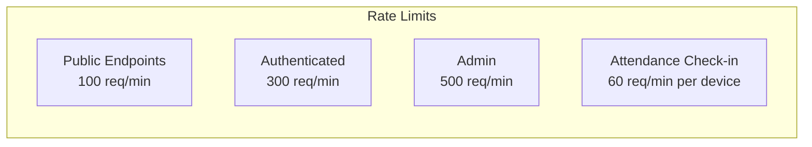

**Rate Limit Headers:**
```http
X-RateLimit-Limit: 300
X-RateLimit-Remaining: 295
X-RateLimit-Reset: 1644847260
```

## 14. WebSocket Events (Real-time)

### Connection

```javascript
const socket = io('wss://api.ams.com', {
  auth: { token: 'jwt_token' },
  query: { instituteId: 'uuid', classId: 'uuid' }
});
```

### Events

| Event | Direction | Description |
|-------|-----------|-------------|
| `attendance:checkin` | Server → Client | New check-in recorded |
| `payment:received` | Server → Client | Payment recorded |
| `card:status` | Server → Client | Card status changed |
| `class:join` | Client → Server | Join class room |
| `class:leave` | Client → Server | Leave class room |

### Event Payload Example

```json
{
  "event": "attendance:checkin",
  "data": {
    "attendanceId": "uuid",
    "studentId": "uuid",
    "studentName": "Jane Smith",
    "classId": "uuid",
    "timestamp": "2026-02-14T09:05:23Z"
  }
}
```

---

**Previous:** [Database Design](./database-design.md) | **Next:** [Security Architecture](./security-architecture.md)


<div style="page-break-after: always;"></div>

# 📊 System Diagrams

> Class Diagram and Entity Relationship Diagram for the Attendance Management System

## 1. Class Diagram

The class diagram shows the object-oriented design of the AMS system, including all entities, their attributes, methods, and relationships.

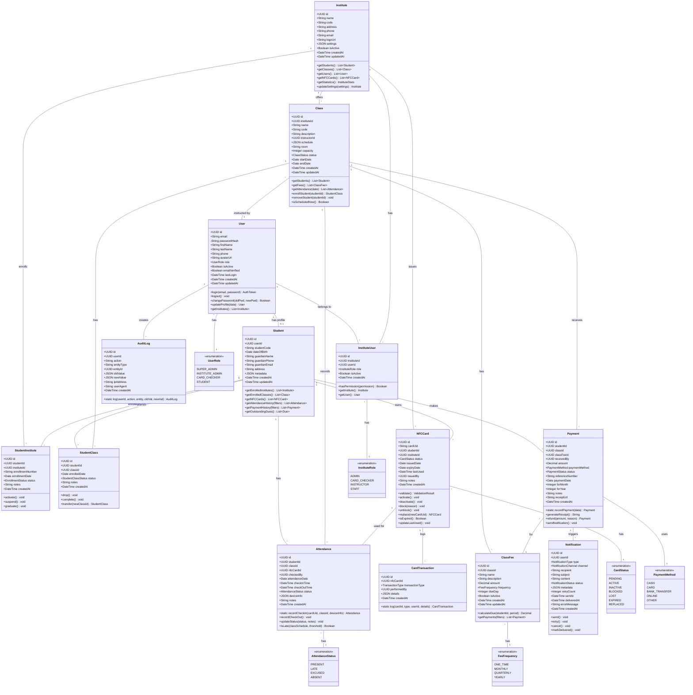

## 2. Detailed Class Diagram (Core Entities)

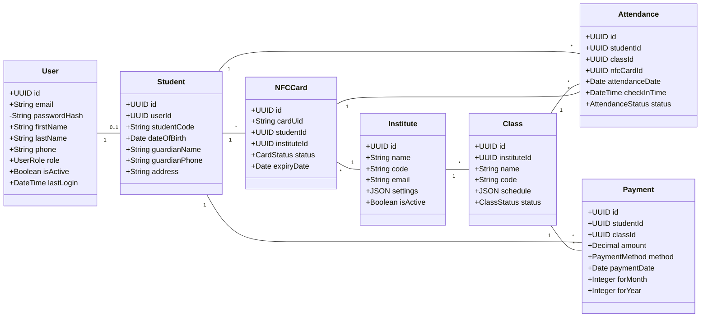

## 3. Entity Relationship Diagram (Chen Notation)

```mermaid
erDiagram
    %% ==================== CORE ENTITIES ====================
    
    USERS {
        uuid id PK "Primary Key"
        varchar email UK "Unique email address"
        varchar password_hash "Bcrypt hashed password"
        varchar first_name "User's first name"
        varchar last_name "User's last name"
        varchar phone "Contact phone"
        varchar avatar_url "Profile picture URL"
        enum role "super_admin|institute_admin|card_checker|student"
        boolean is_active "Account active status"
        boolean email_verified "Email verification status"
        timestamp last_login "Last login timestamp"
        timestamp created_at "Record creation time"
        timestamp updated_at "Last update time"
    }
    
    INSTITUTES {
        uuid id PK "Primary Key"
        varchar name "Institute name"
        varchar code UK "Unique institute code"
        text address "Physical address"
        varchar phone "Contact phone"
        varchar email "Contact email"
        varchar logo_url "Logo image URL"
        jsonb settings "Configuration settings"
        boolean is_active "Active status"
        timestamp created_at "Record creation time"
        timestamp updated_at "Last update time"
    }
    
    STUDENTS {
        uuid id PK "Primary Key"
        uuid user_id FK,UK "References users.id"
        varchar student_code UK "Unique student identifier"
        date date_of_birth "Student DOB"
        varchar guardian_name "Parent/Guardian name"
        varchar guardian_phone "Guardian contact"
        varchar guardian_email "Guardian email"
        text address "Student address"
        jsonb metadata "Additional info JSON"
        timestamp created_at "Record creation time"
        timestamp updated_at "Last update time"
    }
    
    CLASSES {
        uuid id PK "Primary Key"
        uuid institute_id FK "References institutes.id"
        varchar name "Class name"
        varchar code "Class code within institute"
        text description "Class description"
        uuid instructor_id FK "References users.id"
        jsonb schedule "Schedule JSON array"
        varchar room "Room/Location"
        integer capacity "Max students"
        enum status "active|inactive|completed|cancelled"
        date start_date "Class start date"
        date end_date "Class end date"
        timestamp created_at "Record creation time"
        timestamp updated_at "Last update time"
    }
    
    NFC_CARDS {
        uuid id PK "Primary Key"
        varchar card_uid UK "Physical card UID"
        uuid student_id FK "References students.id"
        uuid institute_id FK "References institutes.id"
        enum status "active|inactive|lost|expired|blocked"
        date issued_date "Card issue date"
        date expiry_date "Card expiration"
        timestamp last_used "Last card tap time"
        uuid issued_by FK "References users.id"
        text notes "Admin notes"
        timestamp created_at "Record creation time"
    }
    
    %% ==================== JUNCTION/BRIDGE TABLES ====================
    
    INSTITUTE_USERS {
        uuid id PK "Primary Key"
        uuid institute_id FK "References institutes.id"
        uuid user_id FK "References users.id"
        enum role "admin|card_checker|instructor|staff"
        boolean is_active "Membership active"
        timestamp created_at "Record creation time"
    }
    
    STUDENT_INSTITUTES {
        uuid id PK "Primary Key"
        uuid student_id FK "References students.id"
        uuid institute_id FK "References institutes.id"
        varchar enrollment_number UK "Institute enrollment number"
        date enrollment_date "Enrollment date"
        enum status "active|inactive|suspended|graduated"
        text notes "Enrollment notes"
        timestamp created_at "Record creation time"
    }
    
    STUDENT_CLASSES {
        uuid id PK "Primary Key"
        uuid student_id FK "References students.id"
        uuid class_id FK "References classes.id"
        date enrolled_date "Class enrollment date"
        enum status "enrolled|dropped|completed|transferred"
        text notes "Enrollment notes"
        timestamp created_at "Record creation time"
    }
    
    %% ==================== TRANSACTION TABLES ====================
    
    ATTENDANCE {
        uuid id PK "Primary Key"
        uuid student_id FK "References students.id"
        uuid class_id FK "References classes.id"
        uuid nfc_card_id FK "References nfc_cards.id"
        uuid checked_by FK "References users.id"
        date attendance_date "Attendance date"
        timestamp check_in_time "Check-in timestamp"
        timestamp check_out_time "Check-out timestamp"
        enum status "present|late|excused|absent"
        jsonb device_info "Device metadata"
        text notes "Attendance notes"
        timestamp created_at "Record creation time"
    }
    
    CLASS_FEES {
        uuid id PK "Primary Key"
        uuid class_id FK "References classes.id"
        varchar name "Fee name"
        text description "Fee description"
        decimal amount "Fee amount"
        enum frequency "one_time|monthly|quarterly|yearly"
        integer due_day "Day of month due (1-31)"
        boolean is_active "Fee active status"
        timestamp created_at "Record creation time"
        timestamp updated_at "Last update time"
    }
    
    PAYMENTS {
        uuid id PK "Primary Key"
        uuid student_id FK "References students.id"
        uuid class_id FK "References classes.id"
        uuid class_fee_id FK "References class_fees.id"
        uuid received_by FK "References users.id"
        decimal amount "Payment amount"
        enum payment_method "cash|card|bank_transfer|online|other"
        enum status "pending|completed|failed|refunded"
        varchar reference_number "Receipt number"
        date payment_date "Payment date"
        integer for_month "Payment period month"
        integer for_year "Payment period year"
        text notes "Payment notes"
        varchar receipt_url "Receipt file URL"
        timestamp created_at "Record creation time"
    }
    
    %% ==================== AUDIT/LOG TABLES ====================
    
    CARD_TRANSACTIONS {
        uuid id PK "Primary Key"
        uuid nfc_card_id FK "References nfc_cards.id"
        enum transaction_type "issued|activated|deactivated|blocked|unblocked|replaced|expired"
        uuid performed_by FK "References users.id"
        jsonb details "Transaction details JSON"
        timestamp created_at "Record creation time"
    }
    
    NOTIFICATIONS {
        uuid id PK "Primary Key"
        uuid user_id FK "References users.id"
        enum type "payment_confirmation|payment_reminder|attendance|general|alert"
        enum channel "sms|email|push|in_app"
        varchar recipient "Phone or email"
        varchar subject "Notification subject"
        text content "Notification body"
        enum status "pending|sent|delivered|failed|cancelled"
        jsonb metadata "Additional metadata"
        integer retry_count "Delivery attempts"
        timestamp sent_at "Send timestamp"
        timestamp delivered_at "Delivery timestamp"
        text error_message "Error if failed"
        timestamp created_at "Record creation time"
    }
    
    AUDIT_LOGS {
        uuid id PK "Primary Key"
        uuid user_id FK "References users.id"
        varchar action "Action performed"
        varchar entity_type "Entity type modified"
        uuid entity_id "Entity ID modified"
        jsonb old_value "Previous state"
        jsonb new_value "New state"
        inet ip_address "Client IP"
        text user_agent "Browser/client info"
        timestamp created_at "Record creation time"
    }
    
    %% ==================== RELATIONSHIPS ====================
    
    %% User to Student (1:1)
    USERS ||--o| STUDENTS : "has profile"
    
    %% User to Institute (M:N via INSTITUTE_USERS)
    USERS ||--o{ INSTITUTE_USERS : "belongs to"
    INSTITUTES ||--o{ INSTITUTE_USERS : "has"
    
    %% Student to Institute (M:N via STUDENT_INSTITUTES)
    STUDENTS ||--o{ STUDENT_INSTITUTES : "enrolled in"
    INSTITUTES ||--o{ STUDENT_INSTITUTES : "enrolls"
    
    %% Institute to Class (1:N)
    INSTITUTES ||--o{ CLASSES : "offers"
    
    %% Class Instructor
    USERS ||--o{ CLASSES : "instructs"
    
    %% Student to Class (M:N via STUDENT_CLASSES)
    STUDENTS ||--o{ STUDENT_CLASSES : "attends"
    CLASSES ||--o{ STUDENT_CLASSES : "has"
    
    %% NFC Cards
    STUDENTS ||--o{ NFC_CARDS : "owns"
    INSTITUTES ||--o{ NFC_CARDS : "issues"
    USERS ||--o{ NFC_CARDS : "issued by"
    
    %% Card Transactions
    NFC_CARDS ||--o{ CARD_TRANSACTIONS : "logs"
    USERS ||--o{ CARD_TRANSACTIONS : "performed by"
    
    %% Class Fees
    CLASSES ||--o{ CLASS_FEES : "has"
    
    %% Attendance
    STUDENTS ||--o{ ATTENDANCE : "has"
    CLASSES ||--o{ ATTENDANCE : "records"
    NFC_CARDS ||--o{ ATTENDANCE : "used for"
    USERS ||--o{ ATTENDANCE : "checked by"
    
    %% Payments
    STUDENTS ||--o{ PAYMENTS : "makes"
    CLASSES ||--o{ PAYMENTS : "receives"
    CLASS_FEES ||--o{ PAYMENTS : "for"
    USERS ||--o{ PAYMENTS : "received by"
    
    %% Notifications
    USERS ||--o{ NOTIFICATIONS : "receives"
    
    %% Audit Logs
    USERS ||--o{ AUDIT_LOGS : "creates"
```

## 4. Simplified ER Diagram (Core Business Entities)

```mermaid
erDiagram
    INSTITUTE ||--o{ CLASS : offers
    INSTITUTE ||--o{ STUDENT_ENROLLMENT : has
    INSTITUTE ||--o{ NFC_CARD : issues
    
    STUDENT ||--o{ STUDENT_ENROLLMENT : "enrolled in"
    STUDENT ||--o{ CLASS_ENROLLMENT : attends
    STUDENT ||--o{ NFC_CARD : owns
    STUDENT ||--o{ ATTENDANCE : has
    STUDENT ||--o{ PAYMENT : makes
    
    CLASS ||--o{ CLASS_ENROLLMENT : has
    CLASS ||--o{ CLASS_FEE : charges
    CLASS ||--o{ ATTENDANCE : records
    CLASS ||--o{ PAYMENT : receives
    
    NFC_CARD ||--o{ ATTENDANCE : "used for"
    
    CLASS_FEE ||--o{ PAYMENT : for
    
    INSTITUTE {
        uuid id PK
        string name
        string code UK
        boolean is_active
    }
    
    STUDENT {
        uuid id PK
        string student_code UK
        string guardian_phone
    }
    
    CLASS {
        uuid id PK
        uuid institute_id FK
        string name
        string code
    }
    
    NFC_CARD {
        uuid id PK
        string card_uid UK
        uuid student_id FK
        uuid institute_id FK
        enum status
    }
    
    STUDENT_ENROLLMENT {
        uuid id PK
        uuid student_id FK
        uuid institute_id FK
        string enrollment_number UK
        enum status
    }
    
    CLASS_ENROLLMENT {
        uuid id PK
        uuid student_id FK
        uuid class_id FK
        enum status
    }
    
    ATTENDANCE {
        uuid id PK
        uuid student_id FK
        uuid class_id FK
        uuid nfc_card_id FK
        date attendance_date
        enum status
    }
    
    CLASS_FEE {
        uuid id PK
        uuid class_id FK
        decimal amount
        enum frequency
    }
    
    PAYMENT {
        uuid id PK
        uuid student_id FK
        uuid class_id FK
        uuid class_fee_id FK
        decimal amount
        date payment_date
    }
```

## 5. Domain Model Diagram

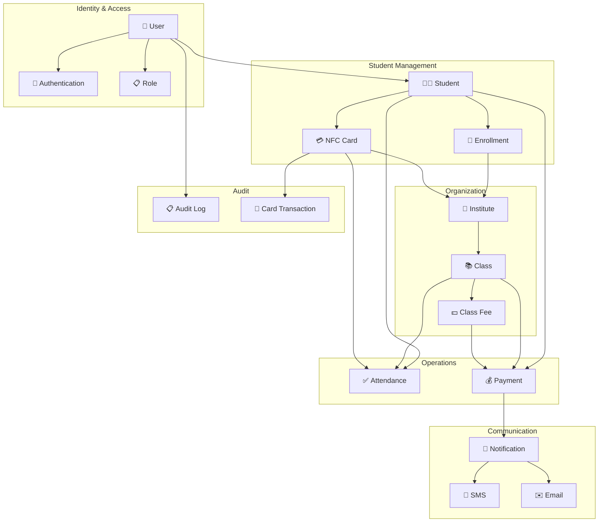

## 6. Cardinality Summary

| Relationship | Type | Description |
|--------------|------|-------------|
| User → Student | 1:0..1 | A user may optionally be a student |
| Institute → Class | 1:N | One institute has many classes |
| Institute → NFC Card | 1:N | One institute issues many cards |
| Student → NFC Card | 1:N | One student can have multiple cards (one per institute) |
| Student → Institute | M:N | Students can enroll in multiple institutes |
| Student → Class | M:N | Students can enroll in multiple classes |
| Class → Class Fee | 1:N | One class can have multiple fee types |
| Student + Class → Attendance | Many records per combination |
| Student + Class + Fee → Payment | Many records per combination |

---

**Related Documentation:**
- [Database Design](./database-design.md) - SQL Schema definitions
- [System Architecture](./system-architecture.md) - Overall system design
- [API Design](./api-design.md) - RESTful API endpoints


<div style="page-break-after: always;"></div>

# Cross-Institute Identity — Frontend Implementation Plan

**Status:** Approved design, ready to implement
**Companion to:** [`cross-institute-identity.md`](./cross-institute-identity.md) (backend)
**Target implementer:** Claude Sonnet (or any frontend engineer)
**Last updated:** 2026-05-02

> Read the backend plan first. This document only covers UI changes; the *why* lives in the backend doc.

---

## 1. Goal

Make the AMS.PWA reflect the new global-identity model:

1. Registrars collect the data the matcher needs (`FirstName`, `LastName`, `DateOfBirth`, `Gender`, optional `Nic`, optional `PersonCode`, structured `Guardian`).
2. **Never display PII from other institutes.** Even if a returning student is linked behind the scenes, the institute UI shows only this institute's enrollment.
3. Optional `PersonCode` input gives parents a clean way to assert "this is the same student" across institutes without revealing where they came from.
4. New screens for the `GlobalIdentityAdmin` role: review queue, merge, split. Strictly isolated from the institute-scoped UI.
5. Same flow applies to instructor onboarding.

## 2. Non-Goals

- No frontend matching logic. The matcher runs on the backend; the PWA never scores duplicates.
- No "potential duplicate from another institute" UI for institute users. Ever.
- No i18n in this iteration (the codebase has no i18n today).
- No NFC hardware integration changes (existing text-input flow unchanged).

---

## 3. Current State (verified 2026-05-02)

### 3.1 Stack
- React 19.2.3, Vite 7.3.0, TypeScript 5.9.3
- TanStack Router (file-based, `routeTree.gen.ts`)
- Zustand for auth state (`src/stores/auth-store.ts`)
- TanStack React Query + Axios (`src/lib/api-client.ts`)
- React Hook Form + Zod
- Radix + shadcn/ui + Tailwind v4
- No i18n. Strings are inline.

### 3.2 Folder layout
- `src/routes/(auth)/` — public routes
- `src/routes/_authenticated/` — institute-scoped, JWT-gated
- `src/routes/(errors)/` — 401/403/404/500/503
- `src/features/<domain>/` — feature modules with `components/`, `index.tsx`, etc.
- `src/services/<domain>.service.ts` — Axios-based API clients
- `src/hooks/use-<domain>.ts` — React Query wrappers
- `src/types/<domain>.ts` — TS types
- `src/components/permission-guard.tsx` — `<PermissionGuard permission="..." />`

### 3.3 Existing student/instructor surface
- `src/features/students/components/student-form.tsx` — Zod schema fields: `email, studentCode, dateOfBirth, guardianName, guardianPhone, guardianEmail, address, enrollmentNumber, notes`. **All free-text guardian.**
- `src/services/student.service.ts` exposes `lookupIdentity({ email?, phone? })` returning `{ exists, userId? }`. **This is a PII leak risk** — see §5.6.
- `src/types/student.ts` mirrors backend DTOs.
- `src/features/users/` — global user management (admin-only).
- `src/features/cards/` — NFC card issuance, validation, listing. Card UID accepted as text input.
- No instructor enrollment form yet (verify; if absent it's added in this plan).
- No identity-matching, merge, or duplicate UI of any kind.

### 3.4 Auth & tenancy
- `useAuthStore` holds `user, accessToken, refreshToken, instituteId, roles, permissions`.
- `instituteId` is decoded from JWT (`institute_id` claim) and persisted.
- API client auto-injects `Authorization: Bearer …` and `X-Institute-Id`.
- UI gating via `<PermissionGuard permission="users:create">` etc.

---

## 4. Frontend Principles

These are non-negotiable.

1. **PII isolation in the response handler.** When a backend response indicates a link happened (or is pending), the PWA must NOT render any field originating from another institute. The student's view is always institute-local.
2. **Registration is non-blocking.** The registrar sees an immediate success. No spinner that waits for the matcher.
3. **`PersonCode` is the only cross-institute signal exposed to institute users.** It can be typed in (registration), displayed back (enrollment detail, NFC card), and printed (receipt, ID card). It never reveals which other institute issued it.
4. **Global identity admin UI is strictly separated** from institute UI. Different route group, different role, different navigation entry, different layout.
5. **Matching never happens client-side.** Don't ship trigram or phonetic logic to the browser. The frontend collects data and shows results from the backend.
6. **Forms validate format, not uniqueness.** Uniqueness is a backend concern. The PWA only enforces local rules (e.g., `PersonCode` regex, phone format hints).

---

## 5. UI Changes by Surface

### 5.1 Student registration form

**File:** `src/features/students/components/student-form.tsx`

Replace the current Zod schema. New shape:

```ts
const enrollSchema = z.object({
  // identity (sent to global ApplicationUser)
  firstName: z.string().min(1, 'First name is required.').max(100),
  lastName: z.string().min(1, 'Last name is required.').max(200),
  dateOfBirth: z.string().min(1, 'Date of birth is required for matching.'),
  gender: z.enum(['Male', 'Female', 'Other', 'PreferNotToSay']).optional(),
  nic: z.string().trim().optional(),                       // NEVER required
  personCode: z
    .string()
    .regex(/^P-\d{4}-\d{6}$/, 'Format: P-YYYY-NNNNNN')
    .optional(),                                            // optional re-enrollment shortcut
  email: z.string().email().optional().or(z.literal('')),  // optional for minors

  // institute-scoped
  studentCode: z.string().min(1),
  enrollmentNumber: z.string().optional(),
  address: z.string().optional(),
  notes: z.string().optional(),

  // guardians (structured — see GuardianPicker §6.3)
  guardians: z
    .array(
      z.object({
        guardianId: z.string().uuid().optional(),         // null = new guardian
        phoneNumber: z.string().min(1, 'Phone is required'),
        name: z.string().optional(),
        email: z.string().email().optional().or(z.literal('')),
        relationship: z.enum(['Father', 'Mother', 'Guardian', 'Sibling', 'Self', 'Other']),
        isPrimary: z.boolean(),
      })
    )
    .min(1, 'At least one guardian is required.'),
})
```

**Removed fields (do not collect):** `birthCertificateNumber` — not requested anywhere in the UI per project decision. The backend column exists but is opt-in for institutes that already collect it; out of scope for the PWA.

**DOB:** Required for the matcher to work. If genuinely unknown, registrar uses a "DOB unknown" toggle which submits `null` and triggers a banner explaining matcher will not auto-link without DOB. Bias the design toward collecting it.

**`PersonCode` field:**
- Optional, placed under a collapsed "Have you enrolled before? Enter your student ID" disclosure on the form.
- When entered AND format-valid, the form calls `useResolvePersonCode()` (see §7.4) and shows a green check (✓ "Existing record found") or a red ✗ ("ID not recognized — leave blank").
- The check returns ONLY a boolean; no PII (no name, no DOB, no other institute). This is enforced by the backend endpoint contract.
- Once validated, the form submits `personCode` and skips the matcher entirely on the backend.

**Submission response handling:**
- `POST /students` returns `{ enrollment, isLinkPending: boolean, personCode: string }`.
- The PWA renders enrollment details and a small status pill: **"Identity verification queued"** if `isLinkPending`, else **"Verified"**. No mention of any other institute.
- On the student detail page, the pill auto-refreshes every 5s for up to 60s while `isLinkPending`, then stops. (Use React Query `refetchInterval` with `enabled: isLinkPending`.)

### 5.2 Student detail page

**File:** `src/features/students/components/student-detail.tsx`

Add to the header:
- `<PersonCodeBadge code={student.personCode} />` — copy-to-clipboard, optional QR icon that opens a dialog showing a printable QR (encodes only the `PersonCode` string).
- `<IdentityVerificationPill state={isLinkPending ? 'pending' : 'verified'} />`.

Add a "Guardians" card listing structured guardians:
- Phone (formatted), name, relationship, primary badge.
- "Add guardian" button → opens `GuardianPicker`.
- Optional "Siblings at this institute" sub-list — same `Guardian.id` linked to other students in the **current institute only**. Backend filters by `CurrentInstituteId`. Cross-institute siblings are intentionally hidden.

### 5.3 Instructor enrollment form

**File:** `src/features/instructors/components/instructor-form.tsx` (create if missing)

Same identity fields as student (`firstName, lastName, dateOfBirth, gender, nic?, email?, personCode?`) plus instructor-specific (`designation, qualification, bio, joinDate, role, isActive`). Drop redundant `name`, `contactEmail`, `contactPhone` (they belong on `ApplicationUser`).

Guardian section is replaced with **"Contact"** (a `Self`-relationship guardian by default; one phone, one email).

### 5.4 NFC card UI

**File:** `src/features/cards/components/card-detail.tsx`

- Display the linked student's `personCode` next to their name. Provide a "Print card" action that includes `personCode` as a small QR + human-readable text.
- No backend change to NFC logic; cards remain scoped to enrollments.

### 5.5 PWA card-checking flow

No identity changes. Validation endpoint already returns `{ isValid, studentEnrollmentId, instituteId, cardStatus }`. The auto-merge re-points the enrollment FK transparently, so a returning student's card-check at the new institute Just Works.

### 5.6 Lock down the existing `lookupIdentity` flow

**Risk:** `student.service.ts → lookupIdentity({ email, phone })` currently returns `{ exists, userId }`. This leaks cross-institute existence to a registrar who guesses an email or phone.

**Fix:**
1. Remove `lookupIdentity` from the registrar's flow entirely. The matcher handles linking now.
2. Replace it with `resolvePersonCode({ personCode })` returning ONLY `{ valid: boolean }`. Used solely to validate the optional `personCode` field on the registration form. Backend endpoint must enforce: no name, no email, no other institute, no DOB in the response.
3. If a `lookupIdentity` consumer remains for any global-admin tool, gate it behind the global-admin policy — never expose to institute roles.

Update `src/services/student.service.ts` and `src/hooks/use-students.ts` accordingly.

---

## 6. New Components

### 6.1 `<PersonCodeBadge code={...} />`
**File:** `src/components/person-code-badge.tsx`

- Pill with monospaced text `P-2026-000123`.
- Click → copy to clipboard + toast.
- Optional QR icon button → modal showing QR (use `qrcode.react` — small dep) and a "Print" button that opens a print-friendly view via `window.print()`.

### 6.2 `<IdentityVerificationPill state="pending|verified" />`
**File:** `src/components/identity-verification-pill.tsx`

- Tooltip on hover explaining "Identity verification runs in the background to detect prior enrollment. No data is shared between institutes." Be deliberate about the wording — it must reassure without revealing anything.

### 6.3 `<GuardianPicker value={guardians} onChange={...} />`
**File:** `src/features/guardians/components/guardian-picker.tsx`

Multi-guardian editor. For each guardian row:
1. Phone input (formats as user types using `libphonenumber-js` — already light dep). On blur, the picker calls `useGuardianLookupByPhone(normalizedPhone)`:
   - If found in the **current institute scope**, prefill `guardianId, name, email`. Show "Existing guardian linked".
   - If not found, leave fields editable and submit creates a new `Guardian`.
2. Name (text), email (optional), relationship (select), primary toggle.
3. Add/remove rows. At least one row required, exactly one `isPrimary = true`.

The guardian lookup is **institute-scoped**. Guardians are not auto-shared across institutes through this picker; a new institute creates its own `Guardian` row even if the phone matches another institute. Only the matcher (server-side) considers cross-institute guardians, never the UI.

### 6.4 `<GenderSelect />`
**File:** `src/components/gender-select.tsx`

Wraps shadcn `Select`. Values match backend enum exactly: `Male | Female | Other | PreferNotToSay`.

### 6.5 `<NicInput />`
**File:** `src/components/nic-input.tsx`

Optional text input with a small format hint. No regional validation hardcoded — accept any non-empty trimmed string. Validation is server-side. Always optional in this app.

### 6.6 `<DobUnknownToggle />`
**File:** `src/features/students/components/dob-unknown-toggle.tsx`

Checkbox below DOB field: "Date of birth unavailable". When checked:
- Disables DOB input, sets value to `null`.
- Renders a yellow inline note: *"Without a date of birth, this student cannot be auto-linked to prior enrollments. Add it later when known."*
- This is the one place we actively educate the registrar on why DOB matters — without leaking PII.

---

## 7. Services & Hooks

### 7.1 New service: `guardian.service.ts`
**File:** `src/services/guardian.service.ts`

```ts
export const guardianService = {
  searchByPhone: (phone: string) => api.get<ApiResponse<Guardian | null>>('/guardians/lookup', { params: { phone } }),
  list: (params) => api.get<ApiResponse<PaginatedResponse<Guardian>>>('/guardians', { params }),
  create: (data: CreateGuardianRequest) => api.post<ApiResponse<Guardian>>('/guardians', data),
  link: (data: { userId: number; guardianId: string; relationship: GuardianRelationship; isPrimary: boolean }) =>
    api.post<ApiResponse<UserGuardian>>('/user-guardians', data),
  unlink: (id: string) => api.delete<ApiResponse<void>>(`/user-guardians/${id}`),
}
```

### 7.2 New service: `global-identity.service.ts`
**File:** `src/services/global-identity.service.ts`

Used only by the global-admin UI.

```ts
export const globalIdentityService = {
  listReview: (params) => api.get<ApiResponse<PaginatedResponse<IdentityReviewItem>>>('/global-identity/review', { params }),
  resolveReview: (id: string, body: ResolveReviewItemRequest) =>
    api.post<ApiResponse<void>>(`/global-identity/review/${id}/resolve`, body),
  merge: (body: MergePersonsRequest) => api.post<ApiResponse<void>>('/global-identity/merge', body),
  split: (body: SplitPersonRequest) => api.post<ApiResponse<void>>('/global-identity/split', body),
  getMergeAuditTrail: (userId: number) => api.get<ApiResponse<PersonMergeAudit[]>>(`/global-identity/users/${userId}/merge-audit`),
}
```

This service must include a header `X-Bypass-Institute-Scope: true` (or rely on the policy on the backend). Document the contract — backend enforces it regardless.

### 7.3 Update `student.service.ts`

- Remove `lookupIdentity`. Add `resolvePersonCode(code: string): Promise<{ valid: boolean }>` (or move to a new `identity.service.ts`).
- `enrollStudent(data: EnrollStudentRequest)` — drop `email`-required, drop free-text `guardianName/Phone/Email`, add structured `guardians[]`, add `gender`, `nic`, `personCode` fields.
- Response type extended with `personCode: string` and `isLinkPending: boolean`.

### 7.4 New hooks
**Files:** `src/hooks/use-guardians.ts`, `src/hooks/use-global-identity.ts`, `src/hooks/use-resolve-person-code.ts`

Standard React Query wrappers. `useResolvePersonCode` uses a debounced fetch (300ms) keyed by the input value, with `enabled: regex.test(value)`.

### 7.5 Types

**Files:** `src/types/guardian.ts`, `src/types/identity.ts`

```ts
// guardian.ts
export type GuardianRelationship = 'Father' | 'Mother' | 'Guardian' | 'Sibling' | 'Self' | 'Other'
export interface Guardian { id: string; phoneNumber: string; name?: string; email?: string; nic?: string }
export interface UserGuardian { id: string; userId: number; guardianId: string; relationship: GuardianRelationship; isPrimary: boolean }

// identity.ts
export type Gender = 'Male' | 'Female' | 'Other' | 'PreferNotToSay'
export type ReviewStatus = 'Pending' | 'Resolved' | 'Dismissed'
export type ReviewReason = 'TwinClusterDetected' | 'ScoreInReviewBand' | 'GenderConflict' | 'Other'
export type ResolvedAction = 'Linked' | 'NewPerson' | 'NeedsMoreInfo'

export interface IdentityReviewItem {
  id: string
  provisionalUserId: number
  candidateUserId?: number
  score: number
  reason: ReviewReason
  candidates: Array<{ userId: number; firstName: string; lastName: string; dateOfBirth?: string; personCode: string; score: number }>
  status: ReviewStatus
  resolvedByUserId?: number
  resolvedAt?: string
  action?: ResolvedAction
  createdAt: string
}
```

Update `src/types/student.ts` and `src/types/user.ts` to add the new identity fields.

---

## 8. Routing & Authorization

### 8.1 New route group: `_global-admin`

**Files:**
- `src/routes/_global-admin/route.tsx` — guard:
  ```tsx
  beforeLoad: () => {
    const { auth } = useAuthStore.getState()
    if (!auth.isAuthenticated()) throw redirect({ to: '/sign-in' })
    if (!auth.hasRole('GlobalIdentityAdmin')) throw redirect({ to: '/_authenticated' })
  }
  ```
- `src/routes/_global-admin/identity/review.tsx` — review queue list.
- `src/routes/_global-admin/identity/review.$id.tsx` — single item, with merge/dismiss actions.
- `src/routes/_global-admin/identity/users.$userId.merge-audit.tsx` — audit trail for a user.

The layout for `_global-admin` should look visually distinct (different header color, "GLOBAL ADMIN" badge) so an admin always knows when they're operating cross-institute.

### 8.2 Permission gates

Add to `<PermissionGuard>` usages:
- Review queue link in nav: `<PermissionGuard permission="identity:review">`.
- Merge/split buttons: `<PermissionGuard permission="identity:merge">`, `<PermissionGuard permission="identity:split">`.

Institute admins must NOT see the global-admin nav entry. Hide by role check, not just permission, since the backend strips `identity:*` perms when an institute context is present (defense in depth).

### 8.3 Auth store extension

`src/stores/auth-store.ts`:
- Add `auth.isGlobalIdentityAdmin: () => boolean` (returns `roles.includes('GlobalIdentityAdmin')`).
- No new instituteId logic — global admin endpoints are `BypassTenantFilters` on the server. The client can leave `X-Institute-Id` header empty or send it; the server ignores it for `/global-identity/*`.

---

## 9. Global Admin Screens (PII allowed here, audited)

### 9.1 Review queue list
**File:** `src/routes/_global-admin/identity/review.tsx`

Table columns: created at, provisional user (FirstName, LastName, DOB), top candidate (FirstName, LastName, DOB, PersonCode), score, reason, status. Filter by status (Pending/Resolved/Dismissed) and reason.

Row click → detail page.

### 9.2 Review item detail
**File:** `src/routes/_global-admin/identity/review.$id.tsx`

Two-pane layout: provisional user (left), top candidate(s) (right). Show all matching candidates with their score and gate-pass results. Visual indicators for which gates passed/failed (green/red dots).

Actions:
- **Link to candidate** — opens confirmation dialog showing the merge plan ("This will combine 2 enrollments, 1 NFC card, $X in payments, …"). On confirm calls `globalIdentityService.merge`.
- **Mark as new person** — calls `resolveReview({ action: 'NewPerson' })`. The provisional user keeps `IsCanonical = true`.
- **Needs more info** — leaves status pending, adds an internal note.

Every action shows a "Reason" textarea (free text, 200 chars) which is included in the audit log.

### 9.3 Merge audit trail
**File:** `src/routes/_global-admin/identity/users.$userId.merge-audit.tsx`

Timeline of every merge that touched this user (as canonical or duplicate). Each row links to the snapshot. Includes a `Split` action for any merge (gated by `identity:split`).

### 9.4 Direct merge (rarely used)
A "Merge two users" page with two `userId` inputs. Backend computes a preview (no PII shown until both are entered). Only used when the matcher missed a duplicate that the admin spotted manually.

---

## 10. Phased Implementation Plan

Mirrors the backend phases. Each phase = one branch, one PR.

### Phase 1 — Types & service shape (no UI behavior change)

**Goal:** Land all the new TS types and service signatures, even if backend isn't ready yet.

- Add `src/types/guardian.ts`, `src/types/identity.ts`.
- Update `src/types/student.ts`, `src/types/user.ts` with new fields (`personCode`, `gender`, `nic`, `dateOfBirth` on User).
- Stub `guardian.service.ts`, `global-identity.service.ts` with the right shape; behind a feature flag the existing screens still call old endpoints.
- No UI change yet.

**Acceptance:** `pnpm tsc --noEmit` passes, `pnpm build` succeeds.

### Phase 2 — Student form refactor

- Replace Zod schema with the new shape.
- Build `<GuardianPicker>` (with phone-lookup hook).
- Build `<GenderSelect>`, `<NicInput>`, `<DobUnknownToggle>`.
- Add the optional "Existing student ID" disclosure with `useResolvePersonCode`.
- Remove all calls to `lookupIdentity`.
- Update enroll mutation to send the new payload.
- Render `<PersonCodeBadge>` and `<IdentityVerificationPill>` in success state.

**Acceptance:** Manual test — register a student with all fields, verify payload matches backend contract, observe success without any cross-institute data in network response.

### Phase 3 — Student detail enhancements

- Add `<PersonCodeBadge>` to the header.
- Add `<IdentityVerificationPill>` with auto-refresh while pending.
- Add structured Guardians card; "Siblings at this institute" sub-list.
- Add "Print card" action including PersonCode QR.

**Acceptance:** Detail page shows guardians and siblings correctly. PII isolation verified — no other-institute hints in any response.

### Phase 4 — Instructor enrollment

- Create `src/features/instructors/` module mirroring `students/`.
- `instructor-form.tsx` — same identity fields, no guardians (just `Self` contact).
- `instructor-detail.tsx`.
- Route: `_authenticated/instructors/`.
- Service & hooks.

**Acceptance:** Register an instructor end-to-end. Identity fields hit the same matcher.

### Phase 5 — Global admin area

- Create `_global-admin` route group + guard.
- Distinct layout (header color, badge).
- Review queue list + detail screens.
- Merge confirmation dialog with preview.
- Audit trail page.
- Manual merge / split tooling.

**Acceptance:** As `GlobalIdentityAdmin`, resolve a review item by linking to a candidate. Verify cross-institute data is visible. As an institute admin, attempt to access `/_global-admin/*` — blocked by route guard, and even if URL is hand-crafted, the backend returns 403.

### Phase 6 — Polish & instrumentation

- Telemetry: log (without PII) counts of "registrations", "person-code-resolved", "review-items-resolved" via existing analytics if any.
- Error states for every new mutation.
- Loading skeletons for review queue and detail.
- Empty states.
- Print stylesheet for PersonCode QR.

---

## 11. Test Plan

### 11.1 Unit (Vitest)

`src/features/students/__tests__/student-form.test.tsx`:
- Validates Zod schema rejects missing `firstName`, `lastName`.
- DOB unknown toggle nullifies DOB and shows the warning banner.
- `personCode` regex: accepts `P-2026-000123`, rejects `p-2026-123` and `12345`.
- At least one guardian required; exactly one primary.

`src/features/guardians/__tests__/guardian-picker.test.tsx`:
- Phone lookup prefills name on hit.
- New guardian creates a row without `guardianId`.

`src/components/__tests__/person-code-badge.test.tsx`:
- Click copies value; toast fired.

### 11.2 Integration (Playwright or Cypress, whichever is set up — verify; if neither, add Playwright)

Scenarios — each scripts the full flow against a backend-double or stubbed API:

1. **Register a brand-new student.**
   - Fill all fields, submit, see success.
   - Network tab: no `X-Other-Institute*` headers in response. Response payload doesn't contain any `otherInstitute*` fields.
   - PersonCode badge displayed on detail page.
2. **Register with PersonCode.**
   - Type a valid `PersonCode`, see green check.
   - Submit. Detail page shows pill = "Verified".
3. **Register without PersonCode that auto-links in background.**
   - Pill shows "Pending" then refreshes to "Verified" after worker completes.
4. **Register two twins.**
   - Both succeed, both get distinct `personCode`s, neither is flagged on the registrar UI.
5. **Institute admin cannot access `/_global-admin/identity/review`.**
   - Direct URL navigation → redirected away.
6. **Global admin resolves a review item.**
   - Sees both provisional and candidate PII.
   - Confirms link; merge succeeds; audit trail shows new row.
7. **Lookup leak regression.**
   - Verify no UI surface displays an "exists at another institute" message at any point.

### 11.3 Manual QA checklist

- [ ] Print a card; scan the QR with a phone; verify it decodes to the `PersonCode` only.
- [ ] Register a student with DOB unknown; confirm yellow warning shown.
- [ ] Register with a deliberately malformed `PersonCode`; confirm form blocks submit.
- [ ] As global admin in `_global-admin`, verify the layout is visually distinct.
- [ ] Logout and back in; auth store reflects role correctly.

---

## 12. Accessibility & UX Notes

- `<PersonCodeBadge>` must have proper ARIA label (`aria-label="Person code, click to copy"`).
- The "DOB unknown" warning must use `role="status"` so screen readers announce it.
- Color is never the only signal: gate-pass dots in review detail include text (`Pass` / `Fail`), not just color.
- Keyboard navigation through `GuardianPicker` rows must support add/remove via focused buttons.
- Print stylesheet for `PersonCode` QR uses CSS `@media print` to hide nav and inflate the QR.

---

## 13. Privacy & PII Engineering Rules

These rules are part of the contract. Code reviews must enforce.

1. **No client-side cross-institute query.** The PWA never asks the backend "does this person exist at another institute?". The only allowed cross-institute query for institute users is `resolvePersonCode(code) → { valid: boolean }`.
2. **No rendering of fields whose origin is another institute.** If a backend response ever includes `otherInstituteName` or similar, it's a backend bug — file it, do not render.
3. **Logs must not include PII.** Sentry / console logs in error handlers must scrub `name`, `email`, `phone`, `nic`, `dateOfBirth` from payloads.
4. **Search params must not include PII.** No `?email=foo@bar.com` in URLs. Use POST bodies for lookups.
5. **`X-Institute-Id` header is sent from `_authenticated` only**, not from `_global-admin`. The global-admin Axios call should explicitly omit it (use a separate Axios instance if needed).

---

## 14. Open Questions

These do not block Phase 1 but should be answered before later phases:

1. **i18n.** Adding cross-institute identity flow is a good moment to introduce `react-i18next`. Decision: defer to a separate workstream; this plan ships English strings.
2. **QR library.** `qrcode.react` is recommended. Confirm bundle-size budget allows ~5KB gzip.
3. **PersonCode display on home dashboard.** Should an enrolled student's PersonCode appear on the institute admin's dashboard widgets? Likely yes for support; flag for product.
4. **Phone country default in `<GuardianPicker>`.** Default to `LK` (Sri Lanka) consistent with backend default. Confirm.
5. **Layout differentiation for `_global-admin`.** Banner color/icon TBD with design.

---

## 15. Out of Scope

- Self-service merge requests by end users.
- Mobile-native NFC reading (existing manual UID flow preserved).
- Bulk import / migration UI for existing data.
- Real-time notifications to global admins about new review items (handled via email/SMS on backend; in-app push is a future enhancement).

---

## 16. Implementation order summary

1. Phase 1 — types & service stubs
2. Phase 2 — student form refactor + new components
3. Phase 3 — student detail enhancements
4. Phase 4 — instructor enrollment surface
5. Phase 5 — global admin area
6. Phase 6 — polish, telemetry, print styling

Each phase ships independently. Backend phases 1–4 must be merged before frontend Phase 2 so the new endpoints exist.

---

## 17. Cross-references

- Backend plan: [`cross-institute-identity.md`](./cross-institute-identity.md)
- Existing security architecture: [`security-architecture.md`](./security-architecture.md) — extend the role/permission section with `GlobalIdentityAdmin` once Phase 5 lands.
- Existing API design: [`api-design.md`](./api-design.md) — add the new `/global-identity/*`, `/guardians`, `/user-guardians` endpoints once Phase 1 of the backend ships.


<div style="page-break-after: always;"></div>

# Cross-Institute Identity — Final Implementation Plan

**Status:** Approved design, ready to implement
**Target implementer:** Claude Sonnet (or any engineer)
**Owner of the design:** discussed with project owner; this document is the source of truth
**Last updated:** 2026-05-02

> Read this document in full before writing any code. It describes both the *what* and the *why*. The why matters when you hit edge cases — fall back to the principles, not your own judgement.

---

## 1. Goal

Allow a single real human to be enrolled at multiple institutes (as student or instructor) with a single underlying global identity, while:

1. **Working for minors with no NIC, no email, no birth certificate.** Birth certificates must NOT be requested — they're a UX tax we refuse to impose.
2. **Correctly distinguishing twins** with the same DOB, same parent, same last name, no strong identifiers. The only thing differing is `FirstName`.
3. **Never leaking PII across institutes.** Institute B's registrar must never see that this student exists at Institute A. Linking happens silently, in the background.
4. **Supporting the same flow for instructors.** `InstructorEmployment` follows the same model.

## 2. Non-Goals

- Re-architecting tenancy. The existing `IInstituteContext` + EF query filter model is correct and stays.
- Replacing `ApplicationUser`. It already plays the role of the global Person.
- Building merge UX for institute admins. Merges are global-admin-only.
- Importing identity data from external authorities. Out of scope.

---

## 3. Current State (as of 2026-05-02)

Verified by reading the codebase. Use these as ground truth.

### 3.1 Identity entities

- `AMS.Domain/Entities/User/ApplicationUser.cs` — extends `IdentityUser<long>`. Carries `Guid UserId` (stable opaque id, auto-generated in property initializer), `FirstName`, `LastName`, audit fields, and a `DocketId`. **No `DateOfBirth`, `NIC`, `PersonCode`.** `Email` (from IdentityUser) is globally unique via Identity defaults.
- `AMS.Domain/Entities/Student/Entity/StudentEnrollment.cs` — `Guid` PK; FKs `long UserId`, `Guid InstituteId`. Fields include `StudentCode`, `DateOfBirth`, free-text `GuardianName/Phone/Email`, `Address`, `EnrollmentNumber`, `Status`. Unique on `(UserId, InstituteId)` and `(StudentCode, InstituteId)`.
- `AMS.Domain/Entities/Instructor/Entity/InstructorEmployment.cs` — `Guid` PK; FKs `long UserId`, `Guid InstituteId`. Carries a redundant `Name` plus `ContactEmail/Phone`, `JoinDate`, `IsActive`. Unique on `(UserId, InstituteId)`.
- `AMS.Domain/Entities/Institute/Entity/InstituteUser.cs` — join table mapping users to institutes with `InstituteRole` enum. Unique on `(InstituteId, UserId)`.

### 3.2 Tenancy

- `AMS.Application/Interfaces/Institute/IInstituteContext.cs` — `Guid? CurrentInstituteId` from JWT claim or header.
- `AMS.Infrastructure/Database/ApplicationDbContext.cs` — applies `HasQueryFilter` to scope `StudentEnrollment`, `InstructorEmployment`, `Class` by `CurrentInstituteId`. Has `BypassTenantFilters` flag for background jobs. `OnModelCreating` calls `ApplyConfigurationsFromAssembly` then `ApplyTenantQueryFilters` (lines 123–144). Domain events published in `SaveChangesAsync` via `PublishDomainEventsAsync` (line ~159).

### 3.3 Migrations

- `AMS.API/AMS.Infrastructure/Persistence/Migrations/`
- Single greenfield migration: `20260501143551_InitialMigration.cs`. All tables prefixed `ams_`, schema `public`.

### 3.4 Service Bus

- `appsettings.json` (lines 35–51) configures topics: `transaction-events`, `charging-events`, `notification-events`. We will add `identity-events`.

### 3.5 What's missing

- No `DateOfBirth`, `NIC`, or human-readable `PersonCode` on `ApplicationUser`.
- No `Guardian` entity. Guardian data is free-text on `StudentEnrollment` — siblings cannot share a normalized guardian.
- No identity matching service, no merge tooling, no background worker for matching.
- No `GlobalIdentityAdmin` role. All current roles are institute-scoped via `InstituteRole` enum.

---

## 4. Final Architecture

### 4.1 Principles (read these first)

1. **`ApplicationUser` IS the global Person.** No new Person entity. We enrich `ApplicationUser` with the missing identity fields.
2. **Enrollments are per-institute.** `StudentEnrollment` and `InstructorEmployment` already have the right shape. Don't change their cardinality.
3. **Guardians are normalized.** A `Guardian` entity owns the phone number; siblings share via a join table.
4. **Matching is async and PII-isolated.** Registrar gets immediate success; matching happens in a background worker that runs as a system principal with `BypassTenantFilters = true`. Match results never surface to institute admins.
5. **When in doubt, do not auto-merge.** A wrong merge corrupts attendance/fees data for two real humans. Splitting is possible but every split is a failure of the matcher.
6. **First name is a gate, not a tiebreaker.** Twins with same DOB / same guardian must remain separate Persons.
7. **Birth certificates are not used.** Even though we keep an optional column, never prompt for them, never depend on them.

### 4.2 Enrich `ApplicationUser`

Add these fields to `ApplicationUser` (file: `AMS.Domain/Entities/User/ApplicationUser.cs`):

| Field | Type | Nullable | Notes |
|---|---|---|---|
| `DateOfBirth` | `DateOnly?` | yes | Strongly encouraged at registration. Without it, gate-based matching fails — only strong identifiers can match. |
| `Gender` | `Gender?` (new enum) | yes | Used as a hard veto in matching: mismatched gender → never auto-merge. Values: `Male`, `Female`, `Other`, `PreferNotToSay`. |
| `Nic` | `string?` | yes | National ID. **Partial unique** index `WHERE Nic IS NOT NULL`. |
| `BirthCertificateNumber` | `string?` | yes | Optional, never prompted. Partial unique. Kept for institutes that already collect it. |
| `PersonCode` | `string` | no | System-generated, human-readable, printable. Format: `P-{YYYY}-{6-digit-sequence}`. Globally unique. Stable forever (do not regenerate on merge). |
| `IsLinkPending` | `bool` | no, default `true` | Flipped to `false` after the matcher has processed this user. |
| `IsCanonical` | `bool` | no, default `true` | After a merge, the duplicate's row stays in the DB (audit) with `IsCanonical = false`, `IsDeleted = true`. |
| `MergedIntoUserId` | `long?` | yes | If `IsCanonical = false`, points to the surviving canonical user. |

Add domain methods:
- `static ApplicationUser CreateProvisional(...)` — creates a new user with `IsLinkPending = true`, generates `PersonCode`.
- `void MarkLinked()` — sets `IsLinkPending = false`. Called after matcher completes.
- `void MarkMergedInto(long canonicalUserId)` — sets `IsCanonical = false`, `IsDeleted = true`, `MergedIntoUserId`. Called by merge service.
- `void UpdateIdentityProfile(DateOnly? dob, Gender? gender, string? nic, string? birthCert)` — for admin corrections.

**`PersonCode` generation.** Use a PostgreSQL sequence `ams_person_code_seq` and format in C#:

```csharp
public static string GeneratePersonCode(long sequenceValue, DateTime utcNow) =>
    $"P-{utcNow:yyyy}-{sequenceValue:D6}";
```

Create the sequence in the migration (`SELECT setval('ams_person_code_seq', 1)` initial). Allocate a value via `_db.Database.SqlQueryRaw<long>("SELECT nextval('ams_person_code_seq')")`. Do this *before* persisting the user so the column is non-null on insert.

### 4.3 Move `DateOfBirth` from `StudentEnrollment` to `ApplicationUser`

DOB is a property of the human, not the enrollment. The migration must:
1. Add `DateOfBirth` (and other identity columns) to `ApplicationUser`.
2. Backfill: `UPDATE ams_users SET "DateOfBirth" = (SELECT "DateOfBirth" FROM ams_student_enrollments WHERE "UserId" = ams_users."Id" LIMIT 1) WHERE EXISTS (...)`.
3. Drop `DateOfBirth` from `StudentEnrollment`.

Update `StudentEnrollment.Create` to no longer accept `dateOfBirth`. Update `UpdateProfile` to no longer take it. Callers update DOB via a new `UpdateUserIdentity` flow on `ApplicationUser`.

### 4.4 Normalize guardians

New entities under `AMS.Domain/Entities/Guardian/`:

**`Guardian`** (`Entity/Guardian.cs`):
```
Guid Id (PK)
string PhoneNumber (required, unique after E.164 normalization)
string? Name
string? Email
string? Nic
audit fields (use BaseAuditableDomainEntity<Guid>)
```

**`UserGuardian`** (join):
```
Guid Id (PK)
long UserId (FK ApplicationUser)
Guid GuardianId (FK Guardian)
GuardianRelationship Relationship  (enum: Father, Mother, Guardian, Sibling, Self, Other)
bool IsPrimary
audit fields
Unique (UserId, GuardianId)
```

Place enum at `AMS.Domain/Shared/Enums/GuardianRelationship.cs`.

**Phone normalization.** Before insert/lookup, normalize to E.164 (e.g. `+94771234567`). Store both `PhoneNumber` (normalized) and optionally `PhoneNumberOriginal`. Use `libphonenumber-csharp` NuGet package. The unique index is on `PhoneNumber` (normalized form).

**Backfill.** Migrate `StudentEnrollment.GuardianName/Phone/Email` to `Guardian` + `UserGuardian` rows. Strategy:
1. Group existing enrollments by normalized `GuardianPhone`.
2. Create one `Guardian` per unique phone, with the most-recent name/email.
3. Create one `UserGuardian` per enrollment linking the enrollment's `UserId` to the new `Guardian` with `Relationship = Guardian, IsPrimary = true`.
4. Drop `GuardianName/Phone/Email` columns from `StudentEnrollment`.

Same applies to `InstructorEmployment.ContactPhone/Email` — but for instructors, the relationship is `Self`. Drop `Name`, `ContactEmail`, `ContactPhone` from `InstructorEmployment` after backfill (use `ApplicationUser.FirstName/LastName` and `Email` instead). Keep `Designation`, `Qualification`, `Bio`, `JoinDate`, `IsActive` — those are employment-scoped.

### 4.5 NFC cards stay enrollment-scoped

`NfcCard.StudentEnrollmentId` is correct and unchanged. Cards are issued by an institute. After a merge, the card's enrollment FK is re-pointed transparently (because the duplicate's enrollment moves to the canonical user — see §6.3).

### 4.6 New role: `GlobalIdentityAdmin`

Create a global role outside `InstituteRole`:
- Stored as an `ApplicationRole` row with name `GlobalIdentityAdmin`.
- Seeded in migration.
- Granted permissions: `identity:review`, `identity:merge`, `identity:split`, `identity:read-pii-cross-institute`.
- This role bypasses institute scope (the relevant endpoints set `BypassTenantFilters = true` after authorization).

**Institute admins must NOT have these permissions.** Add a guard in `PermissionService` that strips `identity:*` permissions if the user is acting under any `InstituteUser` context.

---

## 5. Matching Algorithm — Authoritative Spec

### 5.1 Inputs to a match attempt

Constructed at registration time:

```csharp
public record MatchInput(
    long ProvisionalUserId,
    string FirstName,
    string LastName,
    DateOnly? DateOfBirth,
    Gender? Gender,
    string? Nic,
    string? Email,
    string? PersonCode,            // optional — student-supplied
    Guid? BirthCertificateId,
    IReadOnlyList<Guid> GuardianIds,  // resolved Guardian rows by normalized phone
    DateTime AttemptedAt
);
```

### 5.2 Decision pipeline

Run in this exact order. First terminal outcome wins.

```
STAGE 1 — STRONG PATH
  if PersonCode matches an existing canonical user → AUTO-LINK
  if Nic matches                                    → AUTO-LINK
  if Email matches (and not in family-email allowlist) → AUTO-LINK

STAGE 2 — HARD VETOES (eliminate candidates)
  remove candidate if Gender present on both sides and differs
  remove candidate if DateOfBirth present on both sides and differs

STAGE 3 — GATE PATH (must pass ALL three gates)
  Gate A — FirstName:
    trigram_similarity(input.FirstName, candidate.FirstName) >= 0.85
    OR DoubleMetaphone(input.FirstName) == DoubleMetaphone(candidate.FirstName)
  Gate B — DateOfBirth:
    both present AND exact match
  Gate C — Guardian:
    candidate has at least one GuardianId in input.GuardianIds

  if any gate fails → candidate is NOT a match

STAGE 4 — TWIN-CLUSTER DETECTION
  let cluster = SELECT users WHERE DateOfBirth = input.DateOfBirth
                AND EXISTS (UserGuardian where GuardianId IN input.GuardianIds)
                AND IsCanonical = true
  if cluster.Count >= 2:
    raise FirstName gate to: trigram >= 0.92 AND DoubleMetaphone match AND Gender match
    if any candidate still passes → REVIEW QUEUE (never auto-merge inside a twin cluster)

STAGE 5 — COMPOSITE SCORE (only for candidates that passed all gates)
  base = 0.70  // gates passed
  + 0.10 if LastName trigram >= 0.85
  + 0.10 if Gender both present and match
  + 0.05 if OtherNames similarity >= 0.70  // if/when OtherNames is added
  + 0.05 if Address similarity >= 0.70

STAGE 6 — DECISION
  if STAGE 1 hit                  → AUTO-LINK (confidence 1.0)
  if score >= 0.92 AND not in cluster → AUTO-LINK
  if score in [0.75, 0.92)        → REVIEW QUEUE
  if score < 0.75                  → NEW PERSON (matcher leaves provisional user as canonical, sets IsLinkPending = false)
```

### 5.3 PostgreSQL extensions required

In Migration 1:
```sql
CREATE EXTENSION IF NOT EXISTS pg_trgm;       -- trigram similarity
CREATE EXTENSION IF NOT EXISTS fuzzystrmatch; -- Double Metaphone
```

### 5.4 Candidate query (sketch)

```sql
SELECT u."Id", u."FirstName", u."LastName", u."DateOfBirth", u."Gender", u."Nic",
       similarity(u."FirstName", @firstName) AS first_name_sim,
       similarity(u."LastName", @lastName) AS last_name_sim,
       dmetaphone(u."FirstName") AS first_name_dm
FROM ams_users u
JOIN ams_user_guardians ug ON ug."UserId" = u."Id"
WHERE u."IsCanonical" = true
  AND u."IsDeleted" = false
  AND u."Id" <> @provisionalUserId
  AND ug."GuardianId" = ANY(@guardianIds)
  AND (u."DateOfBirth" IS NULL OR u."DateOfBirth" = @dob)
  AND (u."Gender" IS NULL OR @gender IS NULL OR u."Gender" = @gender)
  AND (
        similarity(u."FirstName", @firstName) >= 0.85
        OR dmetaphone(u."FirstName") = dmetaphone(@firstName)
      )
GROUP BY u."Id";
```

This MUST run with `BypassTenantFilters = true`.

### 5.5 Family email allowlist

Some parents register all children with the same email. To avoid auto-linking three siblings to one user when they share a parent's email, do not strong-match on Email alone if the email is already attached to ≥ 2 canonical users. In that case, fall through to the gate path.

---

## 6. Background Pipeline

### 6.1 Event flow

```
Registration command (StudentEnrollment or InstructorEmployment)
  └─> Domain event raised on ApplicationUser: IdentityMatchRequestedEvent { UserId, Source = Student|Instructor, EnrollmentId }
       └─> MediatR handler in AMS.Application publishes to Service Bus topic 'identity-events'
            └─> IdentityMatchingWorker consumes (subscription 'identity-matcher')
                 ├─ runs matching pipeline
                 ├─ if AUTO-LINK → MergePersonsCommand (system principal)
                 ├─ if REVIEW QUEUE → insert IdentityReviewItem row, send notification to GlobalIdentityAdmin
                 └─ if NEW PERSON → MarkLinked()
```

### 6.2 New Service Bus topic

In `appsettings.json`:
```json
"AzureServiceBus": {
  "Topics": {
    ...
    "IdentityEvents": "identity-events"
  },
  "Subscriptions": {
    ...
    "IdentityMatcher": "um-identity-matcher"
  }
}
```

### 6.3 Merge transaction (idempotent)

`IIdentityMergeService.MergeAsync(long canonicalUserId, long duplicateUserId, MergeReason reason, string actorId)`:

```
BEGIN
  set _instituteContext.BypassTenantFilters = true
  if duplicateUserId.IsCanonical = false → return (already merged)

  for each table with FK UserId:
    StudentEnrollment, InstructorEmployment, InstituteUser, Payment, Attendance,
    Notification, AuditLog, Docket, ApplicationUserRole, ApplicationUserClaim,
    ApplicationUserLogin, ApplicationUserToken, UserGuardian
  do:
    UPDATE table SET UserId = canonical WHERE UserId = duplicate
    handle unique constraint (UserId, InstituteId) clashes:
      - StudentEnrollment: keep earliest EnrollmentDate, latest Status, merge Notes; delete duplicate enrollment
      - InstructorEmployment: keep earliest JoinDate, latest IsActive; delete duplicate employment
      - InstituteUser: keep highest InstituteRole; delete duplicate
      - UserGuardian: ON CONFLICT DO NOTHING

  duplicateUser.MarkMergedInto(canonical)  // sets IsCanonical=false, IsDeleted=true, MergedIntoUserId
  insert PersonMergeAudit { canonicalId, duplicateId, score, reason, actorId, timestamp, snapshotJson }

COMMIT
```

Make idempotent: re-running with the same args is a no-op after the first commit.

### 6.4 Split (admin-only undo)

`SplitPersonCommand` accepts a `PersonMergeAudit.Id`, restores the duplicate by:
1. Set `IsCanonical = true`, `IsDeleted = false`, `MergedIntoUserId = null`.
2. Re-point any FKs that were originally on the duplicate, using the snapshot JSON in the audit record.
3. Insert a new `PersonMergeAudit` row with reason `Split` for traceability.

Splits are rare. Keep the snapshot JSON for at least 1 year.

### 6.5 Review queue

New entity `IdentityReviewItem` (`AMS.Domain/Entities/Identity/Entity/IdentityReviewItem.cs`):
```
Guid Id
long ProvisionalUserId
long? CandidateUserId          // top candidate
double Score
ReviewReason Reason            // TwinClusterDetected | ScoreInReviewBand | GenderConflict | Other
string CandidatesJson          // serialized list of all candidates with scores
ReviewStatus Status            // Pending | Resolved | Dismissed
long? ResolvedByUserId
DateTime? ResolvedAt
ResolvedAction? Action         // Linked | NewPerson | NeedsMoreInfo
```

Endpoint: `GET /api/global-identity/review` (lists pending), `POST /api/global-identity/review/{id}/resolve` (body: `{ action, candidateUserId? }`).

Authorization: `[Authorize(Policy = "GlobalIdentityAdmin")]`. The endpoint sets `BypassTenantFilters = true` after authz.

---

## 7. Phased Implementation Plan

Each phase is independently shippable and reviewable. Do them in order.

### Phase 1 — Schema for global identity (foundation)

**Goal:** Enrich `ApplicationUser`. No behavior change yet.

Files:
- `AMS.Domain/Entities/User/ApplicationUser.cs` — add fields, methods.
- `AMS.Domain/Shared/Enums/Gender.cs` — new enum.
- `AMS.Infrastructure/Database/Configurations/User/ApplicationUserConfiguration.cs` (create if absent) — partial unique indexes via `HasIndex(...).HasFilter(...)`.
- `AMS.Infrastructure/Persistence/Migrations/<timestamp>_EnrichApplicationUserIdentity.cs` — generated via `dotnet ef migrations add`.

Migration must:
- Create extensions: `pg_trgm`, `fuzzystrmatch`.
- Create sequence `ams_person_code_seq`.
- Add columns `DateOfBirth`, `Gender`, `Nic`, `BirthCertificateNumber`, `PersonCode`, `IsLinkPending`, `IsCanonical`, `MergedIntoUserId`.
- Backfill `PersonCode` for existing users using sequence values.
- Add partial unique indexes on `Nic`, `BirthCertificateNumber`. Unique index on `PersonCode`.
- After backfill, alter `PersonCode` to `NOT NULL`.

EF index syntax for partial unique:
```csharp
builder.HasIndex(u => u.Nic)
    .IsUnique()
    .HasFilter("\"Nic\" IS NOT NULL");
```

**Acceptance:**
- `dotnet build AMS.slnx` passes.
- `dotnet ef database update` runs the new migration cleanly on a populated dev DB.
- Existing users get a `PersonCode`. New `ApplicationUser` creation flow allocates a `PersonCode`.
- Inserting two users with the same non-null `Nic` fails with a unique-violation. Inserting two users with NULL `Nic` succeeds.

### Phase 2 — Move `DateOfBirth` and add `Guardian`

**Goal:** DOB lives on the Person. Guardians are normalized.

Files:
- `AMS.Domain/Entities/Guardian/Entity/Guardian.cs` — new.
- `AMS.Domain/Entities/Guardian/Entity/UserGuardian.cs` — new.
- `AMS.Domain/Shared/Enums/GuardianRelationship.cs` — new enum.
- `AMS.Domain/Entities/Guardian/Interfaces/IGuardianRepository.cs` — new.
- `AMS.Infrastructure/Repositories/Guardian/GuardianRepository.cs` — new.
- `AMS.Infrastructure/Database/Configurations/Guardian/*.cs` — EF configs.
- `AMS.Infrastructure/Database/ApplicationDbContext.cs` — add `DbSet<Guardian>`, `DbSet<UserGuardian>`.
- `AMS.Application/Services/Phone/IPhoneNormalizer.cs` + impl in Infrastructure using `libphonenumber-csharp`.
- `AMS.Domain/Entities/Student/Entity/StudentEnrollment.cs` — remove `DateOfBirth`, `GuardianName`, `GuardianPhone`, `GuardianEmail`. Update `Create` and `UpdateProfile` signatures.
- `AMS.Domain/Entities/Instructor/Entity/InstructorEmployment.cs` — remove `Name`, `ContactEmail`, `ContactPhone`. Update `Create` and `Update`.
- All command handlers and DTOs that reference removed fields — update to either pass through to `ApplicationUser` (DOB) or to `UserGuardian` (guardian fields).
- `AMS.Infrastructure/Persistence/Migrations/<timestamp>_NormalizeGuardiansAndMoveDob.cs`.

Migration must:
- Create `ams_guardians` and `ams_user_guardians` tables.
- Backfill DOB: `UPDATE ams_users u SET "DateOfBirth" = se."DateOfBirth" FROM ams_student_enrollments se WHERE u."Id" = se."UserId" AND se."DateOfBirth" IS NOT NULL`.
- Backfill guardians: insert one `Guardian` per unique normalized phone (use a CTE), then one `UserGuardian` per `StudentEnrollment` with non-null guardian phone.
- Backfill instructors as `Self` relationships from `InstructorEmployment.ContactPhone`.
- Drop `DateOfBirth`, `GuardianName`, `GuardianPhone`, `GuardianEmail` from `ams_student_enrollments`.
- Drop `Name`, `ContactEmail`, `ContactPhone` from `ams_instructor_employments`.

**Acceptance:**
- All existing tests pass after refactoring command/handler signatures.
- A query for "all users with guardian phone X" returns the correct set after backfill.
- Three sibling users sharing a guardian phone produce 1 `Guardian` row + 3 `UserGuardian` rows.

### Phase 3 — Identity matching service (no background yet)

**Goal:** Pure synchronous matching service that anyone can call. No worker, no merge yet.

Files:
- `AMS.Application/IdentityMatching/IIdentityMatchingService.cs` — interface.
- `AMS.Application/IdentityMatching/Models/MatchInput.cs`, `MatchResult.cs`, `MatchCandidate.cs`, `MatchDecision.cs` (enum: `AutoLink | ReviewQueue | NewPerson`).
- `AMS.Infrastructure/Services/IdentityMatching/IdentityMatchingService.cs` — implementation following §5.2 exactly.
- `AMS.Infrastructure/Services/IdentityMatching/TwinClusterDetector.cs`.
- `AMS.Infrastructure/Services/IdentityMatching/NameSimilarity.cs` — wraps `pg_trgm` and `dmetaphone` calls via raw SQL or `EF.Functions.TrigramsSimilarity` if available.
- DI wiring in `AMS.Infrastructure/DependencyInjection.cs`.

The service must:
- Always set `_instituteContext.BypassTenantFilters = true` while running.
- Return a `MatchResult` with `Decision`, top `Candidate`, and full ranked list. **It does not mutate state.**
- Be unit-testable without a real Service Bus.

**Acceptance:** Unit tests cover (use fixtures, no real DB needed for pure scoring; integration tests for the SQL-bound pieces):
- Twin scenario: two users with same DOB + shared guardian + different first names → both kept separate.
- Re-enrollment: same first name + DOB + guardian → AUTO-LINK.
- Twin re-enrollment: cluster of 2 detected, same FirstName trigram 0.93, DM match, gender match → REVIEW QUEUE (never auto-merge inside a cluster).
- Gender mismatch + everything else matching → NEW PERSON.
- Strong path: matching `Nic` overrides everything else → AUTO-LINK.
- Family email: an email shared by 2 existing users → fall through to gate path (no email auto-link).
- Missing DOB on candidate → gate B fails → NEW PERSON unless strong path.

### Phase 4 — Background worker + Service Bus wiring

**Goal:** Async pipeline. Enrollment fires an event; worker resolves it.

Files:
- `AMS.Domain/DomainEvents/Identity/IdentityMatchRequestedEvent.cs`.
- `AMS.Application/EventHandlers/Identity/IdentityMatchRequestedHandler.cs` — relays to Service Bus.
- `AMS.Infrastructure/BackgroundServices/IdentityMatchingWorker.cs` — `BackgroundService` consuming the subscription. On each message: open scope, call `IIdentityMatchingService`, then call merge or insert review item or just `MarkLinked`.
- `appsettings.json` + `appsettings.Development.json` — add the new topic/subscription.
- `Program.cs` — register the hosted service.
- `AMS.Application/Commands/Student/RegisterStudent/RegisterStudentCommandHandler.cs` (and Instructor equivalent) — at the end of registration, raise `IdentityMatchRequestedEvent` on the `ApplicationUser` aggregate.

**Acceptance:**
- Registering a new student fires the event, the worker picks it up within 5s in dev, and `IsLinkPending` flips to `false`.
- Worker is idempotent: replaying the same message produces no duplicate state change.
- Worker dead-letters poisoned messages after 3 failures; no infinite loops.

### Phase 5 — Merge / split / review queue

**Goal:** Tooling for the auto-link decision and global-admin overrides.

Files:
- `AMS.Domain/Entities/Identity/Entity/IdentityReviewItem.cs`.
- `AMS.Domain/Entities/Identity/Entity/PersonMergeAudit.cs`.
- `AMS.Application/Commands/Identity/MergePersons/MergePersonsCommand.cs` + handler + validator.
- `AMS.Application/Commands/Identity/SplitPerson/SplitPersonCommand.cs` + handler + validator.
- `AMS.Application/Queries/Identity/ListReviewItems/ListReviewItemsQuery.cs` + handler.
- `AMS.Application/Commands/Identity/ResolveReviewItem/ResolveReviewItemCommand.cs` + handler.
- `AMS.Api/Controllers/GlobalIdentityController.cs` — extends `BaseApiController`, gated by `[Authorize(Policy = "GlobalIdentityAdmin")]`.
- `AMS.Infrastructure/Services/Permission/PermissionService.cs` — strip `identity:*` permissions when current principal has any `InstituteUser` claim attached.
- Seed `GlobalIdentityAdmin` role + permissions (`identity:review`, `identity:merge`, `identity:split`, `identity:read-pii-cross-institute`) in the seeder.

**Acceptance:**
- Merging two users transactionally re-points all FKs and survives a unique-constraint clash on `(UserId, InstituteId)`.
- Audit row written for every merge with snapshot JSON.
- Split restores the previous state from the audit snapshot.
- Institute admin (no global role) gets 403 on review endpoints.
- An institute admin who is *also* a `GlobalIdentityAdmin` can only use the global endpoints from a session without an institute context (verify via integration test).

### Phase 6 — Registration UX changes (no PII leak)

**Goal:** Registrar-facing flow honors PII isolation. `PersonCode` becomes an optional input.

Files:
- `AMS.Application/Commands/Student/RegisterStudent/RegisterStudentCommand.cs` — add optional `PersonCode`. If present, `RegisterStudentCommandHandler` resolves it to an existing canonical `ApplicationUser` and creates a new `StudentEnrollment` against it directly (no provisional user, no matcher needed). Wraps in transaction.
- Same for `RegisterInstructorCommand`.
- API DTOs and PWA forms — add optional `PersonCode` field labeled "Existing student ID (if any)".
- The registration response **must not** indicate whether a match was found. It returns the institute-local enrollment view only. The link, if any, happens silently in the background.
- Audit log entry on registration must NOT include any cross-institute identifiers (e.g. don't log "linked to existing user from Institute X").

**Acceptance:**
- Registering with a valid `PersonCode` skips the matcher and links directly.
- Registering without a `PersonCode` always returns success immediately. Background worker resolves the link within seconds.
- Inspecting the API response with browser devtools reveals no other-institute identifiers.

---

## 8. Test Plan

### 8.1 Unit tests (no DB)

In `AMS.Tests/IdentityMatching/`:
- `MatchingPipelineTests.cs` — covers all decision branches in §5.2 with hand-rolled fixtures.
- `TwinClusterDetectorTests.cs`.
- `PersonCodeGeneratorTests.cs` — format, no collisions across years.
- `PhoneNormalizerTests.cs` — Sri Lankan numbers `077...`, `+94 77...`, etc.

### 8.2 Integration tests (Testcontainers PostgreSQL)

In `AMS.Tests/Integration/IdentityMatching/`:
- `RegisterAtTwoInstitutesAutoLinksTest.cs` — same person registers at A then B with same first name, DOB, and parent phone → second registration's enrollment ends up pointing to the first user's `Id` after the worker runs.
- `TwinsRegisterAtSameInstituteTest.cs` — Alice and Bob register; verify two distinct `ApplicationUser` rows.
- `TwinReEnrollsAtSecondInstituteTest.cs` — Alice (twin) re-enrolls at B; verify item lands in review queue, not auto-merged.
- `MergeIdempotencyTest.cs`.
- `SplitRestoresStateTest.cs`.
- `InstituteAdminCannotSeeReviewQueueTest.cs`.
- `RegistrationResponseHasNoCrossInstitutePiiTest.cs` — assert response payload after registration contains no `OtherInstitute*` keys, no other `PersonCode`s.

### 8.3 Manual QA checklist

After Phase 6 ships, run through:
- [ ] Register a brand-new student. Observe matcher logs show "NEW PERSON".
- [ ] Register the same student (same first name, DOB, parent phone) at a second institute. Observe matcher logs show "AUTO-LINK". UI at second institute shows enrollment normally with no other-institute hints.
- [ ] Register two twins at the same institute. Observe two distinct users.
- [ ] Re-enroll one twin at a second institute. Observe a review item appears for `GlobalIdentityAdmin`.
- [ ] As global admin, resolve review item → "Link" → second institute's enrollment now points to the first twin's user.
- [ ] Confirm institute admin cannot access `/api/global-identity/*` (403).

---

## 9. Operational Runbook

- **Matcher backlog grows.** Check `IdentityMatchingWorker` logs in Seq. Likely cause: Service Bus subscription disabled or DB pool exhaustion.
- **Wrong merge in production.** Find the `PersonMergeAudit` row, run `SplitPersonCommand` with that audit id. The duplicate user is restored from the snapshot. Re-trigger matching only after manually correcting the inputs that caused the false positive.
- **Twin appears as one record.** If users report "my child's attendance is mixed up with their twin", that's a symptom of a wrong auto-merge. Run `SELECT * FROM ams_person_merge_audit WHERE canonicaluserid = X OR duplicateuserid = X` to find the merge, then split.
- **A returning student wasn't auto-linked.** Likely the `FirstName` trigram fell below 0.85 (e.g. spelling drift) OR the parent's phone changed and the gate failed. Resolution: a global admin uses the review queue if it's there; otherwise registers normally and uses `MergePersonsCommand` later. Optionally, registrar can ask the student for a `PersonCode` next time.

---

## 10. Open Questions (decide before implementation)

These don't block schema work but should be resolved before Phase 6 ships:

1. **Family-email allowlist size.** What's "≥ 2 users"? Or do we want a configurable threshold per environment?
2. **`OtherNames` / middle name field.** Recommended to add to `ApplicationUser` to disambiguate same-FirstName twins. Not in this plan because not yet collected anywhere — flag for product.
3. **Auto-merge confidence threshold.** Currently 0.92. Tune after observing review-queue volume in production.
4. **Phone country default.** `libphonenumber-csharp` needs a region for ambiguous numbers. Default to `LK` (Sri Lanka) based on project context — confirm.
5. **PersonCode visibility on cards.** Should the PWA card-checking surface display `PersonCode` to swipe operators? Likely yes, for support; not part of this plan but flagged.

---

## 11. What this plan deliberately does NOT include

- A self-serve "merge my own duplicates" flow for end users. All merges are admin-mediated.
- Cross-region replication of `Guardian` data. Out of scope.
- Soft fingerprinting (browser/device-based identity hints). Privacy-hostile and unreliable.
- Photo-based matching. Way out of scope.

---

## 12. Implementation order summary

1. Phase 1 — enrich `ApplicationUser` + extensions + sequence (1 migration)
2. Phase 2 — move DOB up, normalize guardians (1 migration + entity refactor)
3. Phase 3 — `IIdentityMatchingService` synchronous, fully unit/integration tested
4. Phase 4 — domain event + Service Bus + background worker
5. Phase 5 — merge/split/review tooling + `GlobalIdentityAdmin` role
6. Phase 6 — registration UX changes + `PersonCode` input

Each phase = its own branch, its own PR, its own review.

---

## 13. Glossary

- **Person** — a real human. Represented by a row in `ams_users` (canonical `ApplicationUser`).
- **Enrollment** — a relationship between a Person and an Institute as a student or instructor.
- **PersonCode** — printable, stable, globally unique string. The "passport" a student carries between institutes.
- **Provisional user** — an `ApplicationUser` row with `IsLinkPending = true`. Functionally complete; pending matching outcome.
- **Canonical user** — an `ApplicationUser` row with `IsCanonical = true`. The surviving identity after merges.
- **Twin cluster** — ≥ 2 canonical users sharing the same `(DateOfBirth, Guardian)` tuple. Auto-merge is disabled inside clusters.
- **GlobalIdentityAdmin** — the only role allowed to see PII across institutes. Lives outside `InstituteRole`.


<div style="page-break-after: always;"></div>

# 🗄️ Database Design

> Comprehensive database schema design for the Attendance Management System

## 1. Database Overview

The AMS uses **PostgreSQL** as its primary database, chosen for its:
- Strong ACID compliance
- Excellent JSON support for flexible data
- Advanced indexing capabilities
- Built-in full-text search
- Robust security features

## 2. Entity Relationship Diagram

```mermaid
erDiagram
    INSTITUTE ||--o{ INSTITUTE_USER : has
    INSTITUTE ||--o{ CLASS : offers
    INSTITUTE ||--o{ NFC_CARD : issues
    INSTITUTE ||--o{ STUDENT_INSTITUTE : enrolls
    
    USER ||--o{ INSTITUTE_USER : belongs_to
    USER ||--o{ STUDENT : is
    USER ||--o{ AUDIT_LOG : creates
    
    STUDENT ||--o{ STUDENT_INSTITUTE : enrolled_in
    STUDENT ||--o{ NFC_CARD : owns
    STUDENT ||--o{ STUDENT_CLASS : attends
    STUDENT ||--o{ ATTENDANCE : has
    STUDENT ||--o{ PAYMENT : makes
    
    CLASS ||--o{ STUDENT_CLASS : has
    CLASS ||--o{ ATTENDANCE : records
    CLASS ||--o{ CLASS_FEE : has
    CLASS ||--o{ PAYMENT : receives
    
    NFC_CARD ||--o{ ATTENDANCE : used_for
    NFC_CARD ||--o{ CARD_TRANSACTION : logs
    
    CLASS_FEE ||--o{ PAYMENT : for
    
    PAYMENT ||--o{ NOTIFICATION : triggers
    ATTENDANCE ||--o{ NOTIFICATION : triggers

    INSTITUTE {
        uuid id PK
        string name
        string code UK
        string address
        string phone
        string email
        jsonb settings
        boolean is_active
        timestamp created_at
        timestamp updated_at
    }
    
    USER {
        uuid id PK
        string email UK
        string password_hash
        string first_name
        string last_name
        string phone
        enum role
        boolean is_active
        timestamp last_login
        timestamp created_at
        timestamp updated_at
    }
    
    INSTITUTE_USER {
        uuid id PK
        uuid institute_id FK
        uuid user_id FK
        enum role
        boolean is_active
        timestamp created_at
    }
    
    STUDENT {
        uuid id PK
        uuid user_id FK
        string student_code UK
        date date_of_birth
        string guardian_name
        string guardian_phone
        string address
        jsonb metadata
        timestamp created_at
        timestamp updated_at
    }
    
    STUDENT_INSTITUTE {
        uuid id PK
        uuid student_id FK
        uuid institute_id FK
        string enrollment_number UK
        date enrollment_date
        enum status
        timestamp created_at
    }
    
    NFC_CARD {
        uuid id PK
        string card_uid UK
        uuid student_id FK
        uuid institute_id FK
        enum status
        date issued_date
        date expiry_date
        timestamp last_used
        timestamp created_at
    }
    
    CLASS {
        uuid id PK
        uuid institute_id FK
        string name
        string code
        string description
        uuid instructor_id FK
        jsonb schedule
        enum status
        timestamp created_at
        timestamp updated_at
    }
    
    STUDENT_CLASS {
        uuid id PK
        uuid student_id FK
        uuid class_id FK
        date enrolled_date
        enum status
        timestamp created_at
    }
    
    ATTENDANCE {
        uuid id PK
        uuid student_id FK
        uuid class_id FK
        uuid nfc_card_id FK
        uuid checked_by FK
        timestamp check_in_time
        enum status
        string device_info
        timestamp created_at
    }
    
    CLASS_FEE {
        uuid id PK
        uuid class_id FK
        string name
        decimal amount
        enum frequency
        integer due_day
        boolean is_active
        timestamp created_at
    }
    
    PAYMENT {
        uuid id PK
        uuid student_id FK
        uuid class_id FK
        uuid class_fee_id FK
        uuid received_by FK
        decimal amount
        enum payment_method
        string reference_number
        date payment_date
        integer for_month
        integer for_year
        string notes
        timestamp created_at
    }
    
    NOTIFICATION {
        uuid id PK
        uuid user_id FK
        enum type
        string channel
        string recipient
        string subject
        text content
        enum status
        jsonb metadata
        timestamp sent_at
        timestamp created_at
    }
    
    AUDIT_LOG {
        uuid id PK
        uuid user_id FK
        string action
        string entity_type
        uuid entity_id
        jsonb old_value
        jsonb new_value
        string ip_address
        timestamp created_at
    }
    
    CARD_TRANSACTION {
        uuid id PK
        uuid nfc_card_id FK
        enum transaction_type
        jsonb details
        timestamp created_at
    }
```

## 3. Detailed Schema Definitions

### 3.1 Core Tables

#### institutes
```sql
CREATE TABLE institutes (
    id UUID PRIMARY KEY DEFAULT gen_random_uuid(),
    name VARCHAR(255) NOT NULL,
    code VARCHAR(50) UNIQUE NOT NULL,
    address TEXT,
    phone VARCHAR(20),
    email VARCHAR(255),
    logo_url VARCHAR(500),
    settings JSONB DEFAULT '{}',
    is_active BOOLEAN DEFAULT true,
    created_at TIMESTAMP WITH TIME ZONE DEFAULT CURRENT_TIMESTAMP,
    updated_at TIMESTAMP WITH TIME ZONE DEFAULT CURRENT_TIMESTAMP
);

CREATE INDEX idx_institutes_code ON institutes(code);
CREATE INDEX idx_institutes_is_active ON institutes(is_active);

COMMENT ON TABLE institutes IS 'Educational institutes registered in the system';
COMMENT ON COLUMN institutes.settings IS 'JSON config: notification prefs, branding, etc.';
```

#### users
```sql
CREATE TYPE user_role AS ENUM ('super_admin', 'institute_admin', 'card_checker', 'student');

CREATE TABLE users (
    id UUID PRIMARY KEY DEFAULT gen_random_uuid(),
    email VARCHAR(255) UNIQUE NOT NULL,
    password_hash VARCHAR(255) NOT NULL,
    first_name VARCHAR(100) NOT NULL,
    last_name VARCHAR(100) NOT NULL,
    phone VARCHAR(20),
    avatar_url VARCHAR(500),
    role user_role NOT NULL DEFAULT 'student',
    is_active BOOLEAN DEFAULT true,
    email_verified BOOLEAN DEFAULT false,
    last_login TIMESTAMP WITH TIME ZONE,
    created_at TIMESTAMP WITH TIME ZONE DEFAULT CURRENT_TIMESTAMP,
    updated_at TIMESTAMP WITH TIME ZONE DEFAULT CURRENT_TIMESTAMP
);

CREATE INDEX idx_users_email ON users(email);
CREATE INDEX idx_users_role ON users(role);
CREATE INDEX idx_users_is_active ON users(is_active);

COMMENT ON TABLE users IS 'All system users including students, admins, and staff';
```

#### institute_users
```sql
CREATE TYPE institute_role AS ENUM ('admin', 'card_checker', 'instructor', 'staff');

CREATE TABLE institute_users (
    id UUID PRIMARY KEY DEFAULT gen_random_uuid(),
    institute_id UUID NOT NULL REFERENCES institutes(id) ON DELETE CASCADE,
    user_id UUID NOT NULL REFERENCES users(id) ON DELETE CASCADE,
    role institute_role NOT NULL,
    is_active BOOLEAN DEFAULT true,
    created_at TIMESTAMP WITH TIME ZONE DEFAULT CURRENT_TIMESTAMP,
    
    UNIQUE(institute_id, user_id)
);

CREATE INDEX idx_institute_users_institute ON institute_users(institute_id);
CREATE INDEX idx_institute_users_user ON institute_users(user_id);

COMMENT ON TABLE institute_users IS 'Maps users to institutes with specific roles';
```

### 3.2 Student Tables

#### students
```sql
CREATE TABLE students (
    id UUID PRIMARY KEY DEFAULT gen_random_uuid(),
    user_id UUID NOT NULL REFERENCES users(id) ON DELETE CASCADE,
    student_code VARCHAR(50) UNIQUE NOT NULL,
    date_of_birth DATE,
    guardian_name VARCHAR(255),
    guardian_phone VARCHAR(20),
    guardian_email VARCHAR(255),
    address TEXT,
    metadata JSONB DEFAULT '{}',
    created_at TIMESTAMP WITH TIME ZONE DEFAULT CURRENT_TIMESTAMP,
    updated_at TIMESTAMP WITH TIME ZONE DEFAULT CURRENT_TIMESTAMP,
    
    UNIQUE(user_id)
);

CREATE INDEX idx_students_user ON students(user_id);
CREATE INDEX idx_students_code ON students(student_code);

COMMENT ON TABLE students IS 'Student-specific profile information';
COMMENT ON COLUMN students.metadata IS 'Additional student data: emergency contacts, medical info, etc.';
```

#### student_institutes
```sql
CREATE TYPE enrollment_status AS ENUM ('active', 'inactive', 'suspended', 'graduated');

CREATE TABLE student_institutes (
    id UUID PRIMARY KEY DEFAULT gen_random_uuid(),
    student_id UUID NOT NULL REFERENCES students(id) ON DELETE CASCADE,
    institute_id UUID NOT NULL REFERENCES institutes(id) ON DELETE CASCADE,
    enrollment_number VARCHAR(100) NOT NULL,
    enrollment_date DATE NOT NULL DEFAULT CURRENT_DATE,
    status enrollment_status DEFAULT 'active',
    notes TEXT,
    created_at TIMESTAMP WITH TIME ZONE DEFAULT CURRENT_TIMESTAMP,
    
    UNIQUE(student_id, institute_id),
    UNIQUE(institute_id, enrollment_number)
);

CREATE INDEX idx_student_institutes_student ON student_institutes(student_id);
CREATE INDEX idx_student_institutes_institute ON student_institutes(institute_id);
CREATE INDEX idx_student_institutes_status ON student_institutes(status);

COMMENT ON TABLE student_institutes IS 'Student enrollment in institutes (many-to-many)';
```

### 3.3 NFC Card Tables

#### nfc_cards
```sql
CREATE TYPE card_status AS ENUM ('active', 'inactive', 'lost', 'expired', 'blocked');

CREATE TABLE nfc_cards (
    id UUID PRIMARY KEY DEFAULT gen_random_uuid(),
    card_uid VARCHAR(100) UNIQUE NOT NULL,
    student_id UUID NOT NULL REFERENCES students(id) ON DELETE CASCADE,
    institute_id UUID NOT NULL REFERENCES institutes(id) ON DELETE CASCADE,
    status card_status DEFAULT 'active',
    issued_date DATE NOT NULL DEFAULT CURRENT_DATE,
    expiry_date DATE,
    last_used TIMESTAMP WITH TIME ZONE,
    issued_by UUID REFERENCES users(id),
    notes TEXT,
    created_at TIMESTAMP WITH TIME ZONE DEFAULT CURRENT_TIMESTAMP,
    
    UNIQUE(student_id, institute_id)
);

CREATE INDEX idx_nfc_cards_uid ON nfc_cards(card_uid);
CREATE INDEX idx_nfc_cards_student ON nfc_cards(student_id);
CREATE INDEX idx_nfc_cards_institute ON nfc_cards(institute_id);
CREATE INDEX idx_nfc_cards_status ON nfc_cards(status);

COMMENT ON TABLE nfc_cards IS 'NFC cards issued to students per institute';
COMMENT ON COLUMN nfc_cards.card_uid IS 'Unique identifier read from the physical NFC card';
```

#### card_transactions
```sql
CREATE TYPE transaction_type AS ENUM ('issued', 'activated', 'deactivated', 'blocked', 'unblocked', 'replaced', 'expired');

CREATE TABLE card_transactions (
    id UUID PRIMARY KEY DEFAULT gen_random_uuid(),
    nfc_card_id UUID NOT NULL REFERENCES nfc_cards(id) ON DELETE CASCADE,
    transaction_type transaction_type NOT NULL,
    performed_by UUID REFERENCES users(id),
    details JSONB DEFAULT '{}',
    created_at TIMESTAMP WITH TIME ZONE DEFAULT CURRENT_TIMESTAMP
);

CREATE INDEX idx_card_transactions_card ON card_transactions(nfc_card_id);
CREATE INDEX idx_card_transactions_type ON card_transactions(transaction_type);
CREATE INDEX idx_card_transactions_created ON card_transactions(created_at);

COMMENT ON TABLE card_transactions IS 'Audit log for NFC card lifecycle events';
```

### 3.4 Class Tables

#### classes
```sql
CREATE TYPE class_status AS ENUM ('active', 'inactive', 'completed', 'cancelled');

CREATE TABLE classes (
    id UUID PRIMARY KEY DEFAULT gen_random_uuid(),
    institute_id UUID NOT NULL REFERENCES institutes(id) ON DELETE CASCADE,
    name VARCHAR(255) NOT NULL,
    code VARCHAR(50) NOT NULL,
    description TEXT,
    instructor_id UUID REFERENCES users(id),
    schedule JSONB DEFAULT '[]',
    room VARCHAR(100),
    capacity INTEGER,
    status class_status DEFAULT 'active',
    start_date DATE,
    end_date DATE,
    created_at TIMESTAMP WITH TIME ZONE DEFAULT CURRENT_TIMESTAMP,
    updated_at TIMESTAMP WITH TIME ZONE DEFAULT CURRENT_TIMESTAMP,
    
    UNIQUE(institute_id, code)
);

CREATE INDEX idx_classes_institute ON classes(institute_id);
CREATE INDEX idx_classes_status ON classes(status);
CREATE INDEX idx_classes_instructor ON classes(instructor_id);

COMMENT ON TABLE classes IS 'Classes offered by institutes';
COMMENT ON COLUMN classes.schedule IS 'JSON array of schedule objects: [{day, start_time, end_time}]';
```

#### student_classes
```sql
CREATE TYPE student_class_status AS ENUM ('enrolled', 'dropped', 'completed', 'transferred');

CREATE TABLE student_classes (
    id UUID PRIMARY KEY DEFAULT gen_random_uuid(),
    student_id UUID NOT NULL REFERENCES students(id) ON DELETE CASCADE,
    class_id UUID NOT NULL REFERENCES classes(id) ON DELETE CASCADE,
    enrolled_date DATE NOT NULL DEFAULT CURRENT_DATE,
    status student_class_status DEFAULT 'enrolled',
    notes TEXT,
    created_at TIMESTAMP WITH TIME ZONE DEFAULT CURRENT_TIMESTAMP,
    
    UNIQUE(student_id, class_id)
);

CREATE INDEX idx_student_classes_student ON student_classes(student_id);
CREATE INDEX idx_student_classes_class ON student_classes(class_id);
CREATE INDEX idx_student_classes_status ON student_classes(status);

COMMENT ON TABLE student_classes IS 'Student enrollment in classes (many-to-many)';
```

### 3.5 Attendance Tables

#### attendance
```sql
CREATE TYPE attendance_status AS ENUM ('present', 'late', 'excused', 'absent');

CREATE TABLE attendance (
    id UUID PRIMARY KEY DEFAULT gen_random_uuid(),
    student_id UUID NOT NULL REFERENCES students(id) ON DELETE CASCADE,
    class_id UUID NOT NULL REFERENCES classes(id) ON DELETE CASCADE,
    nfc_card_id UUID REFERENCES nfc_cards(id),
    checked_by UUID REFERENCES users(id),
    attendance_date DATE NOT NULL DEFAULT CURRENT_DATE,
    check_in_time TIMESTAMP WITH TIME ZONE NOT NULL DEFAULT CURRENT_TIMESTAMP,
    check_out_time TIMESTAMP WITH TIME ZONE,
    status attendance_status DEFAULT 'present',
    device_info JSONB DEFAULT '{}',
    notes TEXT,
    created_at TIMESTAMP WITH TIME ZONE DEFAULT CURRENT_TIMESTAMP,
    
    UNIQUE(student_id, class_id, attendance_date)
);

CREATE INDEX idx_attendance_student ON attendance(student_id);
CREATE INDEX idx_attendance_class ON attendance(class_id);
CREATE INDEX idx_attendance_date ON attendance(attendance_date);
CREATE INDEX idx_attendance_card ON attendance(nfc_card_id);
CREATE INDEX idx_attendance_status ON attendance(status);

-- Composite index for common queries
CREATE INDEX idx_attendance_class_date ON attendance(class_id, attendance_date);

COMMENT ON TABLE attendance IS 'Student attendance records';
COMMENT ON COLUMN attendance.device_info IS 'JSON: device type, browser, location, etc.';
```

### 3.6 Payment Tables

#### class_fees
```sql
CREATE TYPE fee_frequency AS ENUM ('one_time', 'monthly', 'quarterly', 'yearly');

CREATE TABLE class_fees (
    id UUID PRIMARY KEY DEFAULT gen_random_uuid(),
    class_id UUID NOT NULL REFERENCES classes(id) ON DELETE CASCADE,
    name VARCHAR(255) NOT NULL,
    description TEXT,
    amount DECIMAL(10, 2) NOT NULL,
    frequency fee_frequency DEFAULT 'monthly',
    due_day INTEGER DEFAULT 1 CHECK (due_day >= 1 AND due_day <= 31),
    is_active BOOLEAN DEFAULT true,
    created_at TIMESTAMP WITH TIME ZONE DEFAULT CURRENT_TIMESTAMP,
    updated_at TIMESTAMP WITH TIME ZONE DEFAULT CURRENT_TIMESTAMP
);

CREATE INDEX idx_class_fees_class ON class_fees(class_id);
CREATE INDEX idx_class_fees_active ON class_fees(is_active);

COMMENT ON TABLE class_fees IS 'Fee structure for classes';
COMMENT ON COLUMN class_fees.due_day IS 'Day of month when fee is due';
```

#### payments
```sql
CREATE TYPE payment_method AS ENUM ('cash', 'card', 'bank_transfer', 'online', 'other');
CREATE TYPE payment_status AS ENUM ('pending', 'completed', 'failed', 'refunded');

CREATE TABLE payments (
    id UUID PRIMARY KEY DEFAULT gen_random_uuid(),
    student_id UUID NOT NULL REFERENCES students(id) ON DELETE CASCADE,
    class_id UUID NOT NULL REFERENCES classes(id) ON DELETE CASCADE,
    class_fee_id UUID REFERENCES class_fees(id),
    received_by UUID NOT NULL REFERENCES users(id),
    amount DECIMAL(10, 2) NOT NULL,
    payment_method payment_method NOT NULL,
    status payment_status DEFAULT 'completed',
    reference_number VARCHAR(100),
    payment_date DATE NOT NULL DEFAULT CURRENT_DATE,
    for_month INTEGER CHECK (for_month >= 1 AND for_month <= 12),
    for_year INTEGER CHECK (for_year >= 2000 AND for_year <= 2100),
    notes TEXT,
    receipt_url VARCHAR(500),
    created_at TIMESTAMP WITH TIME ZONE DEFAULT CURRENT_TIMESTAMP
);

CREATE INDEX idx_payments_student ON payments(student_id);
CREATE INDEX idx_payments_class ON payments(class_id);
CREATE INDEX idx_payments_date ON payments(payment_date);
CREATE INDEX idx_payments_status ON payments(status);

-- Composite index for payment history queries
CREATE INDEX idx_payments_student_class ON payments(student_id, class_id);
CREATE INDEX idx_payments_period ON payments(for_year, for_month);

COMMENT ON TABLE payments IS 'Payment records for class fees';
```

### 3.7 Notification Tables

#### notifications
```sql
CREATE TYPE notification_type AS ENUM ('payment_confirmation', 'payment_reminder', 'attendance', 'general', 'alert');
CREATE TYPE notification_channel AS ENUM ('sms', 'email', 'push', 'in_app');
CREATE TYPE notification_status AS ENUM ('pending', 'sent', 'delivered', 'failed', 'cancelled');

CREATE TABLE notifications (
    id UUID PRIMARY KEY DEFAULT gen_random_uuid(),
    user_id UUID REFERENCES users(id) ON DELETE SET NULL,
    type notification_type NOT NULL,
    channel notification_channel NOT NULL,
    recipient VARCHAR(255) NOT NULL,
    subject VARCHAR(500),
    content TEXT NOT NULL,
    status notification_status DEFAULT 'pending',
    metadata JSONB DEFAULT '{}',
    retry_count INTEGER DEFAULT 0,
    sent_at TIMESTAMP WITH TIME ZONE,
    delivered_at TIMESTAMP WITH TIME ZONE,
    error_message TEXT,
    created_at TIMESTAMP WITH TIME ZONE DEFAULT CURRENT_TIMESTAMP
);

CREATE INDEX idx_notifications_user ON notifications(user_id);
CREATE INDEX idx_notifications_status ON notifications(status);
CREATE INDEX idx_notifications_type ON notifications(type);
CREATE INDEX idx_notifications_created ON notifications(created_at);

COMMENT ON TABLE notifications IS 'SMS and email notification records';
```

### 3.8 Audit Tables

#### audit_logs
```sql
CREATE TABLE audit_logs (
    id UUID PRIMARY KEY DEFAULT gen_random_uuid(),
    user_id UUID REFERENCES users(id) ON DELETE SET NULL,
    action VARCHAR(100) NOT NULL,
    entity_type VARCHAR(100) NOT NULL,
    entity_id UUID,
    old_value JSONB,
    new_value JSONB,
    ip_address INET,
    user_agent TEXT,
    created_at TIMESTAMP WITH TIME ZONE DEFAULT CURRENT_TIMESTAMP
);

CREATE INDEX idx_audit_logs_user ON audit_logs(user_id);
CREATE INDEX idx_audit_logs_action ON audit_logs(action);
CREATE INDEX idx_audit_logs_entity ON audit_logs(entity_type, entity_id);
CREATE INDEX idx_audit_logs_created ON audit_logs(created_at);

-- Partition by month for better performance
-- CREATE TABLE audit_logs_y2026m01 PARTITION OF audit_logs
--     FOR VALUES FROM ('2026-01-01') TO ('2026-02-01');

COMMENT ON TABLE audit_logs IS 'System-wide audit trail for all changes';
```

## 4. Database Relationships Diagram

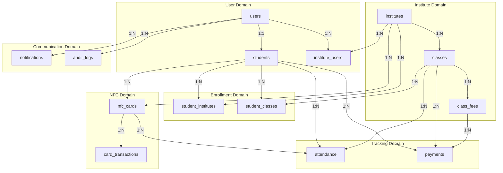

## 5. Indexes Strategy

### 5.1 Performance-Critical Indexes

```sql
-- Fast card lookup during check-in (most frequent operation)
CREATE INDEX CONCURRENTLY idx_nfc_cards_uid_active 
ON nfc_cards(card_uid) 
WHERE status = 'active';

-- Fast attendance check for duplicate prevention
CREATE INDEX CONCURRENTLY idx_attendance_lookup 
ON attendance(class_id, student_id, attendance_date);

-- Payment status lookup for a student
CREATE INDEX CONCURRENTLY idx_payments_student_period 
ON payments(student_id, for_year, for_month);

-- Active students in a class
CREATE INDEX CONCURRENTLY idx_student_classes_active 
ON student_classes(class_id) 
WHERE status = 'enrolled';
```

### 5.2 Full-Text Search Indexes

```sql
-- Student search
CREATE INDEX idx_students_search ON students 
USING gin(to_tsvector('english', 
    coalesce(student_code, '') || ' ' || 
    coalesce(guardian_name, '')));

-- Class search
CREATE INDEX idx_classes_search ON classes 
USING gin(to_tsvector('english', 
    name || ' ' || coalesce(description, '')));
```

## 6. Views for Common Queries

### 6.1 Student Dashboard View

```sql
CREATE VIEW vw_student_dashboard AS
SELECT 
    s.id AS student_id,
    s.student_code,
    u.first_name,
    u.last_name,
    u.email,
    i.id AS institute_id,
    i.name AS institute_name,
    nc.card_uid,
    nc.status AS card_status,
    COUNT(DISTINCT sc.class_id) AS enrolled_classes,
    (
        SELECT COUNT(*) 
        FROM attendance a 
        WHERE a.student_id = s.id 
        AND a.attendance_date >= DATE_TRUNC('month', CURRENT_DATE)
    ) AS attendance_this_month
FROM students s
JOIN users u ON s.user_id = u.id
JOIN student_institutes si ON s.id = si.student_id
JOIN institutes i ON si.institute_id = i.id
LEFT JOIN nfc_cards nc ON s.id = nc.student_id AND i.id = nc.institute_id
LEFT JOIN student_classes sc ON s.id = sc.student_id AND sc.status = 'enrolled'
WHERE si.status = 'active'
GROUP BY s.id, s.student_code, u.first_name, u.last_name, u.email,
         i.id, i.name, nc.card_uid, nc.status;
```

### 6.2 Class Attendance Summary View

```sql
CREATE VIEW vw_class_attendance_summary AS
SELECT 
    c.id AS class_id,
    c.name AS class_name,
    c.institute_id,
    a.attendance_date,
    COUNT(*) FILTER (WHERE a.status = 'present') AS present_count,
    COUNT(*) FILTER (WHERE a.status = 'late') AS late_count,
    COUNT(*) FILTER (WHERE a.status = 'absent') AS absent_count,
    COUNT(*) FILTER (WHERE a.status = 'excused') AS excused_count,
    COUNT(*) AS total_records
FROM classes c
LEFT JOIN attendance a ON c.id = a.class_id
GROUP BY c.id, c.name, c.institute_id, a.attendance_date;
```

### 6.3 Payment Status View

```sql
CREATE VIEW vw_payment_status AS
SELECT 
    s.id AS student_id,
    s.student_code,
    u.first_name || ' ' || u.last_name AS student_name,
    c.id AS class_id,
    c.name AS class_name,
    cf.id AS fee_id,
    cf.name AS fee_name,
    cf.amount AS fee_amount,
    cf.frequency,
    EXTRACT(MONTH FROM CURRENT_DATE)::INTEGER AS current_month,
    EXTRACT(YEAR FROM CURRENT_DATE)::INTEGER AS current_year,
    COALESCE(
        (SELECT SUM(p.amount) 
         FROM payments p 
         WHERE p.student_id = s.id 
         AND p.class_id = c.id 
         AND p.for_month = EXTRACT(MONTH FROM CURRENT_DATE)
         AND p.for_year = EXTRACT(YEAR FROM CURRENT_DATE)
         AND p.status = 'completed'),
        0
    ) AS paid_amount,
    cf.amount - COALESCE(
        (SELECT SUM(p.amount) 
         FROM payments p 
         WHERE p.student_id = s.id 
         AND p.class_id = c.id 
         AND p.for_month = EXTRACT(MONTH FROM CURRENT_DATE)
         AND p.for_year = EXTRACT(YEAR FROM CURRENT_DATE)
         AND p.status = 'completed'),
        0
    ) AS due_amount
FROM students s
JOIN users u ON s.user_id = u.id
JOIN student_classes sc ON s.id = sc.student_id
JOIN classes c ON sc.class_id = c.id
JOIN class_fees cf ON c.id = cf.class_id
WHERE sc.status = 'enrolled' AND cf.is_active = true;
```

## 7. Database Functions

### 7.1 Trigger for Updated Timestamp

```sql
CREATE OR REPLACE FUNCTION update_updated_at_column()
RETURNS TRIGGER AS $$
BEGIN
    NEW.updated_at = CURRENT_TIMESTAMP;
    RETURN NEW;
END;
$$ language 'plpgsql';

-- Apply to tables
CREATE TRIGGER update_institutes_updated_at 
    BEFORE UPDATE ON institutes 
    FOR EACH ROW EXECUTE FUNCTION update_updated_at_column();

CREATE TRIGGER update_users_updated_at 
    BEFORE UPDATE ON users 
    FOR EACH ROW EXECUTE FUNCTION update_updated_at_column();

CREATE TRIGGER update_students_updated_at 
    BEFORE UPDATE ON students 
    FOR EACH ROW EXECUTE FUNCTION update_updated_at_column();

CREATE TRIGGER update_classes_updated_at 
    BEFORE UPDATE ON classes 
    FOR EACH ROW EXECUTE FUNCTION update_updated_at_column();
```

### 7.2 Function to Check Duplicate Attendance

```sql
CREATE OR REPLACE FUNCTION check_duplicate_attendance()
RETURNS TRIGGER AS $$
BEGIN
    IF EXISTS (
        SELECT 1 FROM attendance 
        WHERE student_id = NEW.student_id 
        AND class_id = NEW.class_id 
        AND attendance_date = NEW.attendance_date
    ) THEN
        RAISE EXCEPTION 'Attendance already recorded for this student in this class today';
    END IF;
    RETURN NEW;
END;
$$ language 'plpgsql';

CREATE TRIGGER prevent_duplicate_attendance
    BEFORE INSERT ON attendance
    FOR EACH ROW EXECUTE FUNCTION check_duplicate_attendance();
```

## 8. Migration Strategy

```mermaid
graph LR
    subgraph "Phase 1: Core"
        M1[institutes]
        M2[users]
        M3[institute_users]
    end
    
    subgraph "Phase 2: Students"
        M4[students]
        M5[student_institutes]
    end
    
    subgraph "Phase 3: Classes"
        M6[classes]
        M7[student_classes]
        M8[class_fees]
    end
    
    subgraph "Phase 4: NFC"
        M9[nfc_cards]
        M10[card_transactions]
    end
    
    subgraph "Phase 5: Operations"
        M11[attendance]
        M12[payments]
    end
    
    subgraph "Phase 6: Support"
        M13[notifications]
        M14[audit_logs]
    end
    
    M1 --> M2 --> M3 --> M4 --> M5 --> M6 --> M7 --> M8 --> M9 --> M10 --> M11 --> M12 --> M13 --> M14
```

---

**Previous:** [System Architecture](./system-architecture.md) | **Next:** [API Design](./api-design.md)


<div style="page-break-after: always;"></div>

# Multi-Tenant Subdomain Access

Tenant-scoped URLs (`<slug>.classpass.lk`) with a dedicated system-admin root (`portal.classpass.lk`) and a single backend host (`api.classpass.lk`). Industry-standard pattern (Slack / Zendesk / Atlassian style) adapted to the existing AMS Clean Architecture solution.

This document is the source of truth for the rollout. It cross-references existing code so every "what changes" line is concrete.

---

## 1. Goals

- Each institute gets a dedicated, brandable URL: `royal-college.classpass.lk`.
- Privileged institute users land on a tenant-branded sign-in screen and, after login, see only their institute's nav — no switcher, no global-admin tabs.
- SystemAdmins (and anyone holding `institutes:access-any`) on a tenant subdomain are **scoped to that tenant**; they go to `portal.classpass.lk` for cross-tenant work.
- One API host serves every tenant. Token-vs-host mismatch is rejected server-side; the tenant **cannot be changed** while logged in via a tenant subdomain.
- The architecture survives a future VPS → Azure backend migration with config changes only.

## 2. Non-goals

- Custom per-institute apex domains (e.g. `portal.royal-college.lk`). Deferrable to a paid tier later.
- Cross-subdomain SSO. Cookies stay per-subdomain by design.
- Tenant-specific data residency. All tenants share one Postgres DB; isolation is logical via `InstituteId` columns + EF query filters (already in place).

## 3. Domain & hosting

### URL layout

| Host | Audience | Behaviour |
|---|---|---|
| `portal.classpass.lk` | SystemAdmins, multi-institute users | Existing experience: generic sign-in, institute switcher, all admin tabs. |
| `<slug>.classpass.lk` | Institute admins + privileged institute users | Branded sign-in; JWT bound to that institute; switcher hidden; tenant-scoped nav. |
| `api.classpass.lk` | Both PWA experiences | Single backend host. Dynamic CORS allows the root + every known tenant origin. |
| `www.classpass.lk` | — | 301 to `portal.classpass.lk`. |

Reserved subdomains (never assignable as slugs): `portal`, `api`, `www`, `app`, `admin`, `static`, `assets`, `cdn`, `mail`, `docs`, `status`, `pages`, `dev`, `staging`.

### Why single-level wildcard

Cloudflare's Universal SSL covers `*.classpass.lk` and `classpass.lk` for free. A two-level pattern (`*.app.classpass.lk`) would need Advanced Certificate Manager (~$10/mo).

### Hosting

- **DNS**: Cloudflare (domain registered at register.lk).
- **Frontend (AMS.PWA)**: Cloudflare Pages. The current Netlify free tier rejects unknown Host headers, and the Pro plan ($19/mo) trades real money for a worse fit than Pages (same vendor as DNS, native wildcards, unlimited bandwidth, free).
- **Backend (AMS.Api)**: .NET 9 on a VPS today (nginx → Kestrel, Let's Encrypt DNS-01 via Cloudflare). Designed to lift-and-shift to Azure App Service / Container Apps later; no code path is host-aware.
- **Storage**: already Azure Blob + Azure Service Bus (per `appsettings.json`).

---

## 4. Existing code we build on

The system already does most of the heavy lifting; this plan extends rather than replaces.

| Concept | Existing artefact | Notes |
|---|---|---|
| Tenant entity | `AMS.Domain/Entities/Institute/Entity/Institute.cs` | Has `Code`, `Name`, `LogoUrl`, `Settings (jsonb)`, `IsActive`. Adds `Slug` + `BrandingTheme`. |
| Repository | `AMS.Domain/Entities/Institute/Interfaces/IInstituteRepository.cs` + `AMS.Infrastructure/Repositories/Institute/InstituteRepository.cs` | Has `GetByCodeAsync`. Adds `GetBySlugAsync` / `ExistsBySlugAsync`. |
| EF config | `AMS.Infrastructure/EntityConfigurations/Institute/InstituteEntityConfig.cs` | Adds `slug` column + unique lowercase index, `branding_theme` jsonb. |
| Membership | `InstituteUser` + `IInstituteUserRepository.ExistsAsync` | Unchanged; remains the source of truth for "can this user act in this institute". |
| Tenant context | `AMS.Application/Interfaces/Institute/IInstituteContext.cs` + `AMS.Infrastructure/Services/Institute/InstituteContext.cs` | Precedence becomes: host > header > JWT claim. New `InstituteContextSource.Host`. |
| Enforcement | `AMS.Api/Middleware/InstituteContextEnforcementMiddleware.cs` | Adds host-vs-token mismatch check. Adds `/api/public` to exempt list. |
| Logging | `InstituteContextLoggingMiddleware` | Picks up the new source enum for free. |
| Login | `AMS.Application/Handlers/User/Commands/LoginApplicationUserCommand.cs` | Already accepts `Guid? InstituteId`. Controller now resolves from host or body slug. |
| Switch | `AMS.Application/Handlers/Auth/Commands/SwitchInstituteCommand.cs` | Add tenant-host rejection in handler. |
| Auth `/me` | `AuthController.GetCurrentUser` | Add `TenantSlug` field. |
| PWA auth store | `AMS.PWA/src/stores/auth-store.ts` | Add `canSwitchInstitute()` derived from host. |
| PWA api client | `AMS.PWA/src/lib/api-client.ts` | Stop sending `X-Institute-Id` header on tenant hosts (server ignores it anyway, but cleaner). |
| PWA switcher | `AMS.PWA/src/components/layout/institute-switcher.tsx` | Replaced by `InstituteBadge` on tenant hosts. |
| PWA sidebar | `AMS.PWA/src/components/layout/data/sidebar-data.ts` + `app-sidebar.tsx` | Items gain `requiredPermission` / `requiredRole` / `visibleOnRootOnly`; new `useSidebarData()` filters them. |
| PWA cookies | `AMS.PWA/src/lib/cookies.ts` | Already host-scoped (no `Domain=` attribute). Per-subdomain isolation works for free. |
| PWA SPA redirect | `AMS.PWA/netlify.toml` | Replaced by `public/_redirects`. |
| CORS | `AMS.Infrastructure/DependencyInjection.cs:708` (`AddCorsInternal`) | Already calls `SetIsOriginAllowedToAllowWildcardSubdomains()` — wildcard origin like `https://*.classpass.lk` just works. We add a delegate guard so unknown slugs are rejected and the `portal` origin is explicitly allowed. |
| nginx | `AMS.WIKI/deployment/ams-nginx.conf` | Today serves PWA + proxies API. Split: PWA moves to Cloudflare Pages; nginx becomes API-only at `api.classpass.lk`. |

---

## 5. Phase 0 — Infrastructure foundation

> Operator task list; not code.

### 5.1 Cloudflare DNS

| Type | Name | Target | Proxy |
|---|---|---|---|
| A | `api` | VPS public IP | ✅ proxied (orange cloud) |
| CNAME | `portal` | `<pages-project>.pages.dev` | ✅ proxied |
| CNAME | `*` | `<pages-project>.pages.dev` | ✅ proxied |
| CNAME | `www` | `portal.classpass.lk` | ✅ proxied |

### 5.2 TLS

- Universal SSL auto-provisions `*.classpass.lk` and `classpass.lk` — verify under **SSL/TLS → Edge Certificates**.
- VPS cert for `api.classpass.lk` via certbot + `python3-certbot-dns-cloudflare` plugin and a scoped Cloudflare API token (Zone:DNS:Edit on `classpass.lk` only).

### 5.3 Cloudflare Pages

- Connect AMS.PWA repo; build `npm run build`, output `dist`.
- Custom domains: `portal.classpass.lk`, `*.classpass.lk`, `www.classpass.lk`.
- Env vars: `VITE_API_BASE_URL=https://api.classpass.lk/api`, `VITE_ROOT_HOST=classpass.lk`, `VITE_ADMIN_SUBDOMAIN=portal`.

### 5.4 nginx on the VPS

Replace `AMS.WIKI/deployment/ams-nginx.conf` with an API-only vhost on `api.classpass.lk` that terminates TLS, proxies to Kestrel on `127.0.0.1:5000`, and trusts Cloudflare's published IP ranges as `set_real_ip_from`. The PWA `root` and SPA-fallback blocks come out — Pages serves the frontend.

### 5.5 Backend forwarded-headers

`Program.cs` must call `app.UseForwardedHeaders` before `UseAuthentication` so Kestrel honours `X-Forwarded-For`, `X-Forwarded-Proto`, and `X-Forwarded-Host` from Cloudflare. Restrict via `KnownNetworks` / `KnownProxies` to Cloudflare's published ranges.

### 5.6 Acceptance

```
curl https://api.classpass.lk/health                            # 200 from VPS
curl -I https://portal.classpass.lk                             # 200 from Pages
curl -I https://anything-unknown-yet.classpass.lk               # 200 (SPA), 404 inside app
```

---

## 6. Phase 1 — Domain & data

### 6.1 `Institute` entity (`AMS.Domain/Entities/Institute/Entity/Institute.cs`)

- New private setter `Slug` (string, required after backfill).
- New private setter `BrandingTheme` (string?, JSON: `{ accentColor, secondaryColor, tagline }`).
- `Create` overload accepts `slug`.
- Method `ChangeSlug(string newSlug)` raises `InstituteSlugChangedEvent` (domain event).
- Validation in the entity: regex `^[a-z][a-z0-9-]{1,38}[a-z0-9]$`; reject any value in `ReservedSlugs`.

### 6.2 Constants

- `AMS.Domain.Constants.ReservedSlugs` — `IReadOnlyCollection<string>` literal list (above).
- Mirror in PWA: `AMS.PWA/src/lib/reserved-slugs.ts` for client-side pre-check.

### 6.3 EF config (`InstituteEntityConfig.cs`)

```csharp
builder.Property(x => x.Slug)
    .HasColumnName("slug")
    .IsRequired()
    .HasMaxLength(40);
builder.Property(x => x.BrandingTheme)
    .HasColumnName("branding_theme")
    .HasColumnType("jsonb");
builder.HasIndex(x => x.Slug)
    .IsUnique()
    .HasDatabaseName("IX_Institutes_Slug");
```

Postgres index uses `LOWER(slug)` semantics via a check constraint or by always lower-casing on write (we lowercase in the entity). Single-column unique index is enough since the entity guarantees lowercase.

### 6.4 Repository (`IInstituteRepository`, `InstituteRepository`)

```csharp
Task<Institute?> GetBySlugAsync(string slug, CancellationToken ct = default);
Task<bool> ExistsBySlugAsync(string slug, CancellationToken ct = default);
```

### 6.5 Migration

`dotnet ef migrations add AddInstituteSlugAndBranding --project AMS.Infrastructure --startup-project AMS.Api`

- Add `slug` nullable, `branding_theme` jsonb nullable.
- Backfill `slug` from `LOWER(code)` (strip the `INST-` prefix if you want shorter slugs — confirm with stakeholders before deciding; default is to keep `inst-2026-0001` style and let admins rename later).
- Set NOT NULL on `slug`; add the unique index.

### 6.6 Tests (`AMS.Tests`)

- Slug regex accepts/rejects per spec.
- Reserved-slug rejection.
- `ChangeSlug` raises the domain event.
- `GetBySlugAsync` is case-insensitive in queries (`.ToLowerInvariant()` on input).

### 6.7 Acceptance

Dev DB migrates cleanly; every existing institute has a non-null slug; calling `GetBySlugAsync("inst-2026-0001")` returns the matching row.

---

## 7. Phase 2 — API tenant resolution

### 7.1 Slug resolver

`AMS.Application/Interfaces/Institute/IInstituteSlugResolver.cs`

```csharp
public interface IInstituteSlugResolver
{
    Task<InstituteSlugInfo?> ResolveAsync(string slug, CancellationToken ct);
    void Invalidate(string slug);
}
public sealed record InstituteSlugInfo(Guid Id, string Slug, bool IsActive);
```

Implementation in `AMS.Infrastructure/Services/Institute/InstituteSlugResolver.cs`. Backed by `IInstituteRepository` + `IMemoryCache` (60s sliding TTL). Invalidate from a `INotificationHandler<InstituteSlugChangedEvent>` and from create/deactivate handlers.

### 7.2 Tenant host context

`AMS.Application/Interfaces/Institute/ITenantHostContext.cs`

```csharp
public interface ITenantHostContext
{
    string? Slug { get; }
    Guid? InstituteId { get; }
    bool IsTenantHost { get; }
    bool IsRootHost { get; }   // portal.classpass.lk or apex
}
```

Implementation reads `HttpContext.Items[TenantContextKey]` set by the middleware below. Registered scoped.

### 7.3 `TenantResolutionMiddleware`

`AMS.Api/Middleware/TenantResolutionMiddleware.cs`. Runs immediately after `UseRouting` and before `UseAuthentication`.

```text
host = forwarded host || request.host
suffix = config["Tenant:RootHostSuffix"]            // "classpass.lk"
admin  = config["Tenant:AdminSubdomain"]            // "portal"
label  = host minus suffix (first label)

if label is null OR label == "www" OR label == suffix → IsRootHost=true
elif label == admin                                  → IsRootHost=true
elif label in ReservedSlugs                          → 404 tenant_unknown
else:
    info = await resolver.ResolveAsync(label)
    if info is null              → 404 tenant_unknown
    elif !info.IsActive          → 410 tenant_inactive
    else:
        Items[TenantContextKey] = new TenantHostContext(label, info.Id)
```

The 404/410 response is a small JSON `{ error, slug }` so the PWA can render a clean page when it hits the API directly. The middleware skips `/health` and `/swagger`.

### 7.4 `InstituteContext` precedence change

`AMS.Infrastructure/Services/Institute/InstituteContext.cs`. New precedence:

1. `ITenantHostContext.InstituteId` (Source = `Host`)
2. `X-Institute-Id` header (Source = `Header`) — ignored if the host context disagrees; log a warning.
3. JWT `institute_id` claim (Source = `JwtClaim`)

Extend `InstituteContextSource` with `Host = 3`.

### 7.5 `InstituteContextEnforcementMiddleware` hardening

`AMS.Api/Middleware/InstituteContextEnforcementMiddleware.cs`:

- Add `/api/public` to `ExemptPathPrefixes`.
- New rule executed before the existing membership check:
  ```
  if tenantHost.IsTenantHost && jwt.institute_id is set
     && jwt.institute_id != tenantHost.InstituteId
  → 403 tenant_token_mismatch
  ```
  This is the cross-tenant token-replay defence.
- Super-admins on tenant hosts must still pass the existing membership check **OR** hold `Institutes.AccessAny`. (Current code already short-circuits on `AccessAny`; we keep that — being on a tenant host doesn't strip the permission, it just locks the institute scope.)

### 7.6 Auth surface changes

#### `LoginApplicationUserCommand`

Already takes `Guid? InstituteId`. We do **not** add `InstituteSlug` to the application-layer record; the controller (which has access to `ITenantHostContext`) resolves and forwards an `InstituteId`:

```csharp
[HttpPost("login")]
public async Task<IActionResult> Login(
    [FromBody] LoginApplicationUserCommand command,
    [FromServices] ITenantHostContext tenant)
{
    if (tenant.IsTenantHost && tenant.InstituteId is { } hostInstituteId)
        command = command with { InstituteId = hostInstituteId };

    var result = await Mediator.Send(command);
    return HandleResult(result);
}
```

This keeps the application contract clean and ensures any host-supplied institute always wins over a client-supplied one — no spoofing.

**Error parity**: keep `Error.NotFound("User", …)` for unknown emails. To remove the enumeration leak on tenant hosts, the handler should collapse "user not found", "wrong password", and "not a member of this institute" to the same `Error.Unauthorized("invalid_credentials", "Invalid email or password")` response. (Existing code returns three distinct errors; this is a small change in the handler.)

#### `SwitchInstituteCommand`

```csharp
if (tenant.IsTenantHost && request.InstituteId != tenant.InstituteId)
    return Result.Failure<UseLoginDto>(
        Error.Forbidden("SwitchInstitute", "Switching is not allowed on a tenant host"));
```

Inject `ITenantHostContext` into the handler.

#### `AuthController.GetCurrentUser` (`/api/auth/me`)

Add `TenantSlug` (string?) and `IsTenantHost` (bool) read from `ITenantHostContext`.

### 7.7 Public branding endpoint

`AMS.Api/Controllers/RestApi/PublicInstituteController.cs`:

```csharp
[ApiController]
[Route("api/public/institutes")]
[AllowAnonymous]
public sealed class PublicInstituteController : PublicApiController
{
    [HttpGet("by-slug/{slug}/branding")]
    public async Task<IActionResult> GetBranding(string slug, CancellationToken ct) =>
        HandleResult(await Mediator.Send(new GetInstituteBrandingBySlugQuery(slug), ct));
}
```

`GetInstituteBrandingBySlugQuery` returns `{ name, slug, logoUrl, accentColor, secondaryColor, tagline, isActive }`. 404 when slug unknown.

### 7.8 CORS

`AMS.Infrastructure/DependencyInjection.cs::AddCorsInternal` already calls `SetIsOriginAllowedToAllowWildcardSubdomains()`. Tweaks:

- `appsettings.Production.json` `AllowedOrigins` becomes `["https://portal.classpass.lk", "https://*.classpass.lk"]`.
- Optionally tighten with a `SetIsOriginAllowed(origin => …)` delegate that pings `IInstituteSlugResolver` for any non-portal subdomain, rejecting unknown slugs at the CORS layer too. (Defence-in-depth; the real protection is the host-vs-token check.)

### 7.9 Forwarded headers

`Program.cs` (insert before `app.UseAuthentication()`):

```csharp
var forwarded = new ForwardedHeadersOptions
{
    ForwardedHeaders = ForwardedHeaders.XForwardedFor
                    | ForwardedHeaders.XForwardedProto
                    | ForwardedHeaders.XForwardedHost,
    ForwardLimit = 2
};
foreach (var range in builder.Configuration.GetSection("Cloudflare:KnownNetworks").Get<string[]>() ?? [])
    forwarded.KnownNetworks.Add(IPNetwork.Parse(range));
app.UseForwardedHeaders(forwarded);
```

### 7.10 Acceptance

- `curl https://api.classpass.lk/api/public/institutes/by-slug/inst-2026-0001/branding` → 200.
- Login with `Host: royal-college.classpass.lk` issues a JWT whose `institute_id` matches that slug's institute (verify by decoding the token).
- A JWT minted on `royal-college.classpass.lk` replayed with `Host: st-peters.classpass.lk` → 403 `tenant_token_mismatch`.
- POST `/api/auth/switch-institute` on a tenant host → 403 `switch_not_allowed_on_tenant_host`.

---

## 8. Phase 3 — PWA tenant detection + branded sign-in

### 8.1 Host detection

`AMS.PWA/src/lib/tenant-host.ts`:

```ts
const ROOT_HOST = import.meta.env.VITE_ROOT_HOST as string;        // "classpass.lk"
const ADMIN     = import.meta.env.VITE_ADMIN_SUBDOMAIN as string;   // "portal"

export interface TenantHostInfo {
  isTenantHost: boolean;   // false on portal / apex / localhost
  isAdminHost: boolean;    // portal.classpass.lk
  slug: string | null;     // the tenant slug or null
}

export function detectTenantHost(hostname = window.location.hostname): TenantHostInfo { … }
```

Localhost: returns `isAdminHost: true` so dev mirrors `portal` behaviour. To dev-test a tenant locally, set `VITE_DEV_TENANT_SLUG=royal-college` (a debug-only override read by `detectTenantHost`).

### 8.2 Tenant provider

`AMS.PWA/src/context/tenant-provider.tsx` wraps the app inside `main.tsx`. On boot:

- If `!isTenantHost` → provide `null`, render children immediately.
- Else fetch `/api/public/institutes/by-slug/{slug}/branding`.
  - 200 + `isActive` → provide `{ slug, name, logoUrl, accentColor, … }`.
  - 200 + `!isActive` → render full-page "This institute is inactive" with a link to `portal.classpass.lk`.
  - 404 → render full-page "Institute not found".

Expose `useTenant()` hook returning `TenantBranding | null`.

### 8.3 Branded sign-in

`AMS.PWA/src/features/auth/sign-in/index.tsx`:

- If `useTenant()` is non-null, render a `<TenantBrand />` panel (logo + name + optional tagline) above the form.
- Apply `accentColor` as CSS variable `--brand` on `<html data-tenant="…">` to recolour primary buttons in the auth flow.

`AMS.PWA/src/features/auth/sign-in/components/user-auth-form.tsx`:

- On tenant hosts: send `instituteSlug: tenant.slug` in the login body. Backend ignores body slug if host disagrees (host wins).
- Skip the existing `/institutes/mine` + auto-switch fallback on tenant hosts — the JWT is already scoped.
- Treat 401 / 403 generically: "Invalid email or password, or you are not a member of this institute" (matches the new backend parity).

### 8.4 Auth store

`AMS.PWA/src/stores/auth-store.ts` gains:

```ts
canSwitchInstitute: () => !detectTenantHost().isTenantHost
```

`switchInstitute` mutation hook returns a no-op when this is false.

### 8.5 API client

`AMS.PWA/src/lib/api-client.ts`: in the request interceptor, skip the `X-Institute-Id` header when `detectTenantHost().isTenantHost` (or always send it — backend ignores it on tenant hosts anyway; preference is to suppress for cleanliness).

### 8.6 Switcher → badge

`AMS.PWA/src/components/layout/app-sidebar.tsx`:

```tsx
{isTenantHost ? <InstituteBadge /> : <InstituteSwitcher />}
```

`InstituteBadge` is a new small read-only component that shows the tenant logo + name from `useTenant()`. The "Operate globally" affordance disappears with the switcher.

### 8.7 Acceptance

- Visit `https://royal-college.classpass.lk/sign-in` → see logo + name; sign in; land on `/` with switcher absent and accent applied.
- Visit `https://portal.classpass.lk/sign-in` → unchanged generic flow with the switcher.
- An unknown subdomain renders the "Institute not found" page.

---

## 9. Phase 4 — Sidebar & route gating

### 9.1 Sidebar item schema

`AMS.PWA/src/components/layout/types.ts`: extend `NavItem` with

```ts
requiredPermission?: string;   // e.g. "users:manage"
requiredRole?: string;         // e.g. "SystemAdmin"
visibleOnRootOnly?: boolean;   // hide on tenant subdomains
```

### 9.2 Filtering

`AMS.PWA/src/components/layout/app-sidebar.tsx` uses a new `useSidebarData()` hook that:

1. Loads `sidebarData.navGroups`.
2. For each item: hide if `requiredPermission` set and `!auth.hasPermission(p)`; hide if `requiredRole` set and `!auth.hasRole(r)`; hide if `visibleOnRootOnly` and tenant host.
3. Drops empty groups.

### 9.3 Group restructure

`AMS.PWA/src/components/layout/data/sidebar-data.ts` becomes:

- **General** (universal): Dashboard, Class Rooms, Students, Instructors, Classes, NFC Cards, Attendance, Payments.
- **Institute Administration**: Institute Settings, Institute Users (`requiredPermission: "institutes:view"`), Institute Roles (`requiredPermission: "institute-roles:manage"`), Notifications (`requiredPermission: "notifications:manage"`), Audit Logs.
- **System Administration** (`visibleOnRootOnly: true`): Institutes (`requiredPermission: "institutes:view"`), Global Users (`requiredPermission: "users:manage"`), Global Roles (`requiredPermission: "roles:manage"`), Identity Review (`requiredRole: "GlobalIdentityAdmin"`).
- **Settings** (universal, profile/account/etc.).

### 9.4 Route guards

- `AMS.PWA/src/routes/_global-admin/route.tsx`: extend `beforeLoad` to redirect to `/` when `detectTenantHost().isTenantHost`.
- `AMS.PWA/src/routes/__root.tsx`: no change needed; the underlying route guard handles it.

### 9.5 Acceptance

- An institute-admin user on `royal-college.classpass.lk` sees only General + Institute Administration + Settings.
- A SystemAdmin on `portal.classpass.lk` sees all four groups.
- A SystemAdmin who navigates to `royal-college.classpass.lk` sees the same nav as the institute admin (system tabs hidden).

---

## 10. Phase 5 — Hosting cutover

### 10.1 PWA → Cloudflare Pages

- Delete `AMS.PWA/netlify.toml`.
- Add `AMS.PWA/public/_redirects` with `/* /index.html 200`.
- Create the Pages project, wire custom domains (Phase 0.3 / 0.1).
- Run the new PWA against the existing API for one week before flipping DNS.

### 10.2 API on `api.classpass.lk`

- Replace `AMS.WIKI/deployment/ams-nginx.conf` with the API-only vhost.
- Issue and install the `api.classpass.lk` cert via certbot DNS-01.
- Update `AMS.WIKI/deployment/api.env.template`: add `Tenant__RootHostSuffix=classpass.lk`, `Tenant__AdminSubdomain=portal`, `Cloudflare__KnownNetworks__0=…` (one entry per published range).

### 10.3 Decommission Netlify

After 7 days of stable Pages traffic, delete the Netlify site.

---

## 11. Phase 6 — Onboarding UX

### 11.1 Institute creation form

`AMS.PWA/src/features/institutes/` — add a slug field with:

- Live availability check `GET /api/institutes/check-slug?value=…` (system-admin only; returns `{ available, reason }` with `reason` ∈ `"taken" | "reserved" | "invalid"`).
- Inline URL preview: `https://<slug>.classpass.lk`.
- Client-side pre-validation against `AMS.PWA/src/lib/reserved-slugs.ts` (Phase 1.2).

`CreateInstituteCommand` gains an optional `Slug`. If null, the handler defaults to `LOWER(code)`; if provided, validates and persists it.

### 11.2 Slug change

`UpdateInstituteCommand` (or a new `ChangeInstituteSlugCommand` for auditability) gates slug changes behind:

- A PWA confirmation modal warning that existing tenant URLs / sessions will break.
- A domain event (`InstituteSlugChangedEvent`) handled by the slug resolver to invalidate the cache.
- An audit row in the existing audit infrastructure.

### 11.3 Acceptance

- Reserved slugs (`portal`, `api`, etc.) are rejected with a clear inline error.
- Renaming an institute's slug invalidates the resolver cache within 1s.

---

## 12. Phase 7 — Azure-readiness audit *(do before any cutover)*

Architectural guardrails so the VPS → Azure migration is config-only.

- Every host/origin/storage/DB value flows through `IConfiguration`. No string literal pinning to VPS IPs.
- `AllowedOrigins` already supports wildcards. `Tenant:RootHostSuffix` and `Tenant:AdminSubdomain` join the pattern.
- Postgres connection string supports `SslMode=Require;Trust Server Certificate=true` toggle (Azure Flexible Server enforces SSL).
- Logs: keep Seq via env var; add an Application Insights `TelemetryClient` registration behind an `Observability:UseApplicationInsights` flag.
- Health: `/health` exists; add `/health/ready` and `/health/live` aliases for App Service / Container Apps probes.
- Sticky sessions / in-memory state: none (already stateless). The `IMemoryCache` for slug resolution is process-local; that's fine because invalidation is event-driven per process (cache TTL caps staleness anyway).

**Migration sequence (when ready):**

1. Provision Azure DB for PostgreSQL Flexible Server; `pg_dump | pg_restore`.
2. Deploy API to App Service / Container App with the same env vars.
3. Cloudflare DNS: flip `api.classpass.lk` A record → App Service / Front Door hostname.
4. Decommission VPS.

The frontend on Cloudflare Pages is **not** affected.

---

## 13. Security model

- Tenant subdomain ≠ authorisation. A user must already have an `InstituteUser` row for the host's institute (or hold `Institutes.AccessAny`). The host narrows scope; it never grants access.
- JWT `institute_id` MUST equal `TenantHostContext.InstituteId` when the request is from a tenant host (Phase 2.5).
- `X-Institute-Id` header is ignored on tenant hosts.
- Switch-institute is server-rejected on tenant hosts.
- Cookies are per-host by default (PWA `cookies.ts` does not set `Domain=`). A stolen cookie cannot move laterally between tenants.
- Failed login on a tenant host returns the same error whether the email exists, the password is wrong, or the user isn't a member — no enumeration leak.

---

## 14. Risks & open items

| Risk | Mitigation |
|---|---|
| Cookie scope regression | Audit any future `setCookie` change to confirm no `Domain=` attribute slips in. |
| Reserved-slug drift between API + PWA | Mirror the list in `AMS.Domain.Constants.ReservedSlugs` and `AMS.PWA/src/lib/reserved-slugs.ts`; CI grep test asserting parity (`AMS.Tests` integration). |
| Slug resolver cache invalidation across multiple API instances | Today: single-process VPS, no issue. On Azure scale-out: add a `IDistributedCache` (Redis) or rely on the 60s TTL. Document the limit. |
| Cloudflare WebSocket proxying | Confirm any SSE/WebSocket feature works through Cloudflare's orange-cloud (notifications stream). |
| Unknown-subdomain UX | Phase 3 tenant provider already renders a "Not found" screen. |
| Backup access path | Keep the VPS IP reachable directly (`https://<vps-ip>` with a self-signed cert) for emergency support; documented in the runbook. |

---

## 15. Roll-forward order

1. **Phase 1 — Domain/data** (smallest blast radius; everything else depends on `Slug`).
2. **Phase 2 — API tenant resolution** (server-side complete; PWA still works on root host).
3. **Phase 5 — Hosting cutover** to Cloudflare Pages on `portal.classpass.lk` only, before tenant subdomains exist.
4. **Phase 3 — PWA tenant detection & branded sign-in** (now tenant URLs become real).
5. **Phase 4 — Sidebar & route gating**.
6. **Phase 6 — Onboarding UX**.
7. **Phase 7 — Azure-readiness audit** (whenever the Azure decision lands).


<div style="page-break-after: always;"></div>

# 🔐 Security Architecture

> Security design and implementation guidelines for the Attendance Management System

## 1. Security Overview

The AMS implements a defense-in-depth security strategy with multiple layers of protection to safeguard sensitive student data, payment information, and system integrity.

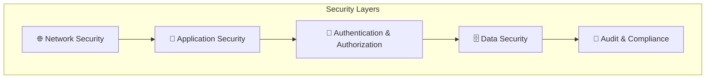

## 2. Authentication Architecture

### 2.1 Authentication Flow

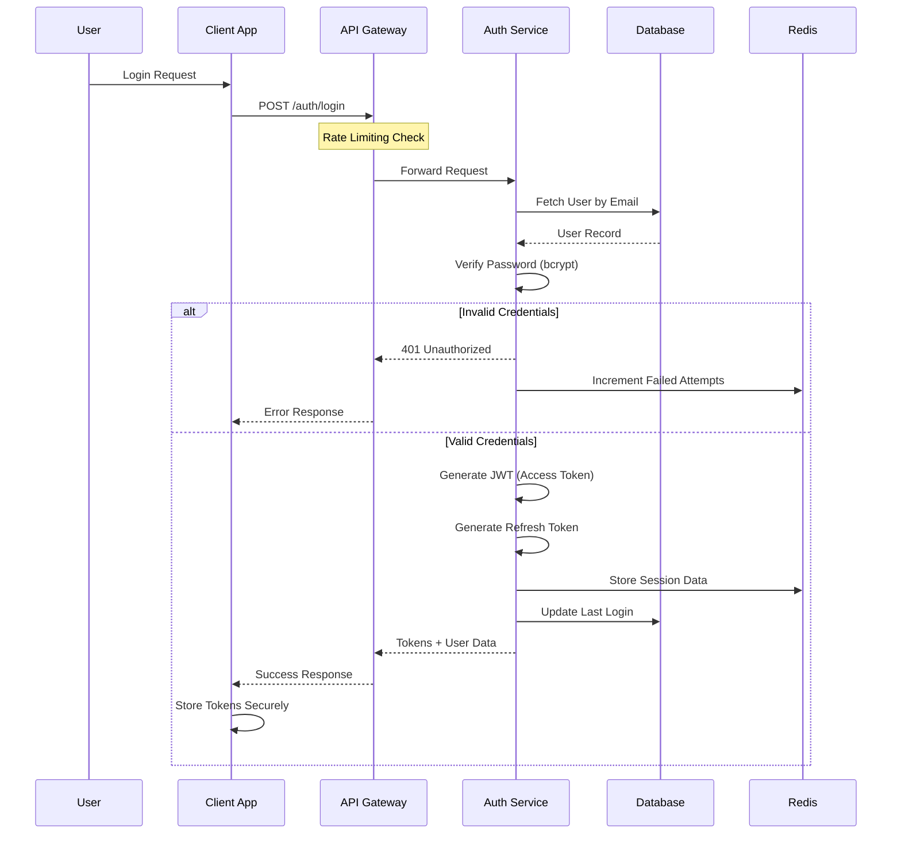

### 2.2 JWT Token Structure

```json
{
  "header": {
    "alg": "RS256",
    "typ": "JWT"
  },
  "payload": {
    "sub": "user_uuid",
    "email": "user@example.com",
    "role": "institute_admin",
    "institutes": ["institute_uuid_1", "institute_uuid_2"],
    "permissions": ["read:students", "write:attendance"],
    "iat": 1644847200,
    "exp": 1644850800,
    "iss": "ams-auth-service",
    "aud": "ams-api"
  }
}
```

### 2.3 Token Management

| Token Type | Lifetime | Storage | Refresh |
|------------|----------|---------|---------|
| Access Token | 1 hour | Memory only | Via refresh token |
| Refresh Token | 7 days | HttpOnly cookie | Re-authenticate |
| Session | 24 hours | Redis | Sliding expiration |

## 3. Authorization Model

### 3.1 Role-Based Access Control (RBAC)

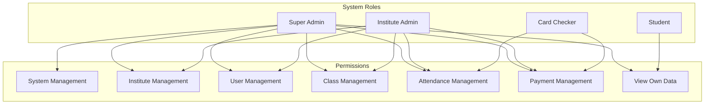

### 3.2 Permission Matrix

| Permission | Super Admin | Institute Admin | Card Checker | Student |
|------------|:-----------:|:---------------:|:------------:|:-------:|
| Create Institute | ✅ | ❌ | ❌ | ❌ |
| Manage Institute | ✅ | ✅* | ❌ | ❌ |
| Manage Users | ✅ | ✅* | ❌ | ❌ |
| Manage Classes | ✅ | ✅* | ❌ | ❌ |
| Register Students | ✅ | ✅* | ❌ | ❌ |
| Issue NFC Cards | ✅ | ✅* | ❌ | ❌ |
| Record Attendance | ✅ | ✅* | ✅* | ❌ |
| Record Payments | ✅ | ✅* | ✅* | ❌ |
| View Reports | ✅ | ✅* | ✅* | ❌ |
| View Own Attendance | ✅ | ✅ | ✅ | ✅ |
| View Own Payments | ✅ | ✅ | ✅ | ✅ |

*Restricted to assigned institute(s)/class(es)

### 3.3 Multi-Tenancy Security

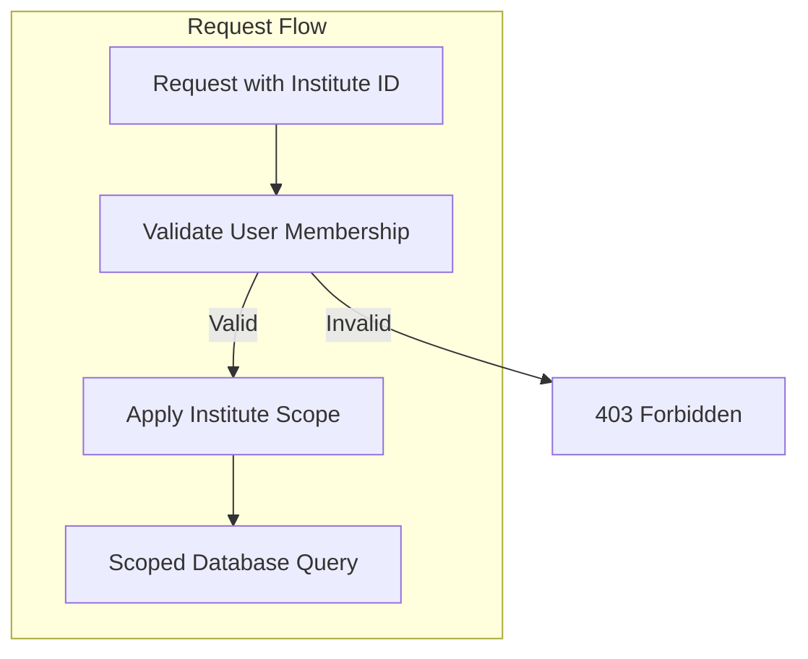

**Implementation:**
```typescript
// Middleware for institute scope validation
async function validateInstituteAccess(req, res, next) {
  const { instituteId } = req.headers['x-institute-id'] || req.params;
  const userId = req.user.id;
  
  // Super admins have access to all institutes
  if (req.user.role === 'super_admin') {
    return next();
  }
  
  // Verify user belongs to institute
  const membership = await InstituteUser.findOne({
    where: { userId, instituteId, isActive: true }
  });
  
  if (!membership) {
    return res.status(403).json({ error: 'Access denied to this institute' });
  }
  
  req.instituteRole = membership.role;
  next();
}
```

## 4. Data Security

### 4.1 Encryption Strategy

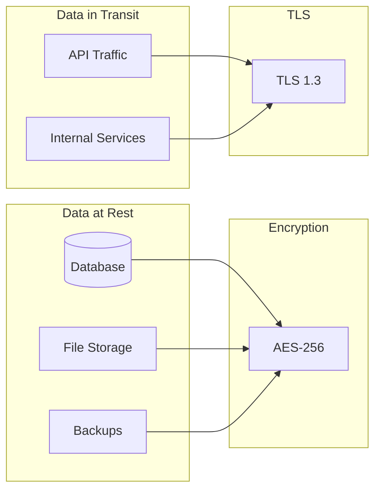

### 4.2 Sensitive Data Handling

| Data Type | Storage | Encryption | Access |
|-----------|---------|------------|--------|
| Passwords | Database | bcrypt (cost 12) | Never exposed |
| NFC Card UIDs | Database | AES-256 | Authenticated only |
| Student PII | Database | Column-level encryption | Role-based |
| Payment Data | Database | AES-256 | Role-based |
| Session Data | Redis | At-rest encryption | System only |

### 4.3 Data Masking

```typescript
// PII masking for logs and non-privileged responses
const maskEmail = (email: string): string => {
  const [local, domain] = email.split('@');
  return `${local.slice(0, 2)}***@${domain}`;
};

const maskPhone = (phone: string): string => {
  return phone.slice(0, 3) + '****' + phone.slice(-2);
};

const maskCardUid = (uid: string): string => {
  return uid.slice(0, 5) + '***' + uid.slice(-2);
};
```

## 5. API Security

### 5.1 Security Headers

```typescript
// Security headers middleware
app.use(helmet({
  contentSecurityPolicy: {
    directives: {
      defaultSrc: ["'self'"],
      scriptSrc: ["'self'"],
      styleSrc: ["'self'", "'unsafe-inline'"],
      imgSrc: ["'self'", "data:", "https:"],
      connectSrc: ["'self'", "https://api.ams.com"],
      frameSrc: ["'none'"],
      objectSrc: ["'none'"]
    }
  },
  hsts: {
    maxAge: 31536000,
    includeSubDomains: true,
    preload: true
  },
  referrerPolicy: { policy: 'strict-origin-when-cross-origin' },
  noSniff: true,
  xssFilter: true,
  frameguard: { action: 'deny' }
}));
```

### 5.2 Input Validation

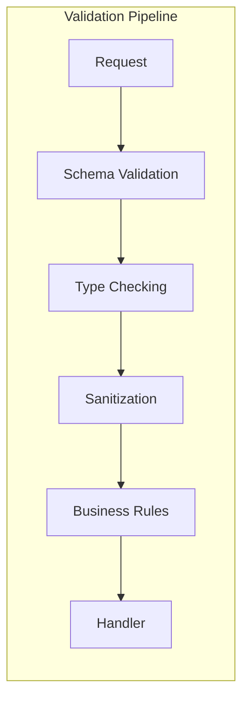

**Validation Example:**
```typescript
// Using Joi for validation
const studentRegistrationSchema = Joi.object({
  firstName: Joi.string().min(2).max(100).required()
    .pattern(/^[a-zA-Z\s'-]+$/),
  lastName: Joi.string().min(2).max(100).required()
    .pattern(/^[a-zA-Z\s'-]+$/),
  email: Joi.string().email().required(),
  phone: Joi.string().pattern(/^\+?[\d\s-]{10,15}$/),
  dateOfBirth: Joi.date().max('now').min('1900-01-01'),
  instituteId: Joi.string().uuid().required(),
  classIds: Joi.array().items(Joi.string().uuid()).min(1)
});
```

### 5.3 Rate Limiting Configuration

```typescript
const rateLimitConfig = {
  // General API rate limit
  api: {
    windowMs: 60 * 1000, // 1 minute
    max: 100, // requests per window
    message: 'Too many requests, please try again later'
  },
  
  // Authentication endpoints
  auth: {
    windowMs: 15 * 60 * 1000, // 15 minutes
    max: 5, // login attempts
    message: 'Too many login attempts, please try again later'
  },
  
  // NFC card validation (high frequency)
  cardValidation: {
    windowMs: 60 * 1000,
    max: 60, // per device
    keyGenerator: (req) => req.headers['x-device-id']
  },
  
  // Password reset
  passwordReset: {
    windowMs: 60 * 60 * 1000, // 1 hour
    max: 3,
    message: 'Too many password reset attempts'
  }
};
```

### 5.4 SQL Injection Prevention

```typescript
// Always use parameterized queries
// ❌ Bad - vulnerable to SQL injection
const badQuery = `SELECT * FROM users WHERE email = '${email}'`;

// ✅ Good - parameterized query
const goodQuery = await db.query(
  'SELECT * FROM users WHERE email = $1',
  [email]
);

// ✅ Good - using ORM
const user = await User.findOne({
  where: { email: email }
});
```

## 6. NFC Security

### 6.1 Card Authentication Flow

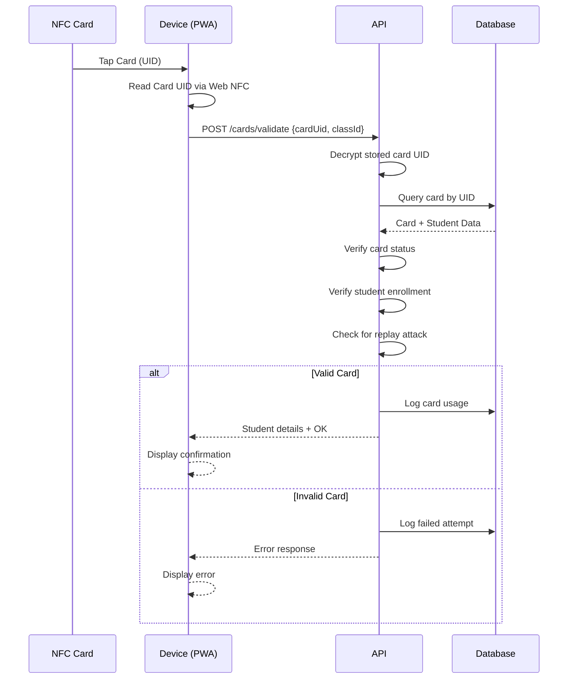

### 6.2 Card Security Measures

| Measure | Implementation |
|---------|----------------|
| UID Encryption | AES-256 encryption of stored UIDs |
| Replay Prevention | Timestamp + rate limiting |
| Card Binding | One card per student per institute |
| Status Tracking | Active, blocked, lost, expired states |
| Audit Trail | All card transactions logged |

### 6.3 Card Cloning Prevention

```typescript
// Detect potential card cloning
async function detectSuspiciousActivity(cardUid: string, deviceInfo: DeviceInfo) {
  const recentUsage = await CardTransaction.findAll({
    where: {
      cardUid,
      createdAt: { [Op.gte]: new Date(Date.now() - 5 * 60 * 1000) } // Last 5 mins
    }
  });
  
  // Check for usage from multiple locations
  const uniqueDevices = new Set(recentUsage.map(u => u.deviceId));
  if (uniqueDevices.size > 1) {
    await alertSecurityTeam({
      type: 'POTENTIAL_CARD_CLONE',
      cardUid,
      devices: Array.from(uniqueDevices)
    });
    return true;
  }
  
  // Check for unusually high frequency
  if (recentUsage.length > 5) {
    await alertSecurityTeam({
      type: 'HIGH_FREQUENCY_USAGE',
      cardUid,
      count: recentUsage.length
    });
    return true;
  }
  
  return false;
}
```

## 7. Session Security

### 7.1 Session Management

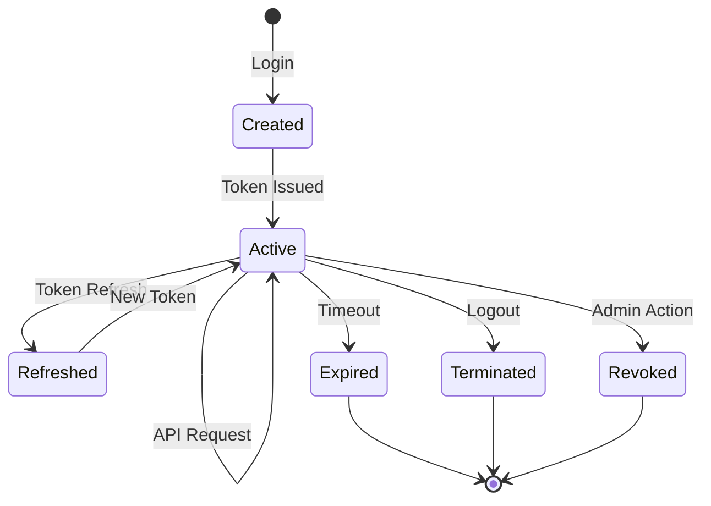

### 7.2 Session Configuration

```typescript
const sessionConfig = {
  // Session timeout
  maxAge: 24 * 60 * 60 * 1000, // 24 hours
  
  // Idle timeout
  idleTimeout: 30 * 60 * 1000, // 30 minutes
  
  // Maximum concurrent sessions
  maxConcurrentSessions: 3,
  
  // Session storage
  store: new RedisStore({
    client: redisClient,
    prefix: 'sess:',
    ttl: 86400
  }),
  
  // Cookie settings
  cookie: {
    secure: true,
    httpOnly: true,
    sameSite: 'strict',
    domain: '.ams.com'
  }
};
```

## 8. Audit & Logging

### 8.1 Audit Events

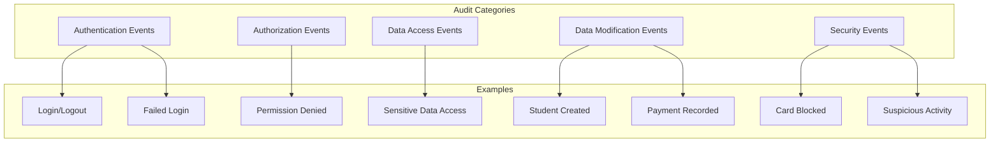

### 8.2 Audit Log Structure

```typescript
interface AuditLog {
  id: string;
  timestamp: Date;
  userId: string;
  userEmail: string;
  action: string;
  entityType: string;
  entityId: string;
  oldValue?: object;
  newValue?: object;
  ipAddress: string;
  userAgent: string;
  requestId: string;
  result: 'success' | 'failure';
  metadata?: object;
}

// Example audit log entry
{
  id: "audit_123",
  timestamp: "2026-02-14T10:30:00Z",
  userId: "user_456",
  userEmail: "admin@abc.edu",
  action: "PAYMENT_RECORDED",
  entityType: "payment",
  entityId: "payment_789",
  oldValue: null,
  newValue: {
    studentId: "student_101",
    amount: 5000,
    classId: "class_202"
  },
  ipAddress: "192.168.1.100",
  userAgent: "Mozilla/5.0...",
  requestId: "req_abc123",
  result: "success",
  metadata: {
    instituteId: "inst_303"
  }
}
```

### 8.3 Security Monitoring

```typescript
// Real-time security alerts
const securityAlerts = [
  {
    name: 'Multiple Failed Logins',
    condition: 'failedLogins > 5 in 15 minutes',
    action: 'lockAccount + notifyAdmin'
  },
  {
    name: 'Suspicious Card Activity',
    condition: 'cardUsage from multiple devices in 5 minutes',
    action: 'blockCard + notifyAdmin'
  },
  {
    name: 'Unusual Data Access',
    condition: 'bulk data export by non-admin',
    action: 'alert + requireVerification'
  },
  {
    name: 'After Hours Access',
    condition: 'admin access between 11PM-6AM',
    action: 'logAndAlert'
  }
];
```

## 9. Compliance & Privacy

### 9.1 Data Protection Principles

| Principle | Implementation |
|-----------|----------------|
| Data Minimization | Collect only necessary data |
| Purpose Limitation | Use data only for stated purposes |
| Storage Limitation | Retention policies enforced |
| Accuracy | Regular data validation |
| Integrity | Audit trails, checksums |
| Confidentiality | Encryption, access controls |

### 9.2 Data Retention Policy

```mermaid
graph LR
    subgraph "Retention Periods"
        A[Attendance Records] -->|7 years| AR[Archive/Delete]
        B[Payment Records] -->|10 years| PR[Archive/Delete]
        C[Audit Logs] -->|5 years| AL[Archive/Delete]
        D[Session Data] -->|30 days| SD[Delete]
        E[Inactive Accounts] -->|2 years| IA[Anonymize]
    end
```

### 9.3 Data Subject Rights

```typescript
// GDPR-style data export
async function exportStudentData(studentId: string): Promise<DataExport> {
  return {
    personalInfo: await Student.findById(studentId),
    enrollments: await StudentInstitute.findAll({ studentId }),
    classes: await StudentClass.findAll({ studentId }),
    attendance: await Attendance.findAll({ studentId }),
    payments: await Payment.findAll({ studentId }),
    cards: await NFCCard.findAll({ studentId }),
    auditLogs: await AuditLog.findAll({ 
      entityType: 'student',
      entityId: studentId
    })
  };
}

// Data deletion (right to be forgotten)
async function deleteStudentData(studentId: string): Promise<void> {
  await db.transaction(async (t) => {
    // Anonymize rather than delete for audit purposes
    await Student.update(
      { 
        firstName: 'DELETED',
        lastName: 'USER',
        email: `deleted_${studentId}@deleted.com`,
        phone: null,
        address: null
      },
      { where: { id: studentId }, transaction: t }
    );
    
    // Deactivate cards
    await NFCCard.update(
      { status: 'blocked' },
      { where: { studentId }, transaction: t }
    );
    
    // Log deletion
    await AuditLog.create({
      action: 'DATA_DELETION_REQUEST',
      entityType: 'student',
      entityId: studentId
    }, { transaction: t });
  });
}
```

## 10. Security Checklist

### 10.1 Development Security

- [ ] Input validation on all endpoints
- [ ] Parameterized database queries
- [ ] Secure password hashing (bcrypt)
- [ ] JWT with appropriate expiration
- [ ] HTTPS everywhere
- [ ] Security headers configured
- [ ] Dependencies regularly updated
- [ ] Code review for security issues

### 10.2 Deployment Security

- [ ] Environment variables for secrets
- [ ] Firewall rules configured
- [ ] Database access restricted
- [ ] Logging enabled
- [ ] Monitoring alerts configured
- [ ] Backup encryption enabled
- [ ] SSL certificates valid
- [ ] DDoS protection enabled

### 10.3 Operational Security

- [ ] Regular security audits
- [ ] Penetration testing (quarterly)
- [ ] Incident response plan
- [ ] Security training for staff
- [ ] Access review (monthly)
- [ ] Vulnerability scanning
- [ ] Log review (weekly)
- [ ] Backup restoration testing

---

**Previous:** [API Design](./api-design.md) | **Next:** [User Management Module](../modules/user-management.md)


<div style="page-break-after: always;"></div>

# 🏗️ System Architecture

> Comprehensive architectural design for the Attendance Management System

## 1. Architecture Overview

The AMS follows a **microservices-inspired modular monolith** architecture, designed to be scalable, maintainable, and secure. This approach provides the benefits of service separation while maintaining operational simplicity for the MVP phase.

### 1.1 High-Level Architecture Diagram

```mermaid
graph TB
    subgraph "Frontend Layer"
        direction LR
        PWA[📱 PWA<br/>Card Checker App]
        AdminUI[🖥️ Admin Portal<br/>React SPA]
        StudentUI[👨‍🎓 Student Portal<br/>React SPA]
    end

    subgraph "CDN & Load Balancer"
        CDN[☁️ CDN]
        LB[⚖️ Load Balancer]
    end

    subgraph "API Layer"
        APIGateway[🔐 API Gateway<br/>Authentication & Rate Limiting]
    end

    subgraph "Application Services"
        direction TB
        subgraph "Core Services"
            AuthSvc[🔑 Authentication<br/>Service]
            InstituteSvc[🏫 Institute<br/>Service]
            StudentSvc[👤 Student<br/>Service]
            ClassSvc[📚 Class<br/>Service]
        end
        
        subgraph "Business Services"
            NFCSvc[💳 NFC Card<br/>Service]
            AttendanceSvc[✅ Attendance<br/>Service]
            PaymentSvc[💰 Payment<br/>Service]
        end
        
        subgraph "Support Services"
            NotificationSvc[📧 Notification<br/>Service]
            ReportSvc[📊 Reporting<br/>Service]
            AuditSvc[📝 Audit<br/>Service]
        end
    end

    subgraph "Data Layer"
        PrimaryDB[(🐘 PostgreSQL<br/>Primary DB)]
        ReadReplica[(📖 PostgreSQL<br/>Read Replica)]
        CacheLayer[(⚡ Redis<br/>Cache & Sessions)]
        FileStorage[📁 Object Storage<br/>S3/MinIO]
    end

    subgraph "External Integrations"
        SMSProvider[📱 SMS Gateway<br/>Twilio/Local Provider]
        EmailProvider[📧 Email Service<br/>SendGrid/SES]
        NFCProvider[💳 NFC Hardware<br/>Integration]
    end

    subgraph "DevOps & Monitoring"
        Logs[📋 Centralized<br/>Logging]
        Metrics[📈 Metrics &<br/>Monitoring]
        Alerts[🚨 Alerting<br/>System]
    end

    PWA --> CDN
    AdminUI --> CDN
    StudentUI --> CDN
    CDN --> LB
    LB --> APIGateway

    APIGateway --> AuthSvc
    APIGateway --> InstituteSvc
    APIGateway --> StudentSvc
    APIGateway --> ClassSvc
    APIGateway --> NFCSvc
    APIGateway --> AttendanceSvc
    APIGateway --> PaymentSvc
    APIGateway --> ReportSvc

    AuthSvc --> PrimaryDB
    AuthSvc --> CacheLayer
    InstituteSvc --> PrimaryDB
    StudentSvc --> PrimaryDB
    ClassSvc --> PrimaryDB
    NFCSvc --> PrimaryDB
    AttendanceSvc --> PrimaryDB
    PaymentSvc --> PrimaryDB
    ReportSvc --> ReadReplica
    AuditSvc --> PrimaryDB

    PaymentSvc --> NotificationSvc
    AttendanceSvc --> NotificationSvc
    NotificationSvc --> SMSProvider
    NotificationSvc --> EmailProvider

    AuthSvc --> Logs
    InstituteSvc --> Logs
    StudentSvc --> Logs
    Logs --> Metrics
    Metrics --> Alerts
```

## 2. Component Architecture

### 2.1 Frontend Applications

```mermaid
graph LR
    subgraph "PWA - Card Checker App"
        PWAShell[App Shell]
        NFCReader[NFC Reader Module]
        AttendanceUI[Attendance UI]
        PaymentUI[Payment UI]
        OfflineSync[Offline Sync]
        ServiceWorker[Service Worker]
    end

    subgraph "Admin Portal"
        Dashboard[Dashboard]
        InstMgmt[Institute Management]
        UserMgmt[User Management]
        ClassMgmt[Class Management]
        Reports[Reports & Analytics]
        Settings[Settings]
    end

    subgraph "Student Portal"
        StudentDash[Dashboard]
        AttendanceHistory[Attendance History]
        PaymentHistory[Payment History]
        Profile[Profile Management]
    end
```

#### 2.1.1 PWA (Progressive Web App) Features

| Feature | Description | Technology |
|---------|-------------|------------|
| **Offline Support** | Works without internet connection | Service Workers, IndexedDB |
| **NFC Reading** | Read NFC cards via Web NFC API | Web NFC API |
| **Push Notifications** | Real-time updates | Web Push API |
| **Installable** | Add to home screen | Web App Manifest |
| **Background Sync** | Sync data when online | Background Sync API |

### 2.2 Backend Service Architecture

```mermaid
graph TB
    subgraph "API Gateway Layer"
        Gateway[API Gateway]
        RateLimiter[Rate Limiter]
        AuthMiddleware[Auth Middleware]
        RequestValidator[Request Validator]
    end

    subgraph "Authentication Service"
        JWTHandler[JWT Handler]
        SessionMgr[Session Manager]
        RoleMgr[Role Manager]
        PasswordHandler[Password Handler]
    end

    subgraph "Institute Service"
        InstCRUD[Institute CRUD]
        InstConfig[Configuration]
        InstUsers[User Assignment]
    end

    subgraph "Student Service"
        StudentCRUD[Student CRUD]
        Enrollment[Enrollment Manager]
        StudentSearch[Search & Filter]
    end

    subgraph "Class Service"
        ClassCRUD[Class CRUD]
        Schedule[Schedule Manager]
        ClassEnrollment[Class Enrollment]
    end

    subgraph "NFC Card Service"
        CardProvisioning[Card Provisioning]
        CardValidation[Card Validation]
        CardLinking[Student Linking]
        CardStatus[Status Management]
    end

    subgraph "Attendance Service"
        AttendanceRecord[Attendance Recording]
        AttendanceQuery[Query & Reports]
        RealTimeTracking[Real-time Tracking]
    end

    subgraph "Payment Service"
        FeeManagement[Fee Management]
        PaymentRecording[Payment Recording]
        PaymentHistory[Payment History]
        DueCalculation[Due Calculation]
    end

    subgraph "Notification Service"
        SMSHandler[SMS Handler]
        EmailHandler[Email Handler]
        TemplateEngine[Template Engine]
        NotificationQueue[Message Queue]
    end

    Gateway --> RateLimiter
    RateLimiter --> AuthMiddleware
    AuthMiddleware --> RequestValidator
    
    RequestValidator --> JWTHandler
    RequestValidator --> InstCRUD
    RequestValidator --> StudentCRUD
    RequestValidator --> ClassCRUD
    RequestValidator --> CardProvisioning
    RequestValidator --> AttendanceRecord
    RequestValidator --> FeeManagement
```

## 3. Data Flow Architecture

### 3.1 Student Registration Flow

```mermaid
sequenceDiagram
    participant S as Student
    participant A as Admin Portal
    participant API as API Gateway
    participant IS as Institute Service
    participant SS as Student Service
    participant NFC as NFC Card Service
    participant NS as Notification Service
    participant DB as Database

    S->>A: Submit Registration
    A->>API: POST /api/students/register
    API->>API: Validate & Authenticate
    API->>IS: Verify Institute
    IS->>DB: Check Institute Exists
    DB-->>IS: Institute Data
    IS-->>API: Institute Verified
    
    API->>SS: Create Student
    SS->>DB: Insert Student Record
    DB-->>SS: Student Created
    SS-->>API: Student ID
    
    API->>NFC: Provision NFC Card
    NFC->>NFC: Generate Unique Card ID
    NFC->>DB: Create Card Record
    NFC->>DB: Link Card to Student & Institute
    DB-->>NFC: Card Linked
    NFC-->>API: Card Details
    
    API->>NS: Send Welcome Notification
    NS->>NS: Queue SMS & Email
    NS-->>API: Notification Queued
    
    API-->>A: Registration Complete
    A-->>S: Display Success + Card Info
```

### 3.2 Attendance Check-in Flow

```mermaid
sequenceDiagram
    participant St as Student
    participant NFC as NFC Card
    participant PWA as PWA App
    participant API as API Gateway
    participant CS as Card Service
    participant AS as Attendance Service
    participant DB as Database
    participant Cache as Redis Cache

    St->>NFC: Tap Card
    NFC->>PWA: Card Data (UID)
    PWA->>PWA: Read Card via Web NFC
    
    PWA->>API: POST /api/attendance/checkin
    Note over PWA,API: {cardUID, classId, timestamp}
    
    API->>Cache: Check Card in Cache
    alt Card in Cache
        Cache-->>API: Card Data (cached)
    else Card not in Cache
        API->>CS: Validate Card
        CS->>DB: Query Card Details
        DB-->>CS: Card + Student Data
        CS->>Cache: Cache Card Data
        CS-->>API: Validated Card Data
    end
    
    API->>AS: Record Attendance
    AS->>AS: Validate Class Schedule
    AS->>AS: Check Duplicate Entry
    AS->>DB: Insert Attendance Record
    DB-->>AS: Record Created
    AS-->>API: Attendance Confirmed
    
    API-->>PWA: Success Response
    PWA-->>St: ✅ Check-in Confirmed
    Note over PWA: Display Student Name & Photo
```

### 3.3 Payment Processing Flow

```mermaid
sequenceDiagram
    participant CC as Card Checker
    participant PWA as PWA App
    participant API as API Gateway
    participant PS as Payment Service
    participant NS as Notification Service
    participant DB as Database
    participant SMS as SMS Gateway
    participant Email as Email Service

    CC->>PWA: Initiate Payment
    PWA->>API: GET /api/payments/dues/{studentId}/{classId}
    API->>PS: Get Outstanding Dues
    PS->>DB: Query Payment Status
    DB-->>PS: Due Amount
    PS-->>API: Due Details
    API-->>PWA: Display Dues
    
    CC->>PWA: Record Payment
    PWA->>API: POST /api/payments/record
    Note over PWA,API: {studentId, classId, amount, method}
    
    API->>PS: Process Payment
    PS->>PS: Validate Amount
    PS->>DB: Create Payment Record
    PS->>DB: Update Payment Status
    DB-->>PS: Payment Recorded
    
    PS->>NS: Trigger Notifications
    
    par Send SMS
        NS->>SMS: Send Payment SMS
        SMS-->>NS: SMS Sent
    and Send Email
        NS->>Email: Send Payment Email
        Email-->>NS: Email Sent
    end
    
    NS-->>PS: Notifications Sent
    PS-->>API: Payment Complete
    API-->>PWA: Success + Receipt
    PWA-->>CC: Display Confirmation
```

## 4. Deployment Architecture

### 4.1 Cloud Deployment Diagram

```mermaid
graph TB
    subgraph "Internet"
        Users[👥 Users]
        Mobile[📱 Mobile Devices]
    end

    subgraph "Edge Layer"
        CloudFlare[☁️ CloudFlare CDN]
        WAF[🛡️ Web Application Firewall]
    end

    subgraph "Cloud Provider (AWS/GCP/Azure)"
        subgraph "Public Subnet"
            ALB[⚖️ Application Load Balancer]
        end
        
        subgraph "Private Subnet - App Tier"
            AppServer1[🖥️ App Server 1]
            AppServer2[🖥️ App Server 2]
            AppServerN[🖥️ App Server N]
        end
        
        subgraph "Private Subnet - Data Tier"
            RDSPrimary[(🐘 RDS Primary)]
            RDSReplica[(📖 RDS Replica)]
            ElastiCache[(⚡ ElastiCache Redis)]
            S3[📁 S3 Bucket]
        end
        
        subgraph "Management"
            Bastion[🔐 Bastion Host]
            CloudWatch[📊 CloudWatch]
            SNS[📧 SNS]
        end
    end

    subgraph "External Services"
        Twilio[📱 Twilio SMS]
        SendGrid[📧 SendGrid]
    end

    Users --> CloudFlare
    Mobile --> CloudFlare
    CloudFlare --> WAF
    WAF --> ALB
    ALB --> AppServer1
    ALB --> AppServer2
    ALB --> AppServerN
    
    AppServer1 --> RDSPrimary
    AppServer2 --> RDSPrimary
    AppServerN --> RDSPrimary
    
    AppServer1 --> ElastiCache
    AppServer2 --> ElastiCache
    AppServerN --> ElastiCache
    
    RDSPrimary --> RDSReplica
    
    AppServer1 --> S3
    AppServer1 --> Twilio
    AppServer1 --> SendGrid
    
    AppServer1 --> CloudWatch
    CloudWatch --> SNS
```

### 4.2 Container Architecture (Docker/Kubernetes)

```mermaid
graph TB
    subgraph "Kubernetes Cluster"
        subgraph "Ingress"
            Nginx[Nginx Ingress Controller]
        end
        
        subgraph "Application Namespace"
            subgraph "Frontend Pods"
                AdminPod[Admin Portal Pod]
                StudentPod[Student Portal Pod]
                PWAPod[PWA Pod]
            end
            
            subgraph "Backend Pods"
                APIPod1[API Pod 1]
                APIPod2[API Pod 2]
                APIPod3[API Pod 3]
            end
            
            subgraph "Worker Pods"
                NotificationWorker[Notification Worker]
                ReportWorker[Report Worker]
            end
        end
        
        subgraph "Data Namespace"
            PostgresPod[(PostgreSQL StatefulSet)]
            RedisPod[(Redis StatefulSet)]
        end
        
        subgraph "Monitoring Namespace"
            Prometheus[Prometheus]
            Grafana[Grafana]
            Loki[Loki]
        end
    end

    Nginx --> AdminPod
    Nginx --> StudentPod
    Nginx --> PWAPod
    Nginx --> APIPod1
    Nginx --> APIPod2
    Nginx --> APIPod3
    
    APIPod1 --> PostgresPod
    APIPod1 --> RedisPod
    APIPod2 --> PostgresPod
    APIPod2 --> RedisPod
    APIPod3 --> PostgresPod
    APIPod3 --> RedisPod
    
    NotificationWorker --> RedisPod
    ReportWorker --> PostgresPod
```

## 5. Security Architecture

### 5.1 Security Layers

```mermaid
graph TB
    subgraph "Perimeter Security"
        WAF[Web Application Firewall]
        DDoS[DDoS Protection]
        SSL[SSL/TLS Termination]
    end
    
    subgraph "Application Security"
        Auth[Authentication Layer]
        RBAC[Role-Based Access Control]
        InputVal[Input Validation]
        RateLimit[Rate Limiting]
    end
    
    subgraph "Data Security"
        Encryption[Data Encryption at Rest]
        TLS[Data Encryption in Transit]
        Masking[Data Masking]
        Backup[Encrypted Backups]
    end
    
    subgraph "Infrastructure Security"
        VPC[VPC Isolation]
        SG[Security Groups]
        IAM[IAM Policies]
        Audit[Audit Logging]
    end
    
    WAF --> Auth
    DDoS --> Auth
    SSL --> Auth
    
    Auth --> Encryption
    RBAC --> Encryption
    InputVal --> Encryption
    RateLimit --> Encryption
    
    Encryption --> VPC
    TLS --> VPC
    Masking --> VPC
    Backup --> VPC
```

### 5.2 Authentication Flow

```mermaid
sequenceDiagram
    participant U as User
    participant C as Client App
    participant AG as API Gateway
    participant AS as Auth Service
    participant DB as Database
    participant R as Redis

    U->>C: Enter Credentials
    C->>AG: POST /auth/login
    AG->>AS: Validate Credentials
    AS->>DB: Query User
    DB-->>AS: User Data
    AS->>AS: Verify Password (bcrypt)
    
    alt Valid Credentials
        AS->>AS: Generate JWT Token
        AS->>AS: Generate Refresh Token
        AS->>R: Store Session
        AS-->>AG: Tokens + User Info
        AG-->>C: 200 OK + Tokens
        C->>C: Store Tokens Securely
        C-->>U: Login Success
    else Invalid Credentials
        AS-->>AG: Authentication Failed
        AG-->>C: 401 Unauthorized
        C-->>U: Login Failed
    end
```

## 6. Integration Architecture

### 6.1 External Service Integration

```mermaid
graph LR
    subgraph "AMS Core"
        NS[Notification Service]
        PS[Payment Service]
        RS[Reporting Service]
    end
    
    subgraph "SMS Providers"
        Twilio[Twilio]
        LocalSMS[Local SMS Provider]
    end
    
    subgraph "Email Providers"
        SendGrid[SendGrid]
        SES[AWS SES]
    end
    
    subgraph "Analytics"
        GA[Google Analytics]
        Mixpanel[Mixpanel]
    end
    
    NS -->|Primary| Twilio
    NS -->|Fallback| LocalSMS
    NS -->|Primary| SendGrid
    NS -->|Fallback| SES
    
    RS --> GA
    RS --> Mixpanel
```

## 7. Scalability Considerations

### 7.1 Horizontal Scaling Strategy

| Component | Scaling Strategy | Trigger |
|-----------|------------------|---------|
| API Servers | Auto-scaling group | CPU > 70% |
| Database | Read replicas | Read load > threshold |
| Cache | Redis Cluster | Memory > 80% |
| Workers | Queue-based scaling | Queue depth |

### 7.2 Performance Targets

| Metric | Target | Maximum |
|--------|--------|---------|
| API Response Time | < 200ms | 500ms |
| NFC Tap to Confirm | < 1s | 2s |
| Concurrent Users | 1000 | 5000 |
| Transactions/second | 100 | 500 |

## 8. Technology Stack Summary

| Layer | Technology | Justification |
|-------|------------|---------------|
| Frontend | React + TypeScript | Type safety, ecosystem |
| PWA | Workbox + Web NFC | Offline support, NFC |
| Backend | Node.js + Express | Performance, ecosystem |
| Database | PostgreSQL | ACID, JSON support |
| Cache | Redis | Speed, pub/sub |
| Queue | Bull (Redis) | Reliable job processing |
| Auth | JWT + bcrypt | Stateless, secure |
| Deployment | Docker + K8s | Scalability, portability |

---

**Next:** [Database Design](./database-design.md) | [API Design](./api-design.md)


<div style="page-break-after: always;"></div>

# 🏫 Admin Guide

> Institute administrator guide for AMS

## 1. Getting Started

### 1.1 Accessing Admin Portal
1. Go to `https://admin.ams.com`
2. Login with admin credentials
3. Select your institute

## 2. Dashboard Overview

```mermaid
graph TB
    subgraph "Admin Dashboard"
        Stats[Statistics]
        Students[Student Management]
        Classes[Class Management]
        Cards[Card Management]
        Reports[Reports]
        Settings[Settings]
    end
```

## 3. Student Management

### 3.1 Registering a New Student

```mermaid
sequenceDiagram
    participant A as Admin
    participant S as System
    
    A->>S: Click "Add Student"
    A->>S: Fill student details
    A->>S: Select classes
    S->>S: Create student account
    S->>S: Generate student code
    A->>S: Issue NFC card
    S->>S: Send welcome message
```

**Required Information:**
- First name, Last name
- Email, Phone
- Date of birth
- Guardian name and contact
- Address
- Classes to enroll

### 3.2 Managing Students
- View all students
- Edit student information
- Manage class enrollment
- View attendance/payment history
- Deactivate student

## 4. Class Management

### 4.1 Creating a Class
1. Go to Classes > Create Class
2. Enter class details:
   - Name and code
   - Description
   - Schedule (days and times)
   - Instructor
   - Room/Location
   - Capacity

### 4.2 Setting Up Fees
1. Open class settings
2. Go to "Fees" tab
3. Add fee structure:
   - Fee name
   - Amount
   - Frequency (monthly, etc.)
   - Due day

### 4.3 Managing Enrollment
- Add students to class
- Remove students
- View enrolled students
- Transfer students

## 5. NFC Card Management

### 5.1 Issuing Cards
1. Go to Cards > Issue Card
2. Select student
3. Tap new NFC card to reader
4. Confirm card details
5. Activate card

### 5.2 Card Operations
| Action | When to Use |
|--------|-------------|
| **Block** | Security concern |
| **Unblock** | Issue resolved |
| **Replace** | Lost/damaged card |
| **Deactivate** | Student left |

## 6. User Management

### 6.1 Adding Staff
1. Go to Users > Add User
2. Enter user details
3. Assign role:
   - Admin
   - Card Checker
   - Instructor

### 6.2 Managing Permissions
- View user list
- Edit user roles
- Deactivate users
- Reset passwords

## 7. Reports

### 7.1 Available Reports

| Report | Description |
|--------|-------------|
| **Attendance Summary** | Daily/weekly/monthly attendance |
| **Payment Collection** | Fee collection summary |
| **Outstanding Dues** | Pending payments |
| **Student Roster** | All enrolled students |
| **Card Inventory** | NFC card status |

### 7.2 Generating Reports
1. Go to Reports
2. Select report type
3. Choose filters (date range, class, etc.)
4. Click Generate
5. Export as PDF/CSV

## 8. Institute Settings

### 8.1 General Settings
- Institute name and logo
- Contact information
- Timezone and locale

### 8.2 Notification Settings
- SMS provider configuration
- Email settings
- Reminder schedules

### 8.3 Attendance Settings
- Late threshold (minutes)
- Allow manual entry
- Require notes for manual

### 8.4 Payment Settings
- Accepted payment methods
- Reminder days before due
- Receipt format

## 9. Common Tasks

### 9.1 Daily Tasks
- ✅ Review attendance summary
- ✅ Check payment collections
- ✅ Follow up on alerts

### 9.2 Weekly Tasks
- ✅ Generate attendance reports
- ✅ Review outstanding dues
- ✅ Send payment reminders

### 9.3 Monthly Tasks
- ✅ Full financial report
- ✅ User access review
- ✅ Card expiry check

## 10. Troubleshooting

### Common Issues

| Issue | Solution |
|-------|----------|
| Student can't login | Reset password |
| Card not working | Check card status, reissue if needed |
| Payment not showing | Check transaction logs |
| Report not generating | Try smaller date range |

---

**Back to:** [Documentation Home](../README.md)


<div style="page-break-after: always;"></div>

# 📋 Card Checker Guide

> How to use the AMS PWA for attendance and payment recording

## 1. Getting Started

### 1.1 Installing the PWA

1. Open Chrome on your Android device
2. Navigate to `https://checker.ams.com`
3. Login with your credentials
4. Click "Add to Home Screen" when prompted
5. The app will be installed on your device

### 1.2 Requirements

| Requirement | Details |
|-------------|---------|
| **Device** | Android phone with NFC |
| **Browser** | Chrome 89+ |
| **Permissions** | NFC, Notifications |

## 2. Main Interface

```mermaid
graph TB
    subgraph "PWA Interface"
        ClassSelect[Select Class]
        NFCReader[NFC Reader Area]
        AttendanceList[Attendance List]
        PaymentBtn[Payment Button]
    end
```

## 3. Recording Attendance

### 3.1 Setup
1. Open the PWA app
2. Select your institute (if multiple)
3. Select the class you're checking

### 3.2 Taking Attendance

```mermaid
sequenceDiagram
    participant S as Student
    participant A as App
    
    A->>A: Click "Start Scanner"
    Note over A: NFC reader active
    S->>A: Student taps card
    A->>A: Validates card
    A->>A: Shows student info
    A->>A: Records attendance
    Note over A: Ready for next student
```

### 3.3 Status Indicators

| Color | Status |
|-------|--------|
| 🟢 Green | Present (on time) |
| 🟡 Yellow | Late |
| 🔴 Red | Error/Invalid |

### 3.4 Manual Entry
If a student forgot their card:
1. Click "Manual Entry"
2. Search for the student
3. Select the student
4. Choose attendance status
5. Add a note (required)
6. Submit

## 4. Recording Payments

### 4.1 Payment Flow

1. Tap student's NFC card
2. Click "Record Payment"
3. View outstanding dues
4. Select fee to pay
5. Enter amount received
6. Select payment method
7. Submit payment
8. Student receives SMS/Email

### 4.2 Payment Methods

- Cash
- Card
- Bank Transfer
- Online

### 4.3 After Payment
- Show receipt to student
- Option to print/share receipt
- Notification sent automatically

## 5. Viewing Records

### 5.1 Today's Attendance
- Real-time attendance list
- Summary counts
- Filter by status

### 5.2 Payment Records
- Today's collections
- Total amount
- Payment breakdown

## 6. Offline Mode

### 6.1 Working Offline
The app works without internet:
1. Continue taking attendance
2. Data stored locally
3. Auto-syncs when online

### 6.2 Sync Status
- 🟢 Online - synced
- 🟡 Pending sync
- 🔴 Sync error

## 7. Troubleshooting

### 7.1 NFC Not Working
1. Ensure NFC is enabled in device settings
2. Check app has NFC permission
3. Hold card steady for 1-2 seconds
4. Try different card position

### 7.2 Card Not Recognized
- Card may be inactive
- Student may not be enrolled
- Contact administrator

### 7.3 App Issues
1. Try refreshing the app
2. Clear browser cache
3. Reinstall from website

## 8. Best Practices

### 8.1 Before Class
- ✅ Charge your device
- ✅ Test NFC reader
- ✅ Ensure app is updated
- ✅ Check internet connection

### 8.2 During Class
- ✅ Keep app open and active
- ✅ Maintain stable position for tapping
- ✅ Verify student name matches

### 8.3 After Class
- ✅ Review attendance list
- ✅ Ensure all payments recorded
- ✅ Check sync status

---

**Back to:** [Documentation Home](../README.md)


<div style="page-break-after: always;"></div>

# 🧪 QA Test Data & Tracking Sheet

> End-to-end manual testing dataset for QA — two full institutes with tracking columns

**Purpose:** A ready-to-enter dataset for end-to-end manual testing of the whole system,
covering **two full institutes** (tenants) with instructors, classrooms, subjects/grades,
classes + fees, students + guardians, NFC cards, attendance and payments.

**How to use this sheet**
1. Work **top-to-bottom** — later entities reference IDs/codes created by earlier steps.
2. Create each row, then fill in the **`✅ / Generated value`** column with the code or ID the
   system returns (e.g. `INST-2026-0001`, `STU-2026-000123`, the GUID, the login it created).
3. Use the **Notes** column for bugs / observations. If something can't be created, mark it ❌
   and note why — that's a finding.
4. Do **Institute A fully first**, then repeat for **Institute B** to confirm tenant isolation
   (data from A must never appear under B's subdomain and vice-versa).

**Environment**
- Admin portal / tenant apps are served per-subdomain. Log into each institute at its own
  subdomain (e.g. `https://royal-science.classpass.lk`, `https://bright-future.classpass.lk`).
  In local dev without DNS, set `VITE_DEV_TENANT_SLUG` to the institute slug.
- Currency is **LKR**. Phone numbers use the Sri Lankan format `+947XXXXXXXX`.
- Codes marked *(auto)* are generated by the server — you do **not** type them; capture what
  comes back.

**Auto-generated code formats (for reference when verifying)**

| Entity         | Format                | Example           |
|----------------|-----------------------|-------------------|
| Institute code | `INST-{year}-{0000}`  | `INST-2026-0001`  |
| Person code    | `P-{year}-{000000}`   | `P-2026-000001`   |
| Student code   | `STU-{year}-{000000}` | `STU-2026-000001` |
| Employee code  | `EMP-{year}-{000000}` | `EMP-2026-000001` |

---

## 0. Global reference data (SystemAdmin — created once, shared by all institutes)

Create these as **global** (no institute) so both tenants can reuse them. If your build only
supports institute-scoped subjects/grades, create the equivalent rows inside each institute
instead and note that.

### 0.1 Global Subjects
| #  | Name                 | Code  | Active | ✅ Created (ID) | Notes |
|----|----------------------|-------|--------|----------------|-------|
| S1 | Combined Mathematics | CMATH | Yes    |                |       |
| S2 | Physics              | PHY   | Yes    |                |       |
| S3 | Chemistry            | CHEM  | Yes    |                |       |
| S4 | Biology              | BIO   | Yes    |                |       |
| S5 | Mathematics          | MATH  | Yes    |                |       |
| S6 | Science              | SCI   | Yes    |                |       |
| S7 | English              | ENG   | Yes    |                |       |
| S8 | ICT                  | ICT   | Yes    |                |       |
| S9 | Accounting           | ACC   | Yes    |                |       |

### 0.2 Global Grades
| #  | Name           | Display Order | Active | ✅ Created (ID) | Notes |
|----|----------------|---------------|--------|----------------|-------|
| G1 | Grade 10       | 10            | Yes    |                |       |
| G2 | Grade 11 (O/L) | 11            | Yes    |                |       |
| G3 | A/L – Year 1   | 12            | Yes    |                |       |
| G4 | A/L – Year 2   | 13            | Yes    |                |       |

---

# INSTITUTE A — Royal Science Academy (A/L focus, Colombo)

## A.1 Institute
| Field   | Value                          |
|---------|--------------------------------|
| Name    | Royal Science Academy          |
| Slug    | `royal-science`                |
| Code    | *(auto)* → capture: __________ |
| Address | 123 Galle Road, Colombo 03     |
| Phone   | +94112345678                   |
| Email   | info@royalscience.lk           |

**✅ Institute ID (GUID): ________________  Institute code: ________________**

> After creation, confirm the tenant resolves at `royal-science.<root>` and that the sending of
> `X-Tenant-Slug: royal-science` returns this institute's context.

## A.2 Institute users (logins for this tenant)
| #    | First  | Last      | Email                   | Role                 | ✅ Created / initial password | Notes                    |
|------|--------|-----------|-------------------------|----------------------|------------------------------|--------------------------|
| A-U1 | Anusha | Rajapaksa | admin@royalscience.lk   | Institute Admin      |                              | Full admin               |
| A-U2 | Kasun  | Mendis    | cashier@royalscience.lk | Cashier / Front Desk |                              | Payments + card checking |

> If accounts are provisioned with a system password (`MustChangePassword = true`), verify the
> forced change-password screen appears on first login.

## A.3 Classrooms
| #    | Name        | Room Code | Capacity | Location     | ✅ Created (ID) | Notes |
|------|-------------|-----------|----------|--------------|----------------|-------|
| A-R1 | Main Hall   | RSA-H1    | 60       | Ground Floor |                |       |
| A-R2 | Hall B      | RSA-H2    | 40       | 1st Floor    |                |       |
| A-R3 | Science Lab | RSA-L1    | 30       | 2nd Floor    |                |       |

## A.4 Instructors
Codes are *(auto)*. `JoinDate` = 2026-01-05.

| #    | First  | Last     | Email                          | Phone        | Gender | NIC          | Designation     | Qualification    | Subject taught | ✅ Employee code / User ID | Notes |
|------|--------|----------|--------------------------------|--------------|--------|--------------|-----------------|------------------|----------------|---------------------------|-------|
| A-I1 | Nimal  | Perera   | nimal.perera@royalscience.lk   | +94771000001 | Male   | 198012345678 | Senior Lecturer | BSc (Maths), MSc | Combined Maths |                           |       |
| A-I2 | Kamala | Silva    | kamala.silva@royalscience.lk   | +94771000002 | Female | 198523456789 | Lecturer        | BSc (Physics)    | Physics        |                           |       |
| A-I3 | Sunil  | Fernando | sunil.fernando@royalscience.lk | +94771000003 | Male   | 197834567890 | Lecturer        | BSc (Chemistry)  | Chemistry      |                           |       |

## A.5 Classes
Link each class to the instructor (`InstructorEmployment` id from A.4), a classroom, subject & grade.

| #    | Name                    | Code     | Subject              | Grade        | Instructor  | Classroom   | Schedule        | Start      | ✅ Created (ID) | Notes |
|------|-------------------------|----------|----------------------|--------------|-------------|-------------|-----------------|------------|----------------|-------|
| A-C1 | A/L Combined Maths 2026 | RSA-CM01 | Combined Mathematics | A/L – Year 1 | A-I1 Nimal  | Main Hall   | Sat 08:00–11:00 | 2026-01-10 |                |       |
| A-C2 | A/L Physics 2026        | RSA-PH01 | Physics              | A/L – Year 1 | A-I2 Kamala | Hall B      | Sun 08:00–11:00 | 2026-01-11 |                |       |
| A-C3 | A/L Chemistry 2026      | RSA-CH01 | Chemistry            | A/L – Year 1 | A-I3 Sunil  | Science Lab | Sat 13:00–16:00 | 2026-01-10 |                |       |

## A.6 Class fees
| #    | Class               | Fee name                | Amount (LKR) | Frequency | Due day | ✅ Created (ID) | Notes |
|------|---------------------|-------------------------|--------------|-----------|---------|----------------|-------|
| A-F1 | A-C1 Combined Maths | Monthly tuition         | 3000         | Monthly   | 5       |                |       |
| A-F2 | A-C1 Combined Maths | Registration (one-time) | 1000         | OneTime   | —       |                |       |
| A-F3 | A-C2 Physics        | Monthly tuition         | 2800         | Monthly   | 5       |                |       |
| A-F4 | A-C3 Chemistry      | Monthly tuition         | 2800         | Monthly   | 5       |                |       |

## A.7 Students (+ guardians)
Each student is enrolled to the institute with a primary guardian. Codes *(auto)*. Enrollment date = 2026-01-08.

| #    | First    | Last           | DOB        | Gender | NIC          | Phone        | Email                 | Guardian name          | Guardian phone | Relationship | ✅ Student code / User ID | Notes                                                    |
|------|----------|----------------|------------|--------|--------------|--------------|-----------------------|------------------------|----------------|--------------|--------------------------|----------------------------------------------------------|
| A-S1 | Tharindu | Jayasuriya     | 2008-03-15 | Male   | 200807512345 | +94761000001 | tharindu.j@example.lk | Ranjan Jayasuriya      | +94771100001   | Father       |                          |                                                          |
| A-S2 | Ashen    | Wickramasinghe | 2008-07-22 | Male   | 200820412346 | +94761000002 | ashen.w@example.lk    | Dilani Wickramasinghe  | +94771100002   | Mother       |                          |                                                          |
| A-S3 | Nethmi   | Gunawardena    | 2009-01-05 | Female | 200900612347 | +94761000003 | nethmi.g@example.lk   | Sarath Gunawardena     | +94771100003   | Father       |                          |                                                          |
| A-S4 | Sanduni  | Ratnayake      | 2008-11-30 | Female | 200833512348 | +94761000004 | sanduni.r@example.lk  | Kumari Ratnayake       | +94771100004   | Mother       |                          |                                                          |
| A-S5 | Dilan    | Abeywardena    | 2008-05-18 | Male   | 200813912349 | +94761000005 | dilan.a@example.lk    | (student self-contact) | +94761000005   | Self         |                          | Test "Self" guardian / notification-preference = Student |

## A.8 Class enrollments (student ↔ class)
| #    | Student       | Class               | Status                   | ✅ Done | Notes                   |
|------|---------------|---------------------|--------------------------|--------|-------------------------|
| A-E1 | A-S1 Tharindu | A-C1 Combined Maths | Enrolled                 |        |                         |
| A-E2 | A-S1 Tharindu | A-C2 Physics        | Enrolled                 |        | Student in 2 classes    |
| A-E3 | A-S2 Ashen    | A-C1 Combined Maths | Enrolled                 |        |                         |
| A-E4 | A-S3 Nethmi   | A-C2 Physics        | Enrolled                 |        |                         |
| A-E5 | A-S3 Nethmi   | A-C3 Chemistry      | Enrolled                 |        |                         |
| A-E6 | A-S4 Sanduni  | A-C3 Chemistry      | Enrolled                 |        |                         |
| A-E7 | A-S5 Dilan    | A-C1 Combined Maths | Enrolled → then **Drop** |        | Test drop/withdraw flow |

## A.9 NFC cards
Issue a card to each student; test the full lifecycle. `IssuedBy` = the logged-in admin (A-U1).

| #    | Student       | Card UID (hex) | Action to test                         | ✅ Card ID / final status | Notes                                        |
|------|---------------|----------------|----------------------------------------|--------------------------|----------------------------------------------|
| A-N1 | A-S1 Tharindu | 04A1B2C3D4     | Issue → Activate                       |                          | Normal active card                           |
| A-N2 | A-S2 Ashen    | 04A1B2C3D5     | Issue → Activate → Block → Unblock     |                          |                                              |
| A-N3 | A-S3 Nethmi   | 04A1B2C3D6     | Issue → Activate → Mark Lost → Replace |                          | Capture replacement card ID                  |
| A-N4 | A-S4 Sanduni  | 04A1B2C3D7     | Issue (leave Pending)                  |                          | Test tap-in on a non-active card is rejected |

## A.10 Attendance (via card tap / manual)
| #    | Student       | Class | Date       | Method                  | Expected     | ✅ Done | Notes                        |
|------|---------------|-------|------------|-------------------------|--------------|--------|------------------------------|
| A-A1 | A-S1 Tharindu | A-C1  | 2026-01-10 | Card tap (A-N1)         | Present      |        |                              |
| A-A2 | A-S2 Ashen    | A-C1  | 2026-01-10 | Card tap (A-N2)         | Present      |        |                              |
| A-A3 | A-S3 Nethmi   | A-C2  | 2026-01-11 | Manual                  | Present      |        |                              |
| A-A4 | A-S4 Sanduni  | A-C3  | 2026-01-10 | Card tap (A-N4 Pending) | **Rejected** |        | Should NOT record attendance |

## A.11 Payments
| #    | Student       | Class | Fee             | Amount (LKR)   | Method       | For month | Status to reach        | ✅ Receipt no. | Notes                                        |
|------|---------------|-------|-----------------|----------------|--------------|-----------|------------------------|---------------|----------------------------------------------|
| A-P1 | A-S1 Tharindu | A-C1  | Monthly tuition | 3000           | Cash         | Jan 2026  | Completed              |               | Print/verify receipt                         |
| A-P2 | A-S1 Tharindu | A-C1  | Registration    | 1000           | Cash         | —         | Completed              |               | One-time fee                                 |
| A-P3 | A-S2 Ashen    | A-C1  | Monthly tuition | 3000           | BankTransfer | Jan 2026  | Completed              |               | Add reference number                         |
| A-P4 | A-S3 Nethmi   | A-C2  | Monthly tuition | 2800           | Card         | Jan 2026  | Completed              |               |                                              |
| A-P5 | A-S3 Nethmi   | A-C2  | Monthly tuition | 2800           | Cash         | Feb 2026  | Completed → **Refund** |               | Test refund flow                             |
| A-P6 | A-S4 Sanduni  | A-C3  | Monthly tuition | 1400 (partial) | Cash         | Jan 2026  | Completed              |               | Partial payment — verify outstanding balance |

---

# INSTITUTE B — Bright Future Academy (O/L focus, Kandy)

## B.1 Institute
| Field   | Value                          |
|---------|--------------------------------|
| Name    | Bright Future Academy          |
| Slug    | `bright-future`                |
| Code    | *(auto)* → capture: __________ |
| Address | 45 Peradeniya Road, Kandy      |
| Phone   | +94812223344                   |
| Email   | info@brightfuture.lk           |

**✅ Institute ID (GUID): ________________  Institute code: ________________**

## B.2 Institute users
| #    | First     | Last        | Email                   | Role                 | ✅ Created / initial password | Notes |
|------|-----------|-------------|-------------------------|----------------------|------------------------------|-------|
| B-U1 | Priyantha | Bandara     | admin@brightfuture.lk   | Institute Admin      |                              |       |
| B-U2 | Iresha    | Dissanayake | cashier@brightfuture.lk | Cashier / Front Desk |                              |       |

## B.3 Classrooms
| #    | Name   | Room Code | Capacity | Location     | ✅ Created (ID) | Notes |
|------|--------|-----------|----------|--------------|----------------|-------|
| B-R1 | Room 1 | BFA-01    | 35       | Ground Floor |                |       |
| B-R2 | Room 2 | BFA-02    | 25       | 1st Floor    |                |       |

## B.4 Instructors
`JoinDate` = 2026-01-03.

| #    | First    | Last       | Email                      | Phone        | Gender | NIC          | Designation | Qualification | Subject taught | ✅ Employee code / User ID | Notes |
|------|----------|------------|----------------------------|--------------|--------|--------------|-------------|---------------|----------------|---------------------------|-------|
| B-I1 | Ruwan    | Ekanayake  | ruwan.e@brightfuture.lk    | +94772000001 | Male   | 198245678901 | Teacher     | BSc, Dip.Ed   | Mathematics    |                           |       |
| B-I2 | Malini   | Herath     | malini.h@brightfuture.lk   | +94772000002 | Female | 198756789012 | Teacher     | BSc           | Science        |                           |       |
| B-I3 | Chaminda | Rathnayake | chaminda.r@brightfuture.lk | +94772000003 | Male   | 199067890123 | Teacher     | BA (English)  | English        |                           |       |

## B.5 Classes
| #    | Name             | Code     | Subject     | Grade          | Instructor    | Classroom | Schedule        | Start      | ✅ Created (ID) | Notes |
|------|------------------|----------|-------------|----------------|---------------|-----------|-----------------|------------|----------------|-------|
| B-C1 | O/L Maths 2026   | BFA-MA01 | Mathematics | Grade 11 (O/L) | B-I1 Ruwan    | Room 1    | Mon 16:00–18:00 | 2026-01-06 |                |       |
| B-C2 | O/L Science 2026 | BFA-SC01 | Science     | Grade 11 (O/L) | B-I2 Malini   | Room 1    | Wed 16:00–18:00 | 2026-01-08 |                |       |
| B-C3 | O/L English 2026 | BFA-EN01 | English     | Grade 10       | B-I3 Chaminda | Room 2    | Fri 15:00–17:00 | 2026-01-09 |                |       |

## B.6 Class fees
| #    | Class        | Fee name        | Amount (LKR) | Frequency | Due day | ✅ Created (ID) | Notes                    |
|------|--------------|-----------------|--------------|-----------|---------|----------------|--------------------------|
| B-F1 | B-C1 Maths   | Monthly tuition | 2000         | Monthly   | 7       |                |                          |
| B-F2 | B-C2 Science | Monthly tuition | 2000         | Monthly   | 7       |                |                          |
| B-F3 | B-C3 English | Monthly tuition | 1800         | Monthly   | 7       |                |                          |
| B-F4 | B-C1 Maths   | Term fee        | 5000         | Quarterly | 1       |                | Test Quarterly frequency |

## B.7 Students (+ guardians)
Enrollment date = 2026-01-05.

| #    | First   | Last        | DOB        | Gender | NIC          | Phone        | Email                | Guardian name      | Guardian phone | Relationship | ✅ Student code / User ID | Notes                                |
|------|---------|-------------|------------|--------|--------------|--------------|----------------------|--------------------|----------------|--------------|--------------------------|--------------------------------------|
| B-S1 | Kavindu | Senanayake  | 2010-02-11 | Male   | 201004312350 | +94762000001 | kavindu.s@example.lk | Nadeeka Senanayake | +94772100001   | Mother       |                          |                                      |
| B-S2 | Hasini  | Weerasinghe | 2010-06-19 | Female | 201017112351 | +94762000002 | hasini.w@example.lk  | Ajith Weerasinghe  | +94772100002   | Father       |                          |                                      |
| B-S3 | Yasas   | Kumara      | 2011-09-03 | Male   | 201125012352 | +94762000003 | yasas.k@example.lk   | Shanika Kumara     | +94772100003   | Guardian     |                          | Relationship = Guardian (not parent) |
| B-S4 | Oneli   | Pathirana   | 2010-12-25 | Female | 201035912353 | +94762000004 | oneli.p@example.lk   | Rohan Pathirana    | +94772100004   | Father       |                          |                                      |

> **Cross-tenant test:** Try to enroll **B-S1 Kavindu** using the same NIC/phone that already
> exists for an Institute A student — verify the system treats them per-tenant and/or surfaces
> the identity-match / person-code linking flow correctly. Record behaviour in Notes.

## B.8 Class enrollments
| #    | Student      | Class        | Status   | ✅ Done | Notes |
|------|--------------|--------------|----------|--------|-------|
| B-E1 | B-S1 Kavindu | B-C1 Maths   | Enrolled |        |       |
| B-E2 | B-S1 Kavindu | B-C2 Science | Enrolled |        |       |
| B-E3 | B-S2 Hasini  | B-C1 Maths   | Enrolled |        |       |
| B-E4 | B-S2 Hasini  | B-C3 English | Enrolled |        |       |
| B-E5 | B-S3 Yasas   | B-C2 Science | Enrolled |        |       |
| B-E6 | B-S4 Oneli   | B-C3 English | Enrolled |        |       |

## B.9 NFC cards
| #    | Student      | Card UID (hex) | Action to test                | ✅ Card ID / final status | Notes |
|------|--------------|----------------|-------------------------------|--------------------------|-------|
| B-N1 | B-S1 Kavindu | 05B1C2D3E4     | Issue → Activate              |                          |       |
| B-N2 | B-S2 Hasini  | 05B1C2D3E5     | Issue → Activate              |                          |       |
| B-N3 | B-S3 Yasas   | 05B1C2D3E6     | Issue → Activate → Deactivate |                          |       |

> **Tenant-isolation test:** Try to tap **A-N1** (Institute A card) at Institute B's checker —
> it must be rejected / not found. Record result.

## B.10 Attendance
| #    | Student      | Class | Date       | Method          | Expected | ✅ Done | Notes                   |
|------|--------------|-------|------------|-----------------|----------|--------|-------------------------|
| B-A1 | B-S1 Kavindu | B-C1  | 2026-01-06 | Card tap (B-N1) | Present  |        |                         |
| B-A2 | B-S2 Hasini  | B-C1  | 2026-01-06 | Card tap (B-N2) | Present  |        |                         |
| B-A3 | B-S3 Yasas   | B-C2  | 2026-01-08 | Manual          | Present  |        |                         |
| B-A4 | B-S4 Oneli   | B-C3  | 2026-01-09 | Manual          | Late     |        | Test non-Present status |

## B.11 Payments
| #    | Student      | Class | Fee             | Amount (LKR) | Method       | For month | Status to reach | ✅ Receipt no. | Notes                          |
|------|--------------|-------|-----------------|--------------|--------------|-----------|-----------------|---------------|--------------------------------|
| B-P1 | B-S1 Kavindu | B-C1  | Monthly tuition | 2000         | Cash         | Jan 2026  | Completed       |               |                                |
| B-P2 | B-S1 Kavindu | B-C2  | Monthly tuition | 2000         | Online       | Jan 2026  | Completed       |               | Test Online method + reference |
| B-P3 | B-S2 Hasini  | B-C1  | Monthly tuition | 2000         | Cash         | Jan 2026  | Completed       |               |                                |
| B-P4 | B-S3 Yasas   | B-C2  | Monthly tuition | 2000         | Cash         | Jan 2026  | Completed       |               |                                |
| B-P5 | B-S4 Oneli   | B-C3  | Term fee        | 5000         | BankTransfer | Q1 2026   | Completed       |               | Quarterly fee                  |

---

## Cross-cutting / negative tests (do after both institutes exist)

| #   | Test                                                                               | Expected                     | ✅ Result | Notes                                    |
|-----|------------------------------------------------------------------------------------|------------------------------|----------|------------------------------------------|
| X1  | Log into `royal-science`, confirm you see **only** Institute A students/classes    | No Institute B data visible  |          | Tenant isolation                         |
| X2  | Log into `bright-future`, confirm you see **only** Institute B data                | No Institute A data visible  |          |                                          |
| X3  | Duplicate slug — create a 3rd institute with slug `royal-science`                  | Rejected (already taken)     |          |                                          |
| X4  | Reserved slug — try slug `www`, `admin`, `portal`, `api`                           | Rejected (reserved)          |          |                                          |
| X5  | Invalid slug — `AB`, `1abc`, `abc-`, `has space`                                   | Rejected (validation)        |          | Must be 3–40, lowercase, start w/ letter |
| X6  | Duplicate card UID — issue `04A1B2C3D4` again                                      | Rejected (UID in use)        |          |                                          |
| X7  | Enroll student into the same class twice                                           | Rejected / no duplicate      |          |                                          |
| X8  | Payment amount = 0 or negative                                                     | Rejected                     |          |                                          |
| X9  | Cashier user (A-U2) tries an admin-only action (e.g. delete institute)             | Forbidden (403)              |          | Permission check                         |
| X10 | Soft delete a student, then confirm they disappear from lists but data is retained | Hidden, not hard-deleted     |          |                                          |
| X11 | Deactivate Institute A, attempt tenant login                                       | Blocked / handled gracefully |          |                                          |

---

## Summary tracker (fill in totals when done)

| Entity             | Institute A target | Institute A done | Institute B target | Institute B done |
|--------------------|--------------------|------------------|--------------------|------------------|
| Institute          | 1                  |                  | 1                  |                  |
| Institute users    | 2                  |                  | 2                  |                  |
| Classrooms         | 3                  |                  | 2                  |                  |
| Instructors        | 3                  |                  | 3                  |                  |
| Classes            | 3                  |                  | 3                  |                  |
| Class fees         | 4                  |                  | 4                  |                  |
| Students           | 5                  |                  | 4                  |                  |
| Guardians          | 5                  |                  | 4                  |                  |
| Class enrollments  | 7                  |                  | 6                  |                  |
| NFC cards          | 4                  |                  | 3                  |                  |
| Attendance records | 4                  |                  | 4                  |                  |
| Payments           | 6                  |                  | 5                  |                  |

**Tester:** ________________   **Build / commit:** ________________   **Date:** ____________


<div style="page-break-after: always;"></div>

# 👨‍🎓 Student Guide

> How to use the AMS Student Portal

## 1. Getting Started

### 1.1 Accessing the Portal

1. Open your web browser
2. Go to `https://student.ams.com`
3. Enter your credentials (email and password)
4. Click "Login"

### 1.2 First Login

When logging in for the first time:
1. Use the temporary password provided by your institute
2. You'll be prompted to change your password
3. Complete your profile information

## 2. Dashboard Overview

```mermaid
graph TB
    subgraph "Student Dashboard"
        Profile[Your Profile]
        Classes[Your Classes]
        Attendance[Attendance History]
        Payments[Payment History]
    end
```

### 2.1 Dashboard Features

| Section | Description |
|---------|-------------|
| **Overview** | Quick stats on attendance and payments |
| **Classes** | List of enrolled classes |
| **Attendance** | View your attendance records |
| **Payments** | View payment history and dues |
| **Profile** | Update your personal information |

## 3. Viewing Attendance

### 3.1 Attendance Summary
- View overall attendance rate
- See attendance by class
- Check monthly breakdown

### 3.2 Detailed Records
- Filter by class and date range
- See check-in times
- View attendance status (Present/Late/Absent)

## 4. Payment History

### 4.1 Viewing Payments
- See all past payments
- Download receipts
- View payment details

### 4.2 Outstanding Dues
- Check current dues
- See due dates
- View payment reminders

## 5. Your NFC Card

### 5.1 Card Information
- View card status
- See card expiry date
- Report lost card

### 5.2 Using Your Card
1. Bring your card to class
2. Tap on the NFC reader when prompted
3. Wait for confirmation beep/message
4. Your attendance is recorded!

## 6. Profile Management

### 6.1 Update Profile
- Change password
- Update contact information
- Set notification preferences

## 7. Getting Help

Contact your institute administrator for:
- Password reset issues
- Card replacement
- Payment queries
- Attendance corrections

---

**Back to:** [Documentation Home](../README.md)


<div style="page-break-after: always;"></div>

# 👑 Super Admin Guide

> System-wide administration guide for AMS developers

## 1. Overview

The Super Admin role provides full system access for developers and system administrators to manage the entire AMS platform.

## 2. Access & Authentication

### 2.1 Super Admin Portal
- URL: `https://superadmin.ams.com`
- Requires 2FA authentication
- Audit logged for all actions

### 2.2 Capabilities

```mermaid
graph TB
    subgraph "Super Admin Access"
        Institutes[All Institutes]
        Users[All Users]
        System[System Config]
        Logs[Audit Logs]
        Monitoring[System Monitoring]
    end
```

## 3. Institute Management

### 3.1 Creating an Institute
1. Go to Institutes > Create
2. Fill in institute details:
   - Name and unique code
   - Contact information
   - Initial settings
3. Create first admin user
4. Activate institute

### 3.2 Institute Operations

| Operation | Description |
|-----------|-------------|
| **Create** | New institute setup |
| **Suspend** | Temporarily disable |
| **Reactivate** | Re-enable suspended |
| **Deactivate** | Permanently disable |
| **Delete** | Remove with data archival |

### 3.3 Institute Settings Override
- Override any institute setting
- Set global defaults
- Configure feature flags

## 4. User Management

### 4.1 Global User Search
- Search across all institutes
- View user's institute memberships
- Impersonate user (for debugging)

### 4.2 User Operations
- Reset any user's password
- Unlock locked accounts
- Revoke all sessions
- Delete user data (GDPR)

## 5. System Configuration

### 5.1 Global Settings
```yaml
# System configuration
system:
  maintenance_mode: false
  registration_enabled: true
  max_institutes: 100
  
notifications:
  global_sms_enabled: true
  global_email_enabled: true
  
security:
  max_login_attempts: 5
  lockout_duration_minutes: 30
  session_timeout_hours: 24
  require_2fa_for_admins: true
```

### 5.2 Feature Flags
| Flag | Description |
|------|-------------|
| `ENABLE_PWA` | PWA functionality |
| `ENABLE_OFFLINE_MODE` | Offline support |
| `ENABLE_SMS_NOTIFICATIONS` | SMS sending |
| `ENABLE_EMAIL_NOTIFICATIONS` | Email sending |
| `ENABLE_REPORTING` | Report generation |

## 6. Monitoring & Logs

### 6.1 System Health Dashboard
- Service status
- Database connections
- Queue depths
- Error rates

### 6.2 Audit Logs
- All admin actions logged
- User activity tracking
- Security events
- Data access logs

### 6.3 Search Audit Logs
```
Filter by:
- User
- Action type
- Entity type
- Date range
- Institute
```

## 7. Database Operations

### 7.1 Backup & Restore
- Schedule automated backups
- Trigger manual backup
- Restore from backup
- Export institute data

### 7.2 Data Maintenance
- Archive old records
- Clean up expired sessions
- Purge audit logs (>retention)

## 8. Integration Management

### 8.1 SMS Providers
- Configure Twilio credentials
- Set up local SMS providers
- Test SMS delivery
- Monitor delivery rates

### 8.2 Email Providers
- Configure SMTP/SendGrid
- Test email delivery
- Manage email templates

## 9. Security Management

### 9.1 Security Dashboard
- Failed login attempts
- Blocked IPs
- Suspicious activities
- Active threats

### 9.2 Security Actions
| Action | Use Case |
|--------|----------|
| Block IP | Malicious activity |
| Force logout all | Security breach |
| Disable 2FA | User locked out |
| Reset rate limits | Testing |

## 10. API Management

### 10.1 API Keys
- Generate API keys
- Set rate limits per key
- Revoke compromised keys
- Monitor API usage

### 10.2 Webhooks
- Configure webhook endpoints
- Test webhook delivery
- View webhook logs

## 11. Maintenance Operations

### 11.1 Maintenance Mode
```
Steps to enable:
1. Go to System > Maintenance
2. Set maintenance message
3. Enable maintenance mode
4. All users see maintenance page
```

### 11.2 System Updates
- View current version
- Check for updates
- Schedule update window
- Rollback if needed

## 12. Troubleshooting

### 12.1 Common Issues

| Issue | Investigation |
|-------|---------------|
| High error rates | Check logs, recent deployments |
| Slow performance | Database queries, cache hits |
| Failed notifications | Provider status, credentials |
| Login issues | Session store, auth service |

### 12.2 Debug Tools
- Request tracing
- Log aggregation
- Performance profiling
- Database query analysis

---

**Back to:** [Documentation Home](../README.md)


<div style="page-break-after: always;"></div>

# ✅ Attendance Module

> Class-wise attendance tracking and management for AMS

## 1. Module Overview

The Attendance Module enables real-time tracking of student attendance using NFC cards. Card checkers use the PWA application to record attendance when students tap their cards at the beginning of each class.

```mermaid
graph TB
    subgraph "Attendance Module"
        Record[Record Attendance]
        View[View Attendance]
        Reports[Reports & Analytics]
        Alerts[Attendance Alerts]
    end
    
    subgraph "Dependencies"
        NFC[NFC Card Module]
        Student[Student Module]
        Class[Class Module]
        Notification[Notification Module]
    end
    
    NFC --> Record
    Student --> Record
    Class --> Record
    Record --> View
    View --> Reports
    Reports --> Alerts
    Alerts --> Notification
```

## 2. Attendance Data Model

### 2.1 Attendance Entity

```typescript
interface Attendance {
  id: string;
  studentId: string;
  classId: string;
  nfcCardId: string;
  checkedBy: string;          // Card checker user ID
  
  attendanceDate: Date;       // Date portion only
  checkInTime: Date;          // Full timestamp
  checkOutTime?: Date;        // Optional checkout
  
  status: AttendanceStatus;
  deviceInfo: DeviceInfo;
  notes?: string;
  
  createdAt: Date;
  updatedAt: Date;
}

enum AttendanceStatus {
  PRESENT = 'present',
  LATE = 'late',
  EXCUSED = 'excused',
  ABSENT = 'absent'
}

interface DeviceInfo {
  deviceId: string;
  deviceType: string;         // 'mobile', 'tablet'
  browser: string;
  platform: string;
  ipAddress: string;
}
```

## 3. Attendance Recording Flow

### 3.1 NFC Check-in Flow

```mermaid
sequenceDiagram
    participant S as Student
    participant NFC as NFC Card
    participant PWA as PWA App
    participant API as API Server
    participant AS as Attendance Service
    participant DB as Database
    participant WS as WebSocket

    Note over PWA: Card checker has class selected
    
    S->>NFC: Tap Card
    NFC->>PWA: Card UID
    PWA->>API: POST /attendance/checkin
    Note over PWA,API: {cardUid, classId, deviceInfo}
    
    API->>AS: Process Check-in
    AS->>DB: Validate Card
    DB-->>AS: Card + Student Data
    
    AS->>AS: Check Class Schedule
    AS->>AS: Determine Status (Present/Late)
    
    AS->>DB: Check Duplicate
    alt Already Checked In
        AS-->>API: Duplicate Entry
        API-->>PWA: Already recorded
    end
    
    AS->>DB: Insert Attendance Record
    DB-->>AS: Record Created
    
    AS->>WS: Broadcast Update
    Note over WS: Real-time UI update
    
    AS-->>API: Attendance Recorded
    API-->>PWA: Success + Student Info
    PWA->>PWA: Display Confirmation
    PWA->>PWA: Play Success Sound
```

### 3.2 Late Detection Logic

```typescript
function determineAttendanceStatus(
  checkInTime: Date,
  classSchedule: ClassSchedule,
  instituteSettings: InstituteSettings
): AttendanceStatus {
  const classStartTime = parseTime(classSchedule.startTime);
  const lateThreshold = instituteSettings.attendance.lateThresholdMinutes;
  
  const checkInMinutes = getMinutesFromMidnight(checkInTime);
  const classStartMinutes = getMinutesFromMidnight(classStartTime);
  
  const minutesLate = checkInMinutes - classStartMinutes;
  
  if (minutesLate <= 0) {
    return AttendanceStatus.PRESENT;
  } else if (minutesLate <= lateThreshold) {
    return AttendanceStatus.LATE;
  } else {
    // Still mark as late but flag for review
    return AttendanceStatus.LATE;
  }
}
```

## 4. PWA Attendance Interface

### 4.1 Card Checker Dashboard

```mermaid
graph TB
    subgraph "PWA Dashboard"
        subgraph "Header"
            ClassSelect[Class Selector]
            DateTime[Current Date/Time]
        end
        
        subgraph "Main Area"
            NFCStatus[NFC Reader Status]
            LastCheckin[Last Check-in Display]
            StudentPhoto[Student Photo]
            StudentName[Student Name]
            CheckinStatus[Status: Present/Late]
        end
        
        subgraph "Sidebar"
            AttendanceCount[Attendance Count]
            PresentList[Present Students]
            AbsentList[Absent Students]
        end
        
        subgraph "Actions"
            ManualEntry[Manual Entry]
            MarkAbsent[Mark Absent]
            PaymentBtn[Record Payment]
        end
    end
```

### 4.2 Real-time Attendance List

```typescript
// React component for real-time attendance list
function AttendanceList({ classId }: { classId: string }) {
  const [attendance, setAttendance] = useState<AttendanceRecord[]>([]);
  const [summary, setSummary] = useState<AttendanceSummary | null>(null);

  // WebSocket for real-time updates
  useEffect(() => {
    const socket = connectWebSocket();
    
    socket.on('attendance:checkin', (data: AttendanceRecord) => {
      if (data.classId === classId) {
        setAttendance(prev => [data, ...prev]);
        updateSummary(data);
      }
    });

    return () => socket.disconnect();
  }, [classId]);

  // Initial load
  useEffect(() => {
    async function loadAttendance() {
      const response = await api.get(`/attendance/class/${classId}/today`);
      setAttendance(response.data.records);
      setSummary(response.data.summary);
    }
    loadAttendance();
  }, [classId]);

  return (
    <div className="attendance-list">
      <div className="summary">
        <div className="stat present">
          <span className="count">{summary?.present || 0}</span>
          <span className="label">Present</span>
        </div>
        <div className="stat late">
          <span className="count">{summary?.late || 0}</span>
          <span className="label">Late</span>
        </div>
        <div className="stat absent">
          <span className="count">{summary?.absent || 0}</span>
          <span className="label">Absent</span>
        </div>
      </div>

      <div className="list">
        {attendance.map(record => (
          <AttendanceCard key={record.id} record={record} />
        ))}
      </div>
    </div>
  );
}
```

## 5. Manual Attendance Entry

### 5.1 Manual Entry Flow

```mermaid
sequenceDiagram
    participant CC as Card Checker
    participant PWA as PWA App
    participant API as API Server
    participant AS as Attendance Service
    participant DB as Database

    CC->>PWA: Click Manual Entry
    PWA->>PWA: Show Student Search
    CC->>PWA: Search/Select Student
    
    PWA->>API: POST /attendance/manual
    Note over PWA,API: {studentId, classId, status, reason}
    
    API->>AS: Process Manual Entry
    AS->>AS: Verify Manual Entry Allowed
    AS->>AS: Verify Student Enrollment
    AS->>DB: Check Duplicate
    
    AS->>DB: Insert with Manual Flag
    AS-->>API: Attendance Recorded
    API-->>PWA: Success
    PWA-->>CC: Confirmation
```

### 5.2 Manual Entry Restrictions

| Setting | Default | Description |
|---------|---------|-------------|
| Allow Manual Entry | true | Enable/disable manual entry |
| Require Reason | true | Must provide reason for manual |
| Max Per Day | 5 | Limit manual entries per checker |
| Admin Override | true | Admins can always enter manually |

## 6. Attendance Reports

### 6.1 Daily Attendance Report

```typescript
interface DailyAttendanceReport {
  date: string;
  class: {
    id: string;
    name: string;
    scheduledTime: string;
  };
  summary: {
    enrolled: number;
    present: number;
    late: number;
    absent: number;
    excused: number;
    attendanceRate: number;
  };
  records: Array<{
    studentId: string;
    studentCode: string;
    studentName: string;
    checkInTime: string;
    status: AttendanceStatus;
    method: 'nfc' | 'manual';
  }>;
  absentStudents: Array<{
    studentId: string;
    studentCode: string;
    studentName: string;
    guardianPhone: string;
  }>;
}
```

### 6.2 Student Attendance Report

```typescript
interface StudentAttendanceReport {
  student: {
    id: string;
    studentCode: string;
    name: string;
  };
  period: {
    startDate: string;
    endDate: string;
  };
  summary: {
    totalClasses: number;
    present: number;
    late: number;
    absent: number;
    excused: number;
    attendanceRate: number;
    lateRate: number;
  };
  byClass: Array<{
    classId: string;
    className: string;
    totalSessions: number;
    attended: number;
    attendanceRate: number;
  }>;
  timeline: Array<{
    date: string;
    className: string;
    status: AttendanceStatus;
    checkInTime?: string;
  }>;
}
```

### 6.3 Attendance Trends

```mermaid
graph LR
    subgraph "Attendance Analytics"
        D[Daily Rates]
        W[Weekly Trends]
        M[Monthly Summary]
        C[Class Comparison]
        S[Student Patterns]
    end
```

## 7. Attendance Alerts

### 7.1 Alert Types

| Alert | Trigger | Action |
|-------|---------|--------|
| Low Attendance | Class attendance < 70% | Notify Admin |
| Chronic Absence | Student absent 3+ consecutive days | Notify Guardian |
| Late Pattern | Student late 5+ times in month | Flag for Review |
| No Show | Student enrolled but never attended | Admin Review |

### 7.2 Alert Configuration

```typescript
const attendanceAlertConfig = {
  lowAttendanceThreshold: 70,      // Percentage
  chronicAbsenceDays: 3,           // Consecutive days
  latePatternCount: 5,             // Times per month
  noShowDays: 7,                   // Days since enrollment
  
  notifications: {
    lowAttendance: {
      recipients: ['institute_admin'],
      channels: ['email', 'in_app']
    },
    chronicAbsence: {
      recipients: ['guardian', 'institute_admin'],
      channels: ['sms', 'email']
    },
    latePattern: {
      recipients: ['guardian'],
      channels: ['sms']
    }
  }
};
```

## 8. Offline Support

### 8.1 Offline Check-in Flow

```mermaid
sequenceDiagram
    participant S as Student
    participant PWA as PWA (Offline)
    participant IDB as IndexedDB
    participant SW as Service Worker
    participant API as API Server

    Note over PWA: Device is offline
    
    S->>PWA: Tap NFC Card
    PWA->>PWA: Read Card UID
    PWA->>IDB: Store Pending Attendance
    PWA->>PWA: Show Offline Confirmation
    
    Note over PWA,SW: Device comes online
    
    SW->>SW: Background Sync Triggered
    SW->>IDB: Get Pending Records
    IDB-->>SW: Pending Attendance
    
    SW->>API: POST /attendance/batch
    API-->>SW: Synced Successfully
    
    SW->>IDB: Clear Pending Records
    SW->>PWA: Update UI
```

### 8.2 Offline Storage Schema

```typescript
// IndexedDB schema for offline attendance
const offlineAttendanceSchema = {
  storeName: 'pendingAttendance',
  keyPath: 'localId',
  indexes: [
    { name: 'classId', keyPath: 'classId' },
    { name: 'timestamp', keyPath: 'timestamp' },
    { name: 'synced', keyPath: 'synced' }
  ]
};

interface PendingAttendance {
  localId: string;           // Local UUID
  cardUid: string;
  classId: string;
  timestamp: Date;
  deviceInfo: DeviceInfo;
  synced: boolean;
  syncAttempts: number;
  lastSyncAttempt?: Date;
  syncError?: string;
}
```

## 9. API Endpoints

| Endpoint | Method | Description | Access |
|----------|--------|-------------|--------|
| `/attendance/checkin` | POST | Record NFC check-in | Card Checker |
| `/attendance/manual` | POST | Manual attendance entry | Card Checker |
| `/attendance/batch` | POST | Sync offline records | Card Checker |
| `/attendance/class/:id/today` | GET | Today's attendance | Card Checker |
| `/attendance/class/:id` | GET | Class attendance history | Admin |
| `/attendance/student/:id` | GET | Student attendance | Admin/Student |
| `/attendance/:id` | PATCH | Update attendance | Admin |
| `/attendance/report` | GET | Generate report | Admin |

## 10. Best Practices

### 10.1 For Card Checkers

- ✅ Ensure PWA is updated before class starts
- ✅ Test NFC reader before students arrive
- ✅ Keep device charged during class
- ✅ Use offline mode if internet is unstable
- ✅ Review attendance list after class

### 10.2 For Administrators

- ✅ Configure late threshold appropriately
- ✅ Set up attendance alerts
- ✅ Review attendance reports weekly
- ✅ Follow up on chronic absences
- ✅ Train card checkers on manual entry

---

**Previous:** [NFC Card Management](./nfc-card-management.md) | **Next:** [Fee Management](./fee-management.md)


<div style="page-break-after: always;"></div>

# 📦 Card Inventory & Provisioning Module

> Platform-controlled NFC card stock: only cards ClassPass supplies can be issued to students.

## 1. Why this exists

Institutes must not be able to use arbitrary NFC tags (cheap clones, random cards) with the
system. ClassPass manufactures and ships physical cards to each institute; the platform
pre-registers those card UIDs. Issuing a card to a student (see the
[NFC Card Management](nfc-card-management.md) module) only succeeds when the scanned UID is a
**registered** card that isn't already in use. **Registration is the gate** — there is no manual
per-institute allocation step. The physical handover of the cards is the control: an institute
simply starts issuing the cards it was given.

This separates two concerns that used to be one:

| Concept | Aggregate | Owner | Meaning |
|---|---|---|---|
| **Inventory** | `CardStock` | Platform (SystemAdmin) | A physical card we manufactured and registered |
| **Issuance** | `NfcCard` | Institute admin | A card that has been issued to a student enrollment |

## 2. CardStock lifecycle

```mermaid
stateDiagram-v2
    [*] --> Available: Register (platform)
    Available --> Assigned: Assign (issued to a student — claims the card for that institute)
    Assigned --> Available: Release (issued card deactivated)
    Available --> Retired: Retire
    Assigned --> Retired: Lost / Replaced (issued card)
    Retired --> Available: Reinstate (platform)
```

- **Available** — registered and free to issue. Not currently on a student, not owned by any institute.
- **Assigned** — currently on a student, linked to an `NfcCard` and the institute that claimed it.
- **Retired** — out of circulation (lost/damaged). Reversible: a retired card can be **reinstated**
  back to `Available`.

## 3. Provisioning workflow (platform / SystemAdmin)

1. **Register** the cards we manufactured. Three ways, all on *Platform → Card Inventory*
   (`/admin/card-stock`):
   - **Register card** — type a single UID.
   - **Scan cards** — tap cards on a Web NFC reader; each tap registers the card instantly so a
     whole stack can be added in seconds.
   - **Bulk import** — paste/CSV a list of UIDs.
   All three accept an optional `BatchCode` (e.g. the shipment box) for inventory tracking;
   invalid and already-registered UIDs are skipped and reported.
2. **Hand the physical cards to the institute.** No system step — the institute starts issuing.
3. **Retire** damaged cards as needed. A card currently `Assigned` to a student cannot be retired
   directly — the issued card must be marked lost or replaced first. A retired card that turns out
   to be usable again can be **Reinstated** back to `Available` from the same screen.

## 4. Issuance enforcement & claim-on-first-use

`IssueCardCommand` looks up the scanned UID in `CardStock` (a global lookup — `CardStock` has no
tenant query filter) and rejects when:

| Condition | Result |
|---|---|
| UID not found | `404` — "not supplied by ClassPass" |
| Stock is `Retired` | `400` — card retired |
| Stock is `Assigned` | `409` — already on a student |
| Stock is `Available` | ✅ issue, then `stock.Assign(card.Id, instituteId)` → **Assigned**, claiming the card for the caller's institute |

Because the UID is globally unique and a card flips to `Assigned` the moment it is issued, a card
can never be on two students at once, and no other institute can reuse a card that is in service.
A registered-but-unclaimed card is claimed by whichever institute issues it first — which in
practice is the institute physically holding it.

Knock-on lifecycle from issued-card operations:

- **Deactivate** issued card → `stock.Release()` returns it to the free pool (`Available`).
- **Mark lost** → `stock.Retire()` (out of circulation; can be reinstated later if recovered).
- **Replace** → new card's stock `Assign`ed, old card's stock `Retire`d.

## 5. Permissions

The inventory is platform-only. Its permissions are **SystemAdmin-only** system permissions
(excluded from the tenant `Admin` role so a tenant admin cannot register or retire the cards we
supply):

- `card-stock:view` — view inventory
- `card-stock:register` — register single / scan / bulk
- `card-stock:manage` — retire / reinstate / manage

Institute admins continue to use `cards:view` / `cards:issue`; the registration gate is enforced
server-side in `IssueCardCommand`, so no institute-facing inventory endpoint is required.

## 6. Persistence

Table `ams_card_stock` (`public` schema): unique index on `card_uid`, plus indexes on
`(institute_id, status)` and `batch_code`. Optional FK to `ams_institutes` (`Restrict`);
`institute_id` is set only while a card is `Assigned`.


<div style="page-break-after: always;"></div>

# Document & Media Storage

NFC-based attendance is multi-tenant: many institutes share one deployment. Every
uploaded file — institute logos, user profile pictures, and general documents — is
stored in **Azure Blob Storage** with **hard per-tenant isolation**.

## Goals

- An institute's files live **only** in that institute's own container.
- The storage account stays **fully private** ("allow blob public access" can be OFF).
  Logos shown on the **anonymous sign-in page** are served via short-lived read **SAS
  URLs**; everything else streams through the authenticated content proxy.
- File access is deterministic (no fragile URL parsing) and always re-checks the
  caller's tenant before returning bytes.

## Blob layout

```
inst-{instituteId}/                 ← private, ONE container per institute
    users/{userId}/profile/{date}/{guid}_name.jpg      (+ /thumbnails/)
    users/{userId}/documents/{date}/{guid}_name.pdf
    students/{studentId}/documents/...
    docket/{docketId}/...
    institute/documents/...
branding/                           ← public-read, shared
    {instituteId}/logo/{date}/{guid}_logo.png
platform/                           ← private, platform/system assets
    templates/... | defaults/...
```

- Container names use the **immutable institute Id** (`inst-{guid:N}`, 37 chars) — not
  the mutable slug — so renaming an institute never strands its blobs. Azure container
  rules (3–63 chars, lowercase alphanumeric + hyphen) are satisfied.
- The container + relative blob path are stored on each `Document` row
  (`ContainerName`, `Path`), so download/delete never have to parse a URI.

## Access model

Every container is **private**. Nothing relies on public blob access.

| Asset | Container | How it's served |
|-------|-----------|-----------------|
| Institute logo | `branding` | Raw blob URL saved to `Institute.LogoUrl`; **signed into a read SAS URL** by `IBlobUrlSigner` whenever a DTO exposes it (branding endpoint, institute detail, switcher, list). Pre-auth friendly — the token is in the URL. |
| Profile picture | `inst-{id}` | Authenticated proxy `GET /api/documents/{id}/content` |
| General document | `inst-{id}` | Authenticated proxy `GET /api/documents/{id}/content` |
| Platform asset | `platform` | Authenticated proxy |

### SAS signing

`IBlobUrlSigner` / `BlobUrlSigner` generates a read-only service SAS (default 24h TTL)
from the account's shared-key credential — i.e. the `AzureBlobStorage` connection string
must include `AccountKey`. The stored `Institute.LogoUrl` is always the **raw** blob URL;
it's re-signed on every read so SAS expiry never strands a stored value. If the client
lacks a shared-key credential (managed identity / SAS connection string), signing is
skipped and the raw URL is returned (works only if the container is public) — logged as a
warning. For that setup, switch to user-delegation SAS.

> The institute logo is managed only via `POST /api/institutes/{id}/logo`. Editing
> institute details (`PUT /api/institutes/{id}`) never touches the logo.

## Tenant isolation enforcement

`ContainerStrategyService.GetContainerName` **throws** if a tenant-scoped category is
requested without an institute id. `DocumentService`:

- Resolves the target institute from `IInstituteContext` (or an explicit, authorized id).
- Rejects cross-tenant writes and reads — only a caller acting inside the document's
  institute (or a holder of `institutes:access-any`) may touch it.

## Key components

- **`IContainerStrategyService` / `ContainerStrategyService`** — container + path rules.
- **`IDocumentStorageService` / `DocumentStorageService`** — Azure Blob I/O, container
  access levels, thumbnail generation, best-effort thumbnail cleanup on delete.
- **`IDocumentService` / `DocumentService`** — orchestrates validation, tenant
  resolution, persistence, and the content proxy.
- **`Document`** entity — `InstituteId`, `OwnerType`, `OwnerId`, `ContainerName`,
  relative `Path`, nullable `DocketId`.

## API surface

| Method | Route | Auth | Purpose |
|--------|-------|------|---------|
| POST | `/api/institutes/{id}/logo` | `institutes:update` | Upload/replace logo (replaces old blob) |
| GET | `/api/public/institutes/by-slug/{slug}/branding` | anonymous | Branding (logo URL) for the sign-in page |
| POST | `/api/account/profile-picture` | authenticated | Upload/replace own avatar |
| GET | `/api/account/profile-picture` | authenticated | Avatar reference (proxy URL) |
| GET | `/api/account/profile-picture/content` | authenticated | Stream own avatar bytes |
| DELETE | `/api/account/profile-picture` | authenticated | Remove own avatar |
| POST | `/api/documents/upload` | `documents:upload` | Upload a document (owner-scoped) |
| GET | `/api/documents/{id}` | `documents:view` | Document metadata |
| GET | `/api/documents/{id}/content` | `documents:download` | Stream document bytes (proxy) |
| DELETE | `/api/documents/{id}` | `documents:delete` | Archive a document |

`AuthMeDto.ProfilePictureUrl` carries the avatar proxy URL so the PWA can render it at
bootstrap; it is resolved live (the avatar can change after the JWT is minted).

## Per-category upload rules

Size limits, allowed extensions and MIME types, and thumbnail generation are defined per
`DocumentCategory` in `CategoryUploadSettings`. Logos: ≤2 MB, `jpg/png/svg/webp`.
Profile pictures: ≤2 MB, `jpg/png`, thumbnailed (200×200).


<div style="page-break-after: always;"></div>

# 💰 Fee Management Module

> Class-wise fee collection and payment tracking for AMS

## 1. Module Overview

The Fee Management Module handles all financial aspects of the AMS, including fee structure definition, payment recording, receipt generation, and SMS/email notifications for payment confirmations.

```mermaid
graph TB
    subgraph "Fee Management Module"
        FeeStructure[Fee Structure]
        PaymentRecord[Payment Recording]
        DueTracking[Due Tracking]
        Notifications[Payment Notifications]
        Reports[Financial Reports]
    end
    
    subgraph "Dependencies"
        Class[Class Module]
        Student[Student Module]
        NFC[NFC Card Module]
        Notification[Notification Service]
    end
    
    Class --> FeeStructure
    Student --> DueTracking
    NFC --> PaymentRecord
    PaymentRecord --> Notifications
    Notifications --> Notification
    DueTracking --> Reports
```

## 2. Fee Data Model

### 2.1 Class Fee Entity

```typescript
interface ClassFee {
  id: string;
  classId: string;
  name: string;                    // e.g., "Monthly Tuition", "Material Fee"
  description?: string;
  amount: number;
  frequency: FeeFrequency;
  dueDay: number;                  // Day of month (1-31)
  isActive: boolean;
  createdAt: Date;
  updatedAt: Date;
}

enum FeeFrequency {
  ONE_TIME = 'one_time',
  MONTHLY = 'monthly',
  QUARTERLY = 'quarterly',
  YEARLY = 'yearly'
}
```

### 2.2 Payment Entity

```typescript
interface Payment {
  id: string;
  studentId: string;
  classId: string;
  classFeeId: string;
  receivedBy: string;              // Card checker/admin user ID
  
  amount: number;
  paymentMethod: PaymentMethod;
  status: PaymentStatus;
  referenceNumber: string;         // Auto-generated receipt number
  
  paymentDate: Date;
  forMonth: number;                // 1-12
  forYear: number;
  
  notes?: string;
  receiptUrl?: string;
  
  createdAt: Date;
}

enum PaymentMethod {
  CASH = 'cash',
  CARD = 'card',
  BANK_TRANSFER = 'bank_transfer',
  ONLINE = 'online',
  OTHER = 'other'
}

enum PaymentStatus {
  PENDING = 'pending',
  COMPLETED = 'completed',
  FAILED = 'failed',
  REFUNDED = 'refunded'
}
```

## 3. Fee Structure Configuration

### 3.1 Fee Setup Flow

```mermaid
sequenceDiagram
    participant IA as Institute Admin
    participant UI as Admin Portal
    participant API as API Server
    participant DB as Database

    IA->>UI: Create/Edit Class
    UI->>UI: Open Fee Configuration
    
    IA->>UI: Add Fee Structure
    Note over UI: Name, Amount, Frequency, Due Day
    
    UI->>API: POST /classes/:id/fees
    API->>DB: Create Fee Record
    DB-->>API: Fee Created
    API-->>UI: Success
    
    Note over UI: Multiple fees can be added per class
    
    IA->>UI: Add Another Fee (Optional)
    UI->>API: POST /classes/:id/fees
    API->>DB: Create Second Fee
    DB-->>API: Created
    API-->>UI: Success
    
    UI-->>IA: Fee Structure Complete
```

### 3.2 Fee Calculation Logic

```typescript
function calculateDues(
  studentId: string,
  classId: string,
  asOfDate: Date = new Date()
): Promise<DueCalculation> {
  // Get all active fees for the class
  const fees = await ClassFee.findAll({
    where: { classId, isActive: true }
  });
  
  // Get enrollment date
  const enrollment = await StudentClass.findOne({
    where: { studentId, classId }
  });
  
  const dues: DueItem[] = [];
  
  for (const fee of fees) {
    switch (fee.frequency) {
      case 'one_time':
        const oneTimePaid = await Payment.findOne({
          where: { studentId, classFeeId: fee.id }
        });
        if (!oneTimePaid) {
          dues.push({
            feeId: fee.id,
            feeName: fee.name,
            amount: fee.amount,
            dueDate: enrollment.enrolledDate
          });
        }
        break;
        
      case 'monthly':
        const months = getMonthsBetween(enrollment.enrolledDate, asOfDate);
        for (const { month, year } of months) {
          const paid = await Payment.findOne({
            where: { studentId, classFeeId: fee.id, forMonth: month, forYear: year }
          });
          if (!paid) {
            dues.push({
              feeId: fee.id,
              feeName: fee.name,
              amount: fee.amount,
              forMonth: month,
              forYear: year,
              dueDate: new Date(year, month - 1, fee.dueDay)
            });
          }
        }
        break;
        
      // Similar logic for quarterly and yearly
    }
  }
  
  return {
    studentId,
    classId,
    totalDue: dues.reduce((sum, d) => sum + d.amount, 0),
    items: dues
  };
}
```

## 4. Payment Recording

### 4.1 Payment Flow (PWA)

```mermaid
sequenceDiagram
    participant CC as Card Checker
    participant PWA as PWA App
    participant API as API Server
    participant PS as Payment Service
    participant NS as Notification Service
    participant DB as Database

    CC->>PWA: Tap Student Card
    PWA->>API: Validate Card
    API-->>PWA: Student Details
    
    CC->>PWA: Click "Record Payment"
    PWA->>API: GET /payments/dues/:studentId
    API->>PS: Calculate Dues
    PS-->>API: Due Items
    API-->>PWA: Display Dues
    
    CC->>PWA: Select Fee & Enter Amount
    PWA->>PWA: Confirm Payment Details
    
    CC->>PWA: Submit Payment
    PWA->>API: POST /payments
    Note over PWA,API: {studentId, classId, feeId, amount, method}
    
    API->>PS: Process Payment
    PS->>PS: Generate Reference Number
    PS->>DB: Create Payment Record
    DB-->>PS: Payment Created
    
    PS->>NS: Queue Notifications
    NS->>NS: Send SMS
    NS->>NS: Send Email
    
    PS-->>API: Payment Complete
    API-->>PWA: Receipt Details
    PWA-->>CC: Show Confirmation
    
    Note over PWA: Print/Share Receipt Option
```

### 4.2 Payment Recording UI

```typescript
// React component for payment recording
function PaymentRecorder({ student, classId }: PaymentRecorderProps) {
  const [dues, setDues] = useState<DueItem[]>([]);
  const [selectedDue, setSelectedDue] = useState<DueItem | null>(null);
  const [amount, setAmount] = useState<number>(0);
  const [method, setMethod] = useState<PaymentMethod>('cash');
  const [processing, setProcessing] = useState(false);

  useEffect(() => {
    async function loadDues() {
      const response = await api.get(`/payments/dues/${student.id}?classId=${classId}`);
      setDues(response.data.items);
    }
    loadDues();
  }, [student.id, classId]);

  const handleSubmit = async () => {
    if (!selectedDue) return;
    
    setProcessing(true);
    try {
      const response = await api.post('/payments', {
        studentId: student.id,
        classId,
        classFeeId: selectedDue.feeId,
        amount,
        paymentMethod: method,
        forMonth: selectedDue.forMonth,
        forYear: selectedDue.forYear
      });
      
      // Show success and receipt
      showReceipt(response.data);
    } catch (error) {
      showError('Payment failed');
    } finally {
      setProcessing(false);
    }
  };

  return (
    <div className="payment-recorder">
      <div className="student-info">
        
        <h3>{student.name}</h3>
        <p>{student.studentCode}</p>
      </div>

      <div className="dues-list">
        <h4>Outstanding Dues</h4>
        {dues.map(due => (
          <div 
            key={`${due.feeId}-${due.forMonth}-${due.forYear}`}
            className={`due-item ${selectedDue === due ? 'selected' : ''}`}
            onClick={() => {
              setSelectedDue(due);
              setAmount(due.amount);
            }}
          >
            <span className="fee-name">{due.feeName}</span>
            {due.forMonth && (
              <span className="period">
                {getMonthName(due.forMonth)} {due.forYear}
              </span>
            )}
            <span className="amount">{formatCurrency(due.amount)}</span>
          </div>
        ))}
      </div>

      {selectedDue && (
        <div className="payment-form">
          <div className="field">
            <label>Amount</label>
            <input 
              type="number" 
              value={amount} 
              onChange={e => setAmount(Number(e.target.value))}
            />
          </div>

          <div className="field">
            <label>Payment Method</label>
            <select value={method} onChange={e => setMethod(e.target.value as PaymentMethod)}>
              <option value="cash">Cash</option>
              <option value="card">Card</option>
              <option value="bank_transfer">Bank Transfer</option>
            </select>
          </div>

          <button 
            className="submit-btn" 
            onClick={handleSubmit}
            disabled={processing}
          >
            {processing ? 'Processing...' : `Record Payment (${formatCurrency(amount)})`}
          </button>
        </div>
      )}
    </div>
  );
}
```

## 5. Payment Notifications

### 5.1 Notification Flow

```mermaid
sequenceDiagram
    participant PS as Payment Service
    participant NS as Notification Service
    participant Q as Message Queue
    participant SMS as SMS Provider
    participant Email as Email Provider
    participant DB as Database

    PS->>NS: Payment Recorded Event
    NS->>NS: Load Notification Templates
    NS->>NS: Prepare SMS Content
    NS->>NS: Prepare Email Content
    
    par SMS Notification
        NS->>Q: Queue SMS Job
        Q->>SMS: Send SMS
        SMS-->>Q: Delivery Status
        Q->>DB: Log SMS Notification
    and Email Notification
        NS->>Q: Queue Email Job
        Q->>Email: Send Email
        Email-->>Q: Delivery Status
        Q->>DB: Log Email Notification
    end
```

### 5.2 Notification Templates

```typescript
const paymentNotificationTemplates = {
  sms: {
    confirmation: `
Dear {guardianName},

Payment of {currency}{amount} received for {studentName}.
Class: {className}
Period: {period}
Receipt: {receiptNumber}

Thank you!
- {instituteName}
    `.trim(),
    
    reminder: `
Dear {guardianName},

Reminder: Payment of {currency}{amount} due for {studentName}.
Class: {className}
Due Date: {dueDate}

Please make payment at your earliest convenience.
- {instituteName}
    `.trim()
  },
  
  email: {
    confirmation: {
      subject: 'Payment Confirmation - {instituteName}',
      body: `
<!DOCTYPE html>
<html>
<head>
  <style>
    .receipt { border: 1px solid #ddd; padding: 20px; }
    .header { background: #f5f5f5; padding: 10px; }
    .amount { font-size: 24px; color: #2e7d32; }
  </style>
</head>
<body>
  <div class="receipt">
    <div class="header">
      <h2>{instituteName}</h2>
      <p>Payment Receipt</p>
    </div>
    <p><strong>Student:</strong> {studentName} ({studentCode})</p>
    <p><strong>Class:</strong> {className}</p>
    <p><strong>Period:</strong> {period}</p>
    <p><strong>Amount:</strong> <span class="amount">{currency}{amount}</span></p>
    <p><strong>Receipt No:</strong> {receiptNumber}</p>
    <p><strong>Date:</strong> {paymentDate}</p>
    <p><strong>Method:</strong> {paymentMethod}</p>
  </div>
</body>
</html>
      `
    }
  }
};
```

### 5.3 Notification Preferences

```typescript
interface NotificationPreferences {
  // Institute-level settings
  institute: {
    smsEnabled: boolean;
    emailEnabled: boolean;
    smsProvider: 'twilio' | 'local';
    emailFrom: string;
  };
  
  // Event-specific settings
  events: {
    paymentReceived: {
      sms: boolean;
      email: boolean;
      recipients: ('guardian' | 'student')[];
    };
    paymentReminder: {
      sms: boolean;
      email: boolean;
      daysBefore: number[];      // e.g., [7, 3, 1] days before due
    };
    paymentOverdue: {
      sms: boolean;
      email: boolean;
      daysAfter: number[];      // e.g., [1, 7, 14] days after due
    };
  };
}
```

## 6. Student Payment Portal

### 6.1 Payment History View

```mermaid
graph TB
    subgraph "Student Portal - Payments"
        subgraph "Overview"
            TotalPaid[Total Paid This Year]
            CurrentDues[Current Outstanding]
            NextDue[Next Due Date]
        end
        
        subgraph "Payment History"
            Filter[Filter by Class/Period]
            Table[Payment Records Table]
            Receipt[Download Receipt]
        end
        
        subgraph "Outstanding"
            DueList[Due Items List]
            DueAmount[Total Due Amount]
        end
    end
```

### 6.2 Student Payment History API Response

```json
{
  "student": {
    "id": "uuid",
    "name": "Jane Smith",
    "studentCode": "STU-2026-001"
  },
  "summary": {
    "totalPaidThisYear": 45000.00,
    "totalDue": 5000.00,
    "lastPaymentDate": "2026-02-10"
  },
  "classes": [
    {
      "classId": "uuid",
      "className": "Mathematics Grade 10",
      "fee": {
        "name": "Monthly Tuition",
        "amount": 5000.00,
        "frequency": "monthly"
      },
      "paymentStatus": {
        "currentMonthPaid": false,
        "lastPaidMonth": "January 2026",
        "dueAmount": 5000.00
      }
    }
  ],
  "recentPayments": [
    {
      "id": "uuid",
      "referenceNumber": "PAY-2026-0001234",
      "amount": 5000.00,
      "paymentDate": "2026-02-10",
      "className": "Mathematics Grade 10",
      "period": "January 2026",
      "method": "cash",
      "receiptUrl": "https://..."
    }
  ],
  "outstandingDues": [
    {
      "classId": "uuid",
      "className": "Mathematics Grade 10",
      "feeName": "Monthly Tuition",
      "amount": 5000.00,
      "forMonth": 2,
      "forYear": 2026,
      "dueDate": "2026-02-05",
      "daysOverdue": 9
    }
  ]
}
```

## 7. Financial Reports

### 7.1 Collection Summary Report

```typescript
interface CollectionSummaryReport {
  period: {
    startDate: string;
    endDate: string;
  };
  institute: {
    id: string;
    name: string;
  };
  summary: {
    totalCollected: number;
    totalExpected: number;
    collectionRate: number;
    transactionCount: number;
  };
  byPaymentMethod: Array<{
    method: PaymentMethod;
    amount: number;
    count: number;
    percentage: number;
  }>;
  byClass: Array<{
    classId: string;
    className: string;
    collected: number;
    expected: number;
    collectionRate: number;
  }>;
  dailyTrend: Array<{
    date: string;
    amount: number;
    count: number;
  }>;
}
```

### 7.2 Outstanding Dues Report

```typescript
interface OutstandingDuesReport {
  asOfDate: string;
  institute: {
    id: string;
    name: string;
  };
  summary: {
    totalOutstanding: number;
    studentsWithDues: number;
    averageDuePerStudent: number;
  };
  byClass: Array<{
    classId: string;
    className: string;
    totalDue: number;
    studentCount: number;
  }>;
  studentList: Array<{
    studentId: string;
    studentCode: string;
    studentName: string;
    guardianPhone: string;
    totalDue: number;
    oldestDueDate: string;
    daysOverdue: number;
    classes: Array<{
      className: string;
      dueAmount: number;
    }>;
  }>;
}
```

### 7.3 Receipt Generation

```mermaid
graph LR
    subgraph "Receipt Generation"
        P[Payment Record] --> T[Template Engine]
        T --> PDF[Generate PDF]
        PDF --> S3[Store in S3]
        S3 --> URL[Return URL]
    end
```

## 8. Payment Reminders

### 8.1 Automated Reminder System

```typescript
// Scheduled job for payment reminders
async function sendPaymentReminders() {
  const institutes = await Institute.findAll({ where: { isActive: true } });
  
  for (const institute of institutes) {
    const settings = institute.settings.payment;
    const reminderDays = settings.reminderDaysBefore || [3, 7];
    
    for (const daysBefore of reminderDays) {
      const dueDate = addDays(new Date(), daysBefore);
      
      const studentsDue = await getStudentsWithDueOn(institute.id, dueDate);
      
      for (const student of studentsDue) {
        await sendReminderNotification({
          studentId: student.id,
          guardianPhone: student.guardianPhone,
          guardianEmail: student.guardianEmail,
          dueAmount: student.dueAmount,
          dueDate: dueDate,
          instituteName: institute.name
        });
      }
    }
  }
}

// Run daily at 9 AM
schedule.scheduleJob('0 9 * * *', sendPaymentReminders);
```

## 9. API Endpoints

| Endpoint | Method | Description | Access |
|----------|--------|-------------|--------|
| `/classes/:id/fees` | GET | List class fees | Admin |
| `/classes/:id/fees` | POST | Create class fee | Admin |
| `/classes/:id/fees/:feeId` | PUT | Update fee | Admin |
| `/payments` | POST | Record payment | Card Checker |
| `/payments` | GET | List payments | Admin |
| `/payments/:id` | GET | Get payment details | Admin/Student |
| `/payments/:id/receipt` | GET | Get receipt | All |
| `/payments/:id/refund` | POST | Process refund | Admin |
| `/payments/dues/:studentId` | GET | Get student dues | Card Checker |
| `/payments/reports/collection` | GET | Collection report | Admin |
| `/payments/reports/outstanding` | GET | Outstanding report | Admin |

## 10. Best Practices

### 10.1 For Card Checkers

- ✅ Always confirm amount with student before recording
- ✅ Provide receipt immediately after payment
- ✅ Record partial payments if applicable
- ✅ Note payment method correctly
- ✅ Handle cash carefully and reconcile daily

### 10.2 For Administrators

- ✅ Review collection reports weekly
- ✅ Follow up on overdue payments
- ✅ Configure appropriate reminder schedules
- ✅ Keep fee structures up to date
- ✅ Reconcile payments with bank statements

---

**Previous:** [Attendance Module](./attendance-module.md) | **Next:** [Notification Service](./notification-service.md)


<div style="page-break-after: always;"></div>

# 🏫 Institute Management Module

> Multi-institute support and configuration management for AMS

## 1. Module Overview

The Institute Management module enables the AMS to support multiple educational institutes on a single platform, each with its own configuration, users, classes, and students.

```mermaid
graph TB
    subgraph "Institute Management"
        Create[Institute Creation]
        Config[Configuration]
        Users[User Assignment]
        Classes[Class Management]
        Reports[Institute Reports]
    end
    
    subgraph "Related Entities"
        Students[Students]
        Cards[NFC Cards]
        Payments[Payments]
        Attendance[Attendance]
    end
    
    Create --> Config
    Config --> Users
    Users --> Classes
    Classes --> Students
    Classes --> Attendance
    Classes --> Payments
    Students --> Cards
```

## 2. Institute Data Model

### 2.1 Institute Entity

```typescript
interface Institute {
  id: string;
  name: string;
  code: string;           // Unique identifier (e.g., "ABC001")
  address: string;
  phone: string;
  email: string;
  logoUrl?: string;
  website?: string;
  
  settings: InstituteSettings;
  
  isActive: boolean;
  createdAt: Date;
  updatedAt: Date;
}

interface InstituteSettings {
  // General
  timezone: string;
  dateFormat: string;
  currency: string;
  
  // Branding
  primaryColor: string;
  secondaryColor: string;
  
  // Notifications
  notifications: {
    smsEnabled: boolean;
    emailEnabled: boolean;
    smsProvider?: string;
    emailFromAddress?: string;
    emailFromName?: string;
  };
  
  // Attendance
  attendance: {
    lateThresholdMinutes: number;
    allowManualEntry: boolean;
    requirePhoto: boolean;
  };
  
  // Payment
  payment: {
    acceptedMethods: PaymentMethod[];
    reminderDaysBefore: number;
    autoGenerateReceipts: boolean;
  };
  
  // Cards
  cards: {
    autoExpireMonths: number;
    allowReplacement: boolean;
    requirePhotoOnCard: boolean;
  };
}
```

## 3. Institute Lifecycle

### 3.1 Institute Creation Flow

```mermaid
sequenceDiagram
    participant SA as Super Admin
    participant UI as Admin Portal
    participant API as API Server
    participant DB as Database
    participant NS as Notification Service

    SA->>UI: Create New Institute
    UI->>API: POST /institutes
    
    API->>API: Validate Institute Data
    API->>DB: Check Code Uniqueness
    DB-->>API: Code Available
    
    API->>DB: Create Institute
    DB-->>API: Institute Created
    
    SA->>UI: Assign First Admin
    UI->>API: POST /users/admin
    API->>DB: Create Admin User
    API->>DB: Link User to Institute
    DB-->>API: Admin Created
    
    API->>NS: Send Onboarding Email
    NS-->>API: Queued
    
    API-->>UI: Institute Ready
    UI-->>SA: Display Details
```

### 3.2 Institute States

```mermaid
stateDiagram-v2
    [*] --> Created: Super Admin Creates
    Created --> Active: Configuration Complete
    Active --> Suspended: Admin Action
    Suspended --> Active: Reactivated
    Active --> Deactivated: Contract End
    Deactivated --> [*]: Data Archived
```

## 4. Multi-Tenancy Architecture

### 4.1 Data Isolation

```mermaid
graph TB
    subgraph "Tenant Isolation Strategy"
        subgraph "Shared Database - Separate Schemas"
            DB[(PostgreSQL)]
            S1[public schema]
            S2[inst_abc schema]
            S3[inst_xyz schema]
        end
        
        subgraph "Row-Level Security"
            RLS[Institute ID Filter]
        end
    end
    
    DB --> S1
    DB --> S2
    DB --> S3
    S1 --> RLS
```

### 4.2 Institute Scoping

```typescript
// Middleware for institute scoping
async function instituteScope(req: Request, res: Response, next: NextFunction) {
  const instituteId = req.headers['x-institute-id'] as string;
  
  if (!instituteId) {
    // Check if endpoint requires institute scope
    if (requiresInstituteScope(req.path)) {
      return res.status(400).json({ error: 'Institute ID required' });
    }
    return next();
  }
  
  // Validate institute exists and is active
  const institute = await Institute.findOne({
    where: { id: instituteId, isActive: true }
  });
  
  if (!institute) {
    return res.status(404).json({ error: 'Institute not found' });
  }
  
  // Verify user has access to this institute
  if (req.user.role !== 'super_admin') {
    const membership = await InstituteUser.findOne({
      where: { userId: req.user.id, instituteId, isActive: true }
    });
    
    if (!membership) {
      return res.status(403).json({ error: 'Access denied' });
    }
    
    req.instituteRole = membership.role;
  }
  
  req.institute = institute;
  next();
}
```

## 5. Institute Configuration

### 5.1 Settings Categories

```mermaid
graph LR
    subgraph "Institute Settings"
        G[General Settings]
        N[Notification Settings]
        A[Attendance Settings]
        P[Payment Settings]
        C[Card Settings]
        B[Branding Settings]
    end
```

### 5.2 Default Configuration

```typescript
const defaultInstituteSettings: InstituteSettings = {
  timezone: 'Asia/Colombo',
  dateFormat: 'DD/MM/YYYY',
  currency: 'LKR',
  
  primaryColor: '#1976D2',
  secondaryColor: '#424242',
  
  notifications: {
    smsEnabled: true,
    emailEnabled: true,
    smsProvider: 'twilio',
    emailFromAddress: 'noreply@ams.com',
    emailFromName: 'AMS Notification'
  },
  
  attendance: {
    lateThresholdMinutes: 15,
    allowManualEntry: true,
    requirePhoto: false
  },
  
  payment: {
    acceptedMethods: ['cash', 'card', 'bank_transfer'],
    reminderDaysBefore: 3,
    autoGenerateReceipts: true
  },
  
  cards: {
    autoExpireMonths: 12,
    allowReplacement: true,
    requirePhotoOnCard: true
  }
};
```

## 6. Institute User Management

### 6.1 User Roles within Institute

```mermaid
graph TD
    subgraph "Institute Roles"
        IA[Institute Admin]
        CC[Card Checker]
        IN[Instructor]
        ST[Staff]
    end
    
    subgraph "Permissions"
        P1[Full Institute Access]
        P2[Attendance & Payment]
        P3[Class View Only]
        P4[Limited Access]
    end
    
    IA --> P1
    CC --> P2
    IN --> P3
    ST --> P4
```

### 6.2 User Assignment Flow

```mermaid
sequenceDiagram
    participant IA as Institute Admin
    participant UI as Admin Portal
    participant API as API Server
    participant DB as Database
    participant NS as Notification Service

    IA->>UI: Add User to Institute
    UI->>API: POST /institutes/:id/users
    
    API->>DB: Check if User Exists
    
    alt New User
        API->>DB: Create User Account
        API->>DB: Link to Institute
    else Existing User
        API->>DB: Link to Institute
    end
    
    DB-->>API: User Linked
    API->>NS: Send Invitation Email
    NS-->>API: Queued
    
    API-->>UI: User Added
    UI-->>IA: Display Confirmation
```

## 7. Institute Dashboard

### 7.1 Dashboard Components

```mermaid
graph TB
    subgraph "Institute Dashboard"
        subgraph "Overview Cards"
            C1[Total Students]
            C2[Active Classes]
            C3[Today's Attendance]
            C4[This Month's Collections]
        end
        
        subgraph "Charts"
            CH1[Attendance Trend]
            CH2[Payment Trend]
            CH3[Class Distribution]
        end
        
        subgraph "Quick Actions"
            A1[Register Student]
            A2[Create Class]
            A3[View Reports]
        end
        
        subgraph "Alerts"
            AL1[Pending Payments]
            AL2[Card Expirations]
            AL3[Low Attendance]
        end
    end
```

### 7.2 Statistics API Response

```json
{
  "institute": {
    "id": "uuid",
    "name": "ABC Institute"
  },
  "overview": {
    "totalStudents": 450,
    "activeStudents": 425,
    "newStudentsThisMonth": 15,
    "totalClasses": 25,
    "activeClasses": 22
  },
  "attendance": {
    "today": {
      "total": 350,
      "present": 320,
      "late": 20,
      "absent": 10,
      "rate": 91.43
    },
    "thisWeek": {
      "averageRate": 89.5
    },
    "thisMonth": {
      "averageRate": 88.2
    }
  },
  "payments": {
    "thisMonth": {
      "collected": 1250000.00,
      "expected": 1500000.00,
      "pending": 250000.00,
      "collectionRate": 83.33
    },
    "trend": [
      { "month": "January", "amount": 1400000 },
      { "month": "February", "amount": 1250000 }
    ]
  },
  "alerts": [
    {
      "type": "payment_overdue",
      "count": 35,
      "message": "35 students have overdue payments"
    },
    {
      "type": "card_expiring",
      "count": 12,
      "message": "12 cards expiring in 30 days"
    }
  ]
}
```

## 8. Institute Reports

### 8.1 Available Reports

| Report | Description | Access Level |
|--------|-------------|--------------|
| Student Roster | All enrolled students | Admin |
| Attendance Summary | Daily/Weekly/Monthly attendance | Admin, Instructor |
| Payment Summary | Collection reports | Admin |
| Outstanding Dues | Pending payments list | Admin |
| Class Performance | Per-class statistics | Admin, Instructor |
| Card Status | NFC card inventory | Admin |

### 8.2 Report Generation Flow

```mermaid
sequenceDiagram
    participant U as User
    participant UI as Admin Portal
    participant API as API Server
    participant RS as Report Service
    participant DB as Database
    participant S3 as File Storage

    U->>UI: Request Report
    UI->>API: POST /reports/generate
    API->>RS: Queue Report Job
    RS-->>API: Job ID
    API-->>UI: Processing Started
    
    RS->>DB: Fetch Data
    DB-->>RS: Raw Data
    RS->>RS: Process & Format
    RS->>S3: Store Report File
    S3-->>RS: File URL
    RS->>API: Report Ready
    API->>UI: Notify (WebSocket)
    
    U->>UI: Download Report
    UI->>S3: Fetch File
    S3-->>UI: Report File
```

## 9. Institute API Endpoints

| Endpoint | Method | Description | Access |
|----------|--------|-------------|--------|
| `/institutes` | GET | List all institutes | Super Admin |
| `/institutes` | POST | Create institute | Super Admin |
| `/institutes/:id` | GET | Get institute details | Admin |
| `/institutes/:id` | PUT | Update institute | Admin |
| `/institutes/:id` | DELETE | Deactivate institute | Super Admin |
| `/institutes/:id/settings` | GET | Get settings | Admin |
| `/institutes/:id/settings` | PUT | Update settings | Admin |
| `/institutes/:id/users` | GET | List users | Admin |
| `/institutes/:id/users` | POST | Add user | Admin |
| `/institutes/:id/stats` | GET | Get statistics | Admin |
| `/institutes/:id/reports` | GET | List reports | Admin |

## 10. Best Practices

### 10.1 Institute Setup Checklist

- [ ] Basic information configured
- [ ] Logo and branding uploaded
- [ ] Timezone and locale set
- [ ] Notification settings configured
- [ ] At least one admin assigned
- [ ] Payment methods configured
- [ ] Card settings reviewed
- [ ] First class created
- [ ] Test student registered

### 10.2 Ongoing Management

- [ ] Regular user access review
- [ ] Monthly report generation
- [ ] Payment collection monitoring
- [ ] Card expiration tracking
- [ ] Settings review (quarterly)

---

**Previous:** [User Management](./user-management.md) | **Next:** [NFC Card Management](./nfc-card-management.md)


<div style="page-break-after: always;"></div>

# 👩‍🏫 Instructor Portal Module

> Self-service portal where instructors log in and see **only their own** classes, students,
> attendance, student fee status, and revenue-share earnings.

## 1. Module Overview

Institutes employ instructors who need visibility into the classes they teach without being
given institute-wide admin access. The Instructor Portal is a permission-gated area of the same
authenticated web app (the PWA) that shows each instructor a personalised view:

- **My Dashboard** — class/student counts, today's sessions, this month's earnings.
- **My Classes** — the classes they're assigned to, with schedule and enrolment counts.
- **Class detail** — tabbed **Roster**, **Attendance** (mark/correct), and **Fees** (read-only).
- **My Earnings** — their own revenue-share payouts, with a trailing-months history.

The whole surface is **self-scoped**: every API call resolves the caller's own
`InstructorEmployment` server-side and only returns data for the classes that instructor
teaches. There is no instructor-id parameter, so one instructor can never read another's data.

## 2. Data Model (reused)

No new tables. The portal sits on top of existing entities:

| Entity | Role |
| --- | --- |
| `InstructorEmployment` | Links a `User` to an `Institute` as an instructor. |
| `InstructorClass` | Assigns an instructor to a `Class` (active/primary). |
| `StudentClass` | Enrolment used for the roster and fee status. |
| `ClassSession` | Weekly schedule shown on the dashboard / class detail. |
| `Attendance` | Read for the sheet; created/updated when marking. |
| `RevenueShareConfig` / `PaymentAllocation` | Drive the earnings figures. |

## 3. Onboarding & Credentials

When an instructor is employed via a **brand-new person** (`EmployInstructorCommand` Person path):

- **Email and NIC are mandatory** (`EmployInstructorCommandValidator`). The email becomes the login
  username; the NIC seeds the initial password.
- The new account gets a **system-generated initial password** `{NIC}@{Firstname}` (first name
  title-cased) — see `InstructorInitialPassword.Build`. It's predictable on purpose so an admin can
  hand it over, never a lasting secret.
- The account is flagged `ApplicationUser.MustChangePassword`, so the instructor is **forced to
  change the password on first login**. The PWA's `_authenticated` route gate redirects to a
  full-screen `/change-password` page until the flag clears (cleared by `ChangePasswordCommand`).

Linking an **existing** person (by `UserId` / `PersonCode`) reuses their account and credentials
untouched — no email/NIC requirement and no password reset.

### Institute membership (login access)

Logging in requires an active `InstituteUser` row (the membership/role record the login guard and
JWT permissions are built from):

- **Instructors are auto-linked.** `EmployInstructorCommandHandler.EnsureInstituteMembershipAsync`
  creates an `InstituteUser` bound to the seeded **Instructor** role (which carries `portal:*`) plus
  the baseline global `User` role — idempotent, so an existing membership/role is never overwritten.
  Without this an employed instructor could not actually sign into the portal.
- **Students are on-demand, not automatic.** Enrolling a student does **not** create login access
  (least-privilege; there's no student portal yet). An admin grants it per student via the Students
  list → **Grant institute access** action, which calls `POST /api/institutes/{id}/users/existing`
  (`AddUserToInstituteCommand`, gated by `institute-users:create`) with the seeded **Student** role.
  The same command also backs the legacy super-admin `POST /users` endpoint.

The `AddStudentRoleAndInstructorMembershipBackfill` migration seeds the Student role into existing
institutes and backfills `InstituteUser(Instructor)` rows for instructor employments that predate
the auto-link.

## 4. Permissions

The seeded **`Instructor`** institute role carries a dedicated self-scoped permission set
(`DefaultInstituteRolePermissions.InstructorPermissions`) instead of the institute-wide
`students:view` / `classes:view`:

| Permission | Grants |
| --- | --- |
| `portal:access` | Use the portal; land on the dashboard. |
| `portal:classes:view` | List own classes + class detail. |
| `portal:students:view` | View the roster of own classes. |
| `portal:attendance:view` | View attendance for own class sessions. |
| `portal:attendance:mark` | Mark/correct attendance for own class sessions. |
| `portal:payments:view` | Read-only fee status of students in own classes. |
| `portal:revenue:view` | View own revenue-share earnings. |

These are eligible for the per-institute assignable boundary (`InstitutePermissionPolicy`,
resource `portal`), so institute admins can grant them to custom roles. Because admins lack
`portal:*` and instructors lack the broad admin permissions, the "My Teaching" sidebar group
and the admin sections never overlap.

## 5. API — `/api/portal/*`

All endpoints extend `BaseApiController` and are gated by the matching `portal:*` policy.
Ownership is enforced by `ICurrentInstructorResolver` (`GetCurrentAsync` / `GetForClassAsync`).

| Method & route | Permission | Returns |
| --- | --- | --- |
| `GET /api/portal/me` | `portal:access` | The instructor's own profile. |
| `GET /api/portal/dashboard` | `portal:access` | Dashboard metrics + today's sessions. |
| `GET /api/portal/classes` | `portal:classes:view` | Classes the instructor teaches. |
| `GET /api/portal/classes/{classId}` | `portal:classes:view` | Class detail: sessions + fees + revenue split. |
| `GET /api/portal/classes/{classId}/students` | `portal:students:view` | Roster. |
| `GET /api/portal/classes/{classId}/attendance?date=` | `portal:attendance:view` | Attendance sheet for a date. |
| `POST /api/portal/classes/{classId}/attendance` | `portal:attendance:mark` | Upsert attendance for a date. |
| `GET /api/portal/classes/{classId}/fee-status?year=&month=` | `portal:payments:view` | Read-only class fee status. |
| `GET /api/portal/earnings?year=&month=` | `portal:revenue:view` | The instructor's payout for a month. |
| `GET /api/portal/earnings/history?months=` | `portal:revenue:view` | Trailing-months payout history. |

Several handlers reuse existing admin queries after the ownership check — `GetClassStudentsQuery`,
`GetClassFeeStatusQuery`, and `GetInstructorPayoutQuery` — so portal data stays consistent with
the admin views.

## 6. Frontend

Lives in the existing authenticated shell (same sidebar/header/theming):

- Routes: `src/routes/_authenticated/portal/**` (dashboard, classes, classes/$classId, earnings).
- Feature: `src/features/portal/**` (dashboard, my-classes, class-detail with tabs, attendance
  sheet, fee-status panel, earnings).
- Data: `src/services/portal.service.ts` + `src/hooks/use-portal.ts` (TanStack Query).
- Nav: a permission-gated **"My Teaching"** group in `sidebar-data.ts`.
- Landing: `_authenticated/index.tsx` redirects instructor-only users to `/portal`.

## 7. Deployment Notes

Three migrations ship with this module:
- `AddInstructorPortalPermissions` — seeds the `portal:*` permission rows, swaps the broad
  permissions on every existing `Instructor` institute role for the `portal:*` set, and adds them to
  each institute's assignable boundary.
- `AddMustChangePassword` — adds the `MustChangePassword` column to `ams_application_users`.
- `AddStudentRoleAndInstructorMembershipBackfill` — seeds the `Student` institute role into existing
  institutes and backfills `InstituteUser(Instructor)` membership for pre-existing instructor employments.

Run the API once with `--seed-permissions` after deploy so the global permission catalogue is reconciled.

## 8. Tests

`AMS.Tests/Portal/`, `AMS.Tests/Instructor/` and `AMS.Tests/Institute/` cover the security spine and
onboarding contracts:
- `CurrentInstructorResolverTests` — non-instructors and non-owned classes are rejected (Forbidden).
- `InstructorPortalRoleTests` — the Instructor role carries `portal:*` and **not** institute-wide perms.
- `MarkMyClassAttendanceCommandValidatorTests` — marking input validation.
- `EmployInstructorCommandValidatorTests` — email + NIC required for a new instructor; not for an existing one.
- `InstructorInitialPasswordTests` — `{NIC}@{Firstname}` format satisfies the Identity password policy.
- `DefaultInstituteRoleTests` — `Student` is a seeded system role with no management permissions; `Instructor` carries `portal:access`.
- `AddUserToInstituteCommandValidatorTests` — add-existing-member input validation.


<div style="page-break-after: always;"></div>

# 💳 NFC Card Management Module

> NFC card provisioning, validation, and lifecycle management for AMS

## 1. Module Overview

The NFC Card Management module handles the complete lifecycle of NFC cards used for student identification, from issuance to retirement. Each student receives a unique NFC card per institute they're enrolled in.

```mermaid
graph TB
    subgraph "NFC Card Module"
        Provision[Card Provisioning]
        Validate[Card Validation]
        Manage[Card Management]
        Track[Usage Tracking]
    end
    
    subgraph "Integrations"
        Student[Student Module]
        Attendance[Attendance Module]
        Payment[Payment Module]
        Security[Security Module]
    end
    
    Student --> Provision
    Provision --> Validate
    Validate --> Attendance
    Validate --> Payment
    Manage --> Track
    Track --> Security
```

## 2. NFC Technology Overview

### 2.1 Supported NFC Standards

| Standard | Description | Use Case |
|----------|-------------|----------|
| **NFC-A (ISO 14443A)** | Most common, MIFARE compatible | Primary support |
| **NFC-B (ISO 14443B)** | Alternative protocol | Secondary support |
| **NFC-F (FeliCa)** | Sony's standard | Regional support |
| **NFC-V (ISO 15693)** | Vicinity cards | Extended range |

### 2.2 Card Data Structure

```mermaid
graph LR
    subgraph "NFC Card"
        UID[Unique ID<br/>7-10 bytes]
        MEM[Memory Sectors]
    end
    
    subgraph "AMS Uses"
        UID --> |Read Only| Identify[Card Identification]
        MEM --> |Not Used| NA[Security Measure]
    end
```

> **Security Note:** AMS only uses the card's hardware UID for identification. No sensitive data is written to the card, preventing card cloning from compromising student information.

## 3. Card Data Model

### 3.1 Card Entity

```typescript
interface NFCCard {
  id: string;
  cardUid: string;           // Hardware UID (encrypted at rest)
  studentId: string;
  instituteId: string;
  
  status: CardStatus;
  issuedDate: Date;
  expiryDate?: Date;
  lastUsed?: Date;
  
  issuedBy: string;          // User ID who issued
  notes?: string;
  
  createdAt: Date;
  updatedAt: Date;
}

enum CardStatus {
  PENDING = 'pending',       // Created but not activated
  ACTIVE = 'active',         // Ready for use
  INACTIVE = 'inactive',     // Temporarily disabled
  BLOCKED = 'blocked',       // Permanently blocked
  LOST = 'lost',             // Reported lost
  EXPIRED = 'expired',       // Past expiry date
  REPLACED = 'replaced'      // Replaced by new card
}
```

### 3.2 Card Transaction Log

```typescript
interface CardTransaction {
  id: string;
  nfcCardId: string;
  transactionType: TransactionType;
  performedBy: string;
  details: Record<string, any>;
  createdAt: Date;
}

enum TransactionType {
  ISSUED = 'issued',
  ACTIVATED = 'activated',
  DEACTIVATED = 'deactivated',
  BLOCKED = 'blocked',
  UNBLOCKED = 'unblocked',
  REPLACED = 'replaced',
  EXPIRED = 'expired',
  USED_ATTENDANCE = 'used_attendance',
  USED_PAYMENT = 'used_payment'
}
```

## 4. Card Lifecycle

### 4.1 Lifecycle States

```mermaid
stateDiagram-v2
    [*] --> Pending: Card Created
    Pending --> Active: Activated
    Active --> Inactive: Temp Disable
    Inactive --> Active: Reactivated
    Active --> Blocked: Security Issue
    Active --> Lost: Reported Lost
    Active --> Expired: Expiry Date Reached
    Blocked --> Active: Unblocked
    Lost --> Replaced: New Card Issued
    Expired --> Replaced: Renewed
    Replaced --> [*]
    Blocked --> [*]: Permanently Blocked
```

### 4.2 Card Issuance Flow

```mermaid
sequenceDiagram
    participant IA as Institute Admin
    participant UI as Admin Portal
    participant API as API Server
    participant CS as Card Service
    participant DB as Database

    IA->>UI: Register New Student
    UI->>API: POST /students/register
    API->>DB: Create Student Record
    DB-->>API: Student Created
    
    IA->>UI: Issue NFC Card
    Note over UI: Admin taps physical card to reader
    UI->>UI: Read Card UID via Web NFC
    
    UI->>API: POST /cards
    Note over UI,API: {studentId, instituteId, cardUid}
    
    API->>CS: Provision Card
    CS->>DB: Check UID Uniqueness
    DB-->>CS: UID Available
    CS->>CS: Encrypt Card UID
    CS->>DB: Create Card Record
    CS->>DB: Log Transaction (ISSUED)
    DB-->>CS: Card Created
    
    CS-->>API: Card Details
    API-->>UI: Card Issued Successfully
    UI-->>IA: Display Card Info
    
    IA->>UI: Activate Card
    UI->>API: PATCH /cards/:id/activate
    API->>CS: Activate Card
    CS->>DB: Update Status to ACTIVE
    CS->>DB: Log Transaction (ACTIVATED)
    DB-->>CS: Activated
    CS-->>API: Card Active
    API-->>UI: Card Ready for Use
```

### 4.3 Card Replacement Flow

```mermaid
sequenceDiagram
    participant IA as Institute Admin
    participant UI as Admin Portal
    participant API as API Server
    participant CS as Card Service
    participant DB as Database
    participant NS as Notification Service

    IA->>UI: Request Card Replacement
    UI->>API: POST /cards/:oldCardId/replace
    Note over UI,API: {newCardUid, reason}
    
    API->>CS: Process Replacement
    CS->>DB: Get Old Card Details
    DB-->>CS: Old Card Data
    
    CS->>DB: Mark Old Card as REPLACED
    CS->>DB: Log Transaction (REPLACED)
    
    CS->>DB: Check New UID Uniqueness
    DB-->>CS: UID Available
    
    CS->>DB: Create New Card Record
    CS->>DB: Link to Same Student
    CS->>DB: Log Transaction (ISSUED)
    DB-->>CS: New Card Created
    
    CS->>NS: Notify Student
    NS-->>CS: Queued
    
    CS-->>API: Replacement Complete
    API-->>UI: New Card Details
    UI-->>IA: Confirm Replacement
```

## 5. Card Validation

### 5.1 Validation Flow (PWA Check-in)

```mermaid
sequenceDiagram
    participant S as Student
    participant NFC as NFC Card
    participant PWA as PWA App
    participant API as API Server
    participant CS as Card Service
    participant Cache as Redis Cache
    participant DB as Database

    S->>NFC: Tap Card
    NFC->>PWA: Card UID
    PWA->>PWA: Read via Web NFC API
    
    PWA->>API: POST /cards/validate
    Note over PWA,API: {cardUid, classId}
    
    API->>CS: Validate Card
    
    CS->>Cache: Check Card Cache
    alt Card Cached
        Cache-->>CS: Card Data
    else Not Cached
        CS->>DB: Query Card
        DB-->>CS: Card Record
        CS->>Cache: Cache Card (5 min TTL)
    end
    
    CS->>CS: Decrypt & Verify UID
    CS->>CS: Check Card Status
    
    alt Status != Active
        CS-->>API: Invalid Card Status
        API-->>PWA: Error: Card Inactive
    end
    
    CS->>CS: Check Expiry Date
    
    alt Card Expired
        CS-->>API: Card Expired
        API-->>PWA: Error: Card Expired
    end
    
    CS->>DB: Verify Student Enrollment
    DB-->>CS: Enrollment Status
    
    alt Not Enrolled in Class
        CS-->>API: Not Enrolled
        API-->>PWA: Error: Not Enrolled
    end
    
    CS->>DB: Update Last Used Time
    CS-->>API: Valid Card + Student Data
    API-->>PWA: Student Details + OK
    PWA-->>S: ✅ Confirmed
```

### 5.2 Validation Response

```typescript
interface CardValidationResponse {
  valid: boolean;
  
  // On success
  student?: {
    id: string;
    studentCode: string;
    firstName: string;
    lastName: string;
    photoUrl?: string;
  };
  
  card?: {
    id: string;
    status: CardStatus;
    expiresAt?: Date;
  };
  
  enrollment?: {
    classId: string;
    className: string;
    status: 'enrolled' | 'dropped';
  };
  
  paymentStatus?: {
    currentMonthPaid: boolean;
    dueAmount: number;
  };
  
  // On failure
  error?: {
    code: string;
    message: string;
  };
}
```

## 6. Web NFC Integration (PWA)

### 6.1 Web NFC API Usage

```typescript
// PWA NFC Reader Service
class NFCReaderService {
  private ndef: NDEFReader | null = null;
  private abortController: AbortController | null = null;

  async checkSupport(): Promise<boolean> {
    if (!('NDEFReader' in window)) {
      console.log('Web NFC not supported');
      return false;
    }
    return true;
  }

  async startReading(onRead: (uid: string) => void): Promise<void> {
    if (!await this.checkSupport()) {
      throw new Error('Web NFC not supported on this device');
    }

    try {
      this.ndef = new NDEFReader();
      this.abortController = new AbortController();

      await this.ndef.scan({ signal: this.abortController.signal });

      this.ndef.addEventListener('reading', (event: NDEFReadingEvent) => {
        const serialNumber = event.serialNumber;
        if (serialNumber) {
          // Format UID as hex string
          const uid = serialNumber.toUpperCase();
          onRead(uid);
        }
      });

      this.ndef.addEventListener('readingerror', () => {
        console.error('Error reading NFC tag');
      });

    } catch (error) {
      if ((error as Error).name === 'NotAllowedError') {
        throw new Error('NFC permission denied');
      }
      throw error;
    }
  }

  stopReading(): void {
    if (this.abortController) {
      this.abortController.abort();
      this.abortController = null;
    }
  }
}
```

### 6.2 PWA Check-in Component

```typescript
// React component for NFC check-in
function NFCCheckIn({ classId }: { classId: string }) {
  const [status, setStatus] = useState<'idle' | 'reading' | 'processing' | 'success' | 'error'>('idle');
  const [student, setStudent] = useState<StudentInfo | null>(null);
  const [error, setError] = useState<string | null>(null);
  
  const nfcReader = useRef(new NFCReaderService());

  const handleCardRead = async (cardUid: string) => {
    setStatus('processing');
    
    try {
      const response = await api.post('/cards/validate', {
        cardUid,
        classId
      });
      
      if (response.data.valid) {
        setStudent(response.data.student);
        setStatus('success');
        
        // Record attendance
        await api.post('/attendance/checkin', {
          cardUid,
          classId
        });
        
        // Reset after 3 seconds
        setTimeout(() => {
          setStudent(null);
          setStatus('reading');
        }, 3000);
      } else {
        setError(response.data.error.message);
        setStatus('error');
      }
    } catch (err) {
      setError('Failed to validate card');
      setStatus('error');
    }
  };

  const startScanning = async () => {
    try {
      await nfcReader.current.startReading(handleCardRead);
      setStatus('reading');
    } catch (err) {
      setError((err as Error).message);
      setStatus('error');
    }
  };

  return (
    <div className="nfc-checkin">
      {status === 'idle' && (
        <button onClick={startScanning}>Start NFC Scanner</button>
      )}
      
      {status === 'reading' && (
        <div className="waiting">
          <NFCIcon className="pulse" />
          <p>Tap student card to check in...</p>
        </div>
      )}
      
      {status === 'processing' && (
        <div className="processing">
          <Spinner />
          <p>Processing...</p>
        </div>
      )}
      
      {status === 'success' && student && (
        <div className="success">
          <CheckIcon />
          
          <h2>{student.firstName} {student.lastName}</h2>
          <p>Checked in successfully!</p>
        </div>
      )}
      
      {status === 'error' && (
        <div className="error">
          <ErrorIcon />
          <p>{error}</p>
          <button onClick={() => setStatus('reading')}>Try Again</button>
        </div>
      )}
    </div>
  );
}
```

## 7. Card Security

### 7.1 Security Measures

```mermaid
graph TB
    subgraph "Card Security Layers"
        L1[UID Encryption at Rest]
        L2[Rate Limiting per Device]
        L3[Duplicate Detection]
        L4[Suspicious Activity Alerts]
        L5[Audit Logging]
    end
    
    L1 --> L2 --> L3 --> L4 --> L5
```

### 7.2 Fraud Detection

```typescript
// Suspicious activity detection
async function detectCardFraud(cardUid: string, deviceId: string): Promise<boolean> {
  const recentUsage = await CardTransaction.findAll({
    where: {
      cardUid,
      createdAt: { [Op.gte]: subMinutes(new Date(), 5) }
    },
    order: [['createdAt', 'DESC']]
  });

  // Check 1: Multiple devices using same card
  const uniqueDevices = new Set(recentUsage.map(u => u.details.deviceId));
  if (uniqueDevices.size > 1) {
    await createSecurityAlert({
      type: 'MULTIPLE_DEVICES',
      cardUid,
      severity: 'high'
    });
    return true;
  }

  // Check 2: Rapid successive taps (potential replay attack)
  if (recentUsage.length > 10) {
    await createSecurityAlert({
      type: 'RAPID_USAGE',
      cardUid,
      count: recentUsage.length,
      severity: 'medium'
    });
    return true;
  }

  // Check 3: Usage from impossible locations
  const locations = recentUsage
    .filter(u => u.details.location)
    .map(u => u.details.location);
  
  if (hasImpossibleTravel(locations)) {
    await createSecurityAlert({
      type: 'IMPOSSIBLE_TRAVEL',
      cardUid,
      severity: 'critical'
    });
    return true;
  }

  return false;
}
```

## 8. Card Management API

### 8.1 Endpoints

| Endpoint | Method | Description | Access |
|----------|--------|-------------|--------|
| `/cards` | POST | Issue new card | Admin |
| `/cards/:id` | GET | Get card details | Admin |
| `/cards/validate` | POST | Validate card | Card Checker |
| `/cards/:id/activate` | PATCH | Activate card | Admin |
| `/cards/:id/deactivate` | PATCH | Deactivate card | Admin |
| `/cards/:id/block` | PATCH | Block card | Admin |
| `/cards/:id/unblock` | PATCH | Unblock card | Admin |
| `/cards/:id/replace` | POST | Replace card | Admin |
| `/cards/:id/transactions` | GET | Get card history | Admin |
| `/cards/student/:studentId` | GET | Get student's cards | Admin |

### 8.2 Issue Card Request

```json
POST /cards
{
  "studentId": "uuid",
  "instituteId": "uuid",
  "cardUid": "04:A2:B3:C4:D5:E6:F7",
  "expiryDate": "2027-02-14",
  "notes": "Initial card issuance"
}
```

### 8.3 Validate Card Request

```json
POST /cards/validate
{
  "cardUid": "04:A2:B3:C4:D5:E6:F7",
  "classId": "uuid"
}
```

## 9. Card Reports

### 9.1 Card Inventory Report

```typescript
interface CardInventoryReport {
  institute: {
    id: string;
    name: string;
  };
  summary: {
    total: number;
    active: number;
    inactive: number;
    blocked: number;
    lost: number;
    expired: number;
    expiringIn30Days: number;
  };
  cards: Array<{
    cardUid: string;
    studentName: string;
    status: CardStatus;
    issuedDate: Date;
    expiryDate?: Date;
    lastUsed?: Date;
  }>;
}
```

### 9.2 Usage Analytics

```mermaid
graph LR
    subgraph "Card Usage Metrics"
        M1[Daily Tap Count]
        M2[Peak Usage Hours]
        M3[Cards Never Used]
        M4[Most Active Cards]
        M5[Failed Validations]
    end
```

## 10. Best Practices

### 10.1 Card Handling

- ✅ Store cards securely before issuance
- ✅ Verify student identity before issuing
- ✅ Record card UID immediately after reading
- ✅ Test card after activation
- ✅ Document any physical damage

### 10.2 Security Guidelines

- ✅ Never share card UIDs in logs/displays
- ✅ Implement rate limiting on validation
- ✅ Monitor for suspicious patterns
- ✅ Regular audit of card transactions
- ✅ Immediate blocking on fraud detection

---

**Previous:** [Institute Management](./institute-management.md) | **Next:** [Attendance Module](./attendance-module.md)


<div style="page-break-after: always;"></div>

# 📡 Notification Channels — Current State & Industry-Standard Evaluation

> A grounded assessment of how AMS actually sends notifications today, how that compares to
> industry practice for SMS and email, and a phased plan to close the gap. This complements the
> aspirational design in [Notification Service](./notification-service.md) — that document
> describes a target; this one describes **what the code does right now** and what to build next.

## 0. Status & chosen providers (Phases 1–5 shipped)

The delivery gap below has been closed across five phases. Phase 1 (foundation):

- **Providers shipped:** **email** — **Resend** (free to 3k/mo, clean REST API + webhooks) and
  **turboSMTP** (`POST /api/v2/mail/send`, `consumerKey`/`consumerSecret`); **SMS** (Sri-Lanka) —
  **SMSlenz.lk** (`POST /api/send-sms`) and **Text.lk** (`POST /api/v3/sms/send`). All register as
  `INotificationSender` (each carries `Provider`/`DisplayName`/`IsConfigured`); the **active provider
  per channel is chosen at runtime** (see Phase 5), not at DI time.
  Config: `Resend:*`, `TurboSmtp:*`, `SmsLenz:*`, `TextLk:*`, `Notifications:*`, `Fcm:*` in
  `appsettings` (secrets via user-secrets/env; `Sms:Provider` is only the initial default).

- **Phase 5 (admin-managed providers) shipped:** the active email/SMS service is a persisted
  platform setting (`SystemSetting` `notifications.provider.{email,sms}`), resolved per dispatch by
  `INotificationSenderResolver` (falls back to any configured sender if the choice is unset/
  unconfigured). System admins manage it at `GET/PUT /api/notifications/providers`
  (`system:settings:manage`) and the PWA **Settings → Notification Services** page — an expandable
  per-channel panel showing the active provider, a provider switcher (un-configured ones disabled),
  and **messages sent this month** overall and per provider (`Notification.Provider` is stamped on
  send; counts via `CountSinceAsync`/`CountByProviderSinceAsync`).
- **Provider abstraction + outbox worker shipped:** `INotificationSender` per channel
  (`ResendEmailSender`, `TextLkSmsSender`, typed `HttpClient`s) drained by
  `NotificationDispatchWorker` (`AMS.Infrastructure/BackgroundServices/`), which dispatches
  `Pending`/retryable rows and transitions status with `RetryCount` backoff. Opt-in via
  `Notifications:DispatchEnabled` (off in dev/CI).
- **Per-institute configurability shipped:** `ams_institute_notification_settings` (event×channel
  matrix) + `INotificationPolicy`, which gates every send against the platform kill-switch, the
  institute matrix, and the recipient's opt-out (`UserPreference.Notifications`). Managed at
  `GET/PUT /api/notifications/settings` (`notifications:manage`) and the PWA **Settings →
  Institute Notifications** page.

**Phase 2 (event triggers) shipped:** business events auto-enqueue through a reusable
`INotificationTrigger` (fans out to email + SMS; the policy/resolver decide what is actually
queued). Wired: **fee paid** (`RecordPaymentCommand` → `PaymentConfirmation`), **low attendance**
(`LowAttendanceAlertWorker` → `Attendance`, replacing its old direct InApp write), **card
blocked/expired/replaced** (`BlockCardCommand`, `CardExpiryWorker`, `ReplaceCardCommand` →
`CardStatus`), and **fee reminders/overdue** (`PaymentReminderWorker` — a daily scan that nudges
unpaid students a few days before each Monthly fee's due day and again after, once each per month
via exact-day matching). `SendUserNotificationCommand` takes an explicit `InstituteId` so
worker/trigger callers gate against the right institute matrix.

**Phase 3 (delivery receipts + governance) shipped:** notifications carry the provider message id
(`provider_message_id`) captured on send; `POST /api/webhooks/notifications/{resend,textlk}`
(shared-secret guarded, anonymous) map provider events to `MarkAsDelivered`/`MarkAsFailed`
idempotently via `RecordNotificationDeliveryCommand` (Resend, turboSMTP, SMSlenz, and Text.lk endpoints).
The dispatch worker now honours **quiet
hours** (defers SMS in a configured window) and a **per-institute per-tick rate cap**
(`institute_id` is persisted on each notification).

**Phase 4 (channels) shipped:** `InAppNotificationSender` (the stored row is the in-app delivery)
and `PushNotificationSender` (FCM legacy HTTP behind `Fcm:ServerKey`) round out all four
`NotificationChannel` values; both are registered and selected by the dispatch worker.

**Still external / future:** SMSlenz **Sender-ID registration** + live `user_id`/`api_key` (and
Resend domain verification) are operational steps, not code. The SMSlenz delivery-report webhook
(`POST /api/webhooks/notifications/smslenz`, correlating on `campaign_id`) ships, but its exact
payload field names should be confirmed against the SMSlenz dashboard's callback settings. Production should add Resend **Svix HMAC**
signature verification alongside the shared-secret check, migrate push to **FCM HTTP v1**
(OAuth2), and add message **templating + Sinhala/Tamil/English i18n** (the senders currently send
the trigger's plain content). Reminder scanning covers **Monthly** fees with a due day.

## 1. Contact resolution & the per-enrollment preference

Every outbound message is addressed by `StudentContactResolver`
(`AMS.Infrastructure/Services/Identity/StudentContactResolver.cs`), which turns a `userId` +
`NotificationChannel` into a concrete recipient. Many students (especially younger ones) have no
email or phone of their own, so the resolver falls back to a linked guardian.

Each enrollment now carries a **notification-contact preference**
(`StudentEnrollment.NotificationContactPreference`, column `notification_contact_preference`):

| Preference | Behaviour |
|------------|-----------|
| `Auto` (default) | Student's own contact if reachable on the channel, otherwise a guardian. |
| `Student` | Prefer the student's own contact; fall back to a guardian if unreachable. |
| `Guardian` | Prefer a guardian's contact; fall back to the student if unreachable. |

The preference is **per enrollment**, so each institute controls routing for the same person
independently — consistent with the multi-tenant model. The resolver reads it via
`IInstituteContext`; when there is no institute in scope (system-level callers) it defaults to
`Auto`, preserving prior behaviour. **Reachability always wins**: an unreachable preferred side
falls through to the other rather than dropping the message, mirroring the PWA enrollment form's
rule that every student must have at least one reachable destination (own email/mobile or a
primary guardian with a phone/email).

A student's own **mobile** is optional and stored on `ApplicationUser.PhoneNumber`; it is
collected on the enrollment form and editable afterwards.

## 2. Current state of the transport (the honest picture)

```mermaid
graph LR
    Caller[SendUserNotificationCommand] --> Resolver[StudentContactResolver]
    Resolver --> Row[(ams_notifications row, status=Pending)]
    Row -. NOTHING READS THIS .-> Void[ ]
    Email[SmtpEmailService] -. password reset only .-> SMTP[Gmail SMTP]
```

- `SendUserNotificationCommand` resolves the contact, then **persists a `Notification` row with
  `Status = Pending`** (`AMS.Domain/Entities/Notification/Entity/Notification.cs`). The entity
  already models the full lifecycle — `MarkAsSent`, `MarkAsDelivered`, `MarkAsFailed`,
  `RetryCount`, `SentAt`, `DeliveredAt`, `ErrorMessage`.
- **No process ever dispatches those rows.** There is no SMS provider, no dispatch worker, and
  no DLR handling. Rows accumulate in `Pending` forever.
- The only real transport is `SmtpEmailService` (Gmail SMTP), used **only** for password-reset
  and similar identity emails — it is not wired to the `Notification` pipeline.
- Background workers exist for other concerns (`AMS.Infrastructure/BackgroundServices/` —
  card expiry, attendance, identity matching) and are the right template for a dispatch worker,
  but none currently send notifications.

**Conclusion:** the *data model* is close to industry standard; the *delivery layer is absent.*

## 3. Gap analysis vs. industry standard

| Capability | Industry standard | AMS today |
|---|---|---|
| Decoupled send (enqueue → dispatch) | Transactional outbox / queue + worker | ❌ row written, never sent |
| Provider abstraction | `ISender` per channel, swappable | ❌ none (SMTP hard-wired for auth only) |
| Retries & backoff | Exponential backoff, max attempts, DLQ | ⚠️ `RetryCount` field exists, unused |
| Delivery receipts (DLR) | Provider webhook → Delivered/Failed | ❌ none |
| Idempotency | Dedupe key prevents double-send | ❌ none |
| Consent / opt-out | STOP handling, per-type opt-out | ⚠️ `UserPreference` flags exist, not enforced at send |
| Quiet hours / rate limits | Defer & throttle per tenant | ❌ none |
| Templating & i18n | Versioned templates, Sinhala/Tamil/English | ⚠️ `EmailTemplate` entity exists; no SMS templates |
| Sender identity & deliverability | SPF/DKIM/DMARC; registered SMS mask/sender ID | ⚠️ Gmail SMTP only |
| Observability | Delivery/failure metrics, alerting | ❌ logs only |

## 4. Recommended target architecture (.NET-native)

```mermaid
graph TB
    Cmd[SendUserNotificationCommand] --> Outbox[(ams_notifications = outbox, Pending)]
    Worker[NotificationDispatchWorker : BackgroundService] --> Outbox
    Worker --> Router{channel}
    Router -->|Email| EmailSender[IEmailNotificationSender]
    Router -->|SMS| SmsSender[ISmsNotificationSender]
    EmailSender --> EProv[SES / SendGrid / Postmark]
    SmsSender --> SProv[LK aggregator / Twilio]
    EProv -. bounce/complaint webhook .-> Hooks[/webhooks/notifications/email/]
    SProv -. DLR webhook .-> HooksS[/webhooks/notifications/sms/]
    Hooks --> Outbox
    HooksS --> Outbox
```

1. **Transactional outbox.** Keep `ams_notifications` as the outbox; rows are written in the same
   transaction as the triggering change (already the case). This guarantees "persist then send"
   with no lost messages.
2. **`NotificationDispatchWorker`** — a `BackgroundService` (same pattern as the existing
   workers) that polls `Pending` (`FOR UPDATE SKIP LOCKED` or a claim column to allow scaling),
   dispatches, and transitions status. Reuse the existing `RetryCount` with exponential backoff
   and a terminal `Failed`/dead-letter state after N attempts.
3. **`INotificationSender` per channel.** One interface, a `Sms` and an `Email` implementation.
   `IEmailService` already provides the email seam; generalise it to send templated content, not
   just password resets.
4. **Providers.**
   - **Email:** move transactional mail to a deliverability-focused provider (Amazon SES,
     SendGrid, or Postmark) with SPF/DKIM/DMARC on `classpass.lk`, plus bounce/complaint
     webhooks. Keep SMTP as a dev fallback.
   - **SMS (Sri Lanka):** local aggregators (e.g. Text.lk / Notify.lk, or direct Dialog/Mobitel/
     Hutch enterprise SMS) give cheaper local rates and a registered alphanumeric sender mask,
     but require sender-ID/mask registration and have per-operator quirks. Global providers
     (Twilio, Vonage) are faster to integrate and offer DLR webhooks out of the box but cost
     more per message and need sender-ID provisioning for LK. Recommend an aggregator for
     production volume with a provider interface so Twilio can be a fallback.
5. **Delivery receipts.** Add `/webhooks/notifications/{sms,email}` endpoints that map
   provider callbacks to `MarkAsDelivered` / `MarkAsFailed` via a stored provider message id
   (use `Notification.Metadata`, which already carries `contactSource`).
6. **Consent, opt-out & quiet hours.** Enforce the existing `UserPreference` notification flags
   at dispatch time; honour SMS STOP replies; defer non-urgent messages outside quiet hours;
   apply per-tenant rate limits.
7. **Templating & i18n.** Extend `EmailTemplate` to cover SMS bodies (160-char awareness) and add
   Sinhala/Tamil/English variants keyed by recipient/institute locale.
8. **Observability.** Emit delivery/failure/latency metrics per channel and per tenant; alert on
   rising failure rates and growing `Pending` backlog.

## 5. Phased rollout

1. **Phase 1 — Email delivery online.** `NotificationDispatchWorker` + generalised
   `IEmailNotificationSender` on a real provider with retries. Notifications stop dying as
   `Pending`.
2. **Phase 2 — SMS + DLR.** Add `ISmsNotificationSender` (LK aggregator), provider message-id
   capture, and delivery webhooks.
3. **Phase 3 — Governance.** Enforce consent/opt-out, quiet hours, per-tenant rate limits;
   add templating + localization.
4. **Phase 4 — Push / in-app.** Implement the remaining `NotificationChannel` values.

Until Phase 1 ships, treat persisted `Pending` notifications as an audit log only — they are
**not** being delivered to students or guardians.

---

**Previous:** [Notification Service](./notification-service.md) | **Next:** [User Management](./user-management.md)


<div style="page-break-after: always;"></div>

# 📧 Notification Service

> SMS and Email notification management for AMS

## 1. Module Overview

The Notification Service handles all outbound communications including SMS messages for payment confirmations, email notifications, and in-app alerts.

```mermaid
graph TB
    subgraph "Notification Service"
        Queue[Message Queue]
        SMS[SMS Handler]
        Email[Email Handler]
        Push[Push Handler]
        Templates[Template Engine]
    end
    
    subgraph "External Providers"
        Twilio[Twilio SMS]
        SendGrid[SendGrid Email]
        FCM[Firebase Cloud Messaging]
    end
    
    subgraph "Triggers"
        Payment[Payment Events]
        Attendance[Attendance Events]
        System[System Alerts]
    end
    
    Payment --> Queue
    Attendance --> Queue
    System --> Queue
    
    Queue --> Templates
    Templates --> SMS
    Templates --> Email
    Templates --> Push
    
    SMS --> Twilio
    Email --> SendGrid
    Push --> FCM
```

## 2. Notification Types

### 2.1 Notification Categories

| Category | Triggers | Channels |
|----------|----------|----------|
| Payment Confirmation | Payment recorded | SMS, Email |
| Payment Reminder | Days before due date | SMS, Email |
| Payment Overdue | Days after due date | SMS, Email |
| Attendance Alert | Low attendance pattern | Email, In-app |
| Card Status | Card blocked/expired | SMS, Email |
| System Alert | Security events | Email, In-app |

### 2.2 Notification Entity

```typescript
interface Notification {
  id: string;
  userId?: string;
  type: NotificationType;
  channel: NotificationChannel;
  recipient: string;           // Phone number or email
  subject?: string;            // For emails
  content: string;
  status: NotificationStatus;
  metadata: Record<string, any>;
  
  retryCount: number;
  sentAt?: Date;
  deliveredAt?: Date;
  errorMessage?: string;
  
  createdAt: Date;
}

enum NotificationType {
  PAYMENT_CONFIRMATION = 'payment_confirmation',
  PAYMENT_REMINDER = 'payment_reminder',
  PAYMENT_OVERDUE = 'payment_overdue',
  ATTENDANCE_ALERT = 'attendance_alert',
  CARD_STATUS = 'card_status',
  SYSTEM_ALERT = 'system_alert',
  GENERAL = 'general'
}

enum NotificationChannel {
  SMS = 'sms',
  EMAIL = 'email',
  PUSH = 'push',
  IN_APP = 'in_app'
}

enum NotificationStatus {
  PENDING = 'pending',
  SENT = 'sent',
  DELIVERED = 'delivered',
  FAILED = 'failed',
  CANCELLED = 'cancelled'
}
```

## 3. SMS Integration

### 3.1 SMS Architecture

```mermaid
graph LR
    subgraph "SMS Flow"
        Event[Event Trigger]
        Service[Notification Service]
        Queue[(Message Queue)]
        Worker[SMS Worker]
        Provider[SMS Provider]
    end
    
    subgraph "Providers"
        Twilio[Twilio]
        Local[Local Provider]
    end
    
    Event --> Service
    Service --> Queue
    Queue --> Worker
    Worker --> Provider
    Provider --> Twilio
    Provider --> Local
```

### 3.2 SMS Service Implementation

```typescript
class SMSService {
  private providers: Map<string, SMSProvider> = new Map();
  private defaultProvider: string;

  constructor(config: SMSConfig) {
    // Initialize Twilio
    if (config.twilio) {
      this.providers.set('twilio', new TwilioProvider(config.twilio));
    }
    
    // Initialize local provider
    if (config.localProvider) {
      this.providers.set('local', new LocalSMSProvider(config.localProvider));
    }
    
    this.defaultProvider = config.defaultProvider || 'twilio';
  }

  async send(message: SMSMessage): Promise<SMSResult> {
    const provider = this.providers.get(this.defaultProvider);
    
    if (!provider) {
      throw new Error('SMS provider not configured');
    }

    try {
      const result = await provider.send({
        to: message.to,
        body: message.body,
        from: message.from
      });

      await this.logNotification({
        type: message.type,
        channel: 'sms',
        recipient: message.to,
        content: message.body,
        status: 'sent',
        metadata: { providerId: result.id }
      });

      return result;
    } catch (error) {
      await this.logNotification({
        type: message.type,
        channel: 'sms',
        recipient: message.to,
        content: message.body,
        status: 'failed',
        errorMessage: error.message
      });

      // Try fallback provider
      if (this.providers.has('local') && this.defaultProvider !== 'local') {
        return this.sendWithFallback(message, 'local');
      }

      throw error;
    }
  }
}
```

### 3.3 SMS Templates

```typescript
const smsTemplates = {
  payment_confirmation: {
    template: `[{instituteName}] Payment received!
Student: {studentName}
Amount: {currency}{amount}
Class: {className}
Receipt: {receiptNumber}
Thank you!`,
    maxLength: 160,
    variables: ['instituteName', 'studentName', 'amount', 'currency', 'className', 'receiptNumber']
  },

  payment_reminder: {
    template: `[{instituteName}] Reminder
Fee due for {studentName}
Amount: {currency}{amount}
Due: {dueDate}
Class: {className}`,
    maxLength: 160,
    variables: ['instituteName', 'studentName', 'amount', 'currency', 'dueDate', 'className']
  },

  payment_overdue: {
    template: `[{instituteName}] OVERDUE
Fee overdue for {studentName}
Amount: {currency}{amount}
Days overdue: {daysOverdue}
Please pay immediately.`,
    maxLength: 160,
    variables: ['instituteName', 'studentName', 'amount', 'currency', 'daysOverdue']
  }
};
```

## 4. Email Integration

### 4.1 Email Service Implementation

```typescript
class EmailService {
  private transporter: nodemailer.Transporter;
  private templateEngine: Handlebars;

  constructor(config: EmailConfig) {
    this.transporter = nodemailer.createTransport({
      host: config.smtp.host,
      port: config.smtp.port,
      secure: config.smtp.secure,
      auth: {
        user: config.smtp.user,
        pass: config.smtp.password
      }
    });

    this.templateEngine = Handlebars.create();
    this.loadTemplates();
  }

  async send(email: EmailMessage): Promise<EmailResult> {
    const template = this.templates.get(email.template);
    
    if (!template) {
      throw new Error(`Email template not found: ${email.template}`);
    }

    const html = this.templateEngine.compile(template.html)(email.data);
    const text = this.templateEngine.compile(template.text)(email.data);

    try {
      const result = await this.transporter.sendMail({
        from: email.from || this.defaultFrom,
        to: email.to,
        subject: this.templateEngine.compile(template.subject)(email.data),
        html,
        text,
        attachments: email.attachments
      });

      await this.logNotification({
        type: email.type,
        channel: 'email',
        recipient: email.to,
        subject: template.subject,
        content: text,
        status: 'sent',
        metadata: { messageId: result.messageId }
      });

      return { success: true, messageId: result.messageId };
    } catch (error) {
      await this.logNotification({
        type: email.type,
        channel: 'email',
        recipient: email.to,
        status: 'failed',
        errorMessage: error.message
      });

      throw error;
    }
  }
}
```

### 4.2 Email Templates

```html
<!-- Payment Confirmation Email Template -->
<!DOCTYPE html>
<html>
<head>
  <meta charset="utf-8">
  <style>
    body {
      font-family: Arial, sans-serif;
      line-height: 1.6;
      color: #333;
    }
    .container {
      max-width: 600px;
      margin: 0 auto;
      padding: 20px;
    }
    .header {
      background: #1976D2;
      color: white;
      padding: 20px;
      text-align: center;
    }
    .receipt {
      background: #f5f5f5;
      padding: 20px;
      margin: 20px 0;
      border-radius: 8px;
    }
    .amount {
      font-size: 28px;
      color: #2e7d32;
      font-weight: bold;
    }
    .footer {
      text-align: center;
      color: #666;
      font-size: 12px;
      margin-top: 30px;
    }
  </style>
</head>
<body>
  <div class="container">
    <div class="header">
      <h1>{{instituteName}}</h1>
      <p>Payment Confirmation</p>
    </div>
    
    <p>Dear {{guardianName}},</p>
    
    <p>We have received your payment. Here are the details:</p>
    
    <div class="receipt">
      <table width="100%">
        <tr>
          <td><strong>Student:</strong></td>
          <td>{{studentName}} ({{studentCode}})</td>
        </tr>
        <tr>
          <td><strong>Class:</strong></td>
          <td>{{className}}</td>
        </tr>
        <tr>
          <td><strong>Period:</strong></td>
          <td>{{period}}</td>
        </tr>
        <tr>
          <td><strong>Amount:</strong></td>
          <td class="amount">{{currency}}{{amount}}</td>
        </tr>
        <tr>
          <td><strong>Receipt No:</strong></td>
          <td>{{receiptNumber}}</td>
        </tr>
        <tr>
          <td><strong>Date:</strong></td>
          <td>{{paymentDate}}</td>
        </tr>
        <tr>
          <td><strong>Method:</strong></td>
          <td>{{paymentMethod}}</td>
        </tr>
      </table>
    </div>
    
    <p>Thank you for your prompt payment!</p>
    
    <div class="footer">
      <p>This is an automated message from {{instituteName}}.</p>
      <p>If you have questions, please contact us at {{instituteEmail}}</p>
    </div>
  </div>
</body>
</html>
```

## 5. Message Queue System

### 5.1 Queue Architecture

```mermaid
graph TB
    subgraph "Message Queue System"
        Producer[Event Producers]
        Queue[(Redis Queue)]
        subgraph "Workers"
            W1[SMS Worker 1]
            W2[SMS Worker 2]
            W3[Email Worker 1]
            W4[Email Worker 2]
        end
        DLQ[(Dead Letter Queue)]
    end
    
    Producer --> Queue
    Queue --> W1
    Queue --> W2
    Queue --> W3
    Queue --> W4
    
    W1 -->|Failed| DLQ
    W2 -->|Failed| DLQ
    W3 -->|Failed| DLQ
    W4 -->|Failed| DLQ
```

### 5.2 Queue Implementation (Bull)

```typescript
import Bull from 'bull';

// Create queues
const smsQueue = new Bull('sms', {
  redis: redisConfig,
  defaultJobOptions: {
    attempts: 3,
    backoff: {
      type: 'exponential',
      delay: 2000
    },
    removeOnComplete: true,
    removeOnFail: false
  }
});

const emailQueue = new Bull('email', {
  redis: redisConfig,
  defaultJobOptions: {
    attempts: 3,
    backoff: {
      type: 'exponential',
      delay: 5000
    }
  }
});

// Process SMS jobs
smsQueue.process(async (job) => {
  const { to, body, type, metadata } = job.data;
  
  const smsService = new SMSService(smsConfig);
  await smsService.send({ to, body, type, metadata });
  
  return { success: true };
});

// Process Email jobs
emailQueue.process(async (job) => {
  const { to, template, data, type } = job.data;
  
  const emailService = new EmailService(emailConfig);
  await emailService.send({ to, template, data, type });
  
  return { success: true };
});

// Handle failures
smsQueue.on('failed', async (job, error) => {
  console.error(`SMS job ${job.id} failed:`, error.message);
  
  if (job.attemptsMade >= job.opts.attempts) {
    // Move to dead letter queue for manual review
    await deadLetterQueue.add({
      originalQueue: 'sms',
      jobData: job.data,
      error: error.message,
      failedAt: new Date()
    });
  }
});
```

## 6. Notification Scheduling

### 6.1 Scheduled Notifications

```typescript
// Payment reminder scheduler
class PaymentReminderScheduler {
  async scheduleReminders(): Promise<void> {
    const institutes = await Institute.findAll({ where: { isActive: true } });
    
    for (const institute of institutes) {
      const settings = institute.settings.notifications;
      
      if (!settings.paymentReminder) continue;
      
      const reminderDays = settings.paymentReminder.daysBefore;
      
      for (const daysBefore of reminderDays) {
        const targetDate = addDays(new Date(), daysBefore);
        const studentsWithDues = await this.getStudentsWithDuesOn(
          institute.id, 
          targetDate
        );
        
        for (const student of studentsWithDues) {
          await this.queueReminder(student, institute, targetDate);
        }
      }
    }
  }

  private async queueReminder(
    student: StudentWithDues, 
    institute: Institute, 
    dueDate: Date
  ): Promise<void> {
    const template = smsTemplates.payment_reminder;
    
    const content = this.renderTemplate(template.template, {
      instituteName: institute.name,
      studentName: student.name,
      amount: student.dueAmount,
      currency: institute.settings.currency,
      dueDate: formatDate(dueDate),
      className: student.className
    });
    
    await smsQueue.add({
      to: student.guardianPhone,
      body: content,
      type: 'payment_reminder',
      metadata: {
        studentId: student.id,
        instituteId: institute.id
      }
    });
  }
}

// Run daily at 9 AM
schedule.scheduleJob('0 9 * * *', async () => {
  const scheduler = new PaymentReminderScheduler();
  await scheduler.scheduleReminders();
});
```

## 7. Notification Preferences

### 7.1 User Notification Settings

```typescript
interface UserNotificationPreferences {
  userId: string;
  
  channels: {
    sms: boolean;
    email: boolean;
    push: boolean;
    inApp: boolean;
  };
  
  types: {
    paymentConfirmation: boolean;
    paymentReminder: boolean;
    paymentOverdue: boolean;
    attendanceAlert: boolean;
    cardStatus: boolean;
    systemAlert: boolean;
  };
  
  quietHours?: {
    enabled: boolean;
    startTime: string;  // "22:00"
    endTime: string;    // "08:00"
  };
}
```

### 7.2 Preference-aware Sending

```typescript
async function sendNotificationWithPreferences(
  notification: NotificationRequest
): Promise<void> {
  const user = await User.findById(notification.userId);
  const preferences = await UserNotificationPreferences.findOne({
    where: { userId: user.id }
  });
  
  // Check if notification type is enabled
  if (preferences && !preferences.types[notification.type]) {
    console.log(`User ${user.id} has disabled ${notification.type} notifications`);
    return;
  }
  
  // Check quiet hours
  if (preferences?.quietHours?.enabled && isQuietHours(preferences.quietHours)) {
    // Queue for later
    const sendAt = getNextActiveTime(preferences.quietHours);
    await notificationQueue.add(notification, { delay: sendAt.getTime() - Date.now() });
    return;
  }
  
  // Send through enabled channels
  const promises = [];
  
  if (preferences?.channels.sms !== false && notification.phone) {
    promises.push(smsQueue.add({ ...notification, channel: 'sms' }));
  }
  
  if (preferences?.channels.email !== false && notification.email) {
    promises.push(emailQueue.add({ ...notification, channel: 'email' }));
  }
  
  await Promise.all(promises);
}
```

## 8. Delivery Tracking

### 8.1 Delivery Status Flow

```mermaid
stateDiagram-v2
    [*] --> Pending: Created
    Pending --> Queued: Added to Queue
    Queued --> Processing: Worker Picks Up
    Processing --> Sent: Provider Accepted
    Processing --> Failed: Provider Rejected
    Sent --> Delivered: Delivery Confirmed
    Sent --> Failed: Delivery Failed
    Failed --> Queued: Retry
    Failed --> DeadLetter: Max Retries
    Delivered --> [*]
    DeadLetter --> [*]
```

### 8.2 Delivery Webhooks (Twilio)

```typescript
// Twilio delivery status webhook
app.post('/webhooks/twilio/status', async (req, res) => {
  const { MessageSid, MessageStatus, To, ErrorCode, ErrorMessage } = req.body;
  
  const notification = await Notification.findOne({
    where: { 'metadata.providerId': MessageSid }
  });
  
  if (!notification) {
    return res.status(404).send('Notification not found');
  }
  
  let status: NotificationStatus;
  
  switch (MessageStatus) {
    case 'delivered':
      status = NotificationStatus.DELIVERED;
      break;
    case 'failed':
    case 'undelivered':
      status = NotificationStatus.FAILED;
      break;
    default:
      status = notification.status;
  }
  
  await notification.update({
    status,
    deliveredAt: status === NotificationStatus.DELIVERED ? new Date() : null,
    errorMessage: ErrorMessage || null,
    metadata: {
      ...notification.metadata,
      twilioStatus: MessageStatus,
      errorCode: ErrorCode
    }
  });
  
  res.status(200).send('OK');
});
```

## 9. API Endpoints

| Endpoint | Method | Description | Access |
|----------|--------|-------------|--------|
| `/notifications` | GET | List notifications | User |
| `/notifications/:id` | GET | Get notification details | User |
| `/notifications/send` | POST | Send notification | Admin |
| `/notifications/preferences` | GET | Get preferences | User |
| `/notifications/preferences` | PUT | Update preferences | User |
| `/notifications/templates` | GET | List templates | Admin |
| `/notifications/stats` | GET | Delivery statistics | Admin |

## 10. Monitoring & Alerting

### 10.1 Notification Metrics

```typescript
const notificationMetrics = {
  // Delivery rates
  deliveryRate: {
    sms: 0,
    email: 0
  },
  
  // Average delivery time
  avgDeliveryTime: {
    sms: 0, // milliseconds
    email: 0
  },
  
  // Failure rates
  failureRate: {
    sms: 0,
    email: 0
  },
  
  // Queue depth
  queueDepth: {
    sms: 0,
    email: 0
  }
};

// Prometheus metrics
const smsDeliveryCounter = new Counter({
  name: 'sms_delivery_total',
  help: 'Total SMS deliveries',
  labelNames: ['status', 'type']
});

const emailDeliveryCounter = new Counter({
  name: 'email_delivery_total',
  help: 'Total email deliveries',
  labelNames: ['status', 'type']
});
```

---

**Previous:** [Fee Management](./fee-management.md) | **Next:** [Technology Stack](../technical/technology-stack.md)


<div style="page-break-after: always;"></div>

# 🧾 Receipt Printing Module

> Thermal receipt printing for fee payments — multi-printer, multi-transport, with fully configurable receipt content

## 1. Module Overview

Some institutes hand the student a **printed receipt** at the moment they pay a class
fee. The hardware varies widely — desk-mounted WiFi thermal printers (e.g.
[Xprinter XP-Q838L](https://savefrist.com/product/xp-q838l-3-thermal-receipt-printer-wi-fi/)),
handheld Bluetooth units with NFC, and USB/serial printers.

This module makes connecting any of them **easy via predefined printer profiles**,
lets each institute **configure exactly what prints on the receipt**, and reaches the
hardware through a **tiered transport ladder** that works whether the desk is a Windows
PC, a Mac, or an Android tablet.

```mermaid
graph TB
    subgraph "Receipt Printing Module"
        Profiles[Printer Profiles<br/>predefined types]
        Registry[Printer Registry<br/>institute-scoped]
        Template[Receipt Template<br/>configurable content]
        Renderer[Receipt Renderer<br/>device-neutral]
        EscPos[ESC/POS Writer]
        Html[HTML/PDF Writer]
        Transport[Transport Tiers]
    end

    subgraph "Existing AMS"
        Payment[Payment / RecordPayment]
        DocSvc[IDocumentService + Blob]
        Notif[Notification Service]
        Kiosk[KioskDevice pattern]
        EmailTpl[EmailTemplate pattern]
    end

    Payment -->|PaymentRecordedEvent| Renderer
    Template --> Renderer
    Profiles --> Registry
    Registry --> Transport
    Renderer --> EscPos
    Renderer --> Html
    EscPos --> Transport
    Html --> DocSvc
    Html --> Transport
    DocSvc --> Notif
    Kiosk -.precedent.-> Registry
    EmailTpl -.precedent.-> Template
```

## 2. Why this design (industry context)

Thermal printers almost universally speak **ESC/POS** (the Epson POS command standard);
the XP-Q838L and the cheap Xprinter/handheld units all do. The hard part is **not** the
command language — it's **where the bytes are produced and how they reach the printer**,
and the AMS topology constrains that:

- The **backend runs on a VPS**. Institute printers (e.g. `192.168.x.x:9100`) sit
  **behind NAT on the institute LAN**, so the server **cannot open a raw socket** to them.
  Naïve "server prints to printer IP" does not work for the common case.
- The **PWA runs on the desk on the same LAN** as the printer — but **browsers cannot
  open raw TCP sockets**, so a browser cannot hit port 9100 directly either.

This is precisely why POS SaaS products (Square, Loyverse, Toast) do **not** pick one
transport — they layer them. AMS does the same: **render content once on the server,
transport in tiers from the client.**

## 3. Reuse of existing patterns

The module is not greenfield — it slots into established seams:

| Existing thing | Reused for |
|---|---|
| `Payment.ReceiptUrl` + `Payment.SetReceiptUrl()` (defined, currently unused) | Persisted PDF/HTML receipt copy |
| `IDocumentService` + Azure Blob | Store / serve receipt artifacts |
| `EmailTemplate` (keyed, DB-stored, editable, token body) | Precedent for the **configurable receipt template** |
| `KioskDevice` (institute-scoped device, label, token hash, active/expiry) | Precedent for the **printer registry / pairing** |
| `SystemSetting` (key/value/category) | Per-institute toggles (auto-print, default paper width) |
| Domain events flushed in `ApplicationDbContext.SaveChangesAsync()` + Notification module | Trigger receipt rendering exactly like SMS/email |
| PWA at the desk (React 19, same LAN as the printer) | Where physical printing happens |

## 4. Data Model

```mermaid
erDiagram
    Institute ||--o{ ReceiptPrinter : "registers"
    Institute ||--o{ ReceiptTemplate : "configures"
    PrinterProfile ||--o{ ReceiptPrinter : "typed by"
    Payment ||--o| ReceiptUrl : "produces"

    ReceiptPrinter {
        guid Id
        guid InstituteId
        string Label
        string ProfileKey
        enum  ConnectionKind
        string IpAddress
        int    Port
        string BluetoothName
        string UsbVendorProductId
        int    PaperWidthMm
        bool   SupportsCut
        bool   SupportsDrawer
        string Codepage
        bool   IsDefault
        bool   IsActive
    }

    PrinterProfile {
        string ProfileKey
        string DisplayName
        int    PaperWidthMm
        string Codepage
        bool   SupportsCut
        bool   SupportsDrawer
        enum   DefaultConnectionKind
    }

    ReceiptTemplate {
        guid   Id
        guid   InstituteId
        string Key
        json   Layout
        bool   IsActive
    }
```

### 4.1 `ReceiptPrinter` — the registry (modeled on `KioskDevice`)

Institute-scoped record of a physical printer. `ProfileKey` ties it to a predefined
profile so the operator only fills in what that profile actually needs.

`ConnectionKind` drives which transport tier the PWA uses:

```
BrowserDriver | WebBluetooth | WebUsb | WebSerial | NetworkBridge | CloudPrnt
```

### 4.2 `PrinterProfile` — predefined types ("easy onboarding")

A **seeded catalog** of known printers. Onboarding becomes "pick your model from a
dropdown." Supporting a new model = adding a profile row (data), **no code change**.

Seed examples:

| ProfileKey | DisplayName | Paper | Default transport |
|---|---|---|---|
| `xprinter-80-wifi` | Xprinter XP-Q838L (WiFi 80mm) | 80mm | `BrowserDriver` (or `NetworkBridge`) |
| `xprinter-58-bt` | Xprinter handheld (Bluetooth 58mm) | 58mm | `WebBluetooth` |
| `epson-tm-network` | Epson TM series (Network) | 80mm | `NetworkBridge` / `CloudPrnt` |
| `generic-escpos-80` | Generic ESC/POS 80mm | 80mm | `BrowserDriver` |
| `generic-escpos-58` | Generic ESC/POS 58mm | 58mm | `WebBluetooth` |
| `browser-default` | System default printer | — | `BrowserDriver` |

### 4.3 `ReceiptTemplate` — configurable content (modeled on `EmailTemplate`)

Institute-scoped, keyed (`FeePayment`). Stores a **structured layout** (not raw ESC/POS),
so the same definition renders to ESC/POS **and** HTML. `Layout` is JSON describing
ordered, individually-toggleable sections:

- **Header** — logo (`Institute.LogoUrl`), name, address, phone (from `Institute`)
- **Title / receipt no.** — `ReferenceNumber`
- **Body fields** — token-substituted lines
- **Totals** — amount paid, balance/outstanding
- **Footer** — thank-you message, signature line, QR/barcode of the reference

Supported tokens: `{{InstituteName}} {{StudentName}} {{ClassName}} {{Period}}
{{Amount}} {{PaymentMethod}} {{Reference}} {{ReceivedBy}} {{Date}} {{Balance}}`.

Per-section `visible` flags = **"configure what writes to the receipt."**

## 5. Rendering Pipeline — render once, target many

The cornerstone is a **device-neutral intermediate representation** so content is defined
in exactly one place.

```mermaid
sequenceDiagram
    participant H as RecordPaymentHandler
    participant E as PaymentRecordedEvent
    participant R as IReceiptRenderer
    participant DOC as ReceiptDocument (neutral)
    participant ESC as EscPosWriter
    participant HTML as HtmlReceiptWriter
    participant BLOB as IDocumentService

    H->>E: raise on SaveChangesAsync
    E->>R: render(payment, template, institute)
    R->>DOC: ordered lines/blocks (align, emphasis, qr)
    DOC->>HTML: HTML/PDF (Tier 0/1)
    HTML->>BLOB: store -> Payment.SetReceiptUrl()
    DOC->>ESC: ESC/POS bytes (Tier 2/3, on demand)
```

- **`IReceiptRenderer`** turns `(Payment + ReceiptTemplate + Institute branding)` into a
  **`ReceiptDocument`**: an ordered list of blocks (text with alignment/emphasis, a
  divider, a barcode/QR of the reference number, a cut marker).
- **`EscPosWriter`** consumes `ReceiptDocument` → ESC/POS byte stream. Pure C#, no external
  dependency. Handles 58 vs 80mm width, codepage, auto-cut, optional cash-drawer kick.
- **`HtmlReceiptWriter`** consumes the same `ReceiptDocument` → an 80mm/58mm CSS receipt
  page used both for `window.print()` and for the stored PDF/HTML blob copy.

## 6. Transport Tiers (the fallback ladder)

A printer's `ConnectionKind` selects the tier automatically in the PWA. All four tiers
ship (per decision: "need all three tiers" + mixed desktop/mobile environment).

```mermaid
graph LR
    T0[Tier 0<br/>Blob receipt + email/SMS<br/>zero hardware]
    T1[Tier 1 - BrowserDriver<br/>window.print HTML<br/>any OS driver incl. WiFi]
    T2[Tier 2 - WebBluetooth/USB/Serial<br/>raw ESC/POS from browser<br/>handhelds + USB desk]
    T3[Tier 3 - NetworkBridge / CloudPRNT<br/>driverless network ESC/POS]
    T0 --> T1 --> T2 --> T3
```

- **Tier 0 — always on, no hardware.** Server renders HTML/PDF, stores via
  `IDocumentService`, sets `Payment.ReceiptUrl`. Permanent record + reprint +
  **emailable/SMS receipt** over existing notification rails. Works with zero printers
  configured.
- **Tier 1 — `BrowserDriver` (default for desk PCs).** PWA loads the rendered receipt HTML
  and calls `window.print()`. Works with **any OS-installed driver**, including the
  XP-Q838L over WiFi — because the **OS driver** handles the TCP, not the browser. Most
  compatible, least code. The printer ships with Windows/Mac drivers; install once, set as
  default, done.
- **Tier 2 — `WebBluetooth` / `WebUsb` / `WebSerial` (full control + handhelds).** PWA
  fetches ESC/POS bytes from `GET /api/payments/{id}/receipt?format=escpos` and pushes them
  directly. Web Bluetooth → handheld BT printers (no driver). WebUSB/WebSerial → USB/serial
  desk printers. Enables precise cut and cash-drawer control. *Chromium-based browsers; not
  iOS Safari.*
- **Tier 3 — `NetworkBridge` / `CloudPrnt` (driverless network ESC/POS).** For a network
  printer with no OS driver: a tiny optional **local bridge agent** on the desk listens on
  `localhost` and forwards bytes to `printerIP:9100`; the PWA POSTs ESC/POS to it.
  Alternatively **CloudPRNT**, where a capable printer (e.g. Star) polls an AMS endpoint for
  queued jobs — no inbound reach to the LAN required.

### 6.1 Environment → recommended tier

| Desk environment | Network/WiFi printer | Handheld BT | USB desk |
|---|---|---|---|
| Windows / Mac PC | Tier 1 (driver) → Tier 3 if driverless | Tier 2 (Web BT) | Tier 1 or Tier 2 |
| Android tablet/phone | Tier 3 bridge / CloudPRNT | **Tier 2 (Web BT)** | Tier 2 (WebUSB) |
| iOS (Safari) | Tier 1 (AirPrint driver) / Tier 0 email | Tier 0 (no Web BT) | Tier 0 |

> Tier 0 is the universal safety net — if no live transport succeeds, the student still
> gets an emailed/SMS receipt and staff can reprint from the stored copy.

## 7. Trigger Flow (print-on-payment)

`RecordPaymentCommandHandler` already flushes domain events in `SaveChangesAsync()`. Add:

1. **`PaymentRecordedDomainEvent`** raised by `Payment.Create`.
2. **Handler** renders Tier 0 (blob + `SetReceiptUrl`) asynchronously; optionally fires the
   email/SMS receipt notification.
3. **PWA**: after a successful `POST /api/payments`, the `record-payment-form` auto-runs the
   institute's **default printer** via its configured transport (Tier 1/2/3). A **Reprint**
   button on `payment-detail` re-runs the same path on demand.

## 8. Onboarding & Configuration UX (PWA)

Two new screens under existing **Settings**:

- **Receipt Printers** — `Add printer → pick predefined profile (dropdown incl. "XP-Q838L
  (WiFi 80mm)") → fill only the fields that profile needs (IP, or "Pair Bluetooth", or "Use
  system printer") → Test print`. Mark one **default** per institute.
- **Receipt Template** — mirrors the email-template editor: edit header/body/footer,
  toggle sections, live preview, token palette.

## 9. API Surface (additions)

| Method | Route | Purpose | Permission |
|---|---|---|---|
| `GET` | `/api/printer-profiles` | List predefined profiles | `payments:view` |
| `GET/POST/PUT/DELETE` | `/api/receipt-printers` | Manage institute printers | `settings:manage` |
| `POST` | `/api/receipt-printers/{id}/test` | Test print | `settings:manage` |
| `GET/PUT` | `/api/receipt-templates/{key}` | Get/update template | `settings:manage` |
| `GET` | `/api/payments/{id}/receipt?format=html\|pdf\|escpos` | Fetch rendered receipt | `payments:view` |

## 10. Phased Delivery

1. **Phase 1 — Foundation (no hardware):** `ReceiptTemplate` entity + editor,
   `IReceiptRenderer` + `HtmlReceiptWriter`, `PaymentRecordedDomainEvent`, Tier-0 blob
   receipt + `ReceiptUrl`, reprint + email/SMS receipt. *Delivers value immediately.*
2. **Phase 2 — Default printing:** PWA `window.print()` auto-print; `ReceiptPrinter`
   registry + `PrinterProfile` seed; `BrowserDriver` printers.
3. **Phase 3 — ESC/POS:** `EscPosWriter`, Web Bluetooth (handhelds) + WebUSB/WebSerial;
   expand profile catalog; cut/drawer control.
4. **Phase 4 — Driverless network:** local bridge agent and/or CloudPRNT polling.

## 11. Open Questions

- Handheld units "with NFC" — is the NFC used to **identify the student at the printer**
  (a card-reader scenario, overlapping the NFC card module), or incidental? Affects whether
  the printer device also acts as a kiosk reader.
- Receipt numbering: reuse `Payment.ReferenceNumber` (`PAY-yyyyMMdd-XXXXXXXX`) or introduce
  a gapless, per-institute sequential receipt number (often a fiscal/audit requirement)?
- Does any target market require fiscal/tax-compliant receipts (sequential numbering, VAT
  lines, signed archives)? If so it tightens the template and numbering rules.
- Local bridge agent (Tier 3): build/distribute in-house, or adopt an existing open-source
  print-bridge?


<div style="page-break-after: always;"></div>

# 💳 SMS Credit Billing Module

> Prepaid, per-institute SMS wallets: institutes fund their own SMS notification costs by bank
> transfer; the platform verifies the transfer, credits the wallet, and debits it per SMS segment.

## 1. Why this exists

SMS costs real money and there is only **one** gateway account for the whole platform (SMSlenz).
Without billing, every institute's notification traffic lands on the ClassPass bill. This module
moves that cost to the institutes without giving them gateway credentials:

| Concern | Owner | Mechanism |
|---|---|---|
| Funding | Institute admin | Transfers a **fixed amount** (e.g. LKR 500/1000/2000/3000/5000) to the ClassPass bank account and uploads the deposit receipt |
| Verification | SystemAdmin | Matches the receipt against the bank statement, then approves (credits the wallet) or rejects with a reason |
| Charging | Platform (dispatch worker) | Debits `rate × segments` per SMS at send time; refunds automatically if the gateway rejects the message |
| Pricing | SystemAdmin | Sets the per-segment rate, the allowed top-up amounts, the bank details text, and the enforcement switch in the portal |

Fixed top-up amounts are deliberate: the verifier only ever needs to find an exact 500/1000/…
credit on the statement, which keeps manual verification fast and unambiguous.

## 2. Data model

Three tables (plus reuse of Documents for receipts):

- **`ams_sms_credit_wallets`** — one row per institute, current `balance`. Created lazily on the
  first credit.
- **`ams_sms_credit_topups`** — top-up requests: amount, receipt document id, bank reference,
  status (`PendingVerification → Approved | Rejected | Cancelled`), reviewer + reason.
- **`ams_sms_credit_transactions`** — append-only ledger. `amount` is signed (top-up/refund/up
  adjustment positive; SMS charge/down adjustment negative) and every row snapshots
  `balance_after`, plus `rate_per_segment` and `segments` on charges so rate changes never
  rewrite history.

Receipts are uploaded through the existing Documents module (`DocumentCategory.SmsCreditReceipt`)
into the institute's **private** blob container and viewed via the authenticated
`/api/documents/{id}/content` proxy (SystemAdmins can read cross-tenant via `access-any`).

## 3. Top-up lifecycle

```mermaid
stateDiagram-v2
    [*] --> PendingVerification: Institute admin submits amount + receipt
    PendingVerification --> Approved: SystemAdmin verifies transfer (wallet credited)
    PendingVerification --> Rejected: No matching transfer (reason recorded)
    PendingVerification --> Cancelled: Institute admin withdraws
```

Approval is **concurrency-safe**: the status flip is a single guarded SQL update
(`… WHERE status = 'PendingVerification'`) inside one DB transaction with the wallet credit and
the ledger entry — two admins clicking Approve at once can never double-credit.

## 4. Charging at dispatch time

`NotificationDispatchWorker` consults `ISmsCreditBillingService.TryChargeAsync` right before
handing an SMS to the gateway:

1. **Segments** are computed by `SmsSegmentCalculator` (GSM-7: 160 single / 153 concatenated;
   unicode — i.e. Sinhala/Tamil text — 70 / 67). The charge is `ratePerSegment × segments`.
2. The debit is a single guarded `UPDATE … SET balance = balance - cost WHERE balance >= cost`,
   so concurrent dispatch ticks cannot overdraw a wallet.
3. **Insufficient balance** → the notification is marked `Failed` with a clear
   "Insufficient SMS credit" reason and re-enters the normal retry path, so it still goes out if
   the institute tops up within the retry window.
4. **Gateway rejection after a charge** → the amount is refunded immediately with a `Refund`
   ledger entry.

Pass-through (no charge): platform notifications without an institute, all email, and all
traffic while **enforcement is disabled**.

## 5. Platform settings

Stored as `SystemSetting` rows (category `SmsCredits`), editable in the portal at
**Platform → SMS Billing → Billing Settings**:

| Key | Meaning | Default |
|---|---|---|
| `sms-credits.rate-per-segment` | LKR charged per segment | `0` (free) |
| `sms-credits.topup-amounts` | Comma-separated fixed amounts | `500,1000,2000,3000,5000` |
| `sms-credits.bank-details` | Transfer instructions shown to institutes | empty |
| `sms-credits.enforcement-enabled` | Hard prepaid gate on/off | `false` |
| `sms-credits.low-balance-threshold` | PWA warning threshold | `200` |

**Rollout is a deliberate two-step act**: defaults are rate 0 + enforcement off, so nothing
changes for existing institutes until a SystemAdmin sets a rate *and* flips enforcement on
(after institutes have had a window to fund their wallets).

## 6. Permissions

| Permission | Who | Grants |
|---|---|---|
| `sms-credits:view` | Institute Admin (seeded) | Balance, own top-ups, usage ledger |
| `sms-credits:topup` | Institute Admin (seeded) | Submit / cancel top-up requests |
| `sms-credits:manage` | SystemAdmin only | Verification queue, approve/reject, adjustments, wallets overview, billing settings |

`sms-credits:manage` is a **system permission**: excluded from the tenant Admin role and listed
in `InstitutePermissionPolicy.AlwaysIneligibleNames`, so it can never be made
institute-assignable. `view`/`topup` are institute-assignable (resource is in the eligibility
ceiling) and part of the seeded institute **Admin** role.

## 7. API surface

Institute (`/api/sms-credits`, tenant context required):
`GET summary` · `GET transactions` (paged) · `GET top-ups` · `POST top-ups` (multipart: receipt +
amount + bankReference + note) · `POST top-ups/{id}/cancel`

Platform (`/api/admin/sms-credits`, `sms-credits:manage`):
`GET top-ups?status=` · `POST top-ups/{id}/approve` · `POST top-ups/{id}/reject` ·
`GET wallets` · `POST adjustments` · `GET/PUT settings`

## 8. PWA surfaces

- **Institute → SMS Credits** (`/sms-credits`): balance / rate / est.-SMS-remaining cards,
  low-balance warning, top-up dialog (fixed amounts + bank details + receipt upload), top-up
  history with statuses and rejection reasons, paged usage ledger.
- **Platform → SMS Billing** (`/admin/sms-credits`, root host only): verification queue with
  receipt preview and approve/reject, wallets overview with manual adjustments, billing
  settings editor.

## 9. Known gaps / future work

- **Low-balance notification**: the PWA warns on the dashboard, but no proactive email/SMS is
  sent to institute admins when the balance crosses the threshold.
- **Crash window**: if the worker dies between wallet debit and the notification's `Sent` state
  persisting, the row is retried and charged again (mirrors the pre-existing double-send
  window). The ledger keeps both charges visible for manual adjustment.
- **No per-institute rate override** — the rate is platform-wide.
- **Email is unmetered** — only SMS is billed (email cost is negligible today).


<div style="page-break-after: always;"></div>

# 👤 User Management Module

> User registration, authentication, and role management for AMS

## 1. Module Overview

The User Management module handles all user-related operations including authentication, authorization, profile management, and role assignments across the system.

```mermaid
graph TB
    subgraph "User Management Module"
        Auth[Authentication]
        Profile[Profile Management]
        Roles[Role Management]
        Password[Password Management]
    end
    
    subgraph "Related Modules"
        Institute[Institute Module]
        Student[Student Module]
        Notification[Notification Module]
    end
    
    Auth --> Profile
    Profile --> Roles
    Roles --> Institute
    Profile --> Student
    Password --> Notification
```

## 2. User Types & Roles

### 2.1 System Roles Hierarchy

```mermaid
graph TD
    SA[👑 Super Admin]
    IA[🏫 Institute Admin]
    CC[📋 Card Checker]
    IN[👨‍🏫 Instructor]
    ST[👨‍🎓 Student]
    
    SA -->|manages| IA
    IA -->|manages| CC
    IA -->|manages| IN
    IA -->|manages| ST
    
    subgraph "Access Levels"
        L1[Full System Access]
        L2[Institute-Level Access]
        L3[Class-Level Access]
        L4[Personal Access]
    end
    
    SA --> L1
    IA --> L2
    CC --> L3
    IN --> L3
    ST --> L4
```

### 2.2 Role Definitions

| Role | Description | Key Responsibilities |
|------|-------------|---------------------|
| **Super Admin** | System-level administrator | System configuration, institute management, global reporting |
| **Institute Admin** | Institute-level administrator | Manage institute settings, users, classes, students |
| **Card Checker** | Attendance and payment staff | Record attendance, process payments |
| **Instructor** | Class teacher/instructor | View class attendance, student progress |
| **Student** | End user | View personal attendance and payment history |

## 3. User Registration Flows

### 3.1 Admin User Registration

```mermaid
sequenceDiagram
    participant SA as Super Admin
    participant UI as Admin Portal
    participant API as API Server
    participant DB as Database
    participant NS as Notification Service
    participant Email as Email Service

    SA->>UI: Create Institute Admin
    UI->>API: POST /users/admin
    API->>API: Validate Request
    API->>API: Generate Temp Password
    API->>DB: Create User Record
    DB-->>API: User Created
    API->>DB: Create Institute-User Link
    DB-->>API: Link Created
    API->>NS: Send Welcome Email
    NS->>Email: Deliver Email
    Email-->>NS: Sent
    API-->>UI: Success Response
    UI-->>SA: Display Credentials
```

### 3.2 Student User Registration

```mermaid
sequenceDiagram
    participant IA as Institute Admin
    participant UI as Admin Portal
    participant API as API Server
    participant DB as Database
    participant SS as Student Service
    participant NS as Notification Service

    IA->>UI: Register New Student
    UI->>API: POST /students/register
    
    API->>DB: Check Email Uniqueness
    DB-->>API: Email Available
    
    API->>API: Generate Student Code
    API->>API: Hash Temp Password
    
    API->>DB: Create User Record
    DB-->>API: User ID
    
    API->>SS: Create Student Profile
    SS->>DB: Insert Student Data
    SS->>DB: Create Institute Enrollment
    DB-->>SS: Student Created
    SS-->>API: Student Details
    
    API->>NS: Send Welcome Package
    NS-->>API: Queued
    
    API-->>UI: Registration Complete
    UI-->>IA: Display Student Info
```

## 4. Authentication

### 4.1 Login Flow

```mermaid
stateDiagram-v2
    [*] --> LoginPage
    LoginPage --> Validating: Submit Credentials
    Validating --> Checking: Valid Format
    Validating --> LoginPage: Invalid Format
    
    Checking --> MFARequired: 2FA Enabled
    Checking --> GenerateTokens: No 2FA
    
    MFARequired --> MFAValidation: Enter Code
    MFAValidation --> GenerateTokens: Valid Code
    MFAValidation --> MFARequired: Invalid Code
    
    GenerateTokens --> StoreSession
    StoreSession --> Dashboard
    Dashboard --> [*]
```

### 4.2 Password Requirements

```typescript
const passwordPolicy = {
  minLength: 8,
  maxLength: 128,
  requireUppercase: true,
  requireLowercase: true,
  requireNumber: true,
  requireSpecialChar: true,
  specialChars: '!@#$%^&*()_+-=[]{}|;:,.<>?',
  preventCommonPasswords: true,
  preventUserInfoInPassword: true,
  historyCount: 5, // Cannot reuse last 5 passwords
  maxAge: 90 // Days before forced change
};
```

### 4.3 Password Reset Flow

```mermaid
sequenceDiagram
    participant U as User
    participant UI as Login Page
    participant API as API Server
    participant DB as Database
    participant R as Redis
    participant Email as Email Service

    U->>UI: Click "Forgot Password"
    UI->>API: POST /auth/password/reset-request
    API->>DB: Find User by Email
    
    alt User Exists
        DB-->>API: User Found
        API->>API: Generate Reset Token
        API->>R: Store Token (15 min TTL)
        API->>Email: Send Reset Link
        Email-->>API: Sent
    else User Not Found
        DB-->>API: Not Found
        Note over API: Still return success (security)
    end
    
    API-->>UI: Check your email
    
    U->>Email: Click Reset Link
    Email->>UI: Open Reset Page
    
    U->>UI: Enter New Password
    UI->>API: POST /auth/password/reset-confirm
    API->>R: Validate Token
    R-->>API: Token Valid
    API->>API: Hash New Password
    API->>DB: Update Password
    API->>R: Invalidate Token
    API->>DB: Invalidate All Sessions
    API-->>UI: Password Changed
```

## 5. Profile Management

### 5.1 User Profile Structure

```typescript
interface UserProfile {
  id: string;
  email: string;
  firstName: string;
  lastName: string;
  phone?: string;
  avatarUrl?: string;
  role: UserRole;
  isActive: boolean;
  emailVerified: boolean;
  lastLogin?: Date;
  
  // Settings
  preferences: {
    language: string;
    timezone: string;
    notifications: {
      email: boolean;
      sms: boolean;
      push: boolean;
    };
  };
  
  // Institute associations
  institutes: InstituteAssociation[];
  
  // Metadata
  createdAt: Date;
  updatedAt: Date;
}

interface InstituteAssociation {
  instituteId: string;
  instituteName: string;
  role: InstituteRole;
  isActive: boolean;
  joinedAt: Date;
}
```

### 5.2 Profile Update Rules

| Field | Self-Update | Admin Update | Requires Verification |
|-------|:-----------:|:------------:|:--------------------:|
| First Name | ✅ | ✅ | ❌ |
| Last Name | ✅ | ✅ | ❌ |
| Email | ✅ | ✅ | ✅ |
| Phone | ✅ | ✅ | ✅ |
| Avatar | ✅ | ✅ | ❌ |
| Role | ❌ | ✅ | ❌ |
| Active Status | ❌ | ✅ | ❌ |
| Password | ✅ | ❌ | ✅ (current) |

## 6. Session Management

### 6.1 Session Lifecycle

```mermaid
graph LR
    subgraph "Session States"
        A[Created] --> B[Active]
        B --> C[Idle]
        C --> B
        C --> D[Expired]
        B --> E[Terminated]
        B --> F[Revoked]
    end
    
    subgraph "Triggers"
        T1[Login] --> A
        T2[API Request] --> B
        T3[No Activity] --> C
        T4[Timeout] --> D
        T5[Logout] --> E
        T6[Admin Action] --> F
    end
```

### 6.2 Concurrent Session Handling

```typescript
const sessionPolicy = {
  maxConcurrentSessions: 3,
  
  // When limit exceeded
  onLimitExceeded: 'terminate_oldest', // or 'deny_new'
  
  // Session identification
  identifyBy: ['userId', 'deviceId', 'ipAddress'],
  
  // Device trust
  trustedDevices: {
    enabled: true,
    maxDevices: 5,
    requireVerification: true
  }
};
```

## 7. Access Control Implementation

### 7.1 Permission Checking

```typescript
// Permission decorator for endpoints
@RequirePermission('students:write')
@RequireInstitute()
async createStudent(req: Request, res: Response) {
  // Only executes if user has permission
}

// Permission checking middleware
async function checkPermission(
  userId: string,
  permission: string,
  instituteId?: string
): Promise<boolean> {
  const user = await User.findById(userId);
  
  // Super admin has all permissions
  if (user.role === 'super_admin') return true;
  
  // Check institute-specific permissions
  if (instituteId) {
    const membership = await InstituteUser.findOne({
      userId,
      instituteId,
      isActive: true
    });
    
    if (!membership) return false;
    
    return hasRolePermission(membership.role, permission);
  }
  
  return hasRolePermission(user.role, permission);
}
```

### 7.2 Role-Permission Mapping

```typescript
const rolePermissions = {
  super_admin: ['*'], // All permissions
  
  institute_admin: [
    'institutes:read',
    'institutes:update',
    'users:*',
    'students:*',
    'classes:*',
    'attendance:*',
    'payments:*',
    'reports:*',
    'cards:*'
  ],
  
  card_checker: [
    'students:read',
    'classes:read',
    'attendance:read',
    'attendance:write',
    'payments:read',
    'payments:write',
    'cards:validate'
  ],
  
  instructor: [
    'students:read',
    'classes:read',
    'attendance:read',
    'reports:read'
  ],
  
  student: [
    'profile:read',
    'profile:update',
    'attendance:read:own',
    'payments:read:own'
  ]
};
```

## 8. User Activity Tracking

### 8.1 Tracked Activities

| Activity | Logged Data | Retention |
|----------|-------------|-----------|
| Login | IP, Device, Time, Result | 1 year |
| Logout | Time, Reason | 1 year |
| Profile Update | Changed Fields | 5 years |
| Password Change | Time, IP | 5 years |
| Permission Change | Old/New Values | 5 years |
| Failed Login | IP, Email Attempted | 90 days |

### 8.2 Activity Dashboard

```mermaid
graph TB
    subgraph "User Activity Dashboard"
        subgraph "Recent Activity"
            A1[Last Login]
            A2[Recent Actions]
            A3[Active Sessions]
        end
        
        subgraph "Security"
            S1[Failed Logins]
            S2[Password History]
            S3[Trusted Devices]
        end
        
        subgraph "Access"
            AC1[Institute Access]
            AC2[Permission Summary]
            AC3[Last Access by Module]
        end
    end
```

## 9. User Management API Summary

| Endpoint | Method | Description | Access |
|----------|--------|-------------|--------|
| `/users` | GET | List users | Admin |
| `/users/:id` | GET | Get user details | Admin/Self |
| `/users/:id` | PUT | Update user | Admin/Self |
| `/users/:id` | DELETE | Deactivate user | Admin |
| `/users/:id/roles` | PUT | Update roles | Admin |
| `/users/:id/sessions` | GET | List sessions | Admin/Self |
| `/users/:id/sessions` | DELETE | Revoke sessions | Admin/Self |
| `/users/:id/activity` | GET | Activity log | Admin/Self |

## 10. Best Practices

### 10.1 User Onboarding

1. ✅ Send welcome email with temporary password
2. ✅ Force password change on first login
3. ✅ Guide through profile completion
4. ✅ Provide role-specific documentation
5. ✅ Enable 2FA for admin accounts

### 10.2 User Offboarding

1. ✅ Deactivate account (don't delete)
2. ✅ Revoke all active sessions
3. ✅ Remove from all institutes
4. ✅ Deactivate associated NFC cards
5. ✅ Archive user data per retention policy

---

**Previous:** [Security Architecture](../architecture/security-architecture.md) | **Next:** [Institute Management](./institute-management.md)


<div style="page-break-after: always;"></div>

