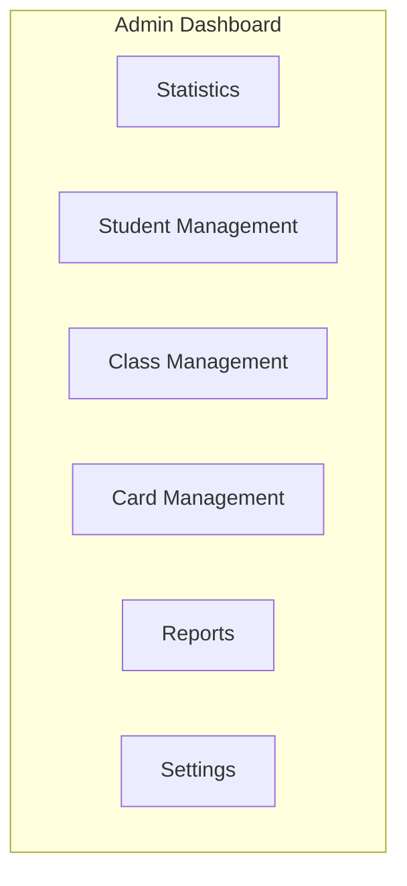
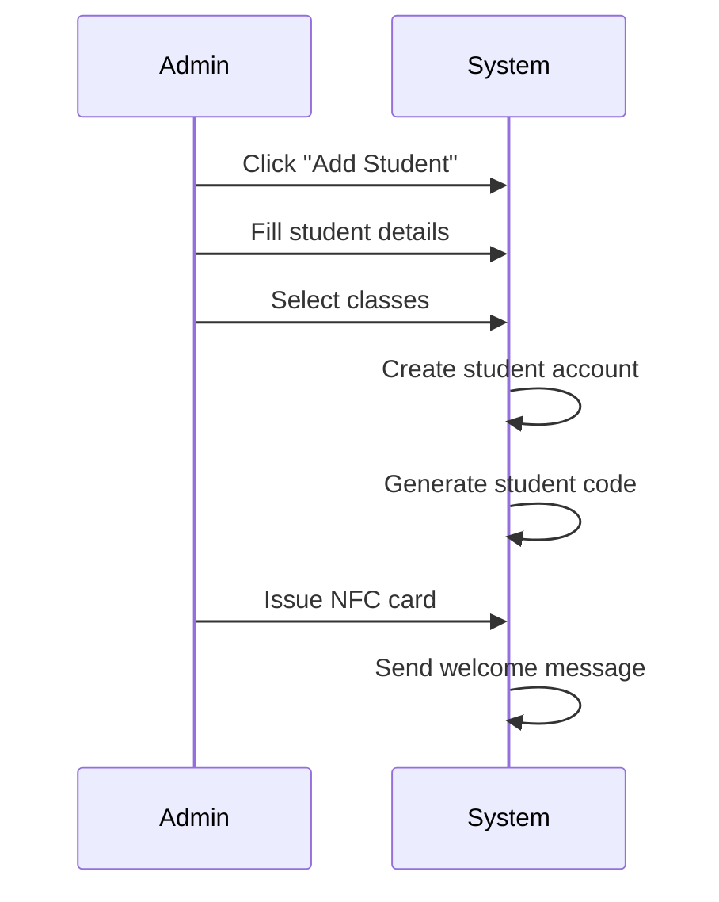

# 🏫 Admin Guide

> Institute administrator guide for AMS

## 1. Getting Started

### 1.1 Accessing Admin Portal
1. Go to `https://admin.ams.com`
2. Login with admin credentials
3. Select your institute

## 2. Dashboard Overview

## 3. Student Management

### 3.1 Registering a New Student

**Required Information:**
- First name, Last name
- Email, Phone
- Date of birth
- Guardian name and contact
- Address
- Classes to enroll

### 3.2 Managing Students
- View all students
- Edit student information
- Manage class enrollment
- View attendance/payment history
- Deactivate student

## 4. Class Management

### 4.1 Creating a Class
1. Go to Classes > Create Class
2. Enter class details:
   - Name and code
   - Description
   - Schedule (days and times)
   - Instructor
   - Room/Location
   - Capacity

### 4.2 Setting Up Fees
1. Open class settings
2. Go to "Fees" tab
3. Add fee structure:
   - Fee name
   - Amount
   - Frequency (monthly, etc.)
   - Due day

### 4.3 Managing Enrollment
- Add students to class
- Remove students
- View enrolled students
- Transfer students

## 5. NFC Card Management

### 5.1 Issuing Cards
1. Go to Cards > Issue Card
2. Select student
3. Tap new NFC card to reader
4. Confirm card details
5. Activate card

### 5.2 Card Operations
| Action | When to Use |
|--------|-------------|
| **Block** | Security concern |
| **Unblock** | Issue resolved |
| **Replace** | Lost/damaged card |
| **Deactivate** | Student left |

## 6. User Management

### 6.1 Adding Staff
1. Go to Users > Add User
2. Enter user details
3. Assign role:
   - Admin
   - Card Checker
   - Instructor

### 6.2 Managing Permissions
- View user list
- Edit user roles
- Deactivate users
- Reset passwords

## 7. Reports

### 7.1 Available Reports

| Report | Description |
|--------|-------------|
| **Attendance Summary** | Daily/weekly/monthly attendance |
| **Payment Collection** | Fee collection summary |
| **Outstanding Dues** | Pending payments |
| **Student Roster** | All enrolled students |
| **Card Inventory** | NFC card status |

### 7.2 Generating Reports
1. Go to Reports
2. Select report type
3. Choose filters (date range, class, etc.)
4. Click Generate
5. Export as PDF/CSV

## 8. Institute Settings

### 8.1 General Settings
- Institute name and logo
- Contact information
- Timezone and locale

### 8.2 Notification Settings
- SMS provider configuration
- Email settings
- Reminder schedules

### 8.3 Attendance Settings
- Late threshold (minutes)
- Allow manual entry
- Require notes for manual

### 8.4 Payment Settings
- Accepted payment methods
- Reminder days before due
- Receipt format

## 9. Common Tasks

### 9.1 Daily Tasks
- ✅ Review attendance summary
- ✅ Check payment collections
- ✅ Follow up on alerts

### 9.2 Weekly Tasks
- ✅ Generate attendance reports
- ✅ Review outstanding dues
- ✅ Send payment reminders

### 9.3 Monthly Tasks
- ✅ Full financial report
- ✅ User access review
- ✅ Card expiry check

## 10. Troubleshooting

### Common Issues

| Issue | Solution |
|-------|----------|
| Student can't login | Reset password |
| Card not working | Check card status, reissue if needed |
| Payment not showing | Check transaction logs |
| Report not generating | Try smaller date range |

---

**Back to:** [Documentation Home](../README.md)

