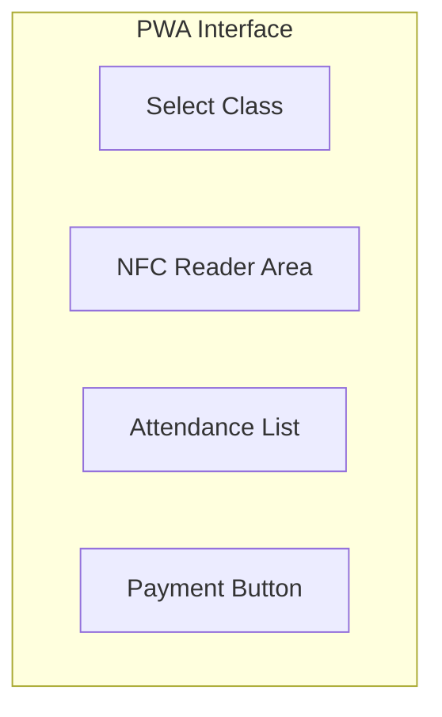
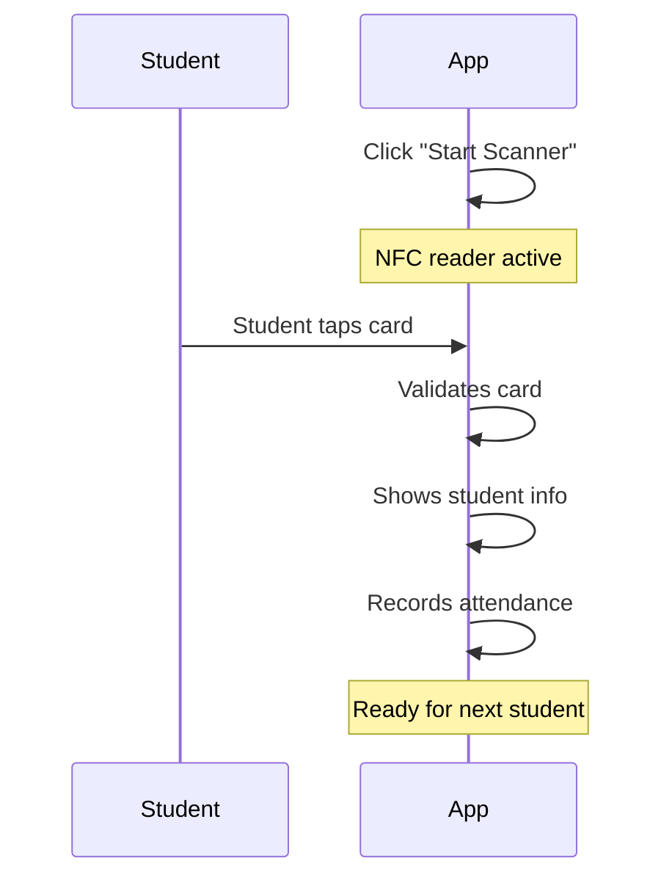

# 📋 Card Checker Guide

> How to use the AMS PWA for attendance and payment recording

## 1. Getting Started

### 1.1 Installing the PWA

1. Open Chrome on your Android device
2. Navigate to `https://checker.ams.com`
3. Login with your credentials
4. Click "Add to Home Screen" when prompted
5. The app will be installed on your device

### 1.2 Requirements

| Requirement | Details |
|-------------|---------|
| **Device** | Android phone with NFC |
| **Browser** | Chrome 89+ |
| **Permissions** | NFC, Notifications |

## 2. Main Interface

## 3. Recording Attendance

### 3.1 Setup
1. Open the PWA app
2. Select your institute (if multiple)
3. Select the class you're checking

### 3.2 Taking Attendance

### 3.3 Status Indicators

| Color | Status |
|-------|--------|
| 🟢 Green | Present (on time) |
| 🟡 Yellow | Late |
| 🔴 Red | Error/Invalid |

### 3.4 Manual Entry
If a student forgot their card:
1. Click "Manual Entry"
2. Search for the student
3. Select the student
4. Choose attendance status
5. Add a note (required)
6. Submit

## 4. Recording Payments

### 4.1 Payment Flow

1. Tap student's NFC card
2. Click "Record Payment"
3. View outstanding dues
4. Select fee to pay
5. Enter amount received
6. Select payment method
7. Submit payment
8. Student receives SMS/Email

### 4.2 Payment Methods

- Cash
- Card
- Bank Transfer
- Online

### 4.3 After Payment
- Show receipt to student
- Option to print/share receipt
- Notification sent automatically

## 5. Viewing Records

### 5.1 Today's Attendance
- Real-time attendance list
- Summary counts
- Filter by status

### 5.2 Payment Records
- Today's collections
- Total amount
- Payment breakdown

## 6. Offline Mode

### 6.1 Working Offline
The app works without internet:
1. Continue taking attendance
2. Data stored locally
3. Auto-syncs when online

### 6.2 Sync Status
- 🟢 Online - synced
- 🟡 Pending sync
- 🔴 Sync error

## 7. Troubleshooting

### 7.1 NFC Not Working
1. Ensure NFC is enabled in device settings
2. Check app has NFC permission
3. Hold card steady for 1-2 seconds
4. Try different card position

### 7.2 Card Not Recognized
- Card may be inactive
- Student may not be enrolled
- Contact administrator

### 7.3 App Issues
1. Try refreshing the app
2. Clear browser cache
3. Reinstall from website

## 8. Best Practices

### 8.1 Before Class
- ✅ Charge your device
- ✅ Test NFC reader
- ✅ Ensure app is updated
- ✅ Check internet connection

### 8.2 During Class
- ✅ Keep app open and active
- ✅ Maintain stable position for tapping
- ✅ Verify student name matches

### 8.3 After Class
- ✅ Review attendance list
- ✅ Ensure all payments recorded
- ✅ Check sync status

---

**Back to:** [Documentation Home](../README.md)

