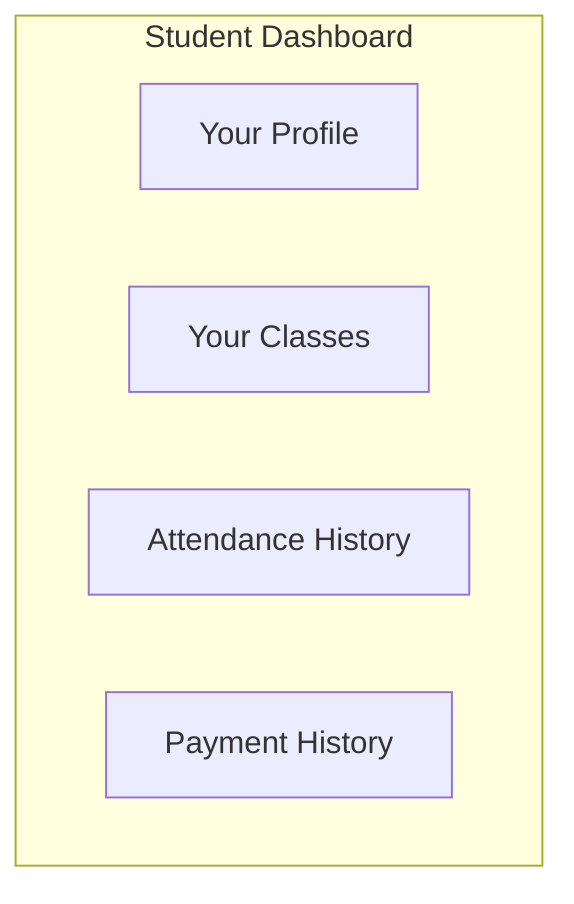

# 👨‍🎓 Student Guide

> How to use the AMS Student Portal

## 1. Getting Started

### 1.1 Accessing the Portal

1. Open your web browser
2. Go to `https://student.ams.com`
3. Enter your credentials (email and password)
4. Click "Login"

### 1.2 First Login

When logging in for the first time:
1. Use the temporary password provided by your institute
2. You'll be prompted to change your password
3. Complete your profile information

## 2. Dashboard Overview

### 2.1 Dashboard Features

| Section | Description |
|---------|-------------|
| **Overview** | Quick stats on attendance and payments |
| **Classes** | List of enrolled classes |
| **Attendance** | View your attendance records |
| **Payments** | View payment history and dues |
| **Profile** | Update your personal information |

## 3. Viewing Attendance

### 3.1 Attendance Summary
- View overall attendance rate
- See attendance by class
- Check monthly breakdown

### 3.2 Detailed Records
- Filter by class and date range
- See check-in times
- View attendance status (Present/Late/Absent)

## 4. Payment History

### 4.1 Viewing Payments
- See all past payments
- Download receipts
- View payment details

### 4.2 Outstanding Dues
- Check current dues
- See due dates
- View payment reminders

## 5. Your NFC Card

### 5.1 Card Information
- View card status
- See card expiry date
- Report lost card

### 5.2 Using Your Card
1. Bring your card to class
2. Tap on the NFC reader when prompted
3. Wait for confirmation beep/message
4. Your attendance is recorded!

## 6. Profile Management

### 6.1 Update Profile
- Change password
- Update contact information
- Set notification preferences

## 7. Getting Help

Contact your institute administrator for:
- Password reset issues
- Card replacement
- Payment queries
- Attendance corrections

---

**Back to:** [Documentation Home](../README.md)

