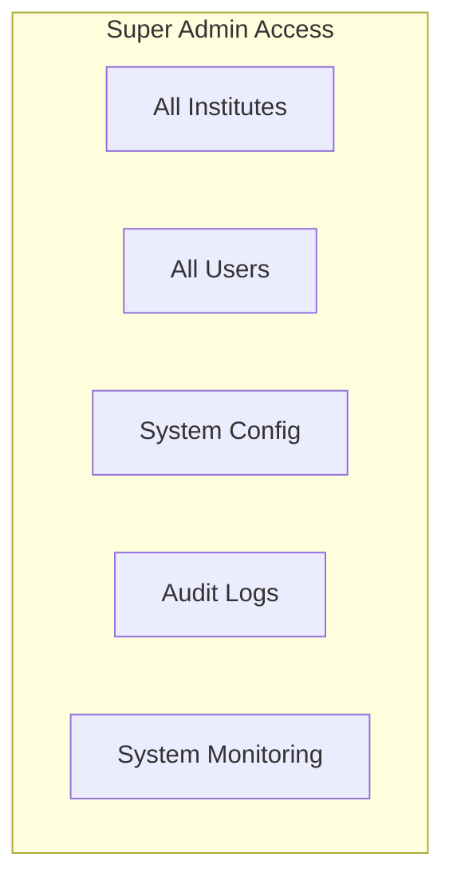

# 👑 Super Admin Guide

> System-wide administration guide for AMS developers

## 1. Overview

The Super Admin role provides full system access for developers and system administrators to manage the entire AMS platform.

## 2. Access & Authentication

### 2.1 Super Admin Portal
- URL: `https://superadmin.ams.com`
- Requires 2FA authentication
- Audit logged for all actions

### 2.2 Capabilities



## 3. Institute Management

### 3.1 Creating an Institute
1. Go to Institutes > Create
2. Fill in institute details:
   - Name and unique code
   - Contact information
   - Initial settings
3. Create first admin user
4. Activate institute

### 3.2 Institute Operations

| Operation | Description |
|-----------|-------------|
| **Create** | New institute setup |
| **Suspend** | Temporarily disable |
| **Reactivate** | Re-enable suspended |
| **Deactivate** | Permanently disable |
| **Delete** | Remove with data archival |

### 3.3 Institute Settings Override
- Override any institute setting
- Set global defaults
- Configure feature flags

## 4. User Management

### 4.1 Global User Search
- Search across all institutes
- View user's institute memberships
- Impersonate user (for debugging)

### 4.2 User Operations
- Reset any user's password
- Unlock locked accounts
- Revoke all sessions
- Delete user data (GDPR)

## 5. System Configuration

### 5.1 Global Settings
```yaml
# System configuration
system:
  maintenance_mode: false
  registration_enabled: true
  max_institutes: 100
  
notifications:
  global_sms_enabled: true
  global_email_enabled: true
  
security:
  max_login_attempts: 5
  lockout_duration_minutes: 30
  session_timeout_hours: 24
  require_2fa_for_admins: true
```

### 5.2 Feature Flags
| Flag | Description |
|------|-------------|
| `ENABLE_PWA` | PWA functionality |
| `ENABLE_OFFLINE_MODE` | Offline support |
| `ENABLE_SMS_NOTIFICATIONS` | SMS sending |
| `ENABLE_EMAIL_NOTIFICATIONS` | Email sending |
| `ENABLE_REPORTING` | Report generation |

## 6. Monitoring & Logs

### 6.1 System Health Dashboard
- Service status
- Database connections
- Queue depths
- Error rates

### 6.2 Audit Logs
- All admin actions logged
- User activity tracking
- Security events
- Data access logs

### 6.3 Search Audit Logs
```
Filter by:
- User
- Action type
- Entity type
- Date range
- Institute
```

## 7. Database Operations

### 7.1 Backup & Restore
- Schedule automated backups
- Trigger manual backup
- Restore from backup
- Export institute data

### 7.2 Data Maintenance
- Archive old records
- Clean up expired sessions
- Purge audit logs (>retention)

## 8. Integration Management

### 8.1 SMS Providers
- Configure Twilio credentials
- Set up local SMS providers
- Test SMS delivery
- Monitor delivery rates

### 8.2 Email Providers
- Configure SMTP/SendGrid
- Test email delivery
- Manage email templates

## 9. Security Management

### 9.1 Security Dashboard
- Failed login attempts
- Blocked IPs
- Suspicious activities
- Active threats

### 9.2 Security Actions
| Action | Use Case |
|--------|----------|
| Block IP | Malicious activity |
| Force logout all | Security breach |
| Disable 2FA | User locked out |
| Reset rate limits | Testing |

## 10. API Management

### 10.1 API Keys
- Generate API keys
- Set rate limits per key
- Revoke compromised keys
- Monitor API usage

### 10.2 Webhooks
- Configure webhook endpoints
- Test webhook delivery
- View webhook logs

## 11. Maintenance Operations

### 11.1 Maintenance Mode
```
Steps to enable:
1. Go to System > Maintenance
2. Set maintenance message
3. Enable maintenance mode
4. All users see maintenance page
```

### 11.2 System Updates
- View current version
- Check for updates
- Schedule update window
- Rollback if needed

## 12. Troubleshooting

### 12.1 Common Issues

| Issue | Investigation |
|-------|---------------|
| High error rates | Check logs, recent deployments |
| Slow performance | Database queries, cache hits |
| Failed notifications | Provider status, credentials |
| Login issues | Session store, auth service |

### 12.2 Debug Tools
- Request tracing
- Log aggregation
- Performance profiling
- Database query analysis

---

**Back to:** [Documentation Home](../README.md)

