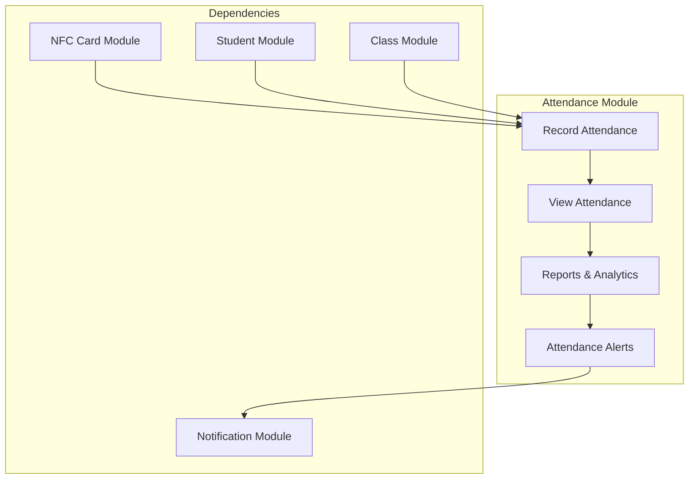
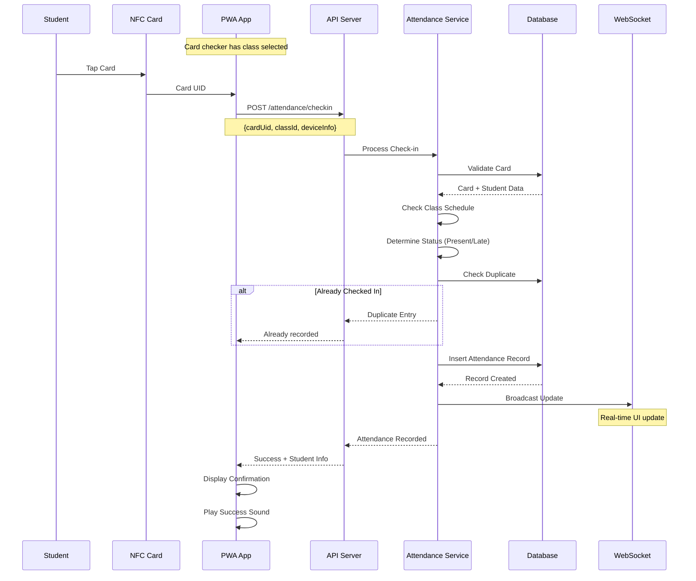
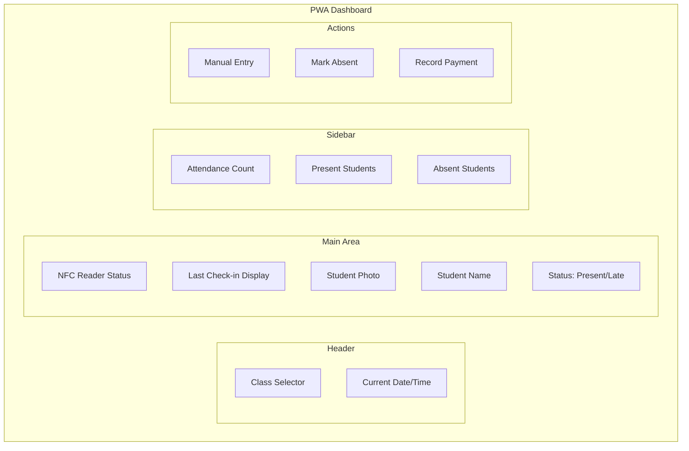
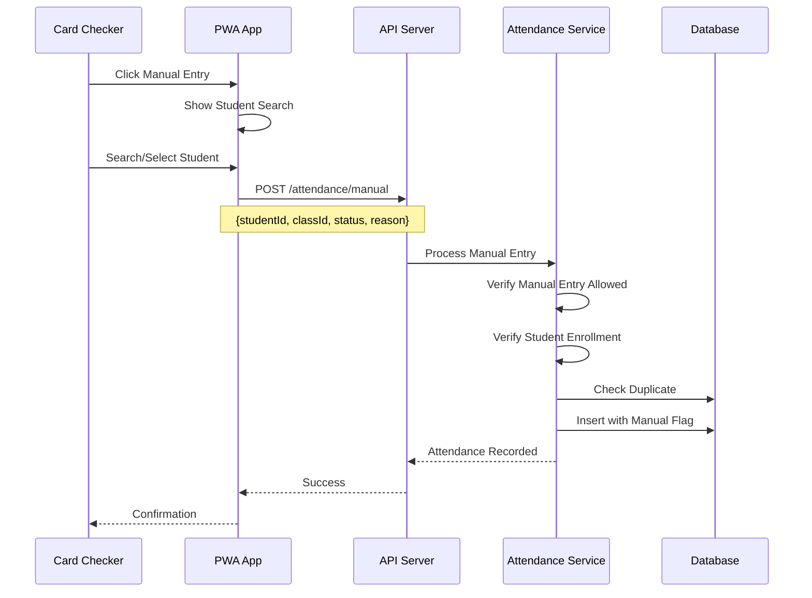
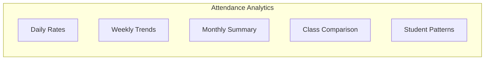
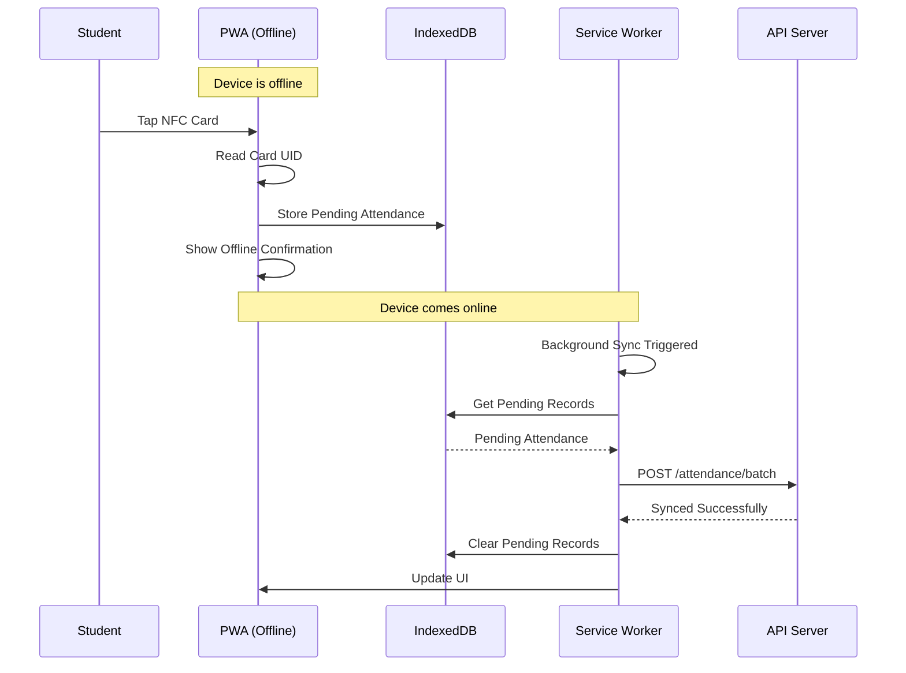

# ✅ Attendance Module

> Class-wise attendance tracking and management for AMS

## 1. Module Overview

The Attendance Module enables real-time tracking of student attendance using NFC cards. Card checkers use the PWA application to record attendance when students tap their cards at the beginning of each class.



## 2. Attendance Data Model

### 2.1 Attendance Entity

```typescript
interface Attendance {
  id: string;
  studentId: string;
  classId: string;
  nfcCardId: string;
  checkedBy: string;          // Card checker user ID
  
  attendanceDate: Date;       // Date portion only
  checkInTime: Date;          // Full timestamp
  checkOutTime?: Date;        // Optional checkout
  
  status: AttendanceStatus;
  deviceInfo: DeviceInfo;
  notes?: string;
  
  createdAt: Date;
  updatedAt: Date;
}

enum AttendanceStatus {
  PRESENT = 'present',
  LATE = 'late',
  EXCUSED = 'excused',
  ABSENT = 'absent'
}

interface DeviceInfo {
  deviceId: string;
  deviceType: string;         // 'mobile', 'tablet'
  browser: string;
  platform: string;
  ipAddress: string;
}
```

## 3. Attendance Recording Flow

### 3.1 NFC Check-in Flow



### 3.2 Late Detection Logic

```typescript
function determineAttendanceStatus(
  checkInTime: Date,
  classSchedule: ClassSchedule,
  instituteSettings: InstituteSettings
): AttendanceStatus {
  const classStartTime = parseTime(classSchedule.startTime);
  const lateThreshold = instituteSettings.attendance.lateThresholdMinutes;
  
  const checkInMinutes = getMinutesFromMidnight(checkInTime);
  const classStartMinutes = getMinutesFromMidnight(classStartTime);
  
  const minutesLate = checkInMinutes - classStartMinutes;
  
  if (minutesLate <= 0) {
    return AttendanceStatus.PRESENT;
  } else if (minutesLate <= lateThreshold) {
    return AttendanceStatus.LATE;
  } else {
    // Still mark as late but flag for review
    return AttendanceStatus.LATE;
  }
}
```

## 4. PWA Attendance Interface

### 4.1 Card Checker Dashboard



### 4.2 Real-time Attendance List

```typescript
// React component for real-time attendance list
function AttendanceList({ classId }: { classId: string }) {
  const [attendance, setAttendance] = useState<AttendanceRecord[]>([]);
  const [summary, setSummary] = useState<AttendanceSummary | null>(null);

  // WebSocket for real-time updates
  useEffect(() => {
    const socket = connectWebSocket();
    
    socket.on('attendance:checkin', (data: AttendanceRecord) => {
      if (data.classId === classId) {
        setAttendance(prev => [data, ...prev]);
        updateSummary(data);
      }
    });

    return () => socket.disconnect();
  }, [classId]);

  // Initial load
  useEffect(() => {
    async function loadAttendance() {
      const response = await api.get(`/attendance/class/${classId}/today`);
      setAttendance(response.data.records);
      setSummary(response.data.summary);
    }
    loadAttendance();
  }, [classId]);

  return (
    <div className="attendance-list">
      <div className="summary">
        <div className="stat present">
          <span className="count">{summary?.present || 0}</span>
          <span className="label">Present</span>
        </div>
        <div className="stat late">
          <span className="count">{summary?.late || 0}</span>
          <span className="label">Late</span>
        </div>
        <div className="stat absent">
          <span className="count">{summary?.absent || 0}</span>
          <span className="label">Absent</span>
        </div>
      </div>

      <div className="list">
        {attendance.map(record => (
          <AttendanceCard key={record.id} record={record} />
        ))}
      </div>
    </div>
  );
}
```

## 5. Manual Attendance Entry

### 5.1 Manual Entry Flow



### 5.2 Manual Entry Restrictions

| Setting | Default | Description |
|---------|---------|-------------|
| Allow Manual Entry | true | Enable/disable manual entry |
| Require Reason | true | Must provide reason for manual |
| Max Per Day | 5 | Limit manual entries per checker |
| Admin Override | true | Admins can always enter manually |

## 6. Attendance Reports

### 6.1 Daily Attendance Report

```typescript
interface DailyAttendanceReport {
  date: string;
  class: {
    id: string;
    name: string;
    scheduledTime: string;
  };
  summary: {
    enrolled: number;
    present: number;
    late: number;
    absent: number;
    excused: number;
    attendanceRate: number;
  };
  records: Array<{
    studentId: string;
    studentCode: string;
    studentName: string;
    checkInTime: string;
    status: AttendanceStatus;
    method: 'nfc' | 'manual';
  }>;
  absentStudents: Array<{
    studentId: string;
    studentCode: string;
    studentName: string;
    guardianPhone: string;
  }>;
}
```

### 6.2 Student Attendance Report

```typescript
interface StudentAttendanceReport {
  student: {
    id: string;
    studentCode: string;
    name: string;
  };
  period: {
    startDate: string;
    endDate: string;
  };
  summary: {
    totalClasses: number;
    present: number;
    late: number;
    absent: number;
    excused: number;
    attendanceRate: number;
    lateRate: number;
  };
  byClass: Array<{
    classId: string;
    className: string;
    totalSessions: number;
    attended: number;
    attendanceRate: number;
  }>;
  timeline: Array<{
    date: string;
    className: string;
    status: AttendanceStatus;
    checkInTime?: string;
  }>;
}
```

### 6.3 Attendance Trends



## 7. Attendance Alerts

### 7.1 Alert Types

| Alert | Trigger | Action |
|-------|---------|--------|
| Low Attendance | Class attendance < 70% | Notify Admin |
| Chronic Absence | Student absent 3+ consecutive days | Notify Guardian |
| Late Pattern | Student late 5+ times in month | Flag for Review |
| No Show | Student enrolled but never attended | Admin Review |

### 7.2 Alert Configuration

```typescript
const attendanceAlertConfig = {
  lowAttendanceThreshold: 70,      // Percentage
  chronicAbsenceDays: 3,           // Consecutive days
  latePatternCount: 5,             // Times per month
  noShowDays: 7,                   // Days since enrollment
  
  notifications: {
    lowAttendance: {
      recipients: ['institute_admin'],
      channels: ['email', 'in_app']
    },
    chronicAbsence: {
      recipients: ['guardian', 'institute_admin'],
      channels: ['sms', 'email']
    },
    latePattern: {
      recipients: ['guardian'],
      channels: ['sms']
    }
  }
};
```

## 8. Offline Support

### 8.1 Offline Check-in Flow



### 8.2 Offline Storage Schema

```typescript
// IndexedDB schema for offline attendance
const offlineAttendanceSchema = {
  storeName: 'pendingAttendance',
  keyPath: 'localId',
  indexes: [
    { name: 'classId', keyPath: 'classId' },
    { name: 'timestamp', keyPath: 'timestamp' },
    { name: 'synced', keyPath: 'synced' }
  ]
};

interface PendingAttendance {
  localId: string;           // Local UUID
  cardUid: string;
  classId: string;
  timestamp: Date;
  deviceInfo: DeviceInfo;
  synced: boolean;
  syncAttempts: number;
  lastSyncAttempt?: Date;
  syncError?: string;
}
```

## 9. API Endpoints

| Endpoint | Method | Description | Access |
|----------|--------|-------------|--------|
| `/attendance/checkin` | POST | Record NFC check-in | Card Checker |
| `/attendance/manual` | POST | Manual attendance entry | Card Checker |
| `/attendance/batch` | POST | Sync offline records | Card Checker |
| `/attendance/class/:id/today` | GET | Today's attendance | Card Checker |
| `/attendance/class/:id` | GET | Class attendance history | Admin |
| `/attendance/student/:id` | GET | Student attendance | Admin/Student |
| `/attendance/:id` | PATCH | Update attendance | Admin |
| `/attendance/report` | GET | Generate report | Admin |

## 10. Best Practices

### 10.1 For Card Checkers

- ✅ Ensure PWA is updated before class starts
- ✅ Test NFC reader before students arrive
- ✅ Keep device charged during class
- ✅ Use offline mode if internet is unstable
- ✅ Review attendance list after class

### 10.2 For Administrators

- ✅ Configure late threshold appropriately
- ✅ Set up attendance alerts
- ✅ Review attendance reports weekly
- ✅ Follow up on chronic absences
- ✅ Train card checkers on manual entry

---

**Previous:** [NFC Card Management](./nfc-card-management.md) | **Next:** [Fee Management](./fee-management.md)

