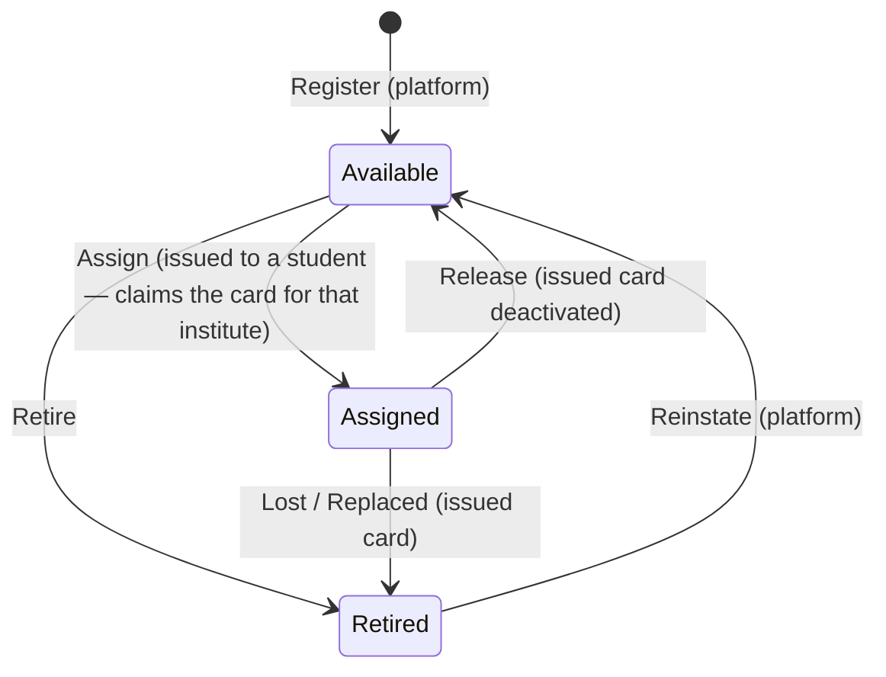

# 📦 Card Inventory & Provisioning Module

> Platform-controlled NFC card stock: only cards ClassPass supplies can be issued to students.

## 1. Why this exists

Institutes must not be able to use arbitrary NFC tags (cheap clones, random cards) with the
system. ClassPass manufactures and ships physical cards to each institute; the platform
pre-registers those card UIDs. Issuing a card to a student (see the
[NFC Card Management](nfc-card-management.md) module) only succeeds when the scanned UID is a
**registered** card that isn't already in use. **Registration is the gate** — there is no manual
per-institute allocation step. The physical handover of the cards is the control: an institute
simply starts issuing the cards it was given.

This separates two concerns that used to be one:

| Concept | Aggregate | Owner | Meaning |
|---|---|---|---|
| **Inventory** | `CardStock` | Platform (SystemAdmin) | A physical card we manufactured and registered |
| **Issuance** | `NfcCard` | Institute admin | A card that has been issued to a student enrollment |

## 2. CardStock lifecycle

- **Available** — registered and free to issue. Not currently on a student, not owned by any institute.
- **Assigned** — currently on a student, linked to an `NfcCard` and the institute that claimed it.
- **Retired** — out of circulation (lost/damaged). Reversible: a retired card can be **reinstated**
  back to `Available`.

## 3. Provisioning workflow (platform / SystemAdmin)

1. **Register** the cards we manufactured. Three ways, all on *Platform → Card Inventory*
   (`/admin/card-stock`):
   - **Register card** — type a single UID.
   - **Scan cards** — tap cards on a Web NFC reader; each tap registers the card instantly so a
     whole stack can be added in seconds.
   - **Bulk import** — paste/CSV a list of UIDs.
   All three accept an optional `BatchCode` (e.g. the shipment box) for inventory tracking;
   invalid and already-registered UIDs are skipped and reported.
2. **Hand the physical cards to the institute.** No system step — the institute starts issuing.
3. **Retire** damaged cards as needed. A card currently `Assigned` to a student cannot be retired
   directly — the issued card must be marked lost or replaced first. A retired card that turns out
   to be usable again can be **Reinstated** back to `Available` from the same screen.

## 4. Issuance enforcement & claim-on-first-use

`IssueCardCommand` looks up the scanned UID in `CardStock` (a global lookup — `CardStock` has no
tenant query filter) and rejects when:

| Condition | Result |
|---|---|
| UID not found | `404` — "not supplied by ClassPass" |
| Stock is `Retired` | `400` — card retired |
| Stock is `Assigned` | `409` — already on a student |
| Stock is `Available` | ✅ issue, then `stock.Assign(card.Id, instituteId)` → **Assigned**, claiming the card for the caller's institute |

Because the UID is globally unique and a card flips to `Assigned` the moment it is issued, a card
can never be on two students at once, and no other institute can reuse a card that is in service.
A registered-but-unclaimed card is claimed by whichever institute issues it first — which in
practice is the institute physically holding it.

Knock-on lifecycle from issued-card operations:

- **Deactivate** issued card → `stock.Release()` returns it to the free pool (`Available`).
- **Mark lost** → `stock.Retire()` (out of circulation; can be reinstated later if recovered).
- **Replace** → new card's stock `Assign`ed, old card's stock `Retire`d.

## 5. Permissions

The inventory is platform-only. Its permissions are **SystemAdmin-only** system permissions
(excluded from the tenant `Admin` role so a tenant admin cannot register or retire the cards we
supply):

- `card-stock:view` — view inventory
- `card-stock:register` — register single / scan / bulk
- `card-stock:manage` — retire / reinstate / manage

Institute admins continue to use `cards:view` / `cards:issue`; the registration gate is enforced
server-side in `IssueCardCommand`, so no institute-facing inventory endpoint is required.

## 6. Persistence

Table `ams_card_stock` (`public` schema): unique index on `card_uid`, plus indexes on
`(institute_id, status)` and `batch_code`. Optional FK to `ams_institutes` (`Restrict`);
`institute_id` is set only while a card is `Assigned`.
