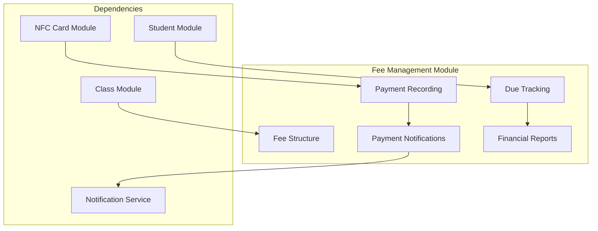
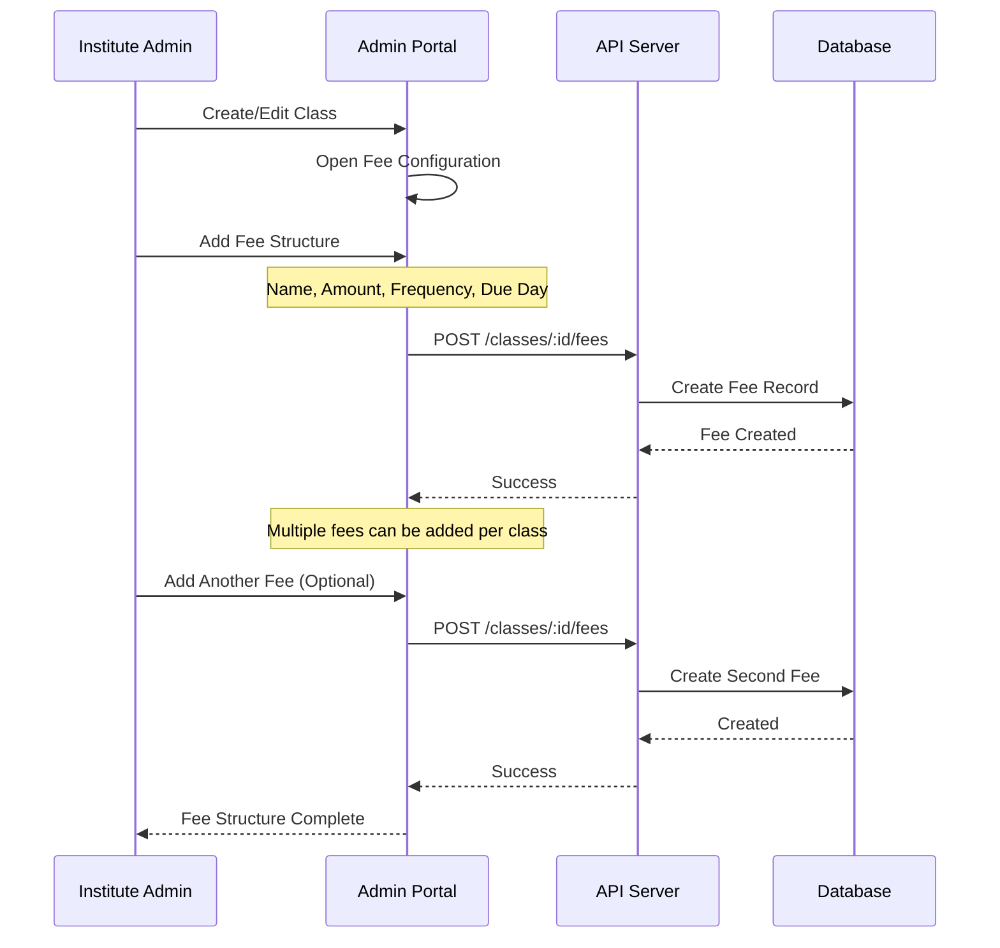
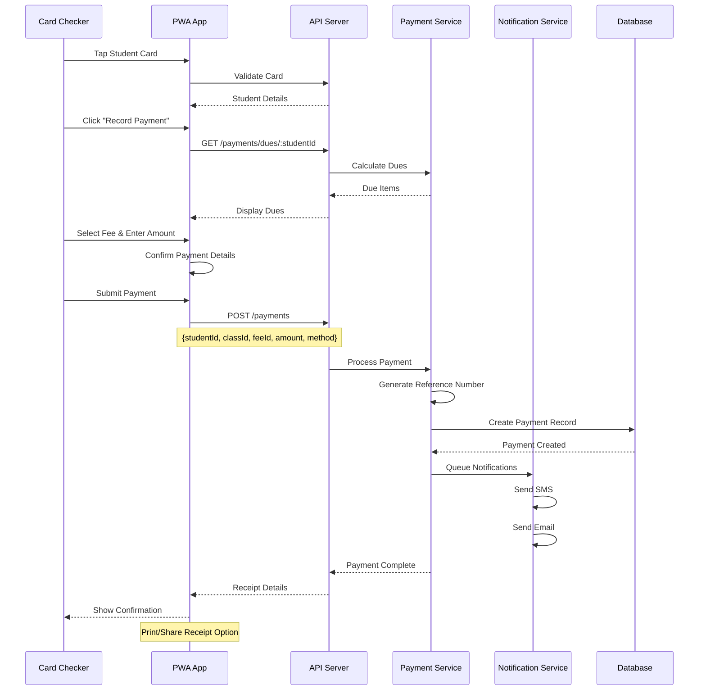
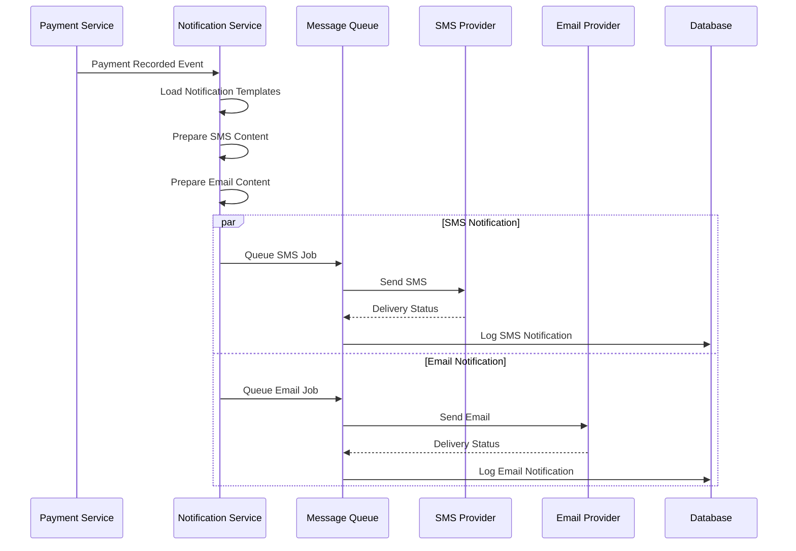
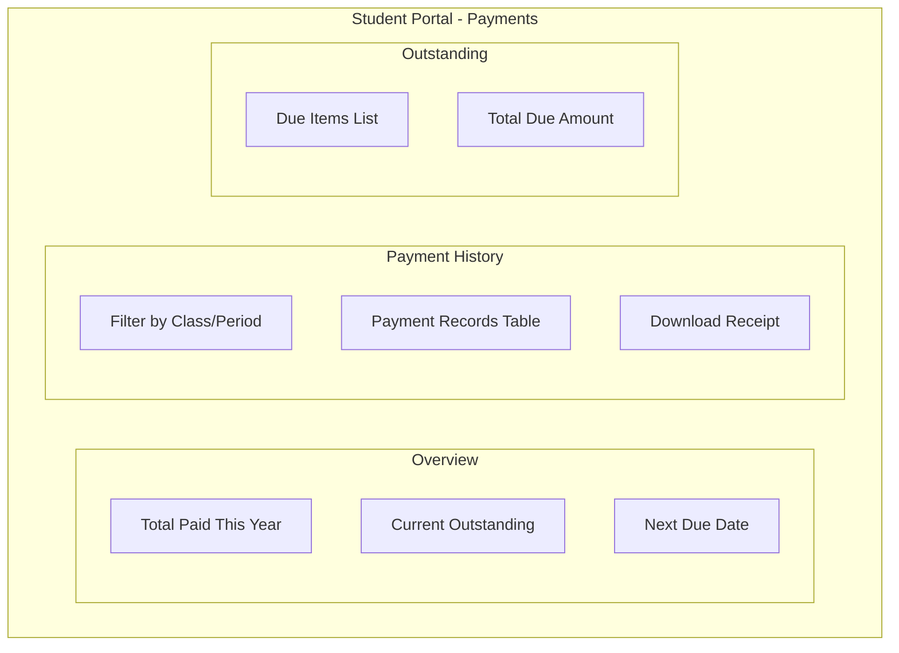
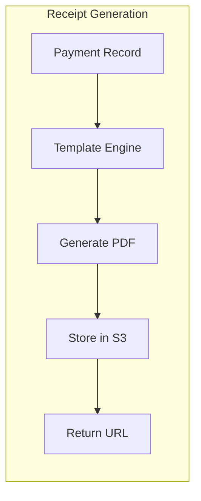

# 💰 Fee Management Module

> Class-wise fee collection and payment tracking for AMS

## 1. Module Overview

The Fee Management Module handles all financial aspects of the AMS, including fee structure definition, payment recording, receipt generation, and SMS/email notifications for payment confirmations.



## 2. Fee Data Model

### 2.1 Class Fee Entity

```typescript
interface ClassFee {
  id: string;
  classId: string;
  name: string;                    // e.g., "Monthly Tuition", "Material Fee"
  description?: string;
  amount: number;
  frequency: FeeFrequency;
  dueDay: number;                  // Day of month (1-31)
  isActive: boolean;
  createdAt: Date;
  updatedAt: Date;
}

enum FeeFrequency {
  ONE_TIME = 'one_time',
  MONTHLY = 'monthly',
  QUARTERLY = 'quarterly',
  YEARLY = 'yearly'
}
```

### 2.2 Payment Entity

```typescript
interface Payment {
  id: string;
  studentId: string;
  classId: string;
  classFeeId: string;
  receivedBy: string;              // Card checker/admin user ID
  
  amount: number;
  paymentMethod: PaymentMethod;
  status: PaymentStatus;
  referenceNumber: string;         // Auto-generated receipt number
  
  paymentDate: Date;
  forMonth: number;                // 1-12
  forYear: number;
  
  notes?: string;
  receiptUrl?: string;
  
  createdAt: Date;
}

enum PaymentMethod {
  CASH = 'cash',
  CARD = 'card',
  BANK_TRANSFER = 'bank_transfer',
  ONLINE = 'online',
  OTHER = 'other'
}

enum PaymentStatus {
  PENDING = 'pending',
  COMPLETED = 'completed',
  FAILED = 'failed',
  REFUNDED = 'refunded'
}
```

## 3. Fee Structure Configuration

### 3.1 Fee Setup Flow



### 3.2 Fee Calculation Logic

```typescript
function calculateDues(
  studentId: string,
  classId: string,
  asOfDate: Date = new Date()
): Promise<DueCalculation> {
  // Get all active fees for the class
  const fees = await ClassFee.findAll({
    where: { classId, isActive: true }
  });
  
  // Get enrollment date
  const enrollment = await StudentClass.findOne({
    where: { studentId, classId }
  });
  
  const dues: DueItem[] = [];
  
  for (const fee of fees) {
    switch (fee.frequency) {
      case 'one_time':
        const oneTimePaid = await Payment.findOne({
          where: { studentId, classFeeId: fee.id }
        });
        if (!oneTimePaid) {
          dues.push({
            feeId: fee.id,
            feeName: fee.name,
            amount: fee.amount,
            dueDate: enrollment.enrolledDate
          });
        }
        break;
        
      case 'monthly':
        const months = getMonthsBetween(enrollment.enrolledDate, asOfDate);
        for (const { month, year } of months) {
          const paid = await Payment.findOne({
            where: { studentId, classFeeId: fee.id, forMonth: month, forYear: year }
          });
          if (!paid) {
            dues.push({
              feeId: fee.id,
              feeName: fee.name,
              amount: fee.amount,
              forMonth: month,
              forYear: year,
              dueDate: new Date(year, month - 1, fee.dueDay)
            });
          }
        }
        break;
        
      // Similar logic for quarterly and yearly
    }
  }
  
  return {
    studentId,
    classId,
    totalDue: dues.reduce((sum, d) => sum + d.amount, 0),
    items: dues
  };
}
```

## 4. Payment Recording

### 4.1 Payment Flow (PWA)



### 4.2 Payment Recording UI

```typescript
// React component for payment recording
function PaymentRecorder({ student, classId }: PaymentRecorderProps) {
  const [dues, setDues] = useState<DueItem[]>([]);
  const [selectedDue, setSelectedDue] = useState<DueItem | null>(null);
  const [amount, setAmount] = useState<number>(0);
  const [method, setMethod] = useState<PaymentMethod>('cash');
  const [processing, setProcessing] = useState(false);

  useEffect(() => {
    async function loadDues() {
      const response = await api.get(`/payments/dues/${student.id}?classId=${classId}`);
      setDues(response.data.items);
    }
    loadDues();
  }, [student.id, classId]);

  const handleSubmit = async () => {
    if (!selectedDue) return;
    
    setProcessing(true);
    try {
      const response = await api.post('/payments', {
        studentId: student.id,
        classId,
        classFeeId: selectedDue.feeId,
        amount,
        paymentMethod: method,
        forMonth: selectedDue.forMonth,
        forYear: selectedDue.forYear
      });
      
      // Show success and receipt
      showReceipt(response.data);
    } catch (error) {
      showError('Payment failed');
    } finally {
      setProcessing(false);
    }
  };

  return (
    <div className="payment-recorder">
      <div className="student-info">
        
        <h3>{student.name}</h3>
        <p>{student.studentCode}</p>
      </div>

      <div className="dues-list">
        <h4>Outstanding Dues</h4>
        {dues.map(due => (
          <div 
            key={`${due.feeId}-${due.forMonth}-${due.forYear}`}
            className={`due-item ${selectedDue === due ? 'selected' : ''}`}
            onClick={() => {
              setSelectedDue(due);
              setAmount(due.amount);
            }}
          >
            <span className="fee-name">{due.feeName}</span>
            {due.forMonth && (
              <span className="period">
                {getMonthName(due.forMonth)} {due.forYear}
              </span>
            )}
            <span className="amount">{formatCurrency(due.amount)}</span>
          </div>
        ))}
      </div>

      {selectedDue && (
        <div className="payment-form">
          <div className="field">
            <label>Amount</label>
            <input 
              type="number" 
              value={amount} 
              onChange={e => setAmount(Number(e.target.value))}
            />
          </div>

          <div className="field">
            <label>Payment Method</label>
            <select value={method} onChange={e => setMethod(e.target.value as PaymentMethod)}>
              <option value="cash">Cash</option>
              <option value="card">Card</option>
              <option value="bank_transfer">Bank Transfer</option>
            </select>
          </div>

          <button 
            className="submit-btn" 
            onClick={handleSubmit}
            disabled={processing}
          >
            {processing ? 'Processing...' : `Record Payment (${formatCurrency(amount)})`}
          </button>
        </div>
      )}
    </div>
  );
}
```

## 5. Payment Notifications

### 5.1 Notification Flow



### 5.2 Notification Templates

```typescript
const paymentNotificationTemplates = {
  sms: {
    confirmation: `
Dear {guardianName},

Payment of {currency}{amount} received for {studentName}.
Class: {className}
Period: {period}
Receipt: {receiptNumber}

Thank you!
- {instituteName}
    `.trim(),
    
    reminder: `
Dear {guardianName},

Reminder: Payment of {currency}{amount} due for {studentName}.
Class: {className}
Due Date: {dueDate}

Please make payment at your earliest convenience.
- {instituteName}
    `.trim()
  },
  
  email: {
    confirmation: {
      subject: 'Payment Confirmation - {instituteName}',
      body: `
<!DOCTYPE html>
<html>
<head>
  <style>
    .receipt { border: 1px solid #ddd; padding: 20px; }
    .header { background: #f5f5f5; padding: 10px; }
    .amount { font-size: 24px; color: #2e7d32; }
  </style>
</head>
<body>
  <div class="receipt">
    <div class="header">
      <h2>{instituteName}</h2>
      <p>Payment Receipt</p>
    </div>
    <p><strong>Student:</strong> {studentName} ({studentCode})</p>
    <p><strong>Class:</strong> {className}</p>
    <p><strong>Period:</strong> {period}</p>
    <p><strong>Amount:</strong> <span class="amount">{currency}{amount}</span></p>
    <p><strong>Receipt No:</strong> {receiptNumber}</p>
    <p><strong>Date:</strong> {paymentDate}</p>
    <p><strong>Method:</strong> {paymentMethod}</p>
  </div>
</body>
</html>
      `
    }
  }
};
```

### 5.3 Notification Preferences

```typescript
interface NotificationPreferences {
  // Institute-level settings
  institute: {
    smsEnabled: boolean;
    emailEnabled: boolean;
    smsProvider: 'twilio' | 'local';
    emailFrom: string;
  };
  
  // Event-specific settings
  events: {
    paymentReceived: {
      sms: boolean;
      email: boolean;
      recipients: ('guardian' | 'student')[];
    };
    paymentReminder: {
      sms: boolean;
      email: boolean;
      daysBefore: number[];      // e.g., [7, 3, 1] days before due
    };
    paymentOverdue: {
      sms: boolean;
      email: boolean;
      daysAfter: number[];      // e.g., [1, 7, 14] days after due
    };
  };
}
```

## 6. Student Payment Portal

### 6.1 Payment History View



### 6.2 Student Payment History API Response

```json
{
  "student": {
    "id": "uuid",
    "name": "Jane Smith",
    "studentCode": "STU-2026-001"
  },
  "summary": {
    "totalPaidThisYear": 45000.00,
    "totalDue": 5000.00,
    "lastPaymentDate": "2026-02-10"
  },
  "classes": [
    {
      "classId": "uuid",
      "className": "Mathematics Grade 10",
      "fee": {
        "name": "Monthly Tuition",
        "amount": 5000.00,
        "frequency": "monthly"
      },
      "paymentStatus": {
        "currentMonthPaid": false,
        "lastPaidMonth": "January 2026",
        "dueAmount": 5000.00
      }
    }
  ],
  "recentPayments": [
    {
      "id": "uuid",
      "referenceNumber": "PAY-2026-0001234",
      "amount": 5000.00,
      "paymentDate": "2026-02-10",
      "className": "Mathematics Grade 10",
      "period": "January 2026",
      "method": "cash",
      "receiptUrl": "https://..."
    }
  ],
  "outstandingDues": [
    {
      "classId": "uuid",
      "className": "Mathematics Grade 10",
      "feeName": "Monthly Tuition",
      "amount": 5000.00,
      "forMonth": 2,
      "forYear": 2026,
      "dueDate": "2026-02-05",
      "daysOverdue": 9
    }
  ]
}
```

## 7. Financial Reports

### 7.1 Collection Summary Report

```typescript
interface CollectionSummaryReport {
  period: {
    startDate: string;
    endDate: string;
  };
  institute: {
    id: string;
    name: string;
  };
  summary: {
    totalCollected: number;
    totalExpected: number;
    collectionRate: number;
    transactionCount: number;
  };
  byPaymentMethod: Array<{
    method: PaymentMethod;
    amount: number;
    count: number;
    percentage: number;
  }>;
  byClass: Array<{
    classId: string;
    className: string;
    collected: number;
    expected: number;
    collectionRate: number;
  }>;
  dailyTrend: Array<{
    date: string;
    amount: number;
    count: number;
  }>;
}
```

### 7.2 Outstanding Dues Report

```typescript
interface OutstandingDuesReport {
  asOfDate: string;
  institute: {
    id: string;
    name: string;
  };
  summary: {
    totalOutstanding: number;
    studentsWithDues: number;
    averageDuePerStudent: number;
  };
  byClass: Array<{
    classId: string;
    className: string;
    totalDue: number;
    studentCount: number;
  }>;
  studentList: Array<{
    studentId: string;
    studentCode: string;
    studentName: string;
    guardianPhone: string;
    totalDue: number;
    oldestDueDate: string;
    daysOverdue: number;
    classes: Array<{
      className: string;
      dueAmount: number;
    }>;
  }>;
}
```

### 7.3 Receipt Generation



## 8. Payment Reminders

### 8.1 Automated Reminder System

```typescript
// Scheduled job for payment reminders
async function sendPaymentReminders() {
  const institutes = await Institute.findAll({ where: { isActive: true } });
  
  for (const institute of institutes) {
    const settings = institute.settings.payment;
    const reminderDays = settings.reminderDaysBefore || [3, 7];
    
    for (const daysBefore of reminderDays) {
      const dueDate = addDays(new Date(), daysBefore);
      
      const studentsDue = await getStudentsWithDueOn(institute.id, dueDate);
      
      for (const student of studentsDue) {
        await sendReminderNotification({
          studentId: student.id,
          guardianPhone: student.guardianPhone,
          guardianEmail: student.guardianEmail,
          dueAmount: student.dueAmount,
          dueDate: dueDate,
          instituteName: institute.name
        });
      }
    }
  }
}

// Run daily at 9 AM
schedule.scheduleJob('0 9 * * *', sendPaymentReminders);
```

## 9. API Endpoints

| Endpoint | Method | Description | Access |
|----------|--------|-------------|--------|
| `/classes/:id/fees` | GET | List class fees | Admin |
| `/classes/:id/fees` | POST | Create class fee | Admin |
| `/classes/:id/fees/:feeId` | PUT | Update fee | Admin |
| `/payments` | POST | Record payment | Card Checker |
| `/payments` | GET | List payments | Admin |
| `/payments/:id` | GET | Get payment details | Admin/Student |
| `/payments/:id/receipt` | GET | Get receipt | All |
| `/payments/:id/refund` | POST | Process refund | Admin |
| `/payments/dues/:studentId` | GET | Get student dues | Card Checker |
| `/payments/reports/collection` | GET | Collection report | Admin |
| `/payments/reports/outstanding` | GET | Outstanding report | Admin |

## 10. Best Practices

### 10.1 For Card Checkers

- ✅ Always confirm amount with student before recording
- ✅ Provide receipt immediately after payment
- ✅ Record partial payments if applicable
- ✅ Note payment method correctly
- ✅ Handle cash carefully and reconcile daily

### 10.2 For Administrators

- ✅ Review collection reports weekly
- ✅ Follow up on overdue payments
- ✅ Configure appropriate reminder schedules
- ✅ Keep fee structures up to date
- ✅ Reconcile payments with bank statements

---

**Previous:** [Attendance Module](./attendance-module.md) | **Next:** [Notification Service](./notification-service.md)

