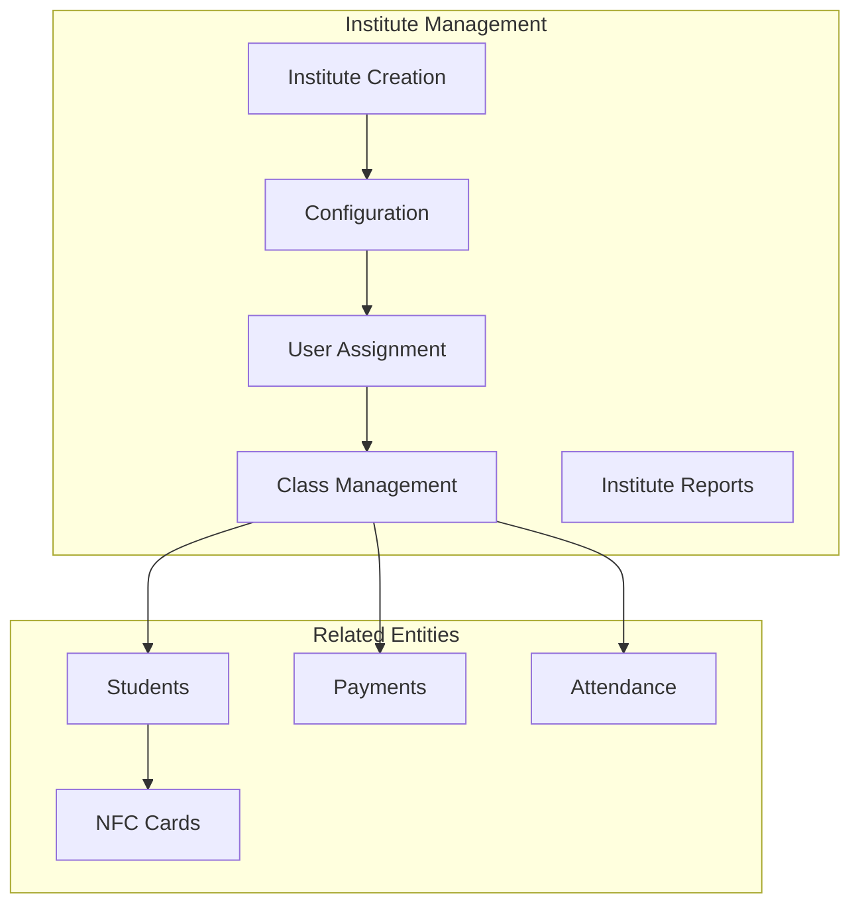
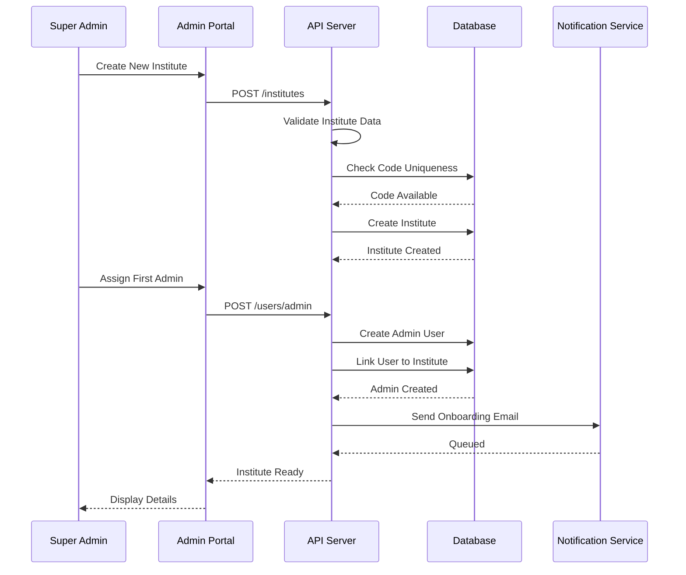
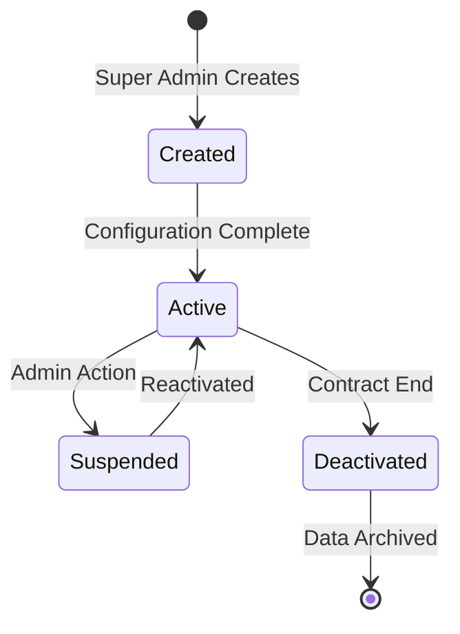
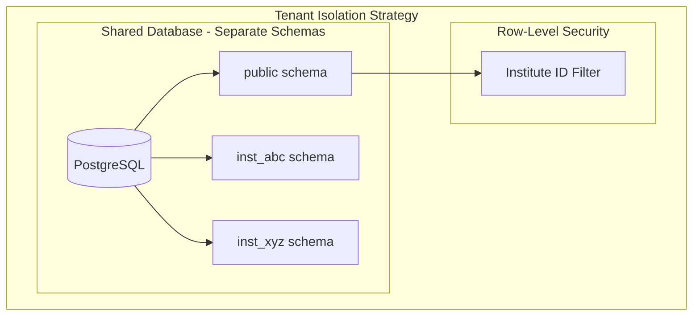
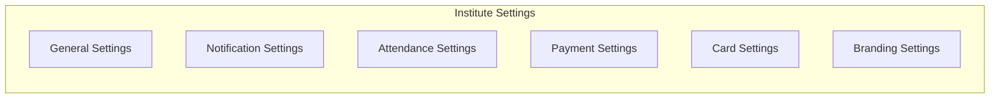
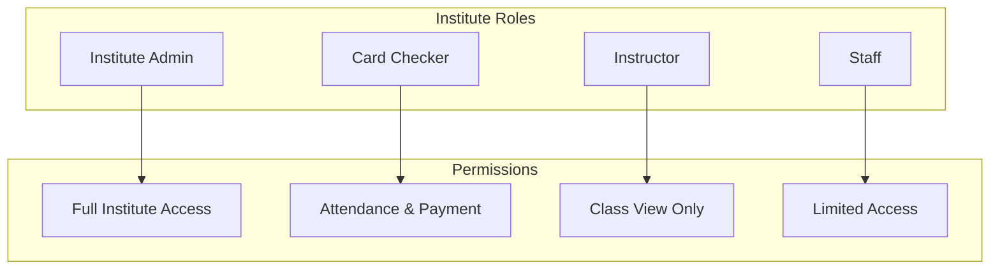
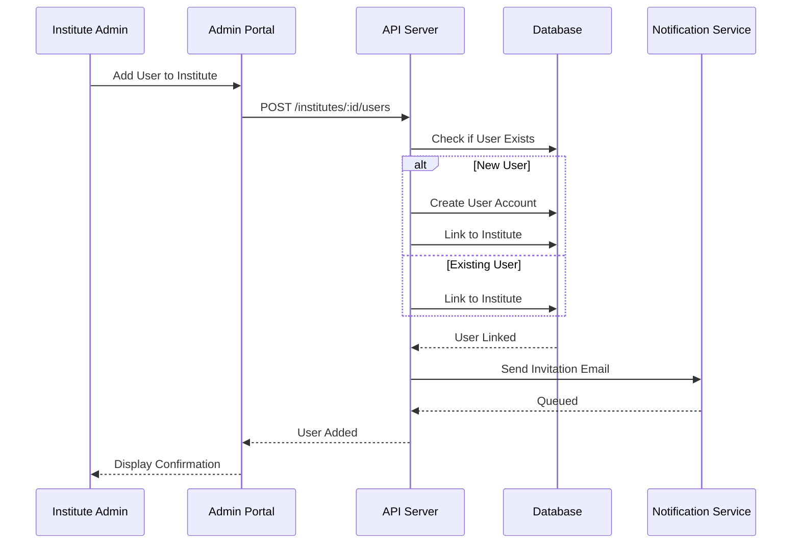
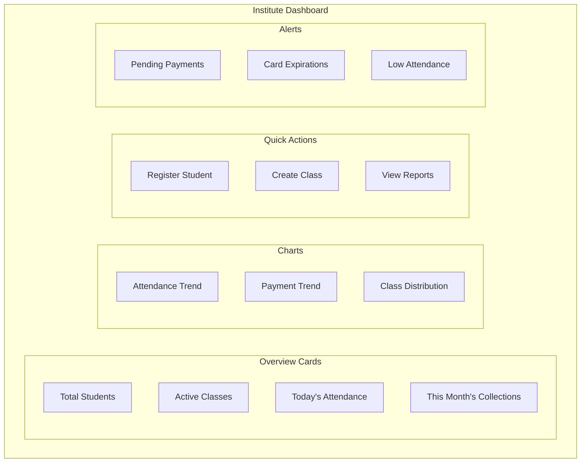
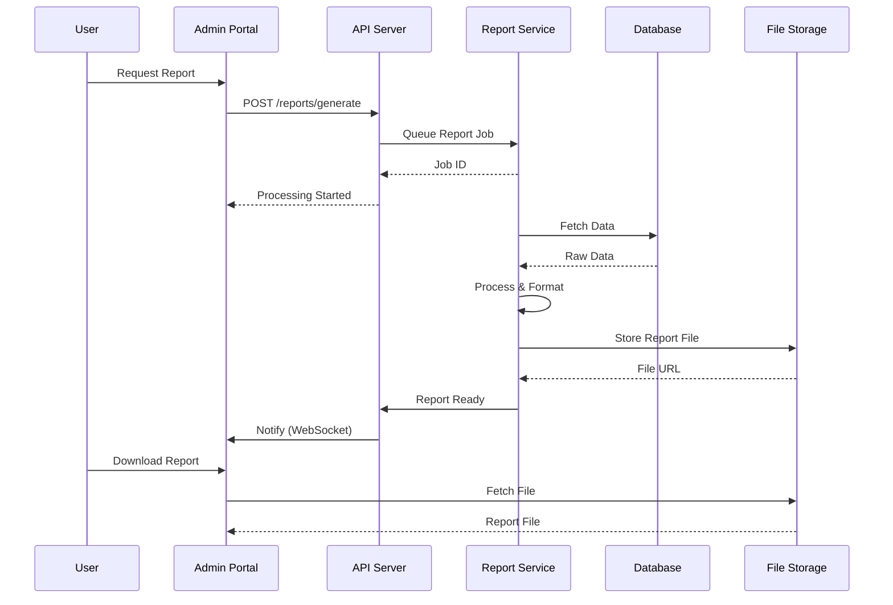

# 🏫 Institute Management Module

> Multi-institute support and configuration management for AMS

## 1. Module Overview

The Institute Management module enables the AMS to support multiple educational institutes on a single platform, each with its own configuration, users, classes, and students.



## 2. Institute Data Model

### 2.1 Institute Entity

```typescript
interface Institute {
  id: string;
  name: string;
  code: string;           // Unique identifier (e.g., "ABC001")
  address: string;
  phone: string;
  email: string;
  logoUrl?: string;
  website?: string;
  
  settings: InstituteSettings;
  
  isActive: boolean;
  createdAt: Date;
  updatedAt: Date;
}

interface InstituteSettings {
  // General
  timezone: string;
  dateFormat: string;
  currency: string;
  
  // Branding
  primaryColor: string;
  secondaryColor: string;
  
  // Notifications
  notifications: {
    smsEnabled: boolean;
    emailEnabled: boolean;
    smsProvider?: string;
    emailFromAddress?: string;
    emailFromName?: string;
  };
  
  // Attendance
  attendance: {
    lateThresholdMinutes: number;
    allowManualEntry: boolean;
    requirePhoto: boolean;
  };
  
  // Payment
  payment: {
    acceptedMethods: PaymentMethod[];
    reminderDaysBefore: number;
    autoGenerateReceipts: boolean;
  };
  
  // Cards
  cards: {
    autoExpireMonths: number;
    allowReplacement: boolean;
    requirePhotoOnCard: boolean;
  };
}
```

## 3. Institute Lifecycle

### 3.1 Institute Creation Flow



### 3.2 Institute States



## 4. Multi-Tenancy Architecture

### 4.1 Data Isolation



### 4.2 Institute Scoping

```typescript
// Middleware for institute scoping
async function instituteScope(req: Request, res: Response, next: NextFunction) {
  const instituteId = req.headers['x-institute-id'] as string;
  
  if (!instituteId) {
    // Check if endpoint requires institute scope
    if (requiresInstituteScope(req.path)) {
      return res.status(400).json({ error: 'Institute ID required' });
    }
    return next();
  }
  
  // Validate institute exists and is active
  const institute = await Institute.findOne({
    where: { id: instituteId, isActive: true }
  });
  
  if (!institute) {
    return res.status(404).json({ error: 'Institute not found' });
  }
  
  // Verify user has access to this institute
  if (req.user.role !== 'super_admin') {
    const membership = await InstituteUser.findOne({
      where: { userId: req.user.id, instituteId, isActive: true }
    });
    
    if (!membership) {
      return res.status(403).json({ error: 'Access denied' });
    }
    
    req.instituteRole = membership.role;
  }
  
  req.institute = institute;
  next();
}
```

## 5. Institute Configuration

### 5.1 Settings Categories



### 5.2 Default Configuration

```typescript
const defaultInstituteSettings: InstituteSettings = {
  timezone: 'Asia/Colombo',
  dateFormat: 'DD/MM/YYYY',
  currency: 'LKR',
  
  primaryColor: '#1976D2',
  secondaryColor: '#424242',
  
  notifications: {
    smsEnabled: true,
    emailEnabled: true,
    smsProvider: 'twilio',
    emailFromAddress: 'noreply@ams.com',
    emailFromName: 'AMS Notification'
  },
  
  attendance: {
    lateThresholdMinutes: 15,
    allowManualEntry: true,
    requirePhoto: false
  },
  
  payment: {
    acceptedMethods: ['cash', 'card', 'bank_transfer'],
    reminderDaysBefore: 3,
    autoGenerateReceipts: true
  },
  
  cards: {
    autoExpireMonths: 12,
    allowReplacement: true,
    requirePhotoOnCard: true
  }
};
```

## 6. Institute User Management

### 6.1 User Roles within Institute



### 6.2 User Assignment Flow



## 7. Institute Dashboard

### 7.1 Dashboard Components



### 7.2 Statistics API Response

```json
{
  "institute": {
    "id": "uuid",
    "name": "ABC Institute"
  },
  "overview": {
    "totalStudents": 450,
    "activeStudents": 425,
    "newStudentsThisMonth": 15,
    "totalClasses": 25,
    "activeClasses": 22
  },
  "attendance": {
    "today": {
      "total": 350,
      "present": 320,
      "late": 20,
      "absent": 10,
      "rate": 91.43
    },
    "thisWeek": {
      "averageRate": 89.5
    },
    "thisMonth": {
      "averageRate": 88.2
    }
  },
  "payments": {
    "thisMonth": {
      "collected": 1250000.00,
      "expected": 1500000.00,
      "pending": 250000.00,
      "collectionRate": 83.33
    },
    "trend": [
      { "month": "January", "amount": 1400000 },
      { "month": "February", "amount": 1250000 }
    ]
  },
  "alerts": [
    {
      "type": "payment_overdue",
      "count": 35,
      "message": "35 students have overdue payments"
    },
    {
      "type": "card_expiring",
      "count": 12,
      "message": "12 cards expiring in 30 days"
    }
  ]
}
```

## 8. Institute Reports

### 8.1 Available Reports

| Report | Description | Access Level |
|--------|-------------|--------------|
| Student Roster | All enrolled students | Admin |
| Attendance Summary | Daily/Weekly/Monthly attendance | Admin, Instructor |
| Payment Summary | Collection reports | Admin |
| Outstanding Dues | Pending payments list | Admin |
| Class Performance | Per-class statistics | Admin, Instructor |
| Card Status | NFC card inventory | Admin |

### 8.2 Report Generation Flow



## 9. Institute API Endpoints

| Endpoint | Method | Description | Access |
|----------|--------|-------------|--------|
| `/institutes` | GET | List all institutes | Super Admin |
| `/institutes` | POST | Create institute | Super Admin |
| `/institutes/:id` | GET | Get institute details | Admin |
| `/institutes/:id` | PUT | Update institute | Admin |
| `/institutes/:id` | DELETE | Deactivate institute | Super Admin |
| `/institutes/:id/settings` | GET | Get settings | Admin |
| `/institutes/:id/settings` | PUT | Update settings | Admin |
| `/institutes/:id/users` | GET | List users | Admin |
| `/institutes/:id/users` | POST | Add user | Admin |
| `/institutes/:id/stats` | GET | Get statistics | Admin |
| `/institutes/:id/reports` | GET | List reports | Admin |

## 10. Best Practices

### 10.1 Institute Setup Checklist

- [ ] Basic information configured
- [ ] Logo and branding uploaded
- [ ] Timezone and locale set
- [ ] Notification settings configured
- [ ] At least one admin assigned
- [ ] Payment methods configured
- [ ] Card settings reviewed
- [ ] First class created
- [ ] Test student registered

### 10.2 Ongoing Management

- [ ] Regular user access review
- [ ] Monthly report generation
- [ ] Payment collection monitoring
- [ ] Card expiration tracking
- [ ] Settings review (quarterly)

---

**Previous:** [User Management](./user-management.md) | **Next:** [NFC Card Management](./nfc-card-management.md)

