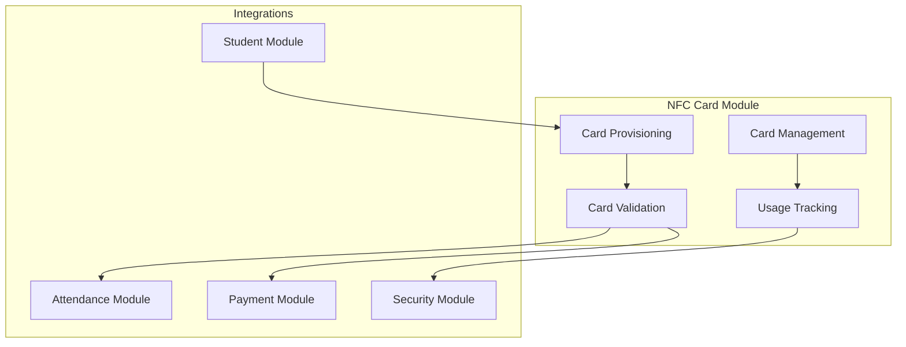
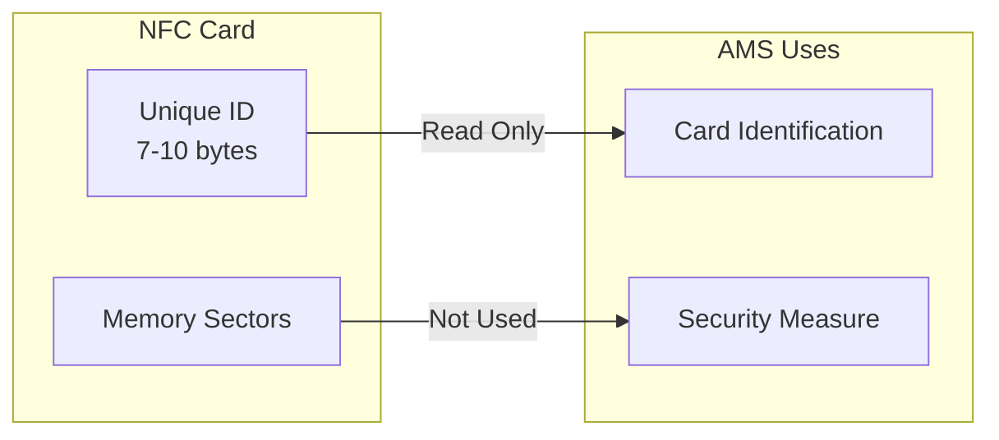
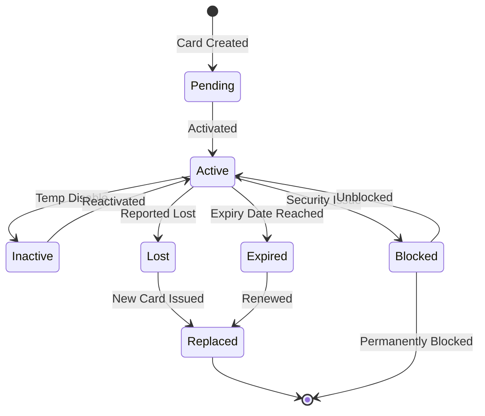
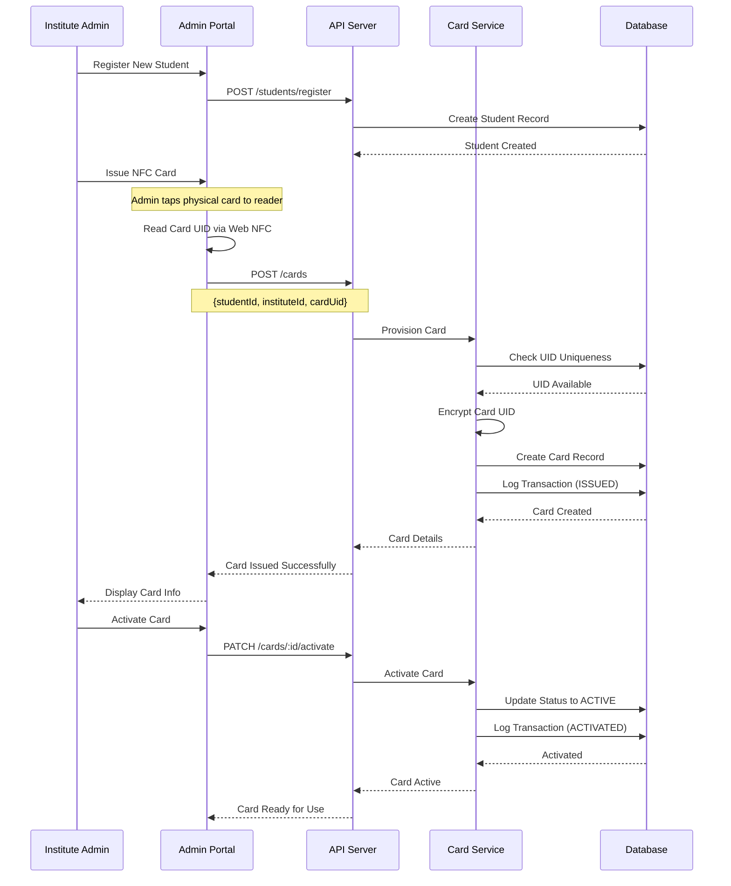
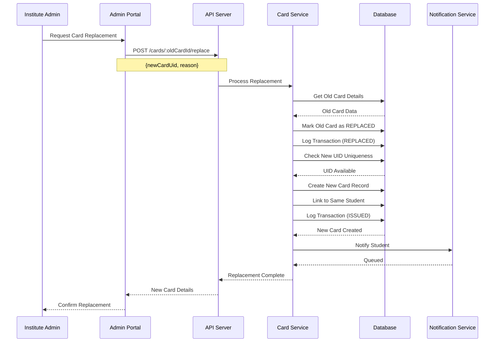
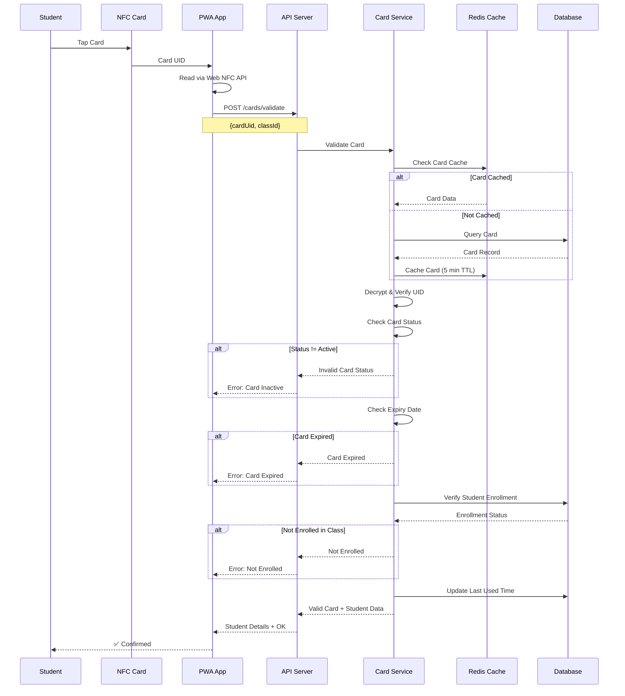
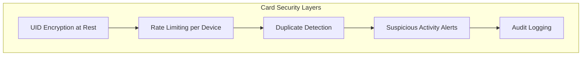
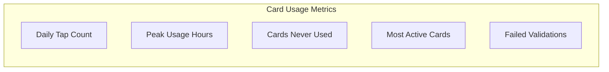

# 💳 NFC Card Management Module

> NFC card provisioning, validation, and lifecycle management for AMS

## 1. Module Overview

The NFC Card Management module handles the complete lifecycle of NFC cards used for student identification, from issuance to retirement. Each student receives a unique NFC card per institute they're enrolled in.



## 2. NFC Technology Overview

### 2.1 Supported NFC Standards

| Standard | Description | Use Case |
|----------|-------------|----------|
| **NFC-A (ISO 14443A)** | Most common, MIFARE compatible | Primary support |
| **NFC-B (ISO 14443B)** | Alternative protocol | Secondary support |
| **NFC-F (FeliCa)** | Sony's standard | Regional support |
| **NFC-V (ISO 15693)** | Vicinity cards | Extended range |

### 2.2 Card Data Structure



> **Security Note:** AMS only uses the card's hardware UID for identification. No sensitive data is written to the card, preventing card cloning from compromising student information.

## 3. Card Data Model

### 3.1 Card Entity

```typescript
interface NFCCard {
  id: string;
  cardUid: string;           // Hardware UID (encrypted at rest)
  studentId: string;
  instituteId: string;
  
  status: CardStatus;
  issuedDate: Date;
  expiryDate?: Date;
  lastUsed?: Date;
  
  issuedBy: string;          // User ID who issued
  notes?: string;
  
  createdAt: Date;
  updatedAt: Date;
}

enum CardStatus {
  PENDING = 'pending',       // Created but not activated
  ACTIVE = 'active',         // Ready for use
  INACTIVE = 'inactive',     // Temporarily disabled
  BLOCKED = 'blocked',       // Permanently blocked
  LOST = 'lost',             // Reported lost
  EXPIRED = 'expired',       // Past expiry date
  REPLACED = 'replaced'      // Replaced by new card
}
```

### 3.2 Card Transaction Log

```typescript
interface CardTransaction {
  id: string;
  nfcCardId: string;
  transactionType: TransactionType;
  performedBy: string;
  details: Record<string, any>;
  createdAt: Date;
}

enum TransactionType {
  ISSUED = 'issued',
  ACTIVATED = 'activated',
  DEACTIVATED = 'deactivated',
  BLOCKED = 'blocked',
  UNBLOCKED = 'unblocked',
  REPLACED = 'replaced',
  EXPIRED = 'expired',
  USED_ATTENDANCE = 'used_attendance',
  USED_PAYMENT = 'used_payment'
}
```

## 4. Card Lifecycle

### 4.1 Lifecycle States



### 4.2 Card Issuance Flow



### 4.3 Card Replacement Flow



## 5. Card Validation

### 5.1 Validation Flow (PWA Check-in)



### 5.2 Validation Response

```typescript
interface CardValidationResponse {
  valid: boolean;
  
  // On success
  student?: {
    id: string;
    studentCode: string;
    firstName: string;
    lastName: string;
    photoUrl?: string;
  };
  
  card?: {
    id: string;
    status: CardStatus;
    expiresAt?: Date;
  };
  
  enrollment?: {
    classId: string;
    className: string;
    status: 'enrolled' | 'dropped';
  };
  
  paymentStatus?: {
    currentMonthPaid: boolean;
    dueAmount: number;
  };
  
  // On failure
  error?: {
    code: string;
    message: string;
  };
}
```

## 6. Web NFC Integration (PWA)

### 6.1 Web NFC API Usage

```typescript
// PWA NFC Reader Service
class NFCReaderService {
  private ndef: NDEFReader | null = null;
  private abortController: AbortController | null = null;

  async checkSupport(): Promise<boolean> {
    if (!('NDEFReader' in window)) {
      console.log('Web NFC not supported');
      return false;
    }
    return true;
  }

  async startReading(onRead: (uid: string) => void): Promise<void> {
    if (!await this.checkSupport()) {
      throw new Error('Web NFC not supported on this device');
    }

    try {
      this.ndef = new NDEFReader();
      this.abortController = new AbortController();

      await this.ndef.scan({ signal: this.abortController.signal });

      this.ndef.addEventListener('reading', (event: NDEFReadingEvent) => {
        const serialNumber = event.serialNumber;
        if (serialNumber) {
          // Format UID as hex string
          const uid = serialNumber.toUpperCase();
          onRead(uid);
        }
      });

      this.ndef.addEventListener('readingerror', () => {
        console.error('Error reading NFC tag');
      });

    } catch (error) {
      if ((error as Error).name === 'NotAllowedError') {
        throw new Error('NFC permission denied');
      }
      throw error;
    }
  }

  stopReading(): void {
    if (this.abortController) {
      this.abortController.abort();
      this.abortController = null;
    }
  }
}
```

### 6.2 PWA Check-in Component

```typescript
// React component for NFC check-in
function NFCCheckIn({ classId }: { classId: string }) {
  const [status, setStatus] = useState<'idle' | 'reading' | 'processing' | 'success' | 'error'>('idle');
  const [student, setStudent] = useState<StudentInfo | null>(null);
  const [error, setError] = useState<string | null>(null);
  
  const nfcReader = useRef(new NFCReaderService());

  const handleCardRead = async (cardUid: string) => {
    setStatus('processing');
    
    try {
      const response = await api.post('/cards/validate', {
        cardUid,
        classId
      });
      
      if (response.data.valid) {
        setStudent(response.data.student);
        setStatus('success');
        
        // Record attendance
        await api.post('/attendance/checkin', {
          cardUid,
          classId
        });
        
        // Reset after 3 seconds
        setTimeout(() => {
          setStudent(null);
          setStatus('reading');
        }, 3000);
      } else {
        setError(response.data.error.message);
        setStatus('error');
      }
    } catch (err) {
      setError('Failed to validate card');
      setStatus('error');
    }
  };

  const startScanning = async () => {
    try {
      await nfcReader.current.startReading(handleCardRead);
      setStatus('reading');
    } catch (err) {
      setError((err as Error).message);
      setStatus('error');
    }
  };

  return (
    <div className="nfc-checkin">
      {status === 'idle' && (
        <button onClick={startScanning}>Start NFC Scanner</button>
      )}
      
      {status === 'reading' && (
        <div className="waiting">
          <NFCIcon className="pulse" />
          <p>Tap student card to check in...</p>
        </div>
      )}
      
      {status === 'processing' && (
        <div className="processing">
          <Spinner />
          <p>Processing...</p>
        </div>
      )}
      
      {status === 'success' && student && (
        <div className="success">
          <CheckIcon />
          
          <h2>{student.firstName} {student.lastName}</h2>
          <p>Checked in successfully!</p>
        </div>
      )}
      
      {status === 'error' && (
        <div className="error">
          <ErrorIcon />
          <p>{error}</p>
          <button onClick={() => setStatus('reading')}>Try Again</button>
        </div>
      )}
    </div>
  );
}
```

## 7. Card Security

### 7.1 Security Measures



### 7.2 Fraud Detection

```typescript
// Suspicious activity detection
async function detectCardFraud(cardUid: string, deviceId: string): Promise<boolean> {
  const recentUsage = await CardTransaction.findAll({
    where: {
      cardUid,
      createdAt: { [Op.gte]: subMinutes(new Date(), 5) }
    },
    order: [['createdAt', 'DESC']]
  });

  // Check 1: Multiple devices using same card
  const uniqueDevices = new Set(recentUsage.map(u => u.details.deviceId));
  if (uniqueDevices.size > 1) {
    await createSecurityAlert({
      type: 'MULTIPLE_DEVICES',
      cardUid,
      severity: 'high'
    });
    return true;
  }

  // Check 2: Rapid successive taps (potential replay attack)
  if (recentUsage.length > 10) {
    await createSecurityAlert({
      type: 'RAPID_USAGE',
      cardUid,
      count: recentUsage.length,
      severity: 'medium'
    });
    return true;
  }

  // Check 3: Usage from impossible locations
  const locations = recentUsage
    .filter(u => u.details.location)
    .map(u => u.details.location);
  
  if (hasImpossibleTravel(locations)) {
    await createSecurityAlert({
      type: 'IMPOSSIBLE_TRAVEL',
      cardUid,
      severity: 'critical'
    });
    return true;
  }

  return false;
}
```

## 8. Card Management API

### 8.1 Endpoints

| Endpoint | Method | Description | Access |
|----------|--------|-------------|--------|
| `/cards` | POST | Issue new card | Admin |
| `/cards/:id` | GET | Get card details | Admin |
| `/cards/validate` | POST | Validate card | Card Checker |
| `/cards/:id/activate` | PATCH | Activate card | Admin |
| `/cards/:id/deactivate` | PATCH | Deactivate card | Admin |
| `/cards/:id/block` | PATCH | Block card | Admin |
| `/cards/:id/unblock` | PATCH | Unblock card | Admin |
| `/cards/:id/replace` | POST | Replace card | Admin |
| `/cards/:id/transactions` | GET | Get card history | Admin |
| `/cards/student/:studentId` | GET | Get student's cards | Admin |

### 8.2 Issue Card Request

```json
POST /cards
{
  "studentId": "uuid",
  "instituteId": "uuid",
  "cardUid": "04:A2:B3:C4:D5:E6:F7",
  "expiryDate": "2027-02-14",
  "notes": "Initial card issuance"
}
```

### 8.3 Validate Card Request

```json
POST /cards/validate
{
  "cardUid": "04:A2:B3:C4:D5:E6:F7",
  "classId": "uuid"
}
```

## 9. Card Reports

### 9.1 Card Inventory Report

```typescript
interface CardInventoryReport {
  institute: {
    id: string;
    name: string;
  };
  summary: {
    total: number;
    active: number;
    inactive: number;
    blocked: number;
    lost: number;
    expired: number;
    expiringIn30Days: number;
  };
  cards: Array<{
    cardUid: string;
    studentName: string;
    status: CardStatus;
    issuedDate: Date;
    expiryDate?: Date;
    lastUsed?: Date;
  }>;
}
```

### 9.2 Usage Analytics



## 10. Best Practices

### 10.1 Card Handling

- ✅ Store cards securely before issuance
- ✅ Verify student identity before issuing
- ✅ Record card UID immediately after reading
- ✅ Test card after activation
- ✅ Document any physical damage

### 10.2 Security Guidelines

- ✅ Never share card UIDs in logs/displays
- ✅ Implement rate limiting on validation
- ✅ Monitor for suspicious patterns
- ✅ Regular audit of card transactions
- ✅ Immediate blocking on fraud detection

---

**Previous:** [Institute Management](./institute-management.md) | **Next:** [Attendance Module](./attendance-module.md)

