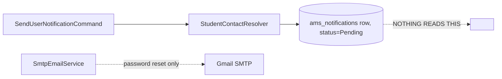
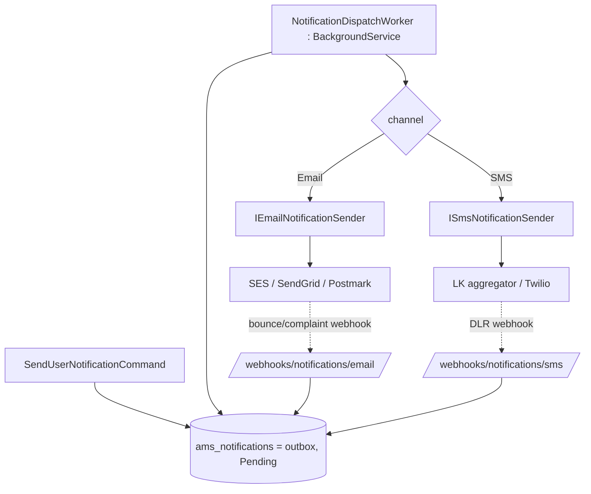

# 📡 Notification Channels — Current State & Industry-Standard Evaluation

> A grounded assessment of how AMS actually sends notifications today, how that compares to
> industry practice for SMS and email, and a phased plan to close the gap. This complements the
> aspirational design in [Notification Service](./notification-service.md) — that document
> describes a target; this one describes **what the code does right now** and what to build next.

## 0. Status & chosen providers (Phases 1–5 shipped)

The delivery gap below has been closed across five phases. Phase 1 (foundation):

- **Providers shipped:** **email** — **Resend** (free to 3k/mo, clean REST API + webhooks) and
  **turboSMTP** (`POST /api/v2/mail/send`, `consumerKey`/`consumerSecret`); **SMS** (Sri-Lanka) —
  **SMSlenz.lk** (`POST /api/send-sms`) and **Text.lk** (`POST /api/v3/sms/send`). All register as
  `INotificationSender` (each carries `Provider`/`DisplayName`/`IsConfigured`); the **active provider
  per channel is chosen at runtime** (see Phase 5), not at DI time.
  Config: `Resend:*`, `TurboSmtp:*`, `SmsLenz:*`, `TextLk:*`, `Notifications:*`, `Fcm:*` in
  `appsettings` (secrets via user-secrets/env; `Sms:Provider` is only the initial default).

- **Phase 5 (admin-managed providers) shipped:** the active email/SMS service is a persisted
  platform setting (`SystemSetting` `notifications.provider.{email,sms}`), resolved per dispatch by
  `INotificationSenderResolver` (falls back to any configured sender if the choice is unset/
  unconfigured). System admins manage it at `GET/PUT /api/notifications/providers`
  (`system:settings:manage`) and the PWA **Settings → Notification Services** page — an expandable
  per-channel panel showing the active provider, a provider switcher (un-configured ones disabled),
  and **messages sent this month** overall and per provider (`Notification.Provider` is stamped on
  send; counts via `CountSinceAsync`/`CountByProviderSinceAsync`).
- **Provider abstraction + outbox worker shipped:** `INotificationSender` per channel
  (`ResendEmailSender`, `TextLkSmsSender`, typed `HttpClient`s) drained by
  `NotificationDispatchWorker` (`AMS.Infrastructure/BackgroundServices/`), which dispatches
  `Pending`/retryable rows and transitions status with `RetryCount` backoff. Opt-in via
  `Notifications:DispatchEnabled` (off in dev/CI).
- **Per-institute configurability shipped:** `ams_institute_notification_settings` (event×channel
  matrix) + `INotificationPolicy`, which gates every send against the platform kill-switch, the
  institute matrix, and the recipient's opt-out (`UserPreference.Notifications`). Managed at
  `GET/PUT /api/notifications/settings` (`notifications:manage`) and the PWA **Settings →
  Institute Notifications** page.

**Phase 2 (event triggers) shipped:** business events auto-enqueue through a reusable
`INotificationTrigger` (fans out to email + SMS; the policy/resolver decide what is actually
queued). Wired: **fee paid** (`RecordPaymentCommand` → `PaymentConfirmation`), **low attendance**
(`LowAttendanceAlertWorker` → `Attendance`, replacing its old direct InApp write), **card
blocked/expired/replaced** (`BlockCardCommand`, `CardExpiryWorker`, `ReplaceCardCommand` →
`CardStatus`), and **fee reminders/overdue** (`PaymentReminderWorker` — a daily scan that nudges
unpaid students a few days before each Monthly fee's due day and again after, once each per month
via exact-day matching). `SendUserNotificationCommand` takes an explicit `InstituteId` so
worker/trigger callers gate against the right institute matrix.

**Phase 3 (delivery receipts + governance) shipped:** notifications carry the provider message id
(`provider_message_id`) captured on send; `POST /api/webhooks/notifications/{resend,textlk}`
(shared-secret guarded, anonymous) map provider events to `MarkAsDelivered`/`MarkAsFailed`
idempotently via `RecordNotificationDeliveryCommand` (Resend, turboSMTP, SMSlenz, and Text.lk endpoints).
The dispatch worker now honours **quiet
hours** (defers SMS in a configured window) and a **per-institute per-tick rate cap**
(`institute_id` is persisted on each notification).

**Phase 4 (channels) shipped:** `InAppNotificationSender` (the stored row is the in-app delivery)
and `PushNotificationSender` (FCM legacy HTTP behind `Fcm:ServerKey`) round out all four
`NotificationChannel` values; both are registered and selected by the dispatch worker.

**Still external / future:** SMSlenz **Sender-ID registration** + live `user_id`/`api_key` (and
Resend domain verification) are operational steps, not code. The SMSlenz delivery-report webhook
(`POST /api/webhooks/notifications/smslenz`, correlating on `campaign_id`) ships, but its exact
payload field names should be confirmed against the SMSlenz dashboard's callback settings. Production should add Resend **Svix HMAC**
signature verification alongside the shared-secret check, migrate push to **FCM HTTP v1**
(OAuth2), and add message **templating + Sinhala/Tamil/English i18n** (the senders currently send
the trigger's plain content). Reminder scanning covers **Monthly** fees with a due day.

## 1. Contact resolution & the per-enrollment preference

Every outbound message is addressed by `StudentContactResolver`
(`AMS.Infrastructure/Services/Identity/StudentContactResolver.cs`), which turns a `userId` +
`NotificationChannel` into a concrete recipient. Many students (especially younger ones) have no
email or phone of their own, so the resolver falls back to a linked guardian.

Each enrollment now carries a **notification-contact preference**
(`StudentEnrollment.NotificationContactPreference`, column `notification_contact_preference`):

| Preference | Behaviour |
|------------|-----------|
| `Auto` (default) | Student's own contact if reachable on the channel, otherwise a guardian. |
| `Student` | Prefer the student's own contact; fall back to a guardian if unreachable. |
| `Guardian` | Prefer a guardian's contact; fall back to the student if unreachable. |

The preference is **per enrollment**, so each institute controls routing for the same person
independently — consistent with the multi-tenant model. The resolver reads it via
`IInstituteContext`; when there is no institute in scope (system-level callers) it defaults to
`Auto`, preserving prior behaviour. **Reachability always wins**: an unreachable preferred side
falls through to the other rather than dropping the message, mirroring the PWA enrollment form's
rule that every student must have at least one reachable destination (own email/mobile or a
primary guardian with a phone/email).

A student's own **mobile** is optional and stored on `ApplicationUser.PhoneNumber`; it is
collected on the enrollment form and editable afterwards.

## 2. Current state of the transport (the honest picture)

- `SendUserNotificationCommand` resolves the contact, then **persists a `Notification` row with
  `Status = Pending`** (`AMS.Domain/Entities/Notification/Entity/Notification.cs`). The entity
  already models the full lifecycle — `MarkAsSent`, `MarkAsDelivered`, `MarkAsFailed`,
  `RetryCount`, `SentAt`, `DeliveredAt`, `ErrorMessage`.
- **No process ever dispatches those rows.** There is no SMS provider, no dispatch worker, and
  no DLR handling. Rows accumulate in `Pending` forever.
- The only real transport is `SmtpEmailService` (Gmail SMTP), used **only** for password-reset
  and similar identity emails — it is not wired to the `Notification` pipeline.
- Background workers exist for other concerns (`AMS.Infrastructure/BackgroundServices/` —
  card expiry, attendance, identity matching) and are the right template for a dispatch worker,
  but none currently send notifications.

**Conclusion:** the *data model* is close to industry standard; the *delivery layer is absent.*

## 3. Gap analysis vs. industry standard

| Capability | Industry standard | AMS today |
|---|---|---|
| Decoupled send (enqueue → dispatch) | Transactional outbox / queue + worker | ❌ row written, never sent |
| Provider abstraction | `ISender` per channel, swappable | ❌ none (SMTP hard-wired for auth only) |
| Retries & backoff | Exponential backoff, max attempts, DLQ | ⚠️ `RetryCount` field exists, unused |
| Delivery receipts (DLR) | Provider webhook → Delivered/Failed | ❌ none |
| Idempotency | Dedupe key prevents double-send | ❌ none |
| Consent / opt-out | STOP handling, per-type opt-out | ⚠️ `UserPreference` flags exist, not enforced at send |
| Quiet hours / rate limits | Defer & throttle per tenant | ❌ none |
| Templating & i18n | Versioned templates, Sinhala/Tamil/English | ⚠️ `EmailTemplate` entity exists; no SMS templates |
| Sender identity & deliverability | SPF/DKIM/DMARC; registered SMS mask/sender ID | ⚠️ Gmail SMTP only |
| Observability | Delivery/failure metrics, alerting | ❌ logs only |

## 4. Recommended target architecture (.NET-native)

1. **Transactional outbox.** Keep `ams_notifications` as the outbox; rows are written in the same
   transaction as the triggering change (already the case). This guarantees "persist then send"
   with no lost messages.
2. **`NotificationDispatchWorker`** — a `BackgroundService` (same pattern as the existing
   workers) that polls `Pending` (`FOR UPDATE SKIP LOCKED` or a claim column to allow scaling),
   dispatches, and transitions status. Reuse the existing `RetryCount` with exponential backoff
   and a terminal `Failed`/dead-letter state after N attempts.
3. **`INotificationSender` per channel.** One interface, a `Sms` and an `Email` implementation.
   `IEmailService` already provides the email seam; generalise it to send templated content, not
   just password resets.
4. **Providers.**
   - **Email:** move transactional mail to a deliverability-focused provider (Amazon SES,
     SendGrid, or Postmark) with SPF/DKIM/DMARC on `classpass.lk`, plus bounce/complaint
     webhooks. Keep SMTP as a dev fallback.
   - **SMS (Sri Lanka):** local aggregators (e.g. Text.lk / Notify.lk, or direct Dialog/Mobitel/
     Hutch enterprise SMS) give cheaper local rates and a registered alphanumeric sender mask,
     but require sender-ID/mask registration and have per-operator quirks. Global providers
     (Twilio, Vonage) are faster to integrate and offer DLR webhooks out of the box but cost
     more per message and need sender-ID provisioning for LK. Recommend an aggregator for
     production volume with a provider interface so Twilio can be a fallback.
5. **Delivery receipts.** Add `/webhooks/notifications/{sms,email}` endpoints that map
   provider callbacks to `MarkAsDelivered` / `MarkAsFailed` via a stored provider message id
   (use `Notification.Metadata`, which already carries `contactSource`).
6. **Consent, opt-out & quiet hours.** Enforce the existing `UserPreference` notification flags
   at dispatch time; honour SMS STOP replies; defer non-urgent messages outside quiet hours;
   apply per-tenant rate limits.
7. **Templating & i18n.** Extend `EmailTemplate` to cover SMS bodies (160-char awareness) and add
   Sinhala/Tamil/English variants keyed by recipient/institute locale.
8. **Observability.** Emit delivery/failure/latency metrics per channel and per tenant; alert on
   rising failure rates and growing `Pending` backlog.

## 5. Phased rollout

1. **Phase 1 — Email delivery online.** `NotificationDispatchWorker` + generalised
   `IEmailNotificationSender` on a real provider with retries. Notifications stop dying as
   `Pending`.
2. **Phase 2 — SMS + DLR.** Add `ISmsNotificationSender` (LK aggregator), provider message-id
   capture, and delivery webhooks.
3. **Phase 3 — Governance.** Enforce consent/opt-out, quiet hours, per-tenant rate limits;
   add templating + localization.
4. **Phase 4 — Push / in-app.** Implement the remaining `NotificationChannel` values.

Until Phase 1 ships, treat persisted `Pending` notifications as an audit log only — they are
**not** being delivered to students or guardians.

---

**Previous:** [Notification Service](./notification-service.md) | **Next:** [User Management](./user-management.md)
