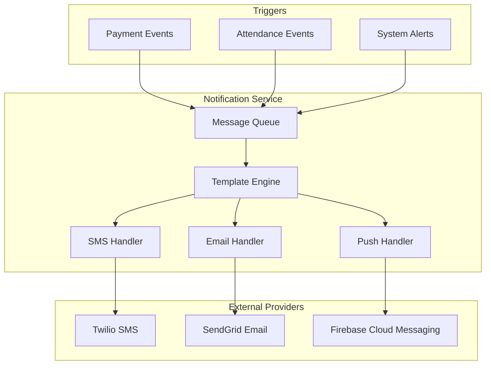
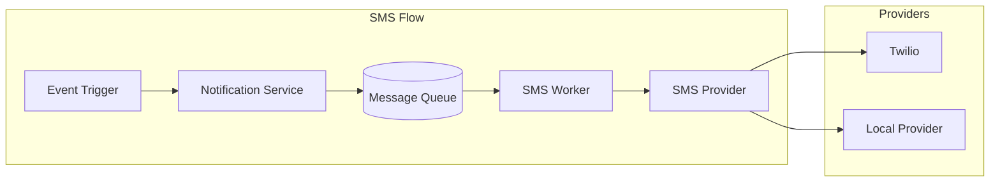
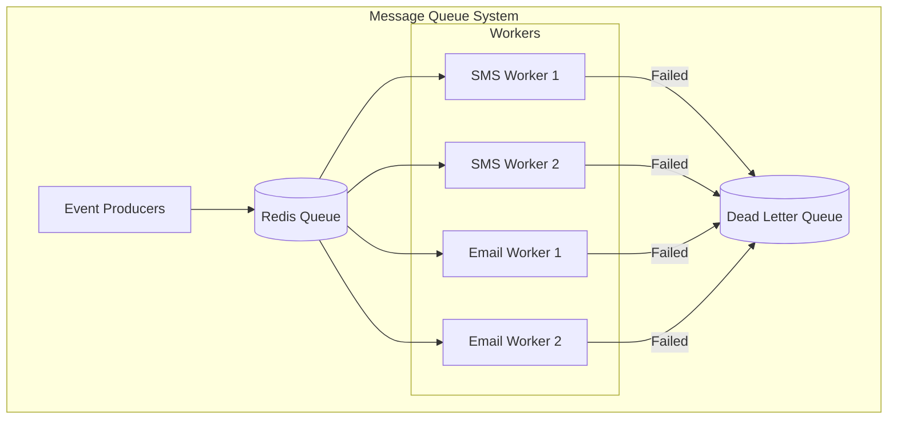
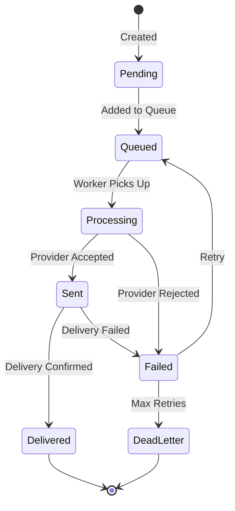

# 📧 Notification Service

> SMS and Email notification management for AMS

## 1. Module Overview

The Notification Service handles all outbound communications including SMS messages for payment confirmations, email notifications, and in-app alerts.



## 2. Notification Types

### 2.1 Notification Categories

| Category | Triggers | Channels |
|----------|----------|----------|
| Payment Confirmation | Payment recorded | SMS, Email |
| Payment Reminder | Days before due date | SMS, Email |
| Payment Overdue | Days after due date | SMS, Email |
| Attendance Alert | Low attendance pattern | Email, In-app |
| Card Status | Card blocked/expired | SMS, Email |
| System Alert | Security events | Email, In-app |

### 2.2 Notification Entity

```typescript
interface Notification {
  id: string;
  userId?: string;
  type: NotificationType;
  channel: NotificationChannel;
  recipient: string;           // Phone number or email
  subject?: string;            // For emails
  content: string;
  status: NotificationStatus;
  metadata: Record<string, any>;
  
  retryCount: number;
  sentAt?: Date;
  deliveredAt?: Date;
  errorMessage?: string;
  
  createdAt: Date;
}

enum NotificationType {
  PAYMENT_CONFIRMATION = 'payment_confirmation',
  PAYMENT_REMINDER = 'payment_reminder',
  PAYMENT_OVERDUE = 'payment_overdue',
  ATTENDANCE_ALERT = 'attendance_alert',
  CARD_STATUS = 'card_status',
  SYSTEM_ALERT = 'system_alert',
  GENERAL = 'general'
}

enum NotificationChannel {
  SMS = 'sms',
  EMAIL = 'email',
  PUSH = 'push',
  IN_APP = 'in_app'
}

enum NotificationStatus {
  PENDING = 'pending',
  SENT = 'sent',
  DELIVERED = 'delivered',
  FAILED = 'failed',
  CANCELLED = 'cancelled'
}
```

## 3. SMS Integration

### 3.1 SMS Architecture



### 3.2 SMS Service Implementation

```typescript
class SMSService {
  private providers: Map<string, SMSProvider> = new Map();
  private defaultProvider: string;

  constructor(config: SMSConfig) {
    // Initialize Twilio
    if (config.twilio) {
      this.providers.set('twilio', new TwilioProvider(config.twilio));
    }
    
    // Initialize local provider
    if (config.localProvider) {
      this.providers.set('local', new LocalSMSProvider(config.localProvider));
    }
    
    this.defaultProvider = config.defaultProvider || 'twilio';
  }

  async send(message: SMSMessage): Promise<SMSResult> {
    const provider = this.providers.get(this.defaultProvider);
    
    if (!provider) {
      throw new Error('SMS provider not configured');
    }

    try {
      const result = await provider.send({
        to: message.to,
        body: message.body,
        from: message.from
      });

      await this.logNotification({
        type: message.type,
        channel: 'sms',
        recipient: message.to,
        content: message.body,
        status: 'sent',
        metadata: { providerId: result.id }
      });

      return result;
    } catch (error) {
      await this.logNotification({
        type: message.type,
        channel: 'sms',
        recipient: message.to,
        content: message.body,
        status: 'failed',
        errorMessage: error.message
      });

      // Try fallback provider
      if (this.providers.has('local') && this.defaultProvider !== 'local') {
        return this.sendWithFallback(message, 'local');
      }

      throw error;
    }
  }
}
```

### 3.3 SMS Templates

```typescript
const smsTemplates = {
  payment_confirmation: {
    template: `[{instituteName}] Payment received!
Student: {studentName}
Amount: {currency}{amount}
Class: {className}
Receipt: {receiptNumber}
Thank you!`,
    maxLength: 160,
    variables: ['instituteName', 'studentName', 'amount', 'currency', 'className', 'receiptNumber']
  },

  payment_reminder: {
    template: `[{instituteName}] Reminder
Fee due for {studentName}
Amount: {currency}{amount}
Due: {dueDate}
Class: {className}`,
    maxLength: 160,
    variables: ['instituteName', 'studentName', 'amount', 'currency', 'dueDate', 'className']
  },

  payment_overdue: {
    template: `[{instituteName}] OVERDUE
Fee overdue for {studentName}
Amount: {currency}{amount}
Days overdue: {daysOverdue}
Please pay immediately.`,
    maxLength: 160,
    variables: ['instituteName', 'studentName', 'amount', 'currency', 'daysOverdue']
  }
};
```

## 4. Email Integration

### 4.1 Email Service Implementation

```typescript
class EmailService {
  private transporter: nodemailer.Transporter;
  private templateEngine: Handlebars;

  constructor(config: EmailConfig) {
    this.transporter = nodemailer.createTransport({
      host: config.smtp.host,
      port: config.smtp.port,
      secure: config.smtp.secure,
      auth: {
        user: config.smtp.user,
        pass: config.smtp.password
      }
    });

    this.templateEngine = Handlebars.create();
    this.loadTemplates();
  }

  async send(email: EmailMessage): Promise<EmailResult> {
    const template = this.templates.get(email.template);
    
    if (!template) {
      throw new Error(`Email template not found: ${email.template}`);
    }

    const html = this.templateEngine.compile(template.html)(email.data);
    const text = this.templateEngine.compile(template.text)(email.data);

    try {
      const result = await this.transporter.sendMail({
        from: email.from || this.defaultFrom,
        to: email.to,
        subject: this.templateEngine.compile(template.subject)(email.data),
        html,
        text,
        attachments: email.attachments
      });

      await this.logNotification({
        type: email.type,
        channel: 'email',
        recipient: email.to,
        subject: template.subject,
        content: text,
        status: 'sent',
        metadata: { messageId: result.messageId }
      });

      return { success: true, messageId: result.messageId };
    } catch (error) {
      await this.logNotification({
        type: email.type,
        channel: 'email',
        recipient: email.to,
        status: 'failed',
        errorMessage: error.message
      });

      throw error;
    }
  }
}
```

### 4.2 Email Templates

```html
<!-- Payment Confirmation Email Template -->
<!DOCTYPE html>
<html>
<head>
  <meta charset="utf-8">
  <style>
    body {
      font-family: Arial, sans-serif;
      line-height: 1.6;
      color: #333;
    }
    .container {
      max-width: 600px;
      margin: 0 auto;
      padding: 20px;
    }
    .header {
      background: #1976D2;
      color: white;
      padding: 20px;
      text-align: center;
    }
    .receipt {
      background: #f5f5f5;
      padding: 20px;
      margin: 20px 0;
      border-radius: 8px;
    }
    .amount {
      font-size: 28px;
      color: #2e7d32;
      font-weight: bold;
    }
    .footer {
      text-align: center;
      color: #666;
      font-size: 12px;
      margin-top: 30px;
    }
  </style>
</head>
<body>
  <div class="container">
    <div class="header">
      <h1>{{instituteName}}</h1>
      <p>Payment Confirmation</p>
    </div>
    
    <p>Dear {{guardianName}},</p>
    
    <p>We have received your payment. Here are the details:</p>
    
    <div class="receipt">
      <table width="100%">
        <tr>
          <td><strong>Student:</strong></td>
          <td>{{studentName}} ({{studentCode}})</td>
        </tr>
        <tr>
          <td><strong>Class:</strong></td>
          <td>{{className}}</td>
        </tr>
        <tr>
          <td><strong>Period:</strong></td>
          <td>{{period}}</td>
        </tr>
        <tr>
          <td><strong>Amount:</strong></td>
          <td class="amount">{{currency}}{{amount}}</td>
        </tr>
        <tr>
          <td><strong>Receipt No:</strong></td>
          <td>{{receiptNumber}}</td>
        </tr>
        <tr>
          <td><strong>Date:</strong></td>
          <td>{{paymentDate}}</td>
        </tr>
        <tr>
          <td><strong>Method:</strong></td>
          <td>{{paymentMethod}}</td>
        </tr>
      </table>
    </div>
    
    <p>Thank you for your prompt payment!</p>
    
    <div class="footer">
      <p>This is an automated message from {{instituteName}}.</p>
      <p>If you have questions, please contact us at {{instituteEmail}}</p>
    </div>
  </div>
</body>
</html>
```

## 5. Message Queue System

### 5.1 Queue Architecture



### 5.2 Queue Implementation (Bull)

```typescript
import Bull from 'bull';

// Create queues
const smsQueue = new Bull('sms', {
  redis: redisConfig,
  defaultJobOptions: {
    attempts: 3,
    backoff: {
      type: 'exponential',
      delay: 2000
    },
    removeOnComplete: true,
    removeOnFail: false
  }
});

const emailQueue = new Bull('email', {
  redis: redisConfig,
  defaultJobOptions: {
    attempts: 3,
    backoff: {
      type: 'exponential',
      delay: 5000
    }
  }
});

// Process SMS jobs
smsQueue.process(async (job) => {
  const { to, body, type, metadata } = job.data;
  
  const smsService = new SMSService(smsConfig);
  await smsService.send({ to, body, type, metadata });
  
  return { success: true };
});

// Process Email jobs
emailQueue.process(async (job) => {
  const { to, template, data, type } = job.data;
  
  const emailService = new EmailService(emailConfig);
  await emailService.send({ to, template, data, type });
  
  return { success: true };
});

// Handle failures
smsQueue.on('failed', async (job, error) => {
  console.error(`SMS job ${job.id} failed:`, error.message);
  
  if (job.attemptsMade >= job.opts.attempts) {
    // Move to dead letter queue for manual review
    await deadLetterQueue.add({
      originalQueue: 'sms',
      jobData: job.data,
      error: error.message,
      failedAt: new Date()
    });
  }
});
```

## 6. Notification Scheduling

### 6.1 Scheduled Notifications

```typescript
// Payment reminder scheduler
class PaymentReminderScheduler {
  async scheduleReminders(): Promise<void> {
    const institutes = await Institute.findAll({ where: { isActive: true } });
    
    for (const institute of institutes) {
      const settings = institute.settings.notifications;
      
      if (!settings.paymentReminder) continue;
      
      const reminderDays = settings.paymentReminder.daysBefore;
      
      for (const daysBefore of reminderDays) {
        const targetDate = addDays(new Date(), daysBefore);
        const studentsWithDues = await this.getStudentsWithDuesOn(
          institute.id, 
          targetDate
        );
        
        for (const student of studentsWithDues) {
          await this.queueReminder(student, institute, targetDate);
        }
      }
    }
  }

  private async queueReminder(
    student: StudentWithDues, 
    institute: Institute, 
    dueDate: Date
  ): Promise<void> {
    const template = smsTemplates.payment_reminder;
    
    const content = this.renderTemplate(template.template, {
      instituteName: institute.name,
      studentName: student.name,
      amount: student.dueAmount,
      currency: institute.settings.currency,
      dueDate: formatDate(dueDate),
      className: student.className
    });
    
    await smsQueue.add({
      to: student.guardianPhone,
      body: content,
      type: 'payment_reminder',
      metadata: {
        studentId: student.id,
        instituteId: institute.id
      }
    });
  }
}

// Run daily at 9 AM
schedule.scheduleJob('0 9 * * *', async () => {
  const scheduler = new PaymentReminderScheduler();
  await scheduler.scheduleReminders();
});
```

## 7. Notification Preferences

### 7.1 User Notification Settings

```typescript
interface UserNotificationPreferences {
  userId: string;
  
  channels: {
    sms: boolean;
    email: boolean;
    push: boolean;
    inApp: boolean;
  };
  
  types: {
    paymentConfirmation: boolean;
    paymentReminder: boolean;
    paymentOverdue: boolean;
    attendanceAlert: boolean;
    cardStatus: boolean;
    systemAlert: boolean;
  };
  
  quietHours?: {
    enabled: boolean;
    startTime: string;  // "22:00"
    endTime: string;    // "08:00"
  };
}
```

### 7.2 Preference-aware Sending

```typescript
async function sendNotificationWithPreferences(
  notification: NotificationRequest
): Promise<void> {
  const user = await User.findById(notification.userId);
  const preferences = await UserNotificationPreferences.findOne({
    where: { userId: user.id }
  });
  
  // Check if notification type is enabled
  if (preferences && !preferences.types[notification.type]) {
    console.log(`User ${user.id} has disabled ${notification.type} notifications`);
    return;
  }
  
  // Check quiet hours
  if (preferences?.quietHours?.enabled && isQuietHours(preferences.quietHours)) {
    // Queue for later
    const sendAt = getNextActiveTime(preferences.quietHours);
    await notificationQueue.add(notification, { delay: sendAt.getTime() - Date.now() });
    return;
  }
  
  // Send through enabled channels
  const promises = [];
  
  if (preferences?.channels.sms !== false && notification.phone) {
    promises.push(smsQueue.add({ ...notification, channel: 'sms' }));
  }
  
  if (preferences?.channels.email !== false && notification.email) {
    promises.push(emailQueue.add({ ...notification, channel: 'email' }));
  }
  
  await Promise.all(promises);
}
```

## 8. Delivery Tracking

### 8.1 Delivery Status Flow



### 8.2 Delivery Webhooks (Twilio)

```typescript
// Twilio delivery status webhook
app.post('/webhooks/twilio/status', async (req, res) => {
  const { MessageSid, MessageStatus, To, ErrorCode, ErrorMessage } = req.body;
  
  const notification = await Notification.findOne({
    where: { 'metadata.providerId': MessageSid }
  });
  
  if (!notification) {
    return res.status(404).send('Notification not found');
  }
  
  let status: NotificationStatus;
  
  switch (MessageStatus) {
    case 'delivered':
      status = NotificationStatus.DELIVERED;
      break;
    case 'failed':
    case 'undelivered':
      status = NotificationStatus.FAILED;
      break;
    default:
      status = notification.status;
  }
  
  await notification.update({
    status,
    deliveredAt: status === NotificationStatus.DELIVERED ? new Date() : null,
    errorMessage: ErrorMessage || null,
    metadata: {
      ...notification.metadata,
      twilioStatus: MessageStatus,
      errorCode: ErrorCode
    }
  });
  
  res.status(200).send('OK');
});
```

## 9. API Endpoints

| Endpoint | Method | Description | Access |
|----------|--------|-------------|--------|
| `/notifications` | GET | List notifications | User |
| `/notifications/:id` | GET | Get notification details | User |
| `/notifications/send` | POST | Send notification | Admin |
| `/notifications/preferences` | GET | Get preferences | User |
| `/notifications/preferences` | PUT | Update preferences | User |
| `/notifications/templates` | GET | List templates | Admin |
| `/notifications/stats` | GET | Delivery statistics | Admin |

## 10. Monitoring & Alerting

### 10.1 Notification Metrics

```typescript
const notificationMetrics = {
  // Delivery rates
  deliveryRate: {
    sms: 0,
    email: 0
  },
  
  // Average delivery time
  avgDeliveryTime: {
    sms: 0, // milliseconds
    email: 0
  },
  
  // Failure rates
  failureRate: {
    sms: 0,
    email: 0
  },
  
  // Queue depth
  queueDepth: {
    sms: 0,
    email: 0
  }
};

// Prometheus metrics
const smsDeliveryCounter = new Counter({
  name: 'sms_delivery_total',
  help: 'Total SMS deliveries',
  labelNames: ['status', 'type']
});

const emailDeliveryCounter = new Counter({
  name: 'email_delivery_total',
  help: 'Total email deliveries',
  labelNames: ['status', 'type']
});
```

---

**Previous:** [Fee Management](./fee-management.md) | **Next:** [Technology Stack](../technical/technology-stack.md)

