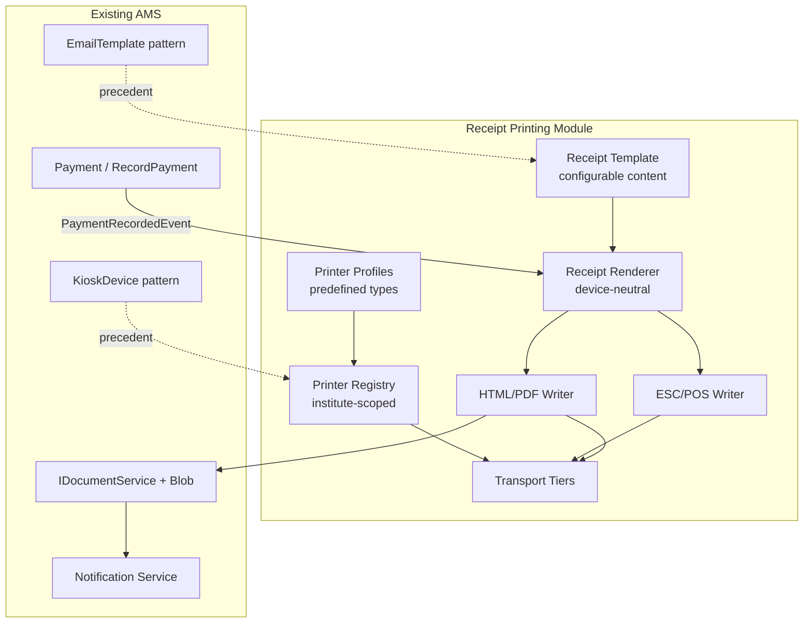
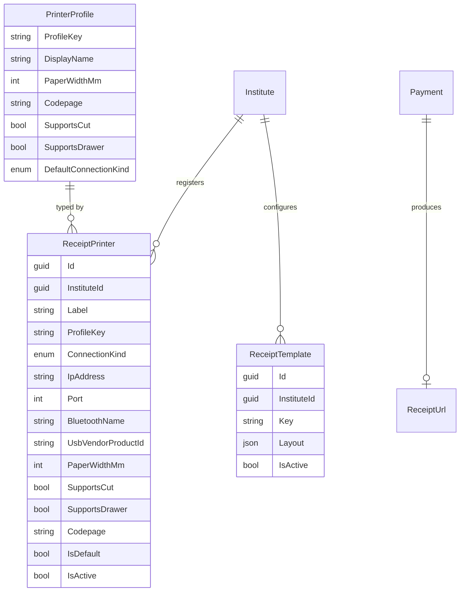
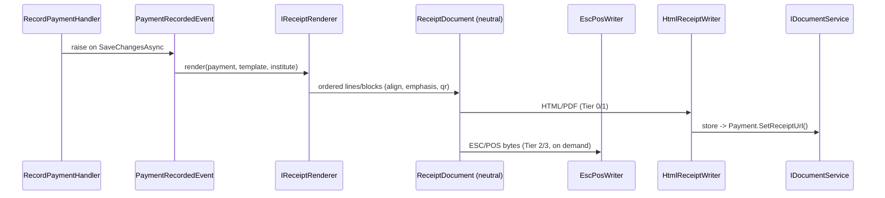
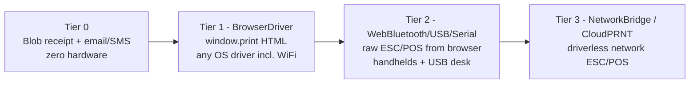

# 🧾 Receipt Printing Module

> Thermal receipt printing for fee payments — multi-printer, multi-transport, with fully configurable receipt content

## 1. Module Overview

Some institutes hand the student a **printed receipt** at the moment they pay a class
fee. The hardware varies widely — desk-mounted WiFi thermal printers (e.g.
[Xprinter XP-Q838L](https://savefrist.com/product/xp-q838l-3-thermal-receipt-printer-wi-fi/)),
handheld Bluetooth units with NFC, and USB/serial printers.

This module makes connecting any of them **easy via predefined printer profiles**,
lets each institute **configure exactly what prints on the receipt**, and reaches the
hardware through a **tiered transport ladder** that works whether the desk is a Windows
PC, a Mac, or an Android tablet.



## 2. Why this design (industry context)

Thermal printers almost universally speak **ESC/POS** (the Epson POS command standard);
the XP-Q838L and the cheap Xprinter/handheld units all do. The hard part is **not** the
command language — it's **where the bytes are produced and how they reach the printer**,
and the AMS topology constrains that:

- The **backend runs on a VPS**. Institute printers (e.g. `192.168.x.x:9100`) sit
  **behind NAT on the institute LAN**, so the server **cannot open a raw socket** to them.
  Naïve "server prints to printer IP" does not work for the common case.
- The **PWA runs on the desk on the same LAN** as the printer — but **browsers cannot
  open raw TCP sockets**, so a browser cannot hit port 9100 directly either.

This is precisely why POS SaaS products (Square, Loyverse, Toast) do **not** pick one
transport — they layer them. AMS does the same: **render content once on the server,
transport in tiers from the client.**

## 3. Reuse of existing patterns

The module is not greenfield — it slots into established seams:

| Existing thing | Reused for |
|---|---|
| `Payment.ReceiptUrl` + `Payment.SetReceiptUrl()` (defined, currently unused) | Persisted PDF/HTML receipt copy |
| `IDocumentService` + Azure Blob | Store / serve receipt artifacts |
| `EmailTemplate` (keyed, DB-stored, editable, token body) | Precedent for the **configurable receipt template** |
| `KioskDevice` (institute-scoped device, label, token hash, active/expiry) | Precedent for the **printer registry / pairing** |
| `SystemSetting` (key/value/category) | Per-institute toggles (auto-print, default paper width) |
| Domain events flushed in `ApplicationDbContext.SaveChangesAsync()` + Notification module | Trigger receipt rendering exactly like SMS/email |
| PWA at the desk (React 19, same LAN as the printer) | Where physical printing happens |

## 4. Data Model



### 4.1 `ReceiptPrinter` — the registry (modeled on `KioskDevice`)

Institute-scoped record of a physical printer. `ProfileKey` ties it to a predefined
profile so the operator only fills in what that profile actually needs.

`ConnectionKind` drives which transport tier the PWA uses:

```
BrowserDriver | WebBluetooth | WebUsb | WebSerial | NetworkBridge | CloudPrnt
```

### 4.2 `PrinterProfile` — predefined types ("easy onboarding")

A **seeded catalog** of known printers. Onboarding becomes "pick your model from a
dropdown." Supporting a new model = adding a profile row (data), **no code change**.

Seed examples:

| ProfileKey | DisplayName | Paper | Default transport |
|---|---|---|---|
| `xprinter-80-wifi` | Xprinter XP-Q838L (WiFi 80mm) | 80mm | `BrowserDriver` (or `NetworkBridge`) |
| `xprinter-58-bt` | Xprinter handheld (Bluetooth 58mm) | 58mm | `WebBluetooth` |
| `epson-tm-network` | Epson TM series (Network) | 80mm | `NetworkBridge` / `CloudPrnt` |
| `generic-escpos-80` | Generic ESC/POS 80mm | 80mm | `BrowserDriver` |
| `generic-escpos-58` | Generic ESC/POS 58mm | 58mm | `WebBluetooth` |
| `browser-default` | System default printer | — | `BrowserDriver` |

### 4.3 `ReceiptTemplate` — configurable content (modeled on `EmailTemplate`)

Institute-scoped, keyed (`FeePayment`). Stores a **structured layout** (not raw ESC/POS),
so the same definition renders to ESC/POS **and** HTML. `Layout` is JSON describing
ordered, individually-toggleable sections:

- **Header** — logo (`Institute.LogoUrl`), name, address, phone (from `Institute`)
- **Title / receipt no.** — `ReferenceNumber`
- **Body fields** — token-substituted lines
- **Totals** — amount paid, balance/outstanding
- **Footer** — thank-you message, signature line, QR/barcode of the reference

Supported tokens: `{{InstituteName}} {{StudentName}} {{ClassName}} {{Period}}
{{Amount}} {{PaymentMethod}} {{Reference}} {{ReceivedBy}} {{Date}} {{Balance}}`.

Per-section `visible` flags = **"configure what writes to the receipt."**

## 5. Rendering Pipeline — render once, target many

The cornerstone is a **device-neutral intermediate representation** so content is defined
in exactly one place.



- **`IReceiptRenderer`** turns `(Payment + ReceiptTemplate + Institute branding)` into a
  **`ReceiptDocument`**: an ordered list of blocks (text with alignment/emphasis, a
  divider, a barcode/QR of the reference number, a cut marker).
- **`EscPosWriter`** consumes `ReceiptDocument` → ESC/POS byte stream. Pure C#, no external
  dependency. Handles 58 vs 80mm width, codepage, auto-cut, optional cash-drawer kick.
- **`HtmlReceiptWriter`** consumes the same `ReceiptDocument` → an 80mm/58mm CSS receipt
  page used both for `window.print()` and for the stored PDF/HTML blob copy.

## 6. Transport Tiers (the fallback ladder)

A printer's `ConnectionKind` selects the tier automatically in the PWA. All four tiers
ship (per decision: "need all three tiers" + mixed desktop/mobile environment).



- **Tier 0 — always on, no hardware.** Server renders HTML/PDF, stores via
  `IDocumentService`, sets `Payment.ReceiptUrl`. Permanent record + reprint +
  **emailable/SMS receipt** over existing notification rails. Works with zero printers
  configured.
- **Tier 1 — `BrowserDriver` (default for desk PCs).** PWA loads the rendered receipt HTML
  and calls `window.print()`. Works with **any OS-installed driver**, including the
  XP-Q838L over WiFi — because the **OS driver** handles the TCP, not the browser. Most
  compatible, least code. The printer ships with Windows/Mac drivers; install once, set as
  default, done.
- **Tier 2 — `WebBluetooth` / `WebUsb` / `WebSerial` (full control + handhelds).** PWA
  fetches ESC/POS bytes from `GET /api/payments/{id}/receipt?format=escpos` and pushes them
  directly. Web Bluetooth → handheld BT printers (no driver). WebUSB/WebSerial → USB/serial
  desk printers. Enables precise cut and cash-drawer control. *Chromium-based browsers; not
  iOS Safari.*
- **Tier 3 — `NetworkBridge` / `CloudPrnt` (driverless network ESC/POS).** For a network
  printer with no OS driver: a tiny optional **local bridge agent** on the desk listens on
  `localhost` and forwards bytes to `printerIP:9100`; the PWA POSTs ESC/POS to it.
  Alternatively **CloudPRNT**, where a capable printer (e.g. Star) polls an AMS endpoint for
  queued jobs — no inbound reach to the LAN required.

### 6.1 Environment → recommended tier

| Desk environment | Network/WiFi printer | Handheld BT | USB desk |
|---|---|---|---|
| Windows / Mac PC | Tier 1 (driver) → Tier 3 if driverless | Tier 2 (Web BT) | Tier 1 or Tier 2 |
| Android tablet/phone | Tier 3 bridge / CloudPRNT | **Tier 2 (Web BT)** | Tier 2 (WebUSB) |
| iOS (Safari) | Tier 1 (AirPrint driver) / Tier 0 email | Tier 0 (no Web BT) | Tier 0 |

> Tier 0 is the universal safety net — if no live transport succeeds, the student still
> gets an emailed/SMS receipt and staff can reprint from the stored copy.

## 7. Trigger Flow (print-on-payment)

`RecordPaymentCommandHandler` already flushes domain events in `SaveChangesAsync()`. Add:

1. **`PaymentRecordedDomainEvent`** raised by `Payment.Create`.
2. **Handler** renders Tier 0 (blob + `SetReceiptUrl`) asynchronously; optionally fires the
   email/SMS receipt notification.
3. **PWA**: after a successful `POST /api/payments`, the `record-payment-form` auto-runs the
   institute's **default printer** via its configured transport (Tier 1/2/3). A **Reprint**
   button on `payment-detail` re-runs the same path on demand.

## 8. Onboarding & Configuration UX (PWA)

Two new screens under existing **Settings**:

- **Receipt Printers** — `Add printer → pick predefined profile (dropdown incl. "XP-Q838L
  (WiFi 80mm)") → fill only the fields that profile needs (IP, or "Pair Bluetooth", or "Use
  system printer") → Test print`. Mark one **default** per institute.
- **Receipt Template** — mirrors the email-template editor: edit header/body/footer,
  toggle sections, live preview, token palette.

## 9. API Surface (additions)

| Method | Route | Purpose | Permission |
|---|---|---|---|
| `GET` | `/api/printer-profiles` | List predefined profiles | `payments:view` |
| `GET/POST/PUT/DELETE` | `/api/receipt-printers` | Manage institute printers | `settings:manage` |
| `POST` | `/api/receipt-printers/{id}/test` | Test print | `settings:manage` |
| `GET/PUT` | `/api/receipt-templates/{key}` | Get/update template | `settings:manage` |
| `GET` | `/api/payments/{id}/receipt?format=html\|pdf\|escpos` | Fetch rendered receipt | `payments:view` |

## 10. Phased Delivery

1. **Phase 1 — Foundation (no hardware):** `ReceiptTemplate` entity + editor,
   `IReceiptRenderer` + `HtmlReceiptWriter`, `PaymentRecordedDomainEvent`, Tier-0 blob
   receipt + `ReceiptUrl`, reprint + email/SMS receipt. *Delivers value immediately.*
2. **Phase 2 — Default printing:** PWA `window.print()` auto-print; `ReceiptPrinter`
   registry + `PrinterProfile` seed; `BrowserDriver` printers.
3. **Phase 3 — ESC/POS:** `EscPosWriter`, Web Bluetooth (handhelds) + WebUSB/WebSerial;
   expand profile catalog; cut/drawer control.
4. **Phase 4 — Driverless network:** local bridge agent and/or CloudPRNT polling.

## 11. Open Questions

- Handheld units "with NFC" — is the NFC used to **identify the student at the printer**
  (a card-reader scenario, overlapping the NFC card module), or incidental? Affects whether
  the printer device also acts as a kiosk reader.
- Receipt numbering: reuse `Payment.ReferenceNumber` (`PAY-yyyyMMdd-XXXXXXXX`) or introduce
  a gapless, per-institute sequential receipt number (often a fiscal/audit requirement)?
- Does any target market require fiscal/tax-compliant receipts (sequential numbering, VAT
  lines, signed archives)? If so it tightens the template and numbering rules.
- Local bridge agent (Tier 3): build/distribute in-house, or adopt an existing open-source
  print-bridge?
