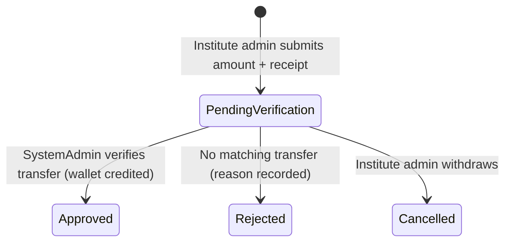

# 💳 SMS Credit Billing Module

> Prepaid, per-institute SMS wallets: institutes fund their own SMS notification costs by bank
> transfer; the platform verifies the transfer, credits the wallet, and debits it per SMS segment.

## 1. Why this exists

SMS costs real money and there is only **one** gateway account for the whole platform (SMSlenz).
Without billing, every institute's notification traffic lands on the ClassPass bill. This module
moves that cost to the institutes without giving them gateway credentials:

| Concern | Owner | Mechanism |
|---|---|---|
| Funding | Institute admin | Transfers a **fixed amount** (e.g. LKR 500/1000/2000/3000/5000) to the ClassPass bank account and uploads the deposit receipt |
| Verification | SystemAdmin | Matches the receipt against the bank statement, then approves (credits the wallet) or rejects with a reason |
| Charging | Platform (dispatch worker) | Debits `rate × segments` per SMS at send time; refunds automatically if the gateway rejects the message |
| Pricing | SystemAdmin | Sets the per-segment rate, the allowed top-up amounts, the bank details text, and the enforcement switch in the portal |

Fixed top-up amounts are deliberate: the verifier only ever needs to find an exact 500/1000/…
credit on the statement, which keeps manual verification fast and unambiguous.

## 2. Data model

Three tables (plus reuse of Documents for receipts):

- **`ams_sms_credit_wallets`** — one row per institute, current `balance`. Created lazily on the
  first credit.
- **`ams_sms_credit_topups`** — top-up requests: amount, receipt document id, bank reference,
  status (`PendingVerification → Approved | Rejected | Cancelled`), reviewer + reason.
- **`ams_sms_credit_transactions`** — append-only ledger. `amount` is signed (top-up/refund/up
  adjustment positive; SMS charge/down adjustment negative) and every row snapshots
  `balance_after`, plus `rate_per_segment` and `segments` on charges so rate changes never
  rewrite history.

Receipts are uploaded through the existing Documents module (`DocumentCategory.SmsCreditReceipt`)
into the institute's **private** blob container and viewed via the authenticated
`/api/documents/{id}/content` proxy (SystemAdmins can read cross-tenant via `access-any`).

## 3. Top-up lifecycle

Approval is **concurrency-safe**: the status flip is a single guarded SQL update
(`… WHERE status = 'PendingVerification'`) inside one DB transaction with the wallet credit and
the ledger entry — two admins clicking Approve at once can never double-credit.

## 4. Charging at dispatch time

`NotificationDispatchWorker` consults `ISmsCreditBillingService.TryChargeAsync` right before
handing an SMS to the gateway:

1. **Segments** are computed by `SmsSegmentCalculator` (GSM-7: 160 single / 153 concatenated;
   unicode — i.e. Sinhala/Tamil text — 70 / 67). The charge is `ratePerSegment × segments`.
2. The debit is a single guarded `UPDATE … SET balance = balance - cost WHERE balance >= cost`,
   so concurrent dispatch ticks cannot overdraw a wallet.
3. **Insufficient balance** → the notification is marked `Failed` with a clear
   "Insufficient SMS credit" reason and re-enters the normal retry path, so it still goes out if
   the institute tops up within the retry window.
4. **Gateway rejection after a charge** → the amount is refunded immediately with a `Refund`
   ledger entry.

Pass-through (no charge): platform notifications without an institute, all email, and all
traffic while **enforcement is disabled**.

## 5. Platform settings

Stored as `SystemSetting` rows (category `SmsCredits`), editable in the portal at
**Platform → SMS Billing → Billing Settings**:

| Key | Meaning | Default |
|---|---|---|
| `sms-credits.rate-per-segment` | LKR charged per segment | `0` (free) |
| `sms-credits.topup-amounts` | Comma-separated fixed amounts | `500,1000,2000,3000,5000` |
| `sms-credits.bank-details` | Transfer instructions shown to institutes | empty |
| `sms-credits.enforcement-enabled` | Hard prepaid gate on/off | `false` |
| `sms-credits.low-balance-threshold` | PWA warning threshold | `200` |

**Rollout is a deliberate two-step act**: defaults are rate 0 + enforcement off, so nothing
changes for existing institutes until a SystemAdmin sets a rate *and* flips enforcement on
(after institutes have had a window to fund their wallets).

## 6. Permissions

| Permission | Who | Grants |
|---|---|---|
| `sms-credits:view` | Institute Admin (seeded) | Balance, own top-ups, usage ledger |
| `sms-credits:topup` | Institute Admin (seeded) | Submit / cancel top-up requests |
| `sms-credits:manage` | SystemAdmin only | Verification queue, approve/reject, adjustments, wallets overview, billing settings |

`sms-credits:manage` is a **system permission**: excluded from the tenant Admin role and listed
in `InstitutePermissionPolicy.AlwaysIneligibleNames`, so it can never be made
institute-assignable. `view`/`topup` are institute-assignable (resource is in the eligibility
ceiling) and part of the seeded institute **Admin** role.

## 7. API surface

Institute (`/api/sms-credits`, tenant context required):
`GET summary` · `GET transactions` (paged) · `GET top-ups` · `POST top-ups` (multipart: receipt +
amount + bankReference + note) · `POST top-ups/{id}/cancel`

Platform (`/api/admin/sms-credits`, `sms-credits:manage`):
`GET top-ups?status=` · `POST top-ups/{id}/approve` · `POST top-ups/{id}/reject` ·
`GET wallets` · `POST adjustments` · `GET/PUT settings`

## 8. PWA surfaces

- **Institute → SMS Credits** (`/sms-credits`): balance / rate / est.-SMS-remaining cards,
  low-balance warning, top-up dialog (fixed amounts + bank details + receipt upload), top-up
  history with statuses and rejection reasons, paged usage ledger.
- **Platform → SMS Billing** (`/admin/sms-credits`, root host only): verification queue with
  receipt preview and approve/reject, wallets overview with manual adjustments, billing
  settings editor.

## 9. Known gaps / future work

- **Low-balance notification**: the PWA warns on the dashboard, but no proactive email/SMS is
  sent to institute admins when the balance crosses the threshold.
- **Crash window**: if the worker dies between wallet debit and the notification's `Sent` state
  persisting, the row is retried and charged again (mirrors the pre-existing double-send
  window). The ledger keeps both charges visible for manual adjustment.
- **No per-institute rate override** — the rate is platform-wide.
- **Email is unmetered** — only SMS is billed (email cost is negligible today).
