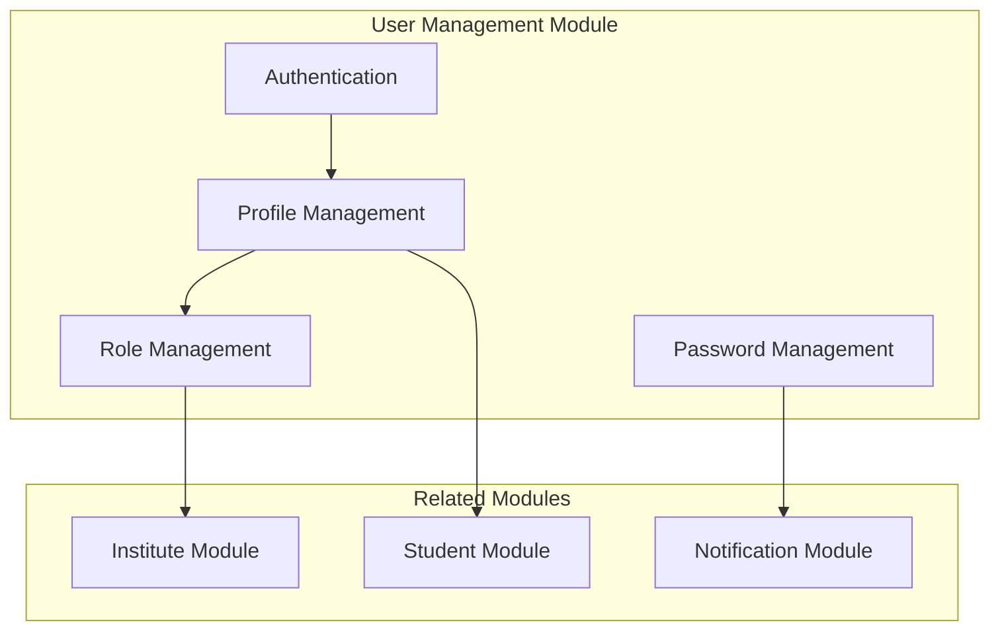
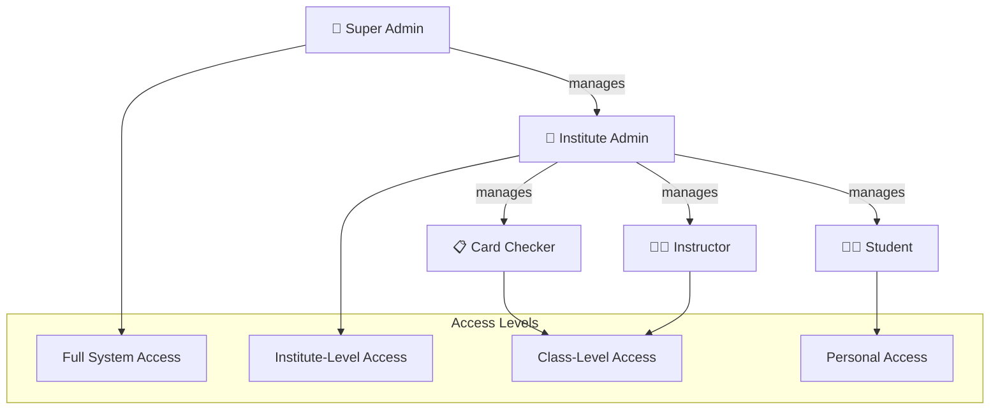
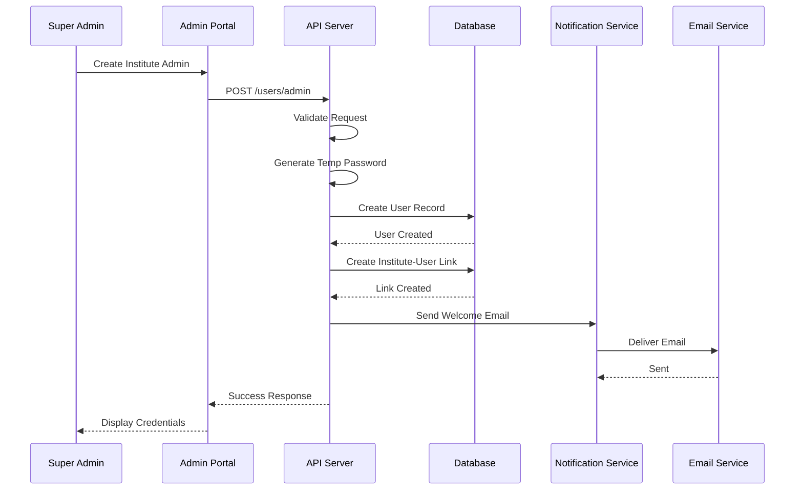
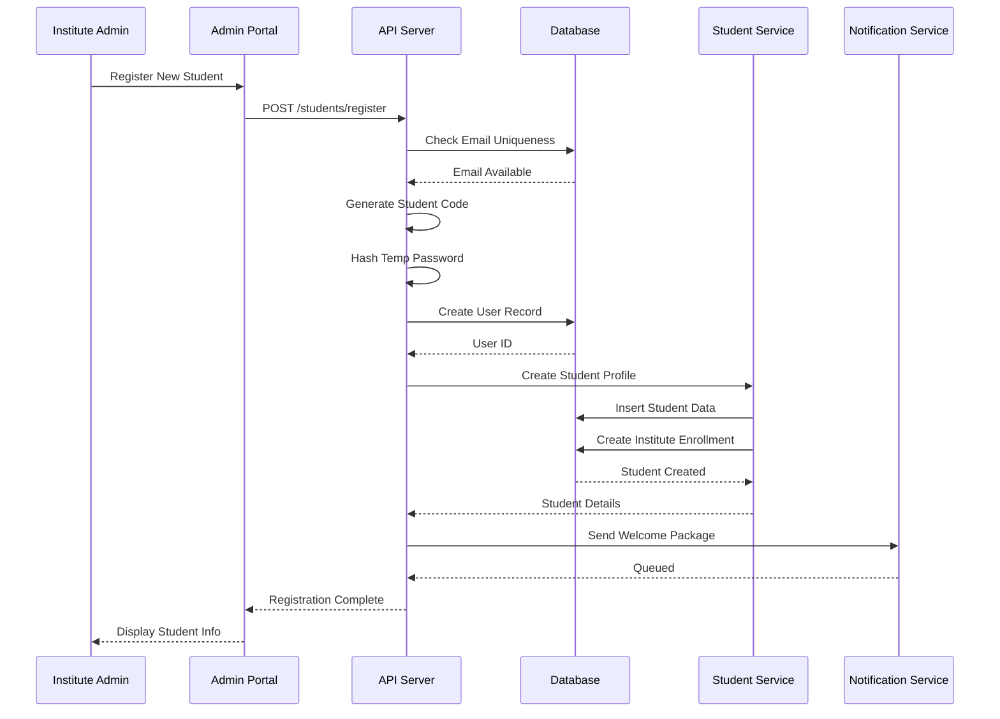
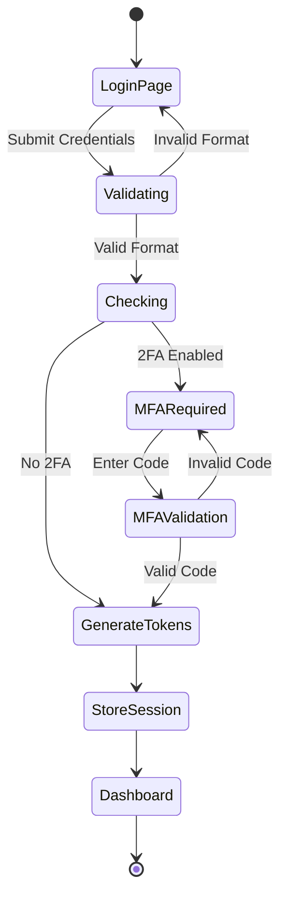
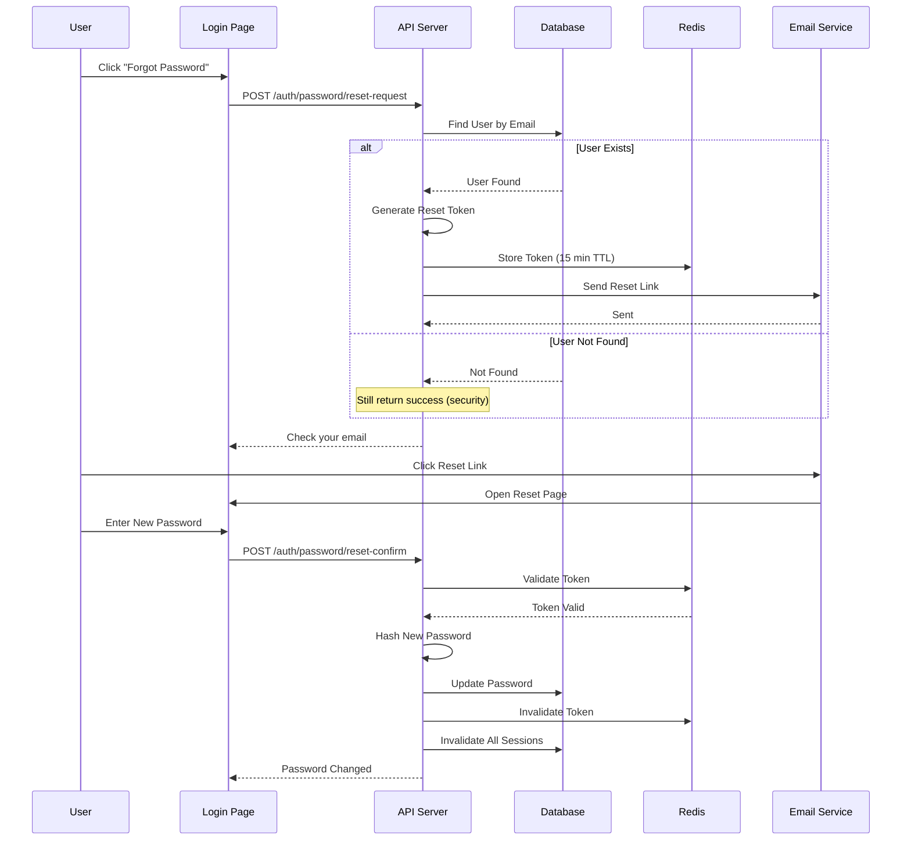
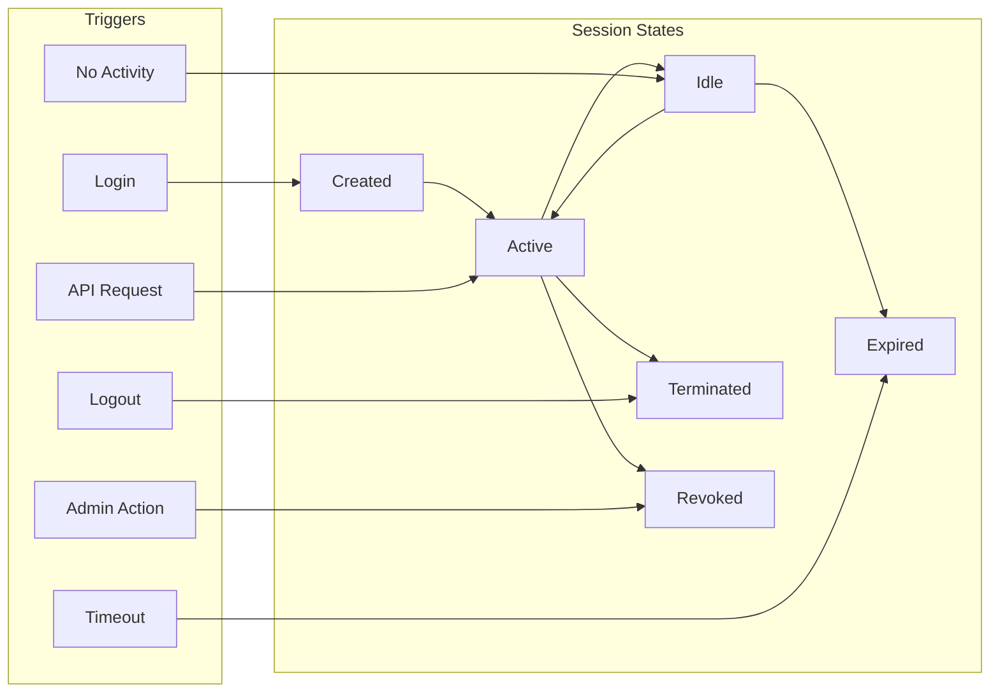
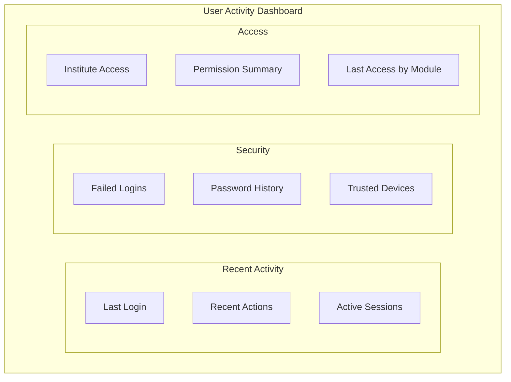

# 👤 User Management Module

> User registration, authentication, and role management for AMS

## 1. Module Overview

The User Management module handles all user-related operations including authentication, authorization, profile management, and role assignments across the system.



## 2. User Types & Roles

### 2.1 System Roles Hierarchy



### 2.2 Role Definitions

| Role | Description | Key Responsibilities |
|------|-------------|---------------------|
| **Super Admin** | System-level administrator | System configuration, institute management, global reporting |
| **Institute Admin** | Institute-level administrator | Manage institute settings, users, classes, students |
| **Card Checker** | Attendance and payment staff | Record attendance, process payments |
| **Instructor** | Class teacher/instructor | View class attendance, student progress |
| **Student** | End user | View personal attendance and payment history |

## 3. User Registration Flows

### 3.1 Admin User Registration



### 3.2 Student User Registration



## 4. Authentication

### 4.1 Login Flow



### 4.2 Password Requirements

```typescript
const passwordPolicy = {
  minLength: 8,
  maxLength: 128,
  requireUppercase: true,
  requireLowercase: true,
  requireNumber: true,
  requireSpecialChar: true,
  specialChars: '!@#$%^&*()_+-=[]{}|;:,.<>?',
  preventCommonPasswords: true,
  preventUserInfoInPassword: true,
  historyCount: 5, // Cannot reuse last 5 passwords
  maxAge: 90 // Days before forced change
};
```

### 4.3 Password Reset Flow



## 5. Profile Management

### 5.1 User Profile Structure

```typescript
interface UserProfile {
  id: string;
  email: string;
  firstName: string;
  lastName: string;
  phone?: string;
  avatarUrl?: string;
  role: UserRole;
  isActive: boolean;
  emailVerified: boolean;
  lastLogin?: Date;
  
  // Settings
  preferences: {
    language: string;
    timezone: string;
    notifications: {
      email: boolean;
      sms: boolean;
      push: boolean;
    };
  };
  
  // Institute associations
  institutes: InstituteAssociation[];
  
  // Metadata
  createdAt: Date;
  updatedAt: Date;
}

interface InstituteAssociation {
  instituteId: string;
  instituteName: string;
  role: InstituteRole;
  isActive: boolean;
  joinedAt: Date;
}
```

### 5.2 Profile Update Rules

| Field | Self-Update | Admin Update | Requires Verification |
|-------|:-----------:|:------------:|:--------------------:|
| First Name | ✅ | ✅ | ❌ |
| Last Name | ✅ | ✅ | ❌ |
| Email | ✅ | ✅ | ✅ |
| Phone | ✅ | ✅ | ✅ |
| Avatar | ✅ | ✅ | ❌ |
| Role | ❌ | ✅ | ❌ |
| Active Status | ❌ | ✅ | ❌ |
| Password | ✅ | ❌ | ✅ (current) |

## 6. Session Management

### 6.1 Session Lifecycle



### 6.2 Concurrent Session Handling

```typescript
const sessionPolicy = {
  maxConcurrentSessions: 3,
  
  // When limit exceeded
  onLimitExceeded: 'terminate_oldest', // or 'deny_new'
  
  // Session identification
  identifyBy: ['userId', 'deviceId', 'ipAddress'],
  
  // Device trust
  trustedDevices: {
    enabled: true,
    maxDevices: 5,
    requireVerification: true
  }
};
```

## 7. Access Control Implementation

### 7.1 Permission Checking

```typescript
// Permission decorator for endpoints
@RequirePermission('students:write')
@RequireInstitute()
async createStudent(req: Request, res: Response) {
  // Only executes if user has permission
}

// Permission checking middleware
async function checkPermission(
  userId: string,
  permission: string,
  instituteId?: string
): Promise<boolean> {
  const user = await User.findById(userId);
  
  // Super admin has all permissions
  if (user.role === 'super_admin') return true;
  
  // Check institute-specific permissions
  if (instituteId) {
    const membership = await InstituteUser.findOne({
      userId,
      instituteId,
      isActive: true
    });
    
    if (!membership) return false;
    
    return hasRolePermission(membership.role, permission);
  }
  
  return hasRolePermission(user.role, permission);
}
```

### 7.2 Role-Permission Mapping

```typescript
const rolePermissions = {
  super_admin: ['*'], // All permissions
  
  institute_admin: [
    'institutes:read',
    'institutes:update',
    'users:*',
    'students:*',
    'classes:*',
    'attendance:*',
    'payments:*',
    'reports:*',
    'cards:*'
  ],
  
  card_checker: [
    'students:read',
    'classes:read',
    'attendance:read',
    'attendance:write',
    'payments:read',
    'payments:write',
    'cards:validate'
  ],
  
  instructor: [
    'students:read',
    'classes:read',
    'attendance:read',
    'reports:read'
  ],
  
  student: [
    'profile:read',
    'profile:update',
    'attendance:read:own',
    'payments:read:own'
  ]
};
```

## 8. User Activity Tracking

### 8.1 Tracked Activities

| Activity | Logged Data | Retention |
|----------|-------------|-----------|
| Login | IP, Device, Time, Result | 1 year |
| Logout | Time, Reason | 1 year |
| Profile Update | Changed Fields | 5 years |
| Password Change | Time, IP | 5 years |
| Permission Change | Old/New Values | 5 years |
| Failed Login | IP, Email Attempted | 90 days |

### 8.2 Activity Dashboard



## 9. User Management API Summary

| Endpoint | Method | Description | Access |
|----------|--------|-------------|--------|
| `/users` | GET | List users | Admin |
| `/users/:id` | GET | Get user details | Admin/Self |
| `/users/:id` | PUT | Update user | Admin/Self |
| `/users/:id` | DELETE | Deactivate user | Admin |
| `/users/:id/roles` | PUT | Update roles | Admin |
| `/users/:id/sessions` | GET | List sessions | Admin/Self |
| `/users/:id/sessions` | DELETE | Revoke sessions | Admin/Self |
| `/users/:id/activity` | GET | Activity log | Admin/Self |

## 10. Best Practices

### 10.1 User Onboarding

1. ✅ Send welcome email with temporary password
2. ✅ Force password change on first login
3. ✅ Guide through profile completion
4. ✅ Provide role-specific documentation
5. ✅ Enable 2FA for admin accounts

### 10.2 User Offboarding

1. ✅ Deactivate account (don't delete)
2. ✅ Revoke all active sessions
3. ✅ Remove from all institutes
4. ✅ Deactivate associated NFC cards
5. ✅ Archive user data per retention policy

---

**Previous:** [Security Architecture](../architecture/security-architecture.md) | **Next:** [Institute Management](./institute-management.md)

